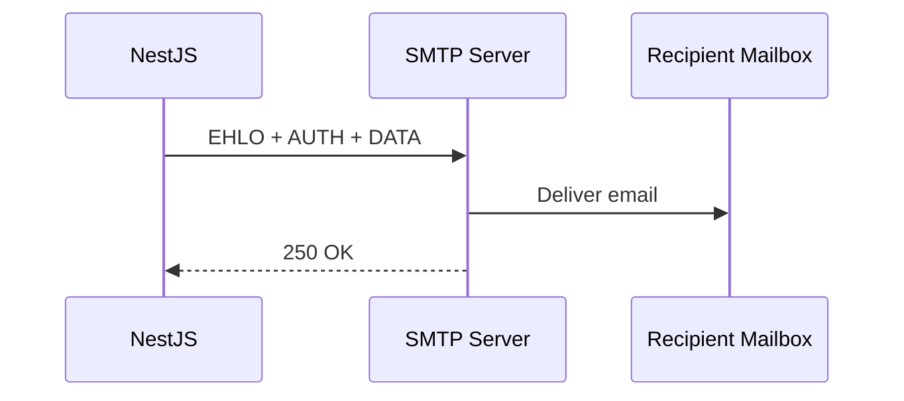

# title
Sending Emails with Nodemailer

# description
Hands-on integrating Nodemailer into NestJS to send welcome emails on user registration, using HTML templates and SMTP providers.

# body

## 1. Opening

"Users register but never receive a confirmation email — how do we know the system sent it?" — a **Senior Engineer** asks during notification review. A **Mid-level Developer** answers: "I'll call `sendMail` directly in the controller." The answer shows awareness of email sending, but misses depth on **separation of concerns**: calling SMTP directly in the controller → not reusable, not testable — **MailService** isolates email logic into a dedicated module, uses a template engine for HTML, and injects via DI.

This lesson runs through two tracks:
- **Part 2.1**: **hands-on**; **stack** is pure **NestJS** (no Docker), with a register → send welcome email flow.
- **Part 2.2**: **theory** clarifying **SMTP**, **Nodemailer**, **template engines**, and **edge cases**.

## 2. Core concepts

The lesson structure follows **practice-led theory**. First, learners clone the source, configure SMTP credentials, run **NestJS** via `nest start --watch`, and call the registration API to observe the email being sent via SMTP. Then the **theory** section analyzes Nodemailer architecture, template engines, and **edge cases**.

### 2.1. Hands-on

#### 2.1.1. Prepare source code and environment

Source: [StarCi-Academy/fullstack-mastery-module-6-email-sms-otp](https://github.com/StarCi-Academy/fullstack-mastery-module-6-email-sms-otp) on GitHub — lesson directory: [`0-sending-emails-with-nodemailer`](https://github.com/StarCi-Academy/fullstack-mastery-module-6-email-sms-otp/tree/main/0-sending-emails-with-nodemailer).

```bash
# Step 1: Clone the repository locally
git clone https://github.com/StarCi-Academy/fullstack-mastery-module-6-email-sms-otp.git

# Step 2: Navigate to the lesson directory
cd fullstack-mastery-module-6-email-sms-otp/0-sending-emails-with-nodemailer
```

#### 2.1.2. Architecture / components

| Component | File | Role |
| --- | --- | --- |
| **UsersController** | `src/modules/users/users.controller.ts` | `POST /users/register` |
| **UsersService** | `src/modules/users/users.service.ts` | Business logic + calls MailService |
| **MailService** | `src/modules/mail/mail.service.ts` | Sends email via SMTP |
| **Template** | `templates/welcome.hbs` | HTML template (Handlebars) |

#### 2.1.3. Prerequisites and startup

##### 2.1.3.1. Prerequisites

- **Node.js** LTS, **npm**, **NestJS CLI**.
- **SMTP credentials:** use Gmail App Password or Mailtrap for testing.
- Configure `.env`: `MAIL_HOST`, `MAIL_PORT`, `MAIL_USER`, `MAIL_PASS`.
- **Windows:** API commands use **`Invoke-RestMethod`** (PowerShell). See parallel **`curl`** for macOS / Linux.

> **Note:** The repo ships with env defaults via **ConfigModule**; you do not need to create or edit **.env** when running the system. Only modify this file if you want to run the service with custom ports/credentials.

##### 2.1.3.2. Start

```bash
# Step 1: Install dependencies
npm install

# Step 2: Start in watch mode
nest start --watch
```

#### 2.1.4. Verification

##### 2.1.4.1. Flow 1 — Register and receive welcome email

  ```bash
  # Windows (PowerShell)
  Invoke-RestMethod -Uri http://localhost:3000/users/register -Method Post -ContentType "application/json" -Body '{"email":"test@demo.com","name":"Alice"}'

  # macOS / Linux
  curl -s -X POST http://localhost:3000/users/register -H "Content-Type: application/json" -d '{"email":"test@demo.com","name":"Alice"}'
  ```

  Response (HTTP 201): `{ "message": "User registered and welcome email sent" }`.

  Check inbox (or Mailtrap) → receive "Welcome to StarCi Academy" email.

*If the response matches:*

- *MailService isolation — controller doesn't know SMTP details.*
- *Template engine — HTML email rendered from Handlebars template.*

#### 2.1.5. Cleanup

This lesson does not use Docker, no resource cleanup is needed.

#### 2.1.6. Further reading

- **Nodemailer:** SMTP email sending for Node.js. ([Nodemailer Docs](https://nodemailer.com/about/))
- **NestJS Mailer:** Integration module. ([NestJS Mailer](https://nest-modules.github.io/mailer/))
- **Mailtrap:** SMTP testing sandbox. ([Mailtrap](https://mailtrap.io/))

### 2.2. Theory — SMTP and Nodemailer

#### 2.2.1. SMTP Flow



#### 2.2.2. Edge cases to internalize

- **Wrong SMTP credentials:** App starts fine but email fails. **Fix:** verify connection at bootstrap, fail fast.
- **Email lands in spam:** Missing SPF/DKIM records. **Fix:** configure DNS records for domain.
- **Template injection:** User input rendered directly in HTML. **Fix:** escape context variables in template.
- **SMTP provider rate limit:** Sending too many emails/minute. **Fix:** queue emails (Bull/BullMQ) instead of sending sync.

## 3. Wrap-up

### 3.1. Common interview questions

- **Question 1:** Why not send email directly in the controller?
  - Sample answer: Isolate MailService for reusability, testability, and decoupling from SMTP.

- **Question 2:** Email sent successfully but lands in spam — why?
  - Sample answer: Missing SPF/DKIM/DMARC DNS records for the sending domain.

- **Question 3:** Should emails be sent synchronously or asynchronously?
  - Sample answer: Asynchronously via queue (Bull) — avoids blocking the request if SMTP is slow.

# references
## 0
### alias
Nodemailer
### url
https://nodemailer.com/about/
## 1
### alias
NestJS Mailer Module
### url
https://nest-modules.github.io/mailer/

# minutesRead
15
