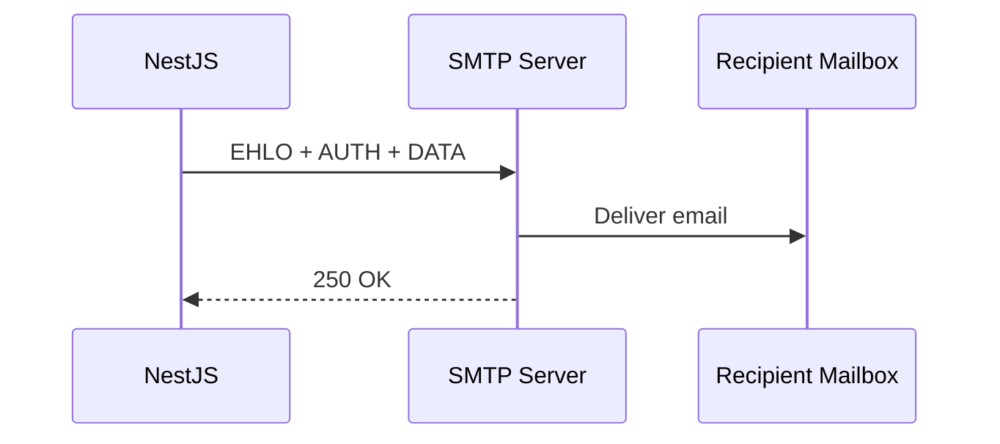

# title
Gửi email với Nodemailer

# description
Thực hành tích hợp Nodemailer vào NestJS để gửi welcome email khi user đăng ký, sử dụng template HTML và SMTP provider.

# body

## 1. Lời mở đầu

"User đăng ký xong nhưng không nhận được email xác nhận — làm sao biết hệ thống gửi chưa?" — một **Senior Engineer** hỏi khi review notification feature. Một **Mid-level Developer** trả lời: "Em dùng hàm `sendMail` trực tiếp trong controller." Câu trả lời cho thấy nhận thức về email sending, nhưng vẫn thiếu chiều sâu về **tách biệt concerns**: gọi SMTP trực tiếp trong controller → không reusable, không testable — **MailService** tách logic gửi email thành module riêng, dùng template engine cho HTML, và inject qua DI.

Bài này dẫn qua hai mạch liên tiếp:
- **Phần 2.1**: **thực hành**; **stack** gồm **NestJS** thuần (không Docker), kèm **luồng** register → send welcome email.
- **Phần 2.2**: **lý thuyết** làm rõ bản chất **SMTP**, **Nodemailer**, **template engine**, và các **edge case**.

## 2. Các khái niệm cốt lõi

Cấu trúc bài học áp dụng phương pháp **Thực hành dẫn dắt Lý thuyết**. Khởi đầu, học viên clone source, cấu hình SMTP credentials, chạy **NestJS** bằng `nest start --watch` và gọi API đăng ký để quan sát email được gửi qua SMTP. Tiếp theo, **phần lý thuyết** phân tích kiến trúc Nodemailer, template engine và các **edge cases**.

### 2.1. Thực hành

#### 2.1.1. Chuẩn bị source code và môi trường

Source: [StarCi-Academy/fullstack-mastery-module-6-email-sms-otp](https://github.com/StarCi-Academy/fullstack-mastery-module-6-email-sms-otp) trên GitHub — thư mục bài học: [`0-sending-emails-with-nodemailer`](https://github.com/StarCi-Academy/fullstack-mastery-module-6-email-sms-otp/tree/main/0-sending-emails-with-nodemailer).

```bash
# Bước 1: Clone repository về máy local
git clone https://github.com/StarCi-Academy/fullstack-mastery-module-6-email-sms-otp.git

# Bước 2: Di chuyển vào đúng thư mục bài học
cd fullstack-mastery-module-6-email-sms-otp/0-sending-emails-with-nodemailer
```

#### 2.1.2. Kiến trúc/thành phần (stack + luồng)

| Thành phần | File | Vai trò |
| --- | --- | --- |
| **UsersController** | `src/modules/users/users.controller.ts` | `POST /users/register` |
| **UsersService** | `src/modules/users/users.service.ts` | Business logic + gọi MailService |
| **MailService** | `src/modules/mail/mail.service.ts` | Gửi email qua SMTP |
| **Template** | `templates/welcome.hbs` | HTML template (Handlebars) |

#### 2.1.3. Chuẩn bị & khởi chạy

##### 2.1.3.1. Điều kiện cần trước

- **Node.js** LTS, **npm**, **NestJS CLI**.
- **SMTP credentials:** dùng Gmail App Password hoặc Mailtrap cho testing.
- Cấu hình `.env`: `MAIL_HOST`, `MAIL_PORT`, `MAIL_USER`, `MAIL_PASS`.
- **Windows:** các lệnh API dùng **`Invoke-RestMethod`** (PowerShell). Xem song song **`curl`** cho macOS / Linux.

##### 2.1.3.2. Khởi động

```bash
# Bước 1: Cài dependency
npm install

# Bước 2: Khởi chạy ở chế độ watch
nest start --watch
```

#### 2.1.4. Kiểm thử

##### 2.1.4.1. Luồng 1 — Đăng ký và nhận welcome email

  ```bash
  # Windows (PowerShell)
  Invoke-RestMethod -Uri http://localhost:3000/users/register -Method Post -ContentType "application/json" -Body '{"email":"test@demo.com","name":"Alice"}'

  # macOS / Linux
  curl -s -X POST http://localhost:3000/users/register -H "Content-Type: application/json" -d '{"email":"test@demo.com","name":"Alice"}'
  ```

  Response (HTTP 201): `{ "message": "User registered and welcome email sent" }`.

  Kiểm tra inbox (hoặc Mailtrap) → nhận email "Chào mừng đến với StarCi Academy".

*Kết luận:*

- *MailService tách biệt — controller không biết chi tiết SMTP.*
- *Template engine — HTML email render từ Handlebars template.*

#### 2.1.5. Dọn tài nguyên

Bài này không sử dụng Docker, không cần dọn tài nguyên.

#### 2.1.6. Đọc thêm

- **Nodemailer:** SMTP email sending cho Node.js. ([Nodemailer Docs](https://nodemailer.com/about/))
- **NestJS Mailer:** Module tích hợp. ([NestJS Mailer](https://nest-modules.github.io/mailer/))
- **Mailtrap:** SMTP testing sandbox. ([Mailtrap](https://mailtrap.io/))

### 2.2. Lý thuyết — SMTP và Nodemailer

#### 2.2.1. SMTP Flow



#### 2.2.2. Các trường hợp biên (edge cases) cần lưu ý

- **SMTP credentials sai:** App khởi động bình thường nhưng gửi email fail. **Giải pháp:** verify connection khi bootstrap, fail fast.
- **Email vào spam:** Thiếu SPF/DKIM record. **Giải pháp:** cấu hình DNS records cho domain.
- **Template injection:** User input render trực tiếp trong HTML. **Giải pháp:** escape context variables trong template.
- **Rate limit SMTP provider:** Gửi quá nhiều email/phút. **Giải pháp:** queue emails (Bull/BullMQ) thay vì gửi sync.

## 3. Tổng kết

### 3.1. Các câu hỏi dễ bị phỏng vấn

- **Câu hỏi 1:** Vì sao không gửi email trực tiếp trong controller?
  - Trả lời mẫu: Tách MailService để reusable, testable, và tránh controller phụ thuộc SMTP.

- **Câu hỏi 2:** Email gửi thành công nhưng vào spam — nguyên nhân?
  - Trả lời mẫu: Thiếu SPF/DKIM/DMARC DNS records cho sending domain.

- **Câu hỏi 3:** Nên gửi email đồng bộ hay bất đồng bộ?
  - Trả lời mẫu: Bất đồng bộ qua queue (Bull) — tránh block request nếu SMTP chậm.

# references
## 0
### alias
Nodemailer
### url
https://nodemailer.com/about/
## 1
### alias
NestJS Mailer Module
### url
https://nest-modules.github.io/mailer/

# minutesRead
15
