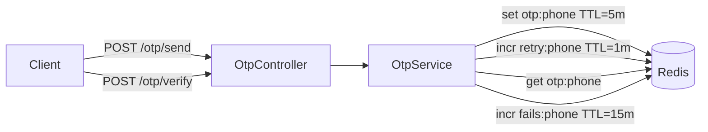

# title
OTP Verification with Redis

# description
Hands-on building an OTP (One-Time Password) system with Redis as temporary storage, including rate limiting and brute force protection.

# body

## 1. Opening

"Users receive OTP but can try 100 wrong codes without getting locked — why no protection?" — a **Senior Engineer** asks during security review. A **Mid-level Developer** answers: "I only check if OTP is correct or not." The answer shows awareness of OTP verification, but misses depth on **brute force protection**: no attempt limit → attacker tries all 999999 combinations. **Redis** provides TTL-based storage for OTP + counters for rate limiting + fail tracking.

This lesson runs through two tracks:
- **Part 2.1**: **hands-on**; **stack** is **NestJS** + **Redis** (Docker), with **three flows** (send OTP, verify OTP, brute force block).
- **Part 2.2**: **theory** clarifying **OTP lifecycle**, **rate limiting**, and **edge cases**.

## 2. Core concepts

The lesson structure follows **practice-led theory**. First, learners clone the source, start **Redis** via **Docker Compose**, run **NestJS** via `nest start --watch`, and call APIs to observe the OTP flow: code generation, rate limiting, verification, and brute force blocking. Then the **theory** section analyzes OTP lifecycle, Redis TTL, and **edge cases**.

### 2.1. Hands-on

#### 2.1.1. Prepare source code and environment

Source: [StarCi-Academy/fullstack-mastery-module-6-email-sms-otp](https://github.com/StarCi-Academy/fullstack-mastery-module-6-email-sms-otp) on GitHub — lesson directory: [`1-otp-verification-with-redis`](https://github.com/StarCi-Academy/fullstack-mastery-module-6-email-sms-otp/tree/main/1-otp-verification-with-redis).

```bash
# Step 1: Clone the repository locally
git clone https://github.com/StarCi-Academy/fullstack-mastery-module-6-email-sms-otp.git

# Step 2: Navigate to the lesson directory
cd fullstack-mastery-module-6-email-sms-otp/1-otp-verification-with-redis
```

#### 2.1.2. Architecture / components (stack + flow)

| Component | File | Role |
| --- | --- | --- |
| **Redis** | `.docker/compose.yaml` | TTL storage for OTP + counters |
| **OtpController** | `src/otp/otp.controller.ts` | `POST /otp/send`, `POST /otp/verify` |
| **OtpService** | `src/otp/otp.service.ts` | Generate OTP, rate limit, verify, brute force |
| **RedisService** | `src/redis/redis.service.ts` | Redis client wrapper |



#### 2.1.3. Prerequisites and startup

##### 2.1.3.1. Prerequisites

- **Node.js** LTS, **npm**, **NestJS CLI**, **Docker Desktop**.
- **Windows:** API commands use **`Invoke-RestMethod`** (PowerShell). See parallel **`curl`** for macOS / Linux.

> **Note:** The repo ships with env defaults via **ConfigModule**; you do not need to create or edit **.env** when running the system. Only modify this file if you want to run the service with custom ports/credentials.

##### 2.1.3.2. Start

```bash
# Step 1: Start Redis
docker compose -f .docker/compose.yaml up -d

# Step 2: Install dependencies
npm install

# Step 3: Start in watch mode
nest start --watch
```

#### 2.1.4. Verification

##### 2.1.4.1. Flow 1 — Send OTP

  ```bash
  # Windows (PowerShell)
  Invoke-RestMethod -Uri http://localhost:3000/otp/send -Method Post -ContentType "application/json" -Body '{"phone":"0901234567"}'

  # macOS / Linux
  curl -s -X POST http://localhost:3000/otp/send -H "Content-Type: application/json" -d '{"phone":"0901234567"}'
  ```

  Response (HTTP 201): `{ "message": "OTP sent successfully", "expiresIn": "5m" }`.

  Terminal log shows: `[DEBUG] OTP for 0901234567: 123456`.

##### 2.1.4.2. Flow 2 — Verify correct OTP

  ```bash
  # Windows (PowerShell)
  Invoke-RestMethod -Uri http://localhost:3000/otp/verify -Method Post -ContentType "application/json" -Body '{"phone":"0901234567","code":"123456"}'

  # macOS / Linux
  curl -s -X POST http://localhost:3000/otp/verify -H "Content-Type: application/json" -d '{"phone":"0901234567","code":"123456"}'
  ```

  Response (HTTP 201): `{ "success": true, "message": "Xác thực OTP thành công!" }`.

##### 2.1.4.3. Flow 3 — Brute force → 15-minute lock

  Send new OTP then enter wrong code 5 times:

  ```bash
  # Windows (PowerShell)
  Invoke-RestMethod -Uri http://localhost:3000/otp/send -Method Post -ContentType "application/json" -Body '{"phone":"0901234567"}'
  1..5 | ForEach-Object { Invoke-RestMethod -Uri http://localhost:3000/otp/verify -Method Post -ContentType "application/json" -Body '{"phone":"0901234567","code":"000000"}' }

  # macOS / Linux
  curl -s -X POST http://localhost:3000/otp/send -H "Content-Type: application/json" -d '{"phone":"0901234567"}'
  for i in {1..5}; do curl -s -X POST http://localhost:3000/otp/verify -H "Content-Type: application/json" -d '{"phone":"0901234567","code":"000000"}'; done
  ```

  5th attempt: HTTP 403 — verification locked for 15 minutes.

*If the responses match:*

- *Redis TTL — OTP auto-expires after 5 minutes, no manual cleanup.*
- *Rate limiting — max 3 sends per minute.*
- *Brute force protection — locked for 15 minutes after 5 wrong attempts.*

#### 2.1.5. Cleanup

When you are done, tear down to free resources.

```bash
# Step 1: Stop the running server
# Windows / macOS / Linux
Ctrl + C

# Step 2: Close Docker (if the lesson uses Docker)
docker compose -f .docker/compose.yaml down -v
```

#### 2.1.6. Further reading

- **Redis TTL:** Key expiration mechanism. ([Redis Docs](https://redis.io/commands/expire/))
- **OWASP OTP Security:** Best practices. ([OWASP](https://cheatsheetseries.owasp.org/cheatsheets/Forgot_Password_Cheat_Sheet.html))

### 2.2. Theory — OTP Lifecycle and Redis

#### 2.2.1. Redis Keys

| Key pattern | TTL | Purpose |
| --- | --- | --- |
| `otp:{phone}` | 300s (5m) | Stores OTP code |
| `retry:{phone}` | 60s (1m) | Counts send attempts |
| `fails:{phone}` | 900s (15m) | Counts wrong verifications |

#### 2.2.2. Edge cases to internalize

- **OTP reuse:** Correct verify but not deleted → reused. **Fix:** `DEL otp:phone` after successful verify.
- **Race condition:** 2 verify requests simultaneously. **Fix:** Redis atomic operations (GETDEL).
- **Predictable OTP:** Using `Math.random()`. **Fix:** use `crypto.randomInt()` for cryptographic randomness.
- **Redis down:** App can't send/verify OTP. **Fix:** Redis health check, fallback or circuit breaker.

## 3. Wrap-up

### 3.1. Common interview questions

- **Question 1:** Why use Redis instead of a database for OTP?
  - Sample answer: OTP is short-lived — Redis TTL auto-cleans, faster than DB for high-frequency read/write.

- **Question 2:** How does OTP rate limiting work?
  - Sample answer: Redis INCR + EXPIRE — counts sends within 1 minute, rejects if over limit.

- **Question 3:** How does brute force protection differ from rate limiting?
  - Sample answer: Rate limiting controls send frequency; brute force protection limits wrong verification attempts.

# references
## 0
### alias
Redis Commands
### url
https://redis.io/commands/
## 1
### alias
OWASP Authentication Cheatsheet
### url
https://cheatsheetseries.owasp.org/cheatsheets/Authentication_Cheat_Sheet.html

# minutesRead
18
