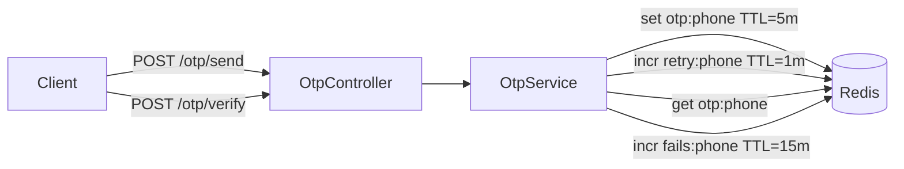

# title
Xác thực OTP với Redis

# description
Thực hành xây dựng hệ thống OTP (One-Time Password) với Redis làm storage tạm thời, bao gồm rate limiting và brute force protection.

# body

## 1. Lời mở đầu

"User nhận OTP nhưng nhập sai 100 lần vẫn được thử tiếp — vì sao không khóa?" — một **Senior Engineer** hỏi khi review security. Một **Mid-level Developer** trả lời: "Em chỉ check OTP đúng hay sai." Câu trả lời cho thấy nhận thức về OTP verification, nhưng vẫn thiếu chiều sâu về **brute force protection**: không giới hạn số lần thử → attacker thử tất cả 999999 tổ hợp. **Redis** cung cấp TTL-based storage cho OTP + counter cho rate limiting + fail tracking.

Bài này dẫn qua hai mạch liên tiếp:
- **Phần 2.1**: **thực hành**; **stack** gồm **NestJS** + **Redis** (Docker), kèm **ba luồng** (send OTP, verify OTP, brute force block).
- **Phần 2.2**: **lý thuyết** làm rõ bản chất **OTP lifecycle**, **rate limiting**, và các **edge case**.

## 2. Các khái niệm cốt lõi

Cấu trúc bài học áp dụng phương pháp **Thực hành dẫn dắt Lý thuyết**. Khởi đầu, học viên clone source, khởi động **Redis** bằng **Docker Compose**, chạy **NestJS** bằng `nest start --watch` và gọi API để quan sát luồng OTP: sinh mã, rate limit, verify, brute force block. Tiếp theo, **phần lý thuyết** phân tích OTP lifecycle, Redis TTL và các **edge cases**.

### 2.1. Thực hành

#### 2.1.1. Chuẩn bị source code và môi trường

Source: [StarCi-Academy/fullstack-mastery-module-6-email-sms-otp](https://github.com/StarCi-Academy/fullstack-mastery-module-6-email-sms-otp) trên GitHub — thư mục bài học: [`1-otp-verification-with-redis`](https://github.com/StarCi-Academy/fullstack-mastery-module-6-email-sms-otp/tree/main/1-otp-verification-with-redis).

```bash
# Bước 1: Clone repository về máy local
git clone https://github.com/StarCi-Academy/fullstack-mastery-module-6-email-sms-otp.git

# Bước 2: Di chuyển vào đúng thư mục bài học
cd fullstack-mastery-module-6-email-sms-otp/1-otp-verification-with-redis
```

#### 2.1.2. Kiến trúc/thành phần (stack + luồng)

| Thành phần | File | Vai trò |
| --- | --- | --- |
| **Redis** | `.docker/compose.yaml` | TTL storage cho OTP + counters |
| **OtpController** | `src/otp/otp.controller.ts` | `POST /otp/send`, `POST /otp/verify` |
| **OtpService** | `src/otp/otp.service.ts` | Sinh OTP, rate limit, verify, brute force |
| **RedisService** | `src/redis/redis.service.ts` | Redis client wrapper |



#### 2.1.3. Chuẩn bị & khởi chạy

##### 2.1.3.1. Điều kiện cần trước

- **Node.js** LTS, **npm**, **NestJS CLI**, **Docker Desktop**.
- **Windows:** các lệnh API dùng **`Invoke-RestMethod`** (PowerShell). Xem song song **`curl`** cho macOS / Linux.

##### 2.1.3.2. Khởi động

```bash
# Bước 1: Khởi động Redis
docker compose -f .docker/compose.yaml up -d

# Bước 2: Cài dependency
npm install

# Bước 3: Khởi chạy ở chế độ watch
nest start --watch
```

#### 2.1.4. Kiểm thử

##### 2.1.4.1. Luồng 1 — Gửi OTP

  ```bash
  # Windows (PowerShell)
  Invoke-RestMethod -Uri http://localhost:3000/otp/send -Method Post -ContentType "application/json" -Body '{"phone":"0901234567"}'

  # macOS / Linux
  curl -s -X POST http://localhost:3000/otp/send -H "Content-Type: application/json" -d '{"phone":"0901234567"}'
  ```

  Response (HTTP 201): `{ "message": "OTP sent successfully", "expiresIn": "5m" }`.

  Terminal log hiển thị: `[DEBUG] OTP for 0901234567: 123456`.

##### 2.1.4.2. Luồng 2 — Verify OTP đúng

  ```bash
  # Windows (PowerShell)
  Invoke-RestMethod -Uri http://localhost:3000/otp/verify -Method Post -ContentType "application/json" -Body '{"phone":"0901234567","code":"123456"}'

  # macOS / Linux
  curl -s -X POST http://localhost:3000/otp/verify -H "Content-Type: application/json" -d '{"phone":"0901234567","code":"123456"}'
  ```

  Response (HTTP 201): `{ "success": true, "message": "Xác thực OTP thành công!" }`.

##### 2.1.4.3. Luồng 3 — Brute force → khóa 15 phút

  Gửi OTP mới rồi nhập sai 5 lần liên tiếp:

  ```bash
  # Windows (PowerShell)
  Invoke-RestMethod -Uri http://localhost:3000/otp/send -Method Post -ContentType "application/json" -Body '{"phone":"0901234567"}'
  # Nhập sai 5 lần
  1..5 | ForEach-Object { Invoke-RestMethod -Uri http://localhost:3000/otp/verify -Method Post -ContentType "application/json" -Body '{"phone":"0901234567","code":"000000"}' }

  # macOS / Linux
  curl -s -X POST http://localhost:3000/otp/send -H "Content-Type: application/json" -d '{"phone":"0901234567"}'
  for i in {1..5}; do curl -s -X POST http://localhost:3000/otp/verify -H "Content-Type: application/json" -d '{"phone":"0901234567","code":"000000"}'; done
  ```

  Lần thứ 5: HTTP 403 `"Bạn đã nhập sai quá 5 lần. Tính năng xác thực bị khóa trong 15 phút."`.

*Kết luận:*

- *Redis TTL — OTP tự hết hạn sau 5 phút, không cần cleanup manual.*
- *Rate limiting — tối đa 3 lần gửi/phút.*
- *Brute force protection — khóa 15 phút sau 5 lần sai.*

#### 2.1.5. Dọn tài nguyên

Sau khi kết thúc bài, bạn có thể dọn tài nguyên để tiết kiệm bộ nhớ.

```bash
# Bước 1: Dừng server đang chạy
# Windows / macOS / Linux
Ctrl + C

# Bước 2: Đóng Docker (nếu bài học có dùng Docker)
docker compose -f .docker/compose.yaml down -v
```

#### 2.1.6. Đọc thêm

- **Redis TTL:** Key expiration mechanism. ([Redis Docs](https://redis.io/commands/expire/))
- **OWASP OTP Security:** Best practices. ([OWASP](https://cheatsheetseries.owasp.org/cheatsheets/Forgot_Password_Cheat_Sheet.html))

### 2.2. Lý thuyết — OTP Lifecycle và Redis

#### 2.2.1. Redis Keys

| Key pattern | TTL | Mục đích |
| --- | --- | --- |
| `otp:{phone}` | 300s (5m) | Lưu mã OTP |
| `retry:{phone}` | 60s (1m) | Đếm số lần gửi |
| `fails:{phone}` | 900s (15m) | Đếm số lần nhập sai |

#### 2.2.2. Các trường hợp biên (edge cases) cần lưu ý

- **OTP reuse:** Verify đúng nhưng không xóa → dùng lại. **Giải pháp:** `DEL otp:phone` sau verify thành công.
- **Race condition:** 2 request verify cùng lúc. **Giải pháp:** Redis atomic operations (GETDEL).
- **Predictable OTP:** Dùng `Math.random()`. **Giải pháp:** dùng `crypto.randomInt()` cho cryptographic randomness.
- **Redis down:** App không gửi/verify được OTP. **Giải pháp:** health check Redis, fallback hoặc circuit breaker.

## 3. Tổng kết

### 3.1. Các câu hỏi dễ bị phỏng vấn

- **Câu hỏi 1:** Vì sao dùng Redis thay vì database cho OTP?
  - Trả lời mẫu: OTP ngắn hạn — Redis TTL tự cleanup, nhanh hơn DB cho read/write tần suất cao.

- **Câu hỏi 2:** Rate limiting OTP hoạt động thế nào?
  - Trả lời mẫu: Redis INCR + EXPIRE — đếm số lần gửi trong 1 phút, reject nếu vượt limit.

- **Câu hỏi 3:** Brute force protection khác rate limiting thế nào?
  - Trả lời mẫu: Rate limiting giới hạn tốc độ gửi; brute force protection giới hạn số lần nhập sai.

# references
## 0
### alias
Redis Commands
### url
https://redis.io/commands/
## 1
### alias
OWASP Authentication Cheatsheet
### url
https://cheatsheetseries.owasp.org/cheatsheets/Authentication_Cheat_Sheet.html

# minutesRead
18
