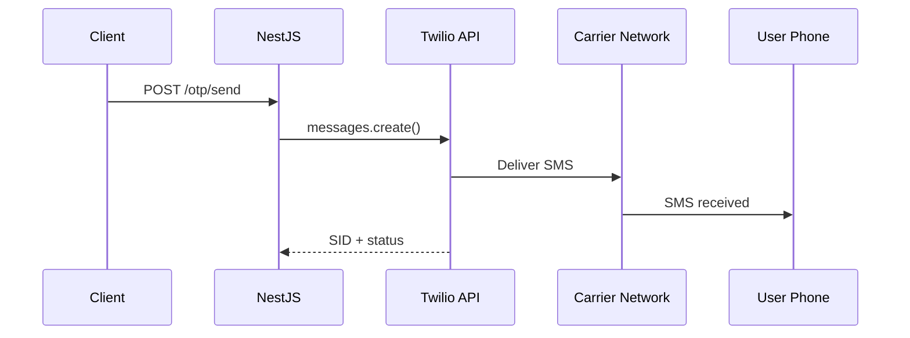

# title
Integrating SMS with Twilio

# description
Hands-on integrating Twilio SMS API into NestJS to send OTP via text messages, including credentials configuration, delivery status handling, and fallback strategy.

# body

## 1. Opening

"Email OTP works — but users in areas without internet can't receive it, how do they get OTP?" — a **Senior Engineer** asks during UX review. A **Mid-level Developer** answers: "I'll send via SMS." The answer is correct, but misses depth on **SMS delivery pipeline**: SMS goes through carrier networks, has latency, and can fail silently — requiring **delivery callbacks**, **retry strategies**, and **cost management** that email doesn't need.

This lesson runs through two tracks:
- **Part 2.1**: **hands-on** integrating Twilio into a NestJS project.
- **Part 2.2**: **theory** clarifying **SMS delivery pipeline**, **Twilio API**, and **edge cases** like **carrier filtering**, **number verification**, and **cost per message**.

## 2. Core concepts

The lesson structure follows **practice-led theory**. First, learners register a **Twilio** trial account, configure credentials, run **NestJS** via `nest start --watch`, and call the API to send a real SMS OTP. Then the **theory** section analyzes the SMS delivery pipeline, webhook status callbacks, and **edge cases**.

### 2.1. Hands-on

#### 2.1.1. Prepare source code and environment

This lesson uses the same OTP project from the previous lesson, extended with an SMS channel.

```bash
# Step 1: Navigate to the project directory (if not cloned, see lesson 1)
cd fullstack-mastery-module-6-email-sms-otp/1-otp-verification-with-redis
```

#### 2.1.2. Architecture / components

| Component | Role |
| --- | --- |
| **Twilio SDK** | Sends SMS via Twilio REST API |
| **SmsService** | Twilio client wrapper |
| **OtpService** | Generates OTP → calls SmsService |
| **Twilio Console** | Manages credentials, phone numbers, logs |



#### 2.1.3. Prerequisites and startup

##### 2.1.3.1. Prerequisites

- **Node.js** LTS, **npm**, **NestJS CLI**, **Docker Desktop** (for Redis).
- **Twilio account:** register trial at [twilio.com](https://www.twilio.com/try-twilio).
- Configure `.env`: `TWILIO_ACCOUNT_SID`, `TWILIO_AUTH_TOKEN`, `TWILIO_PHONE_NUMBER`.
- **Windows:** API commands use **`Invoke-RestMethod`** (PowerShell). See parallel **`curl`** for macOS / Linux.

> **Note:** The repo ships with env defaults via **ConfigModule**; you do not need to create or edit **.env** when running the system. Only modify this file if you want to run the service with custom ports/credentials.

##### 2.1.3.2. Start

```bash
# Step 1: Start Redis
docker compose -f .docker/compose.yaml up -d

# Step 2: Install dependencies (includes twilio SDK)
npm install

# Step 3: Start in watch mode
nest start --watch
```

#### 2.1.4. Verification

##### 2.1.4.1. Flow 1 — Send OTP via SMS

  ```bash
  # Windows (PowerShell)
  Invoke-RestMethod -Uri http://localhost:3000/otp/send -Method Post -ContentType "application/json" -Body '{"phone":"+84901234567","channel":"sms"}'

  # macOS / Linux
  curl -s -X POST http://localhost:3000/otp/send -H "Content-Type: application/json" -d '{"phone":"+84901234567","channel":"sms"}'
  ```

  Response (HTTP 201): `{ "message": "OTP sent via SMS", "expiresIn": "5m" }`.

##### 2.1.4.2. Flow 2 — Verify OTP received via SMS

  ```bash
  # Windows (PowerShell)
  Invoke-RestMethod -Uri http://localhost:3000/otp/verify -Method Post -ContentType "application/json" -Body '{"phone":"+84901234567","code":"<OTP>"}'

  # macOS / Linux
  curl -s -X POST http://localhost:3000/otp/verify -H "Content-Type: application/json" -d '{"phone":"+84901234567","code":"<OTP>"}'
  ```

  Response (HTTP 201): `{ "success": true }`.

*If the responses match:*

- *Twilio SDK — sends SMS via REST API, no carrier infrastructure needed.*
- *Same OTP flow — only delivery channel changes from log to SMS.*

#### 2.1.5. Cleanup

When you are done, tear down to free resources.

```bash
# Step 1: Stop the running server
# Windows / macOS / Linux
Ctrl + C

# Step 2: Close Docker (if the lesson uses Docker)
docker compose -f .docker/compose.yaml down -v
```

#### 2.1.6. Further reading

- **Twilio Programmable SMS:** REST API for messaging. ([Twilio Docs](https://www.twilio.com/docs/sms))
- **Twilio Status Callbacks:** Webhook delivery status. ([Twilio Docs](https://www.twilio.com/docs/sms/tutorials/how-to-confirm-delivery))

### 2.2. Theory — SMS Delivery Pipeline

#### 2.2.1. Email vs SMS

| Email | SMS |
| --- | --- |
| Free (SMTP provider) | Paid per message |
| Delivery via internet | Delivery via carrier network |
| Can land in spam | No spam filter (but carrier filtering) |
| Low latency | Latency depends on carrier |

#### 2.2.2. Edge cases to internalize

- **Twilio trial restrictions:** Only sends to verified numbers. **Fix:** upgrade account or verify test numbers.
- **International format:** Phone number missing country code. **Fix:** always require E.164 format (`+84...`).
- **Carrier filtering:** Carrier blocks bulk messages. **Fix:** use Twilio Messaging Service with sender pool.
- **Cost per message:** SMS more expensive than email. **Fix:** stricter rate limits, fallback to email when possible.
- **Silent delivery failure:** SMS sent but not received. **Fix:** use Twilio status callback webhook to track delivery.

## 3. Wrap-up

### 3.1. Common interview questions

- **Question 1:** Email OTP vs SMS OTP — when to use which?
  - Sample answer: SMS for critical actions (login, payment); email for non-critical (welcome, notification). SMS is costlier but has higher reach.

- **Question 2:** Why is E.164 format required for phone numbers?
  - Sample answer: International standard including country code — avoids confusion between countries.

- **Question 3:** SMS sent successfully but user doesn't receive it — how to troubleshoot?
  - Sample answer: Check Twilio delivery status callback; may be carrier filtering or invalid number.

# references
## 0
### alias
Twilio Programmable SMS
### url
https://www.twilio.com/docs/sms
## 1
### alias
E.164 Phone Number Format
### url
https://www.twilio.com/docs/glossary/what-e164

# minutesRead
15
