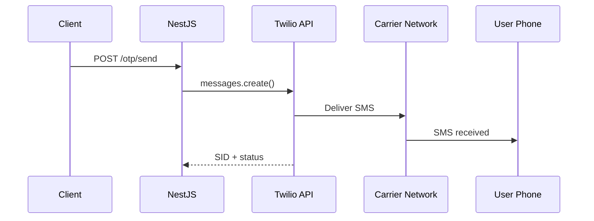

# title
Tích hợp SMS với Twilio

# description
Thực hành tích hợp Twilio SMS API vào NestJS để gửi OTP qua tin nhắn SMS, bao gồm cấu hình credentials, xử lý delivery status và fallback strategy.

# body

## 1. Lời mở đầu

"Gửi OTP qua email ok rồi — nhưng user ở vùng không có internet, làm sao nhận OTP?" — một **Senior Engineer** hỏi khi review UX. Một **Mid-level Developer** trả lời: "Em sẽ gửi qua SMS." Câu trả lời đúng hướng, nhưng vẫn thiếu chiều sâu về **SMS delivery pipeline**: SMS phải qua carrier network, có latency, có thể fail silently — cần **delivery callback**, **retry strategy**, và **cost management** mà email không cần.

Bài này dẫn qua hai mạch liên tiếp:
- **Phần 2.1**: **thực hành** tích hợp Twilio vào NestJS project.
- **Phần 2.2**: **lý thuyết** làm rõ bản chất **SMS delivery pipeline**, **Twilio API**, và các **edge case** như **carrier filtering**, **number verification**, **cost per message**.

## 2. Các khái niệm cốt lõi

Cấu trúc bài học áp dụng phương pháp **Thực hành dẫn dắt Lý thuyết**. Khởi đầu, học viên đăng ký tài khoản **Twilio** trial, cấu hình credentials, chạy **NestJS** bằng `nest start --watch` và gọi API để gửi SMS OTP thực tế. Tiếp theo, **phần lý thuyết** phân tích SMS delivery pipeline, webhook status callback và các **edge cases**.

### 2.1. Thực hành

#### 2.1.1. Chuẩn bị source code và môi trường

Bài này sử dụng cùng project OTP từ bài trước, mở rộng thêm SMS channel.

```bash
# Bước 1: Di chuyển vào thư mục project (nếu chưa clone, xem bài 1)
cd fullstack-mastery-module-6-email-sms-otp/1-otp-verification-with-redis
```

#### 2.1.2. Kiến trúc/thành phần (stack + luồng)

| Thành phần | Vai trò |
| --- | --- |
| **Twilio SDK** | Gửi SMS qua Twilio REST API |
| **SmsService** | Wrapper Twilio client, gửi message |
| **OtpService** | Sinh OTP → gọi SmsService thay vì log |
| **Twilio Console** | Quản lý credentials, phone numbers, logs |



#### 2.1.3. Chuẩn bị & khởi chạy

##### 2.1.3.1. Điều kiện cần trước

- **Node.js** LTS, **npm**, **NestJS CLI**, **Docker Desktop** (cho Redis).
- **Twilio account:** đăng ký trial tại [twilio.com](https://www.twilio.com/try-twilio).
- Cấu hình `.env`: `TWILIO_ACCOUNT_SID`, `TWILIO_AUTH_TOKEN`, `TWILIO_PHONE_NUMBER`.
- **Windows:** các lệnh API dùng **`Invoke-RestMethod`** (PowerShell). Xem song song **`curl`** cho macOS / Linux.

##### 2.1.3.2. Khởi động

```bash
# Bước 1: Khởi động Redis
docker compose -f .docker/compose.yaml up -d

# Bước 2: Cài dependency (bao gồm twilio SDK)
npm install

# Bước 3: Khởi chạy ở chế độ watch
nest start --watch
```

#### 2.1.4. Kiểm thử

##### 2.1.4.1. Luồng 1 — Gửi OTP qua SMS

  ```bash
  # Windows (PowerShell)
  Invoke-RestMethod -Uri http://localhost:3000/otp/send -Method Post -ContentType "application/json" -Body '{"phone":"+84901234567","channel":"sms"}'

  # macOS / Linux
  curl -s -X POST http://localhost:3000/otp/send -H "Content-Type: application/json" -d '{"phone":"+84901234567","channel":"sms"}'
  ```

  Response (HTTP 201): `{ "message": "OTP sent via SMS", "expiresIn": "5m" }`.

  Điện thoại nhận SMS chứa mã OTP.

##### 2.1.4.2. Luồng 2 — Verify OTP nhận qua SMS

  ```bash
  # Windows (PowerShell)
  Invoke-RestMethod -Uri http://localhost:3000/otp/verify -Method Post -ContentType "application/json" -Body '{"phone":"+84901234567","code":"<OTP>"}'

  # macOS / Linux
  curl -s -X POST http://localhost:3000/otp/verify -H "Content-Type: application/json" -d '{"phone":"+84901234567","code":"<OTP>"}'
  ```

  Response (HTTP 201): `{ "success": true }`.

*Kết luận:*

- *Twilio SDK — gửi SMS qua REST API, không cần manage carrier infrastructure.*
- *Cùng OTP flow — chỉ thay delivery channel từ log sang SMS.*

#### 2.1.5. Dọn tài nguyên

Sau khi kết thúc bài, bạn có thể dọn tài nguyên để tiết kiệm bộ nhớ.

```bash
# Bước 1: Dừng server đang chạy
# Windows / macOS / Linux
Ctrl + C

# Bước 2: Đóng Docker (nếu bài học có dùng Docker)
docker compose -f .docker/compose.yaml down -v
```

#### 2.1.6. Đọc thêm

- **Twilio Programmable SMS:** REST API gửi tin nhắn. ([Twilio Docs](https://www.twilio.com/docs/sms))
- **Twilio Status Callbacks:** Webhook delivery status. ([Twilio Docs](https://www.twilio.com/docs/sms/tutorials/how-to-confirm-delivery))

### 2.2. Lý thuyết — SMS Delivery Pipeline

#### 2.2.1. Email vs SMS

| Email | SMS |
| --- | --- |
| Miễn phí (SMTP provider) | Trả phí per message |
| Delivery qua internet | Delivery qua carrier network |
| Có thể vào spam | Không spam filter (nhưng carrier filter) |
| Latency thấp | Latency phụ thuộc carrier |

#### 2.2.2. Các trường hợp biên (edge cases) cần lưu ý

- **Twilio trial restrictions:** Chỉ gửi tới verified numbers. **Giải pháp:** upgrade account hoặc verify số test.
- **International format:** Số điện thoại thiếu country code. **Giải pháp:** luôn yêu cầu E.164 format (`+84...`).
- **Carrier filtering:** Carrier block tin nhắn bulk. **Giải pháp:** dùng Twilio Messaging Service với sender pool.
- **Cost per message:** SMS đắt hơn email. **Giải pháp:** rate limit strict hơn, fallback sang email khi có thể.
- **Delivery failure silent:** SMS gửi nhưng không tới. **Giải pháp:** dùng Twilio status callback webhook để track delivery.

## 3. Tổng kết

### 3.1. Các câu hỏi dễ bị phỏng vấn

- **Câu hỏi 1:** Email OTP vs SMS OTP — khi nào dùng cái nào?
  - Trả lời mẫu: SMS cho critical actions (login, payment); email cho non-critical (welcome, notification). SMS đắt nhưng reach cao hơn.

- **Câu hỏi 2:** Vì sao cần E.164 format cho số điện thoại?
  - Trả lời mẫu: Chuẩn quốc tế bao gồm country code — tránh nhầm lẫn giữa các quốc gia.

- **Câu hỏi 3:** SMS gửi thành công nhưng user không nhận — xử lý thế nào?
  - Trả lời mẫu: Kiểm tra Twilio delivery status callback; có thể do carrier filtering hoặc số không hợp lệ.

# references
## 0
### alias
Twilio Programmable SMS
### url
https://www.twilio.com/docs/sms
## 1
### alias
E.164 Phone Number Format
### url
https://www.twilio.com/docs/glossary/what-e164

# minutesRead
15
