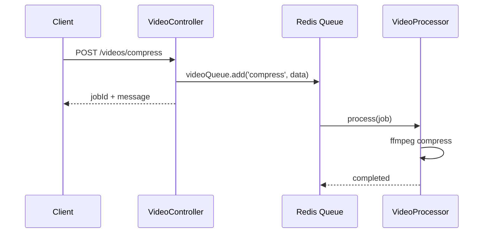

# title
BullMQ Message Queue

# description
Hands-on processing heavy tasks asynchronously with BullMQ in NestJS, including video compression with retry strategy and exponential backoff.

# body

## 1. Opening

"User uploads a 2GB video — API response takes 5 minutes, client times out." — a **Senior Engineer** asks during performance review. A **Mid-level Developer** answers: "I'll increase the timeout." The answer addresses the symptom, but misses depth on **async processing**: heavy tasks shouldn't block HTTP requests — **Message Queue** (BullMQ) accepts the job, responds immediately, and processes asynchronously in a separate worker.

This lesson runs through two tracks:
- **Part 2.1**: **hands-on**; **stack** is **NestJS** + **Redis** (Docker) + **BullMQ**, with the flow POST compress → queue job → worker processes.
- **Part 2.2**: **theory** clarifying the **message queue pattern**, **retry strategy**, and **edge cases**.

## 2. Core concepts

The lesson structure follows **practice-led theory**. First, learners clone the source, start **Redis** via **Docker Compose**, run **NestJS** via `nest start --watch`, and call the video compression API to observe the job being queued and processed asynchronously by the worker. Then the **theory** section analyzes the message queue pattern, retry strategy, and **edge cases**.

### 2.1. Hands-on

#### 2.1.1. Prepare source code and environment

Source: [StarCi-Academy/fullstack-mastery-module-7-workers-and-cron-jobs](https://github.com/StarCi-Academy/fullstack-mastery-module-7-workers-and-cron-jobs) on GitHub — lesson directory: [`1-bullmq-message-queue`](https://github.com/StarCi-Academy/fullstack-mastery-module-7-workers-and-cron-jobs/tree/main/1-bullmq-message-queue).

```bash
# Step 1: Clone the repository locally
git clone https://github.com/StarCi-Academy/fullstack-mastery-module-7-workers-and-cron-jobs.git

# Step 2: Navigate to the lesson directory
cd fullstack-mastery-module-7-workers-and-cron-jobs/1-bullmq-message-queue
```

#### 2.1.2. Architecture / components

| Component | File | Role |
| --- | --- | --- |
| **Redis** | `.docker/compose.yaml` | BullMQ backend (job storage) |
| **VideoController** | `src/video/video.controller.ts` | `POST /videos/compress` → enqueue |
| **VideoProcessor** | `src/video/video.processor.ts` | Worker processes video compression (ffmpeg) |



#### 2.1.3. Prerequisites and startup

##### 2.1.3.1. Prerequisites

- **Node.js** LTS, **npm**, **NestJS CLI**, **Docker Desktop**.
- **FFmpeg** installed locally (for video processing).
- **Windows:** API commands use **`Invoke-RestMethod`** (PowerShell). See parallel **`curl`** for macOS / Linux.

##### 2.1.3.2. Start

```bash
# Step 1: Start Redis
docker compose -f .docker/compose.yaml up -d

# Step 2: Install dependencies
npm install

# Step 3: Start in watch mode
nest start --watch
```

#### 2.1.4. Verification

##### 2.1.4.1. Flow 1 — Enqueue video compression job

  ```bash
  # Windows (PowerShell)
  Invoke-RestMethod -Uri http://localhost:3000/videos/compress -Method Post -ContentType "application/json" -Body '{"filePath":"sample.mp4"}'

  # macOS / Linux
  curl -s -X POST http://localhost:3000/videos/compress -H "Content-Type: application/json" -d '{"filePath":"sample.mp4"}'
  ```

  Response **immediately** (HTTP 201): `{ "message": "Video compression job queued.", "jobId": "1" }`.

##### 2.1.4.2. Flow 2 — Observe worker processing

  Terminal logs show:

  ```
  [VideoProcessor] [Job 1] Starting video compression: sample.mp4
  [VideoProcessor] [Job 1] FFmpeg command: ffmpeg ...
  [VideoProcessor] [Job 1] Video compression successful
  ```

  If file doesn't exist → retries 3 times with exponential backoff (1s → 2s → 4s).

*If the responses match:*

- *Async processing — API responds immediately, worker processes in background.*
- *Retry strategy — 3 retries with exponential backoff, no job lost.*

#### 2.1.5. Cleanup

When you are done, tear down to free resources.

```bash
# Step 1: Stop the running server
# Windows / macOS / Linux
Ctrl + C

# Step 2: Close Docker (if the lesson uses Docker)
docker compose -f .docker/compose.yaml down -v
```

#### 2.1.6. Further reading

- **BullMQ:** Message queue for Node.js/Redis. ([BullMQ Docs](https://docs.bullmq.io/))
- **NestJS Queues:** BullMQ integration. ([NestJS Docs](https://docs.nestjs.com/techniques/queues))

### 2.2. Theory — Message Queue Pattern

#### 2.2.1. Sync vs Async Processing

| Sync (in-request) | Async (queue) |
| --- | --- |
| Client waits for completion | Client gets response immediately |
| Timeout if task is long | Worker processes in background |
| No automatic retry | Automatic retry + backoff |

#### 2.2.2. Edge cases to internalize

- **Redis down:** Queue non-functional. **Fix:** Redis health check, circuit breaker.
- **Worker crash mid-job:** Job stuck in processing. **Fix:** BullMQ auto-moves to failed → retry.
- **Queue backlog:** Jobs accumulate faster than processing. **Fix:** scale workers horizontally, rate limit producer.
- **Duplicate jobs:** Same file queued twice. **Fix:** use unique `jobId` or deduplication logic.

## 3. Wrap-up

### 3.1. Common interview questions

- **Question 1:** When should you use a message queue instead of sync processing?
  - Sample answer: When task > 1–2 seconds (file processing, email, notification) — avoids blocking HTTP response.

- **Question 2:** What is exponential backoff?
  - Sample answer: Retry delay increases exponentially (1s → 2s → 4s) — avoids overwhelming resources during continuous failures.

- **Question 3:** What does BullMQ use Redis for?
  - Sample answer: Stores job data, manages queue state, ensures at-least-once delivery.

# references
## 0
### alias
BullMQ Documentation
### url
https://docs.bullmq.io/
## 1
### alias
NestJS Queues
### url
https://docs.nestjs.com/techniques/queues

# minutesRead
17
