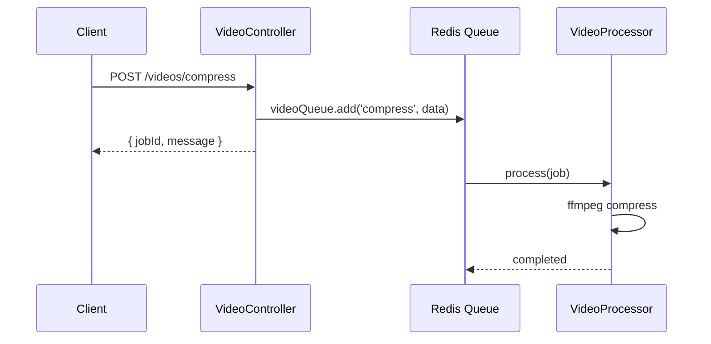

# title
BullMQ Message Queue

# description
Thực hành xử lý tác vụ nặng bất đồng bộ bằng BullMQ trong NestJS, ví dụ nén video với retry strategy và exponential backoff.

# body

## 1. Lời mở đầu

"User upload video 2GB — API response mất 5 phút, client timeout." — một **Senior Engineer** hỏi khi review performance. Một **Mid-level Developer** trả lời: "Em sẽ tăng timeout." Câu trả lời giải quyết triệu chứng, nhưng vẫn thiếu chiều sâu về **async processing**: tác vụ nặng không nên block HTTP request — **Message Queue** (BullMQ) nhận job, trả response ngay, xử lý bất đồng bộ trong worker riêng.

Bài này dẫn qua hai mạch liên tiếp:
- **Phần 2.1**: **thực hành**; **stack** gồm **NestJS** + **Redis** (Docker) + **BullMQ**, kèm **luồng** POST compress → queue job → worker xử lý.
- **Phần 2.2**: **lý thuyết** làm rõ bản chất **message queue pattern**, **retry strategy**, và các **edge case**.

## 2. Các khái niệm cốt lõi

Cấu trúc bài học áp dụng phương pháp **Thực hành dẫn dắt Lý thuyết**. Khởi đầu, học viên clone source, khởi động **Redis** bằng **Docker Compose**, chạy **NestJS** bằng `nest start --watch` và gọi API nén video để quan sát job được queue rồi xử lý bất đồng bộ trong worker. Tiếp theo, **phần lý thuyết** phân tích message queue pattern, retry strategy và các **edge cases**.

### 2.1. Thực hành

#### 2.1.1. Chuẩn bị source code và môi trường

Source: [StarCi-Academy/fullstack-mastery-module-7-workers-and-cron-jobs](https://github.com/StarCi-Academy/fullstack-mastery-module-7-workers-and-cron-jobs) trên GitHub — thư mục bài học: [`1-bullmq-message-queue`](https://github.com/StarCi-Academy/fullstack-mastery-module-7-workers-and-cron-jobs/tree/main/1-bullmq-message-queue).

```bash
# Bước 1: Clone repository về máy local
git clone https://github.com/StarCi-Academy/fullstack-mastery-module-7-workers-and-cron-jobs.git

# Bước 2: Di chuyển vào đúng thư mục bài học
cd fullstack-mastery-module-7-workers-and-cron-jobs/1-bullmq-message-queue
```

#### 2.1.2. Kiến trúc/thành phần (stack + luồng)

| Thành phần | File | Vai trò |
| --- | --- | --- |
| **Redis** | `.docker/compose.yaml` | BullMQ backend (job storage) |
| **VideoController** | `src/video/video.controller.ts` | `POST /videos/compress` → enqueue |
| **VideoProcessor** | `src/video/video.processor.ts` | Worker xử lý nén video (ffmpeg) |



#### 2.1.3. Chuẩn bị & khởi chạy

##### 2.1.3.1. Điều kiện cần trước

- **Node.js** LTS, **npm**, **NestJS CLI**, **Docker Desktop**.
- **FFmpeg** được cung cấp tự động qua `@ffmpeg-installer/ffmpeg` (cài cùng `npm install` — không cần cài FFmpeg hệ thống).
- **Windows:** các lệnh API dùng **`Invoke-RestMethod`** (PowerShell). Xem song song **`curl`** cho macOS / Linux.

> **Lưu ý:** Repo đã ship env defaults qua **ConfigModule**; khi chạy hệ thống không cần tạo hay sửa **.env**. Chỉ chỉnh sửa file này khi bạn muốn chạy service với các port/credential khác mặc định.

##### 2.1.3.2. Khởi động

```bash
# Bước 1: Khởi động Redis
docker compose -f .docker/compose.yaml up -d

# Bước 2: Cài dependency (bao gồm @ffmpeg-installer/ffmpeg — cung cấp binary FFmpeg qua npm)
npm install

# Bước 3: Khởi chạy ở chế độ watch
nest start --watch
```

#### 2.1.4. Kiểm thử

##### 2.1.4.1. Luồng 1 — Enqueue video compression job

  ```bash
  # Windows (PowerShell)
  Invoke-RestMethod -Uri http://localhost:3000/videos/compress -Method Post -ContentType "application/json" -Body '{"filePath":"sample.mp4"}'

  # macOS / Linux
  curl -s -X POST http://localhost:3000/videos/compress -H "Content-Type: application/json" -d '{"filePath":"sample.mp4"}'
  ```

  Response **tức thì** (HTTP 201): `{ "message": "Video compression job queued.", "jobId": "1" }`.

##### 2.1.4.2. Luồng 2 — Quan sát worker processing

  Terminal log hiển thị:

  ```
  [VideoProcessor] [Job 1] Bắt đầu xử lý nén video: sample.mp4
  [VideoProcessor] [Job 1] FFmpeg command: ffmpeg ...
  [VideoProcessor] [Job 1] Nén video thành công
  ```

  Nếu file không tồn tại → retry 3 lần với exponential backoff (1s → 2s → 4s).

*Kết luận:*

- *Async processing — API trả response ngay, worker xử lý background.*
- *Retry strategy — 3 lần retry với exponential backoff, không mất job.*

#### 2.1.5. Dọn tài nguyên

Sau khi kết thúc bài, bạn có thể dọn tài nguyên để tiết kiệm bộ nhớ.

```bash
# Bước 1: Dừng server đang chạy
# Windows / macOS / Linux
Ctrl + C

# Bước 2: Đóng Docker (nếu bài học có dùng Docker)
docker compose -f .docker/compose.yaml down -v
```

#### 2.1.6. Đọc thêm

- **BullMQ:** Message queue cho Node.js/Redis. ([BullMQ Docs](https://docs.bullmq.io/))
- **NestJS Queues:** BullMQ integration. ([NestJS Docs](https://docs.nestjs.com/techniques/queues))

### 2.2. Lý thuyết — Message Queue Pattern

#### 2.2.1. Sync vs Async Processing

| Sync (trong request) | Async (queue) |
| --- | --- |
| Client đợi xong mới nhận response | Client nhận response ngay |
| Timeout nếu task lâu | Worker xử lý background |
| Không retry tự động | Retry + backoff tự động |

#### 2.2.2. Các trường hợp biên (edge cases) cần lưu ý

- **Redis down:** Queue không hoạt động. **Giải pháp:** health check Redis, circuit breaker.
- **Worker crash giữa job:** Job stuck ở processing. **Giải pháp:** BullMQ tự move về failed → retry.
- **Queue backlog:** Jobs tích tụ nhanh hơn xử lý. **Giải pháp:** scale workers horizontally, rate limit producer.
- **Duplicate jobs:** Cùng file được enqueue 2 lần. **Giải pháp:** dùng `jobId` unique hoặc deduplication logic.

## 3. Tổng kết

### 3.1. Các câu hỏi dễ bị phỏng vấn

- **Câu hỏi 1:** Khi nào nên dùng message queue thay vì xử lý sync?
  - Trả lời mẫu: Khi task > 1–2 giây (file processing, email, notification) — tránh block HTTP response.

- **Câu hỏi 2:** Exponential backoff là gì?
  - Trả lời mẫu: Retry delay tăng theo cấp số nhân (1s → 2s → 4s) — tránh overwhelm resource khi lỗi liên tục.

- **Câu hỏi 3:** BullMQ dùng Redis để làm gì?
  - Trả lời mẫu: Lưu job data, quản lý queue state, đảm bảo at-least-once delivery.

# references
## 0
### alias
BullMQ Documentation
### url
https://docs.bullmq.io/
## 1
### alias
NestJS Queues
### url
https://docs.nestjs.com/techniques/queues

# minutesRead
17
