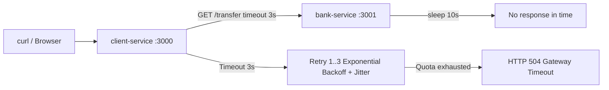

# title
Timeouts and Retries Pattern

# description
Lesson covers the Timeout mechanism to cut hanging connections and smart Retry with Exponential Backoff plus Jitter to improve system availability without overloading partners. Includes hands-on practice building client-service and bank-service in NestJS to observe 3-second Timeout behaviour and progressively spaced retries.

# body

## 1. Opening

A **Senior Engineer** asks a **Mid-level** candidate during a **Backend** interview: *"Your system calls a Bank API. Normally it responds quickly, but today the Bank is congested — requests just hang without returning an error. Your system also hangs and eventually crashes. How do you handle this?"*. The candidate answers with **try…catch** and a continuous **Retry** loop, but still misses depth on two risks: **(1)** without a **Timeout**, requests hold connections indefinitely causing **Thread Exhaustion**, and **(2)** **Retry** without progressive delays is effectively an internal **DDoS** against a partner already under stress.

This lesson runs in two beats:
- **Part 2.1**: **hands-on** aligned with the GitHub repository: learners clone the demo repo, bring up **client-service** + **bank-service** with **Docker Compose**, call the `/pay` API and observe **3-second Timeout** behaviour plus **Exponential Backoff + Jitter** logs across two verification flows.
- **Part 2.2**: **theory** consolidating precise definitions of **Timeout**, **Exponential Backoff**, **Jitter**, a comparison table of **Retry** strategies, and edge cases to internalize.
Afterwards, learners should distinguish **Timeout** from **Circuit Breaker**, configure protected **Retry** in **NestJS**, and explain why **Jitter** prevents **Thundering Herd**.

## 2. Core concepts

The lesson uses **practice-led theory**. First you run **client-service** + **bank-service**, call the `/pay` API and observe the **Timeout** cutting requests plus **Retry** logs with increasing intervals. Then the theory section organizes definitions — **Timeout**, **Exponential Backoff**, **Jitter**, a retry-strategy comparison, and edge cases — mapping directly to what you observed in **section 2.1**.

### 2.1. Hands-on

#### 2.1.1. Prepare source code and environment

Goal: obtain **client-service** (calls bank API with **Timeout** 3s + **Retry** 3 times) and **bank-service** (simulates 10s delay) source code, plus **`compose.yaml`** for local execution.

Source: [StarCi-Academy/system-design-mastery-module-6-reliability-and-resilience-patterns](https://github.com/StarCi-Academy/system-design-mastery-module-6-reliability-and-resilience-patterns) on GitHub — lesson directory: [`0-timeouts-and-retries`](https://github.com/StarCi-Academy/system-design-mastery-module-6-reliability-and-resilience-patterns/tree/main/0-timeouts-and-retries); **Docker Compose** and hands-on files live under [`0-timeouts-and-retries/.docker`](https://github.com/StarCi-Academy/system-design-mastery-module-6-reliability-and-resilience-patterns/tree/main/0-timeouts-and-retries/.docker).

```bash
# Step 1: Clone the repository locally
git clone https://github.com/StarCi-Academy/system-design-mastery-module-6-reliability-and-resilience-patterns.git

# Step 2: Open the Compose directory for the lesson
cd system-design-mastery-module-6-reliability-and-resilience-patterns/0-timeouts-and-retries/.docker
```

The repo ships environment defaults via **Docker Compose** (`compose.yaml`). You do not need to create or edit **`.env`**. Only adjust **`.env`** when running services directly on your machine (**`nest start`**) or when you need different host / port values.

Stack: **Node.js**, **NestJS**, **Axios**, **Docker** + **Docker Compose**.

#### 2.1.2. Architecture / components (stack + flow)

- **client-service:** **NestJS** app exposing `GET /pay`; calls **bank-service** `/transfer` with **Axios** timeout 3s; on failure, **Retry** up to 3 times using **Exponential Backoff + Jitter**.
- **bank-service:** **NestJS** app exposing `GET /transfer`; always sleeps 10 seconds before responding — simulates a hanging partner service.

| Component | Port | Role |
| --- | --- | --- |
| **client-service** | 3000 | Orchestrates **Timeout** 3s + **Retry** (Exponential Backoff + Jitter) when calling bank-service |
| **bank-service** | 3001 | Simulates a slow bank service processing for 10s |



Figure 1: Client calls client-service; client-service calls bank-service with 3s timeout; bank-service hangs 10s → timeout → retry up to 3 times → returns 504.

#### 2.1.3. Prerequisites and startup

##### 2.1.3.1. Prerequisites

- **Docker Desktop** (or **Docker Engine** + **Compose** plugin).
- **Windows:** use **`Invoke-RestMethod`** / **`Invoke-WebRequest`** in PowerShell for HTTP commands.

##### 2.1.3.2. Start the stack

```bash
# Step 1: Start the full stack (Compose creates network `0-timeouts-and-retries` automatically)
docker compose up -d

# Step 2: Follow client-service logs
docker compose logs -f client-service
```

After **`docker compose up -d`** succeeds: **client-service** listens at **`http://localhost:3000`**, **bank-service** at **`http://localhost:3001`**.

#### 2.1.4. Verification

**2 flows** verify **Timeout** and **Retry** behaviour: **(1)** call `/pay` while **bank-service** is running but hanging for 10s → client-service cuts after 3s and retries → eventually returns **HTTP 504**; **(2)** stop **bank-service** completely via Docker → observe **Exponential Backoff + Jitter** log intervals.

##### 2.1.4.1. Flow 1 — Cutting a hanging connection with Timeout

- Step 1: Call the payment API. At this point **bank-service** will hang the request for 10 seconds.

  ```bash
  # Windows (PowerShell)
  Invoke-RestMethod -Uri http://localhost:3000/pay

  # macOS / Linux
  # → Paste cURL into Postman: Import → Raw text
  curl -s http://localhost:3000/pay
  ```

  Expected response (HTTP 504) — after approximately 15–20 seconds (3 retries × timeout):

  ```json
  {
    "message": "Gateway Timeout - Bank did not respond within 3s",
    "error": "Gateway Timeout",
    "statusCode": 504
  }
  ```

  *If you receive HTTP 504 after retries are exhausted:*

  - ***Timeout** 3s works correctly — **client-service** does not hang with **bank-service** for 10s but proactively cuts after 3s.*
  - *After exhausting 3 retries, **client-service** returns a clear error instead of hanging indefinitely — protecting server resources.*

##### 2.1.4.2. Flow 2 — Monitoring Exponential Backoff and Jitter via logs

- Step 1: Temporarily stop **bank-service** with Docker to simulate a total connection failure.

  ```bash
  docker compose stop bank-service
  ```

- Step 2: In a second terminal, follow **client-service** logs.

  ```bash
  docker compose logs -f client-service
  ```

- Step 3: Call the payment API.

  ```bash
  # Windows (PowerShell)
  Invoke-RestMethod -Uri http://localhost:3000/pay

  # macOS / Linux
  # → Paste cURL into Postman: Import → Raw text
  curl -s http://localhost:3000/pay
  ```

  Representative output:

  ```text
  [ClientService] Calling Bank Service, attempt 1
  [ClientService] Retry attempt 1 scheduled in 1150ms
  [ClientService] Calling Bank Service, attempt 2
  [ClientService] Retry attempt 2 scheduled in 2320ms
  [ClientService] Calling Bank Service, attempt 3
  [ClientService] Retry attempt 3 scheduled in 4805ms
  [ClientService] Calling Bank Service, attempt 4
  ```

  *If logs show progressively increasing retry intervals (≈1s → ≈2s → ≈4s) with different offsets each time:*

  - ***Exponential Backoff** works: `baseDelay = 2^(attempt-1) * 1000` ms — each retry doubles, giving the partner time to recover.*
  - ***Jitter** works: adds `random(0–1000)` ms — spreads retry traffic to avoid **Thundering Herd** when many clients retry simultaneously.*

#### 2.1.5. Cleanup

When you are done, tear down to free resources. From **`.../0-timeouts-and-retries/.docker`** (where you ran **`docker compose up`**), run **`docker compose down -v`**: **`-v`** removes **anonymous / named volumes** and **Compose** cleans up the `0-timeouts-and-retries` network automatically.

```bash
docker compose down -v
```

#### 2.1.6. Further reading

- **Exponential Backoff and Jitter:** detailed **AWS** analysis of backoff strategies (Full Jitter, Equal Jitter, Decorrelated Jitter) with real benchmarks. ([AWS Architecture Blog](https://aws.amazon.com/blogs/architecture/exponential-backoff-and-jitter/))
- **Axios Request Config:** documentation for the `timeout` option in **Axios** — the HTTP client library used in this lesson. ([Axios Docs](https://axios-http.com/docs/req_config))
- **NestJS Exception Filters:** how **NestJS** handles exceptions like `GatewayTimeoutException` and maps them to HTTP status codes. ([NestJS Docs](https://docs.nestjs.com/exception-filters))
- **Circuit Breaker vs Timeout+Retry:** comparison of two complementary patterns — **Timeout+Retry** protects individual requests, **Circuit Breaker** protects at system level. ([Azure Architecture — Circuit Breaker](https://learn.microsoft.com/en-us/azure/architecture/patterns/circuit-breaker))

### 2.2. Theory — Timeout and Retry

#### 2.2.1. Timeout

**Timeout** is the mechanism of setting a maximum wait duration for every external call (**API**, **Database**, **Redis**, **gRPC**). If the partner fails to respond within that deadline, the system proactively cancels the request and releases resources (socket, thread). Without a **Timeout**, a single slow service can drag all callers down by exhausting the **Thread Pool**.

Example in **Axios**:

```typescript
await axios.get("http://bank-service:3001/transfer", {
    timeout: 3000, // cancel request if it exceeds 3 seconds
})
```

#### 2.2.2. Exponential Backoff

Instead of retrying immediately (causing internal DDoS), **Exponential Backoff** progressively increases the interval between retries exponentially: `delay = base × 2^(attempt - 1)`.

| Retry | Formula | Delay (ms) |
| --- | --- | --- |
| 1 | `1000 × 2^0` | 1000 |
| 2 | `1000 × 2^1` | 2000 |
| 3 | `1000 × 2^2` | 4000 |

This approach gives the partner increasingly longer "breathing room" to recover.

#### 2.2.3. Jitter

**Jitter** adds a random value to each delay: `waitMs = baseDelay + random(0, maxJitter)`. Purpose: prevent the **Thundering Herd** effect — thousands of clients all timing out simultaneously, all retrying at the exact same moment, creating a new traffic spike that crashes the partner again.

#### 2.2.4. Retry strategy comparison

| Strategy | Description | Pros | Cons |
| --- | --- | --- | --- |
| **Immediate Retry** | Retry instantly | Simple | Internal DDoS on partner |
| **Fixed Delay** | Wait a fixed duration (e.g. 2s) | Easy to configure | Still causes synchronized bursts |
| **Exponential Backoff** | Double delay each time | Effective load reduction | Multiple clients may still collide |
| **Exponential Backoff + Jitter** | Double delay + random offset | Maximum traffic spread | Total wait time less predictable |

#### 2.2.5. Edge cases to internalize

- **Timeout too short, false positives:** setting timeout to 500ms for an API that normally takes 400ms → valid responses are cancelled on minor fluctuations. **Mitigation:** benchmark p99 latency before choosing timeout; set timeout ≥ p99 × 1.5.
- **Retrying non-idempotent APIs, duplicated side effects:** retrying `POST /pay` without an `Idempotency-Key` → customer is charged multiple times. **Mitigation:** only retry when the API guarantees **Idempotency**, or use an `Idempotency-Key` header.
- **Max retries too high, prolonged response time:** setting maxRetries = 10 with Exponential Backoff → total delay reaches minutes, terrible UX. **Mitigation:** cap maxRetries at 3–5 and combine with **Circuit Breaker** to cut early when failures persist.
- **Thundering Herd without Jitter:** 1000 clients all time out, all wait exactly 2s, all retry simultaneously → new traffic spike. **Mitigation:** always enable **Jitter** (Full Jitter or Equal Jitter).

## 3. Wrap-up

### 3.1. Common interview questions

- **Question 1:** Why is **Jitter** necessary in the **Exponential Backoff** algorithm?
  - What interviewers want: understanding of **Thundering Herd** and load distribution.
  - Sample short answer: Without **Jitter**, thousands of clients failing simultaneously would retry at the exact same moment (e.g. exactly 2s later), creating massive traffic spikes that crash the server again. **Jitter** adds a random offset to each delay, spreading retries across different time points.

- **Question 2:** When should you absolutely NOT apply automatic **Retry**?
  - What interviewers want: understanding of **Idempotency**.
  - Sample short answer: When the API does not guarantee **Idempotency**. For example: a payment API without an `Idempotency-Key` — retrying could charge the customer multiple times for the same order.

- **Question 3:** How do **Timeout** and **Circuit Breaker** differ?
  - What interviewers want: distinguishing request-level vs system-level protection.
  - Sample short answer: **Timeout** protects individual requests — cuts a connection if the partner does not respond within the deadline. **Circuit Breaker** protects at system level — monitors failure rates and trips the circuit entirely when errors exceed a threshold, preventing calls to a dead partner. The two patterns complement each other.

# references
## 0
### alias
AWS - Exponential Backoff and Jitter
### url
https://aws.amazon.com/blogs/architecture/exponential-backoff-and-jitter/
## 1
### alias
Axios Request Config
### url
https://axios-http.com/docs/req_config
## 2
### alias
Circuit Breaker Pattern - Microsoft Azure
### url
https://learn.microsoft.com/en-us/azure/architecture/patterns/circuit-breaker

# minutesRead
20
