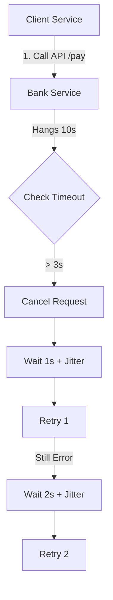

# title
Timeouts and Retries Pattern

# description
Control hanging API calls with the **Timeout** blade. Learn to implement a **Retry** mechanism combined with **Exponential Backoff** and **Jitter** to increase system availability without overloading partners.

# body
## 1. Introduction
In **Senior Backend** interviews, a very common scenario is: *"Your system calls a Bank API. Usually it responds quickly, but today the Bank is congested; requests just hang without returning an error. Your system also hangs and eventually crashes. How do you handle this?"*

An inexperienced developer might answer: *"I will wrap the call in a try...catch and write a loop to automatically retry until it succeeds."* This approach is practically "suicidal" because:
1.  **Thread Exhaustion:** Without a **Timeout**, requests will hold onto connections indefinitely until your server runs out of resources and the entire application crashes.
2.  **Internal DDoS Attack:** If you **Retry** continuously without a delay, you are unintentionally performing a Denial-of-Service attack on a partner who is already struggling.

This lesson will guide you on how to apply the **Timeout** model to cut off hopeless connections and **Smart Retry** (Exponential Backoff + Jitter) to recover the system scientifically using **NestJS**.

## 2. Core Concepts
### 2.1. The Timeout Blade and the Retry Vortex
To build a **Resilient System**, we must adhere to these principles:
-   **Timeout:** Every external call (**API**, **Database**, **Redis**) MUST have a maximum wait time. If the limit is exceeded, we proactively terminate the connection to release resources.
-   **Exponential Backoff:** Instead of retrying immediately, we progressively increase the wait time between retries (e.g., 1s, 2s, 4s). This gives the partner system "breathing room" to recover.
-   **Jitter:** Add a small random duration to each wait time to avoid the **Thundering Herd** effect (where all clients retry at the exact same moment, causing a new traffic spike).


*Figure 1: Timeout and Retry flow with increasing time intervals.*

## 2.2. Practice: Verifying Timeout and Retry Mechanisms
### 2.2.1. Codebase and Environment Setup
Reference Source: `0-timeouts-and-retries`

```bash
# Step 1: Clone the demo repository
git clone https://github.com/StarCi-Academy/system-design-mastery-module-6-reliability-and-resilience-patterns.git

# Step 2: Navigate to the lesson directory
cd system-design-mastery-module-6-reliability-and-resilience-patterns/0-timeouts-and-retries
```

### 2.2.2. Architecture and Components
The system consists of two microservices simulating a payment flow:
-   **client-service (Port 3000):** Acts as the primary system, performing API calls with a 3s **Timeout** and 3 **Retries**.
-   **bank-service (Port 3001):** Simulates a hanging partner system (always responds after 10s).

| Component | Responsibility | Technology |
|---|---|---|
| **client-service** | Orchestrates **Retry** & **Timeout** | **NestJS**, **Axios**, **RxJS** |
| **bank-service** | Simulates a failing partner system | **NestJS** |

### 2.2.3. Setup
**2.2.3.1. Prerequisites**
-   **Node.js >= 20** installed.
-   **Docker** installed.

**2.2.3.2. Installation and Execution with Docker**

```bash
# Step 0: create shared network (run once per machine)
docker network create starci-network

# Step 1: run the full stack
docker compose -f .docker/backend.yaml up -d --build

# Step 2: tail quick logs
docker compose -f .docker/backend.yaml logs -f client-service
```

### 2.2.4. Testing
#### Scenario 1 — Cutting a Hanging Connection with Timeout
Step 1: Call the payment API. The **bank-service** is programmed to hang the request for 10 seconds.
```bash
curl -s http://localhost:3000/pay
```
The response should return a **504 Gateway Timeout** error after exactly **3 seconds**:
```json
{
  "statusCode": 504,
  "message": "Gateway Timeout - Bank did not respond within 3s"
}
```
*Conclusion: The system protected itself by terminating the connection early, preventing the processing thread from hanging along with the partner.*

#### Scenario 2 — Monitoring Exponential Backoff and Jitter via Logs
Step 1: Temporarily stop **bank-service** with Docker to simulate a total connection failure.
```bash
docker compose -f .docker/backend.yaml stop bank-service
```
Step 2: Call the payment API again and observe **client-service** logs.
```bash
docker compose -f .docker/backend.yaml logs -f client-service
```
```bash
curl -s http://localhost:3000/pay
```
The logs will show retry intervals that are not uniform:
```plaintext
[ClientService] Calling Bank Service, attempt 1
[ClientService] Retry attempt 1 scheduled in 1150ms
[ClientService] Calling Bank Service, attempt 2
[ClientService] Retry attempt 2 scheduled in 2320ms
[ClientService] Calling Bank Service, attempt 3
[ClientService] Retry attempt 3 scheduled in 4805ms
```
*Conclusion: Retries are spaced out (1s -> 2s -> 4s) with random deviations (Jitter), thinning out traffic and preventing shocks to the system upon recovery.*

### 2.2.5. Resource Cleanup
Stop all services:

```bash
docker compose -f .docker/backend.yaml down
```

## 3. Summary
### 3.1. Common Interview Questions
-   **Question 1: Why is "Jitter" necessary in the Exponential Backoff algorithm?**
    -   **Answer:** Without **Jitter**, thousands of clients failing at the same time would retry at the exact same moment (e.g., exactly 2 seconds later), creating massive traffic spikes that could crash the server again. **Jitter** spreads these requests across different time offsets.
-   **Question 2: When should you absolutely NOT apply an automatic Retry?**
    -   **Answer:** When the API does not guarantee **Idempotency**. For example: A payment API without an `Idempotency-Key`; retrying could result in a customer being charged multiple times for the same order.

# references
## 0
### alias
AWS - Exponential Backoff and Jitter
### url
https://aws.amazon.com/blogs/architecture/exponential-backoff-and-jitter/

# minutesRead
20
