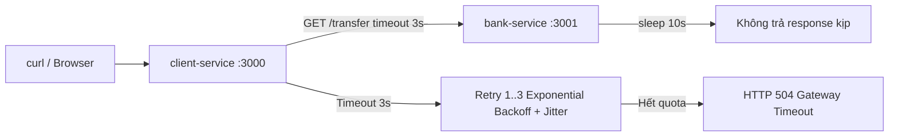

# title
Timeouts và Retries Pattern

# description
Bài học hướng dẫn cơ chế Timeout cắt kết nối treo và Retry thông minh (Exponential Backoff + Jitter) để tăng tính sẵn sàng cho hệ thống mà không làm quá tải đối tác. Bài có phần thực hành dựng client-service và bank-service bằng NestJS để quan sát hành vi Timeout 3 giây và Retry với khoảng cách tăng dần.

# body

## 1. Lời mở đầu

Một **Senior Engineer** hỏi ứng viên **Mid-level Developer** trong vòng phỏng vấn **Backend**: *"Hệ thống của bạn gọi sang một API Ngân hàng. Bình thường phản hồi rất nhanh, nhưng hôm nay phía Ngân hàng bị nghẽn, request gọi sang cứ treo lơ lửng mà không báo lỗi. Hệ thống của bạn cũng bị treo theo và sập luôn. Bạn xử lý thế nào?"*. Ứng viên trả lời được **try…catch** và viết vòng lặp **Retry** liên tục, nhưng chưa nêu được hai rủi ro: **(1)** không có **Timeout** thì request giữ kết nối vô thời hạn gây **Thread Exhaustion**, và **(2)** **Retry** không có độ trễ tăng dần tương đương **DDoS** nội bộ vào đối tác đang gặp sự cố.

Bài học này đi theo hai mạch liên tiếp. **Phần 2.1** là **thực hành**, bám sát repository GitHub: học viên clone repo demo, khởi chạy **client-service** + **bank-service** bằng **Docker Compose**, gọi API `/pay` và quan sát hành vi **Timeout 3 giây** cùng log **Exponential Backoff + Jitter** qua hai luồng kiểm thử. **Phần 2.2** củng cố **lý thuyết** — định nghĩa chính xác **Timeout**, **Exponential Backoff**, **Jitter**, bảng so sánh chiến lược **Retry**, và các trường hợp biên cần lưu ý. Sau bài, học viên phân biệt được **Timeout** với **Circuit Breaker**, cấu hình được **Retry** có bảo vệ trong **NestJS**, và giải thích được vì sao **Jitter** ngăn **Thundering Herd**.

## 2. Các khái niệm cốt lõi

Cấu trúc bài học áp dụng phương pháp **Thực hành dẫn dắt Lý thuyết**. Khởi đầu, học viên chạy **client-service** + **bank-service**, gọi API `/pay` và quan sát **Timeout** cắt request cùng log **Retry** có khoảng cách tăng dần. Tiếp theo, **phần lý thuyết** sẽ hệ thống hóa định nghĩa **Timeout**, **Exponential Backoff**, **Jitter**, bảng so sánh chiến lược **Retry**, và các edge case — giúp đối chiếu và củng cố trực tiếp những kết quả vừa thực nghiệm tại **phần 2.1**.

### 2.1. Thực hành

#### 2.1.1. Chuẩn bị source code và môi trường

Mục đích: lấy mã nguồn demo **client-service** (gọi API với **Timeout** 3s + **Retry** 3 lần) và **bank-service** (giả lập chậm 10s), cùng file **`compose.yaml`** để chạy cục bộ.

Source: [StarCi-Academy/system-design-mastery-module-6-reliability-and-resilience-patterns](https://github.com/StarCi-Academy/system-design-mastery-module-6-reliability-and-resilience-patterns) trên GitHub — thư mục bài học: [`0-timeouts-and-retries`](https://github.com/StarCi-Academy/system-design-mastery-module-6-reliability-and-resilience-patterns/tree/main/0-timeouts-and-retries); **Docker Compose** và file thực hành nằm trong [`0-timeouts-and-retries/.docker`](https://github.com/StarCi-Academy/system-design-mastery-module-6-reliability-and-resilience-patterns/tree/main/0-timeouts-and-retries/.docker).

```bash
# Bước 1: Clone repository về máy local
git clone https://github.com/StarCi-Academy/system-design-mastery-module-6-reliability-and-resilience-patterns.git

# Bước 2: Vào thư mục chứa file compose của bài học
cd system-design-mastery-module-6-reliability-and-resilience-patterns/0-timeouts-and-retries/.docker
```

Repo đã ship giá trị mặc định qua biến môi trường trong **Docker Compose** (`compose.yaml`). Không cần tạo hay sửa **`.env`**. Chỉ chỉnh **`.env`** khi chạy service trực tiếp trên máy (**`nest start`**) hoặc khi cần host / cổng khác mặc định.

Stack: **Node.js**, **NestJS**, **Axios**, **Docker** + **Docker Compose**.

#### 2.1.2. Kiến trúc/thành phần (stack + luồng)

- **client-service:** ứng dụng **NestJS** expose route `GET /pay`; gọi **bank-service** `/transfer` với **Axios** timeout 3s; nếu lỗi thì **Retry** tối đa 3 lần theo **Exponential Backoff + Jitter**.
- **bank-service:** ứng dụng **NestJS** expose route `GET /transfer`; luôn sleep 10 giây trước khi trả response — giả lập dịch vụ đối tác bị treo.

| Thành phần | Cổng (Port) | Vai trò |
| --- | --- | --- |
| **client-service** | 3000 | Điều phối **Timeout** 3s + **Retry** (Exponential Backoff + Jitter) khi gọi bank-service |
| **bank-service** | 3001 | Giả lập dịch vụ ngân hàng xử lý chậm 10s |



Hình 1: Client gọi client-service; client-service gọi bank-service với timeout 3s; bank-service treo 10s → timeout → retry tối đa 3 lần → trả 504.

#### 2.1.3. Chuẩn bị & khởi chạy

##### 2.1.3.1. Điều kiện cần trước

- **Docker Desktop** (hoặc **Docker Engine** + **Compose** plugin).
- **Windows:** dùng **`Invoke-RestMethod`** / **`Invoke-WebRequest`** trong PowerShell cho các lệnh HTTP.

##### 2.1.3.2. Khởi động stack

```bash
# Bước 1: Chạy toàn bộ stack (Compose tự tạo network `0-timeouts-and-retries`)
docker compose up -d

# Bước 2: Theo dõi log client-service
docker compose logs -f client-service
```

Sau khi **`docker compose up -d`** thành công: **client-service** lắng nghe **`http://localhost:3000`**, **bank-service** lắng nghe **`http://localhost:3001`**.

#### 2.1.4. Kiểm thử

**2 luồng** kiểm thử xác nhận hành vi **Timeout** và **Retry**: **(1)** gọi API `/pay` khi **bank-service** đang chạy nhưng treo 10s → client-service cắt sau 3s và retry → cuối cùng trả **HTTP 504**; **(2)** dừng **bank-service** hoàn toàn bằng Docker → quan sát log **Exponential Backoff + Jitter** với khoảng cách tăng dần.

##### 2.1.4.1. Luồng 1 — Chặt đứt kết nối treo bằng Timeout

- Bước 1: Gọi API thanh toán. Lúc này **bank-service** sẽ treo request trong 10 giây.

  ```bash
  # Windows (PowerShell)
  Invoke-RestMethod -Uri http://localhost:3000/pay

  # macOS / Linux
  curl -s http://localhost:3000/pay
  ```

  Response phải trả về (HTTP 504) — sau khoảng 15–20 giây (3 lần retry × timeout):

  ```json
  {
    "statusCode": 504,
    "message": "Gateway Timeout - Bank did not respond within 3s"
  }
  ```

  *Kết luận: Nếu response trả về HTTP 504 sau khi retry hết quota, hệ thống xác nhận:*

  - ***Timeout** 3s hoạt động đúng — **client-service** không treo theo **bank-service** 10s mà chủ động cắt sau 3s.*
  - *Sau khi hết 3 lần retry, **client-service** trả lỗi rõ ràng thay vì treo vô thời hạn — bảo vệ tài nguyên server.*

##### 2.1.4.2. Luồng 2 — Giám sát Exponential Backoff và Jitter qua Log

- Bước 1: Tạm dừng **bank-service** bằng Docker để giả lập lỗi kết nối hoàn toàn.

  ```bash
  docker compose stop bank-service
  ```

- Bước 2: Mở terminal thứ hai, theo dõi log **client-service**.

  ```bash
  docker compose logs -f client-service
  ```

- Bước 3: Gọi API thanh toán.

  ```bash
  # Windows (PowerShell)
  Invoke-RestMethod -Uri http://localhost:3000/pay

  # macOS / Linux
  curl -s http://localhost:3000/pay
  ```

  Kết quả trả về trên terminal:

  ```text
  [ClientService] Calling Bank Service, attempt 1
  [ClientService] Retry attempt 1 scheduled in 1150ms
  [ClientService] Calling Bank Service, attempt 2
  [ClientService] Retry attempt 2 scheduled in 2320ms
  [ClientService] Calling Bank Service, attempt 3
  [ClientService] Retry attempt 3 scheduled in 4805ms
  [ClientService] Calling Bank Service, attempt 4
  ```

  *Kết luận: Nếu log hiện khoảng cách retry tăng dần (≈1s → ≈2s → ≈4s) và mỗi lần có sai số khác nhau, hệ thống xác nhận:*

  - ***Exponential Backoff** hoạt động: `baseDelay = 2^(attempt-1) * 1000` ms — mỗi lần gấp đôi, cho đối tác thời gian phục hồi.*
  - ***Jitter** hoạt động: cộng thêm `random(0–1000)` ms — rải mỏng traffic tránh **Thundering Herd** khi nhiều client cùng retry.*

#### 2.1.5. Dọn tài nguyên

Sau khi kết thúc bài, bạn có thể dọn tài nguyên để tiết kiệm bộ nhớ. Trong thư mục **`.../0-timeouts-and-retries/.docker`** (cùng nơi đã chạy **`docker compose up`**), chạy **`docker compose down -v`**: **`-v`** xóa **anonymous / named volumes** và **Compose** tự dọn network `0-timeouts-and-retries`.

```bash
docker compose down -v
```

#### 2.1.6. Đọc thêm

- **Exponential Backoff and Jitter:** phân tích chi tiết của **AWS** về các chiến lược backoff (Full Jitter, Equal Jitter, Decorrelated Jitter) và benchmark thực tế. ([AWS Architecture Blog](https://aws.amazon.com/blogs/architecture/exponential-backoff-and-jitter/))
- **Axios Request Config:** tài liệu cấu hình `timeout` trong **Axios** — thư viện HTTP client dùng trong bài. ([Axios Docs](https://axios-http.com/docs/req_config))
- **NestJS Exception Filters:** cách **NestJS** xử lý exception như `GatewayTimeoutException` và trả HTTP status code tương ứng. ([NestJS Docs](https://docs.nestjs.com/exception-filters))
- **Circuit Breaker vs Timeout+Retry:** so sánh hai pattern bổ trợ — **Timeout+Retry** bảo vệ từng request, **Circuit Breaker** bảo vệ ở mức hệ thống. ([Azure Architecture — Circuit Breaker](https://learn.microsoft.com/en-us/azure/architecture/patterns/circuit-breaker))

### 2.2. Lý thuyết — Timeout và Retry

#### 2.2.1. Timeout

**Timeout** là cơ chế đặt mốc thời gian chờ tối đa cho mỗi lời gọi ra bên ngoài (**API**, **Database**, **Redis**, **gRPC**). Nếu đối tác không trả response trong mốc đó, hệ thống chủ động hủy request và giải phóng tài nguyên (socket, thread). Không có **Timeout**, một service chậm có thể kéo toàn bộ caller sập theo do hết **Thread Pool**.

Ví dụ trong **Axios**:

```typescript
await axios.get("http://bank-service:3001/transfer", {
    timeout: 3000, // hủy request nếu quá 3 giây
})
```

#### 2.2.2. Exponential Backoff

Thay vì retry ngay lập tức (gây DDoS nội bộ), **Exponential Backoff** tăng dần khoảng cách giữa các lần retry theo cấp số nhân: `delay = base × 2^(attempt - 1)`.

| Lần retry | Công thức | Delay (ms) |
| --- | --- | --- |
| 1 | `1000 × 2^0` | 1000 |
| 2 | `1000 × 2^1` | 2000 |
| 3 | `1000 × 2^2` | 4000 |

Cách tiếp cận này cho đối tác "khoảng thở" ngày càng dài hơn để phục hồi.

#### 2.2.3. Jitter

**Jitter** cộng thêm giá trị ngẫu nhiên vào mỗi lần delay: `waitMs = baseDelay + random(0, maxJitter)`. Mục đích: tránh **Thundering Herd** — hiện tượng hàng ngàn client cùng retry vào đúng cùng một thời điểm sau khi đồng loạt timeout, tạo đỉnh tải mới đánh sập đối tác lần nữa.

#### 2.2.4. Bảng so sánh chiến lược Retry

| Chiến lược | Mô tả | Ưu điểm | Nhược điểm |
| --- | --- | --- | --- |
| **Retry ngay** | Gọi lại ngay lập tức | Đơn giản | DDoS nội bộ đối tác |
| **Fixed Delay** | Chờ cố định (ví dụ 2s) | Dễ cấu hình | Vẫn gây burst đồng thời |
| **Exponential Backoff** | Delay gấp đôi mỗi lần | Giảm tải hiệu quả | Nhiều client vẫn trùng thời điểm |
| **Exponential Backoff + Jitter** | Delay gấp đôi + random | Rải mỏng traffic tối đa | Tổng thời gian chờ khó dự đoán chính xác |

#### 2.2.5. Các trường hợp biên (edge cases) cần lưu ý

- **Timeout quá ngắn, false positive liên tục:** đặt timeout 500ms cho API bình thường mất 400ms → response hợp lệ bị hủy nhầm khi có dao động nhỏ. **Giải pháp:** benchmark p99 latency trước khi chọn timeout; đặt timeout ≥ p99 × 1.5.
- **Retry API không idempotent, trùng lặp side effect:** retry API `POST /pay` không có `Idempotency-Key` → khách hàng bị trừ tiền nhiều lần. **Giải pháp:** chỉ retry khi API đảm bảo **Idempotency**, hoặc sử dụng `Idempotency-Key` header.
- **Max retries quá cao, kéo dài thời gian phản hồi:** đặt maxRetries = 10 + Exponential Backoff → tổng delay lên đến hàng phút, UX tệ. **Giải pháp:** giới hạn maxRetries ≤ 3–5 kết hợp **Circuit Breaker** để cắt sớm khi lỗi kéo dài.
- **Thundering Herd khi không có Jitter:** 1000 client cùng timeout, cùng chờ đúng 2s, cùng retry → đỉnh tải mới. **Giải pháp:** luôn bật **Jitter** (Full Jitter hoặc Equal Jitter).

## 3. Tổng kết

### 3.1. Các câu hỏi dễ bị phỏng vấn

- **Câu hỏi 1:** Tại sao cần thêm **Jitter** vào thuật toán **Exponential Backoff**?
  - Ý interviewer muốn nghe: hiểu **Thundering Herd** và cách rải tải.
  - Trả lời mẫu (ngắn): Không có **Jitter**, hàng ngàn client gặp lỗi cùng lúc sẽ retry vào đúng cùng thời điểm (ví dụ đúng 2s sau), tạo đỉnh tải mới đánh sập server lần nữa. **Jitter** cộng random vào delay để rải đều các retry ra nhiều thời điểm khác nhau.

- **Câu hỏi 2:** Khi nào tuyệt đối không được tự động **Retry**?
  - Ý interviewer muốn nghe: hiểu **Idempotency**.
  - Trả lời mẫu (ngắn): Khi API không đảm bảo **Idempotency**. Ví dụ: API thanh toán không có `Idempotency-Key` — retry có thể trừ tiền khách hàng nhiều lần cho cùng một đơn hàng.

- **Câu hỏi 3:** **Timeout** và **Circuit Breaker** khác nhau thế nào?
  - Ý interviewer muốn nghe: phân biệt bảo vệ ở mức request vs bảo vệ ở mức hệ thống.
  - Trả lời mẫu (ngắn): **Timeout** bảo vệ từng request — cắt kết nối nếu đối tác không trả response trong mốc thời gian. **Circuit Breaker** bảo vệ ở mức hệ thống — theo dõi tỷ lệ lỗi và ngắt mạch hoàn toàn khi lỗi vượt ngưỡng, tránh gọi đối tác đang chết. Hai pattern bổ trợ nhau.

# references
## 0
### alias
AWS - Exponential Backoff and Jitter
### url
https://aws.amazon.com/blogs/architecture/exponential-backoff-and-jitter/
## 1
### alias
Axios Request Config
### url
https://axios-http.com/docs/req_config
## 2
### alias
Circuit Breaker Pattern - Microsoft Azure
### url
https://learn.microsoft.com/en-us/azure/architecture/patterns/circuit-breaker

# minutesRead
20
