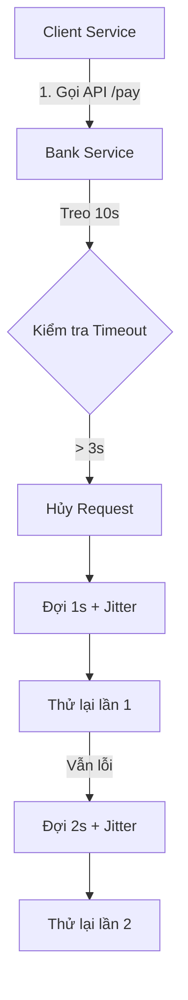

# title
Cơ chế Timeout và Retry (Timeouts and Retries Pattern)

# description
Khống chế các lời gọi API bị treo bằng lưỡi dao **Timeout**. Học cách triển khai cơ chế **Retry** kết hợp **Exponential Backoff** và **Jitter** để tăng tính sẵn sàng cho hệ thống mà không làm quá tải đối tác.

# body
## 1. Lời mở đầu
Trong các buổi phỏng vấn **Senior Backend**, một câu hỏi tình huống cực kỳ phổ biến là: *"Hệ thống của em gọi sang một API Ngân hàng. Bình thường phản hồi rất nhanh, nhưng hôm nay phía Ngân hàng bị nghẽn, request gọi sang cứ treo lơ lửng mà không báo lỗi. Hệ thống của em cũng bị treo theo và sập luôn. Em xử lý thế nào?"*

Một developer thiếu kinh nghiệm thường trả lời: *"Em sẽ bọc hàm trong try...catch và viết vòng lặp để nếu lỗi thì tự động gọi lại (Retry) liên tục ạ."* Cách làm này thực tế là "tự sát" vì:
1.  **Treo luồng (Thread Exhaustion):** Nếu không có **Timeout**, các request sẽ ôm khăng khăng kết nối cho đến khi máy chủ của bạn cạn kiệt tài nguyên và sập toàn bộ.
2.  **Tấn công DDoS nội bộ:** Nếu bạn **Retry** liên tục mà không có độ trễ, bạn đang vô tình thực hiện một cuộc tấn công từ chối dịch vụ vào đối tác vốn đã đang gặp khó khăn.

Bài học này sẽ hướng dẫn bạn cách áp dụng mô hình **Timeout** để cắt đứt các kết nối vô vọng và **Retry thông minh** (Exponential Backoff + Jitter) để phục hồi hệ thống một cách khoa học bằng **NestJS**.

## 2. Các khái niệm cốt lõi
### 2.1. Nhát dao Timeout và vòng xoáy Retry
Để xây dựng một hệ thống ổn định (Resilient System), ta cần tuân thủ các nguyên tắc:
-   **Timeout:** Mọi lời gọi ra bên ngoài (**API**, **Database**, **Redis**) bắt buộc phải có mốc thời gian chờ tối đa. Nếu quá hạn, ta chủ động ngắt kết nối để giải phóng tài nguyên.
-   **Exponential Backoff:** Thay vì thử lại ngay lập tức, ta tăng dần thời gian chờ giữa các lần thử (ví dụ: 1s, 2s, 4s). Điều này giúp hệ thống đối tác có "khoảng thở" để tự phục hồi.
-   **Jitter:** Cộng thêm một khoảng thời gian ngẫu nhiên nhỏ vào mỗi lần chờ để tránh hiện tượng **Thundering Herd** (tất cả các máy khách cùng thử lại vào một thời điểm chính xác, gây ra đỉnh tải mới).


*Hình 1: Luồng xử lý Timeout và Retry với độ giãn cách thời gian tăng dần.*

## 2.2. Thực hành: Kiểm chứng cơ chế Timeout và Retry
### 2.2.1. Chuẩn bị source code và môi trường
Source tham chiếu: `0-timeouts-and-retries`

```bash
# Bước 1: Clone repository demo về máy local
git clone https://github.com/StarCi-Academy/system-design-mastery-module-6-reliability-and-resilience-patterns.git

# Bước 2: Di chuyển vào thư mục bài học
cd system-design-mastery-module-6-reliability-and-resilience-patterns/0-timeouts-and-retries
```

### 2.2.2. Kiến trúc và các thành phần
Hệ thống bao gồm hai microservices mô phỏng luồng thanh toán:
-   **client-service (Port 3000):** Đóng vai trò là hệ thống chính, thực hiện gọi API với cấu hình **Timeout** 3s và **Retry** 3 lần.
-   **bank-service (Port 3001):** Giả lập hệ thống ngân hàng bị treo (luôn phản hồi sau 10s).

| Thành phần | Trách nhiệm | Công nghệ |
|---|---|---|
| **client-service** | Điều phối **Retry** & **Timeout** | **NestJS**, **Axios**, **RxJS** |
| **bank-service** | Giả lập hệ thống đối tác bị sự cố | **NestJS** |

### 2.2.3. Chuẩn bị
**2.2.3.1. Điều kiện cần trước**
-   Đã cài đặt **Node.js >= 20**.
-   Đã cài đặt **Docker**.

**2.2.3.2. Cài đặt và khởi chạy bằng Docker**

```bash
# Bước 0: tạo network dùng chung (chỉ cần chạy một lần trên máy)
docker network create starci-network

# Bước 1: chạy toàn bộ stack
docker compose -f .docker/backend.yaml up -d --build

# Bước 2: xem log nhanh
docker compose -f .docker/backend.yaml logs -f client-service
```

### 2.2.4. Kiểm thử
#### Luồng 1 — Chặt đứt kết nối treo bằng Timeout
Bước 1: Gọi API thanh toán. Lúc này **bank-service** sẽ treo request trong 10 giây.
```bash
curl -s http://localhost:3000/pay
```
Response phải trả về lỗi **504 Gateway Timeout** sau đúng **3 giây**:
```json
{
  "statusCode": 504,
  "message": "Gateway Timeout - Bank did not respond within 3s"
}
```
*Kết luận: Hệ thống đã tự bảo vệ bằng cách ngắt kết nối sớm, không để luồng xử lý bị treo theo đối tác.*

#### Luồng 2 — Giám sát Exponential Backoff và Jitter qua Log
Bước 1: Tạm dừng **bank-service** bằng Docker để giả lập lỗi kết nối hoàn toàn.
```bash
docker compose -f .docker/backend.yaml stop bank-service
```
Bước 2: Gọi lại API thanh toán và quan sát log của **client-service**.
```bash
docker compose -f .docker/backend.yaml logs -f client-service
```
```bash
curl -s http://localhost:3000/pay
```
Kết quả log sẽ hiển thị các mốc thời gian thử lại không đều nhau:
```plaintext
[ClientService] Calling Bank Service, attempt 1
[ClientService] Retry attempt 1 scheduled in 1150ms
[ClientService] Calling Bank Service, attempt 2
[ClientService] Retry attempt 2 scheduled in 2320ms
[ClientService] Calling Bank Service, attempt 3
[ClientService] Retry attempt 3 scheduled in 4805ms
```
*Kết luận: Các lần thử lại được giãn cách (1s -> 2s -> 4s) và có sai số ngẫu nhiên (Jitter), giúp rải mỏng traffic và tránh gây sốc cho hệ thống khi phục hồi.*

### 2.2.5. Dọn tài nguyên
Dừng toàn bộ dịch vụ:

```bash
docker compose -f .docker/backend.yaml down
```

## 3. Tổng kết
### 3.1. Các câu hỏi dễ bị phỏng vấn
-   **Câu hỏi 1: Tại sao cần thêm "Jitter" vào thuật toán Exponential Backoff?**
    -   **Trả lời:** Nếu không có **Jitter**, hàng ngàn client gặp lỗi cùng lúc sẽ thử lại vào cùng một thời điểm chính xác (ví dụ đúng 2 giây sau), tạo thành các đỉnh tải cực lớn đánh sập server lần nữa. **Jitter** giúp rải đều các request này ra các mốc thời gian lệch nhau.
-   **Câu hỏi 2: Khi nào tuyệt đối KHÔNG ĐƯỢC tự động Retry?**
    -   **Trả lời:** Khi API không đảm bảo tính **Idempotency** (Lũy đẳng). Ví dụ: Một API thanh toán không có `Idempotency-Key`, việc thử lại có thể khiến khách hàng bị trừ tiền nhiều lần cho cùng một đơn hàng.

# references
## 0
### alias
AWS - Exponential Backoff and Jitter
### url
https://aws.amazon.com/blogs/architecture/exponential-backoff-and-jitter/

# minutesRead
20
