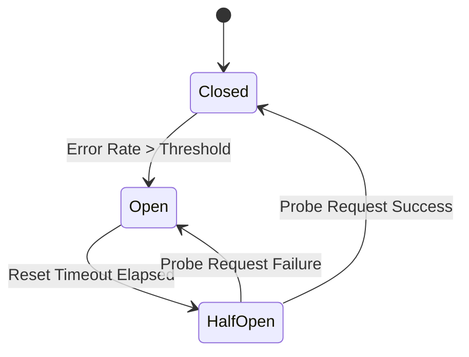

# title
Circuit Breaker Pattern

# description
Explore the internal workings of the **Circuit Breaker** pattern, enabling applications to automatically disconnect (**Fast Fail**) from overloaded services and recover automatically when stability is restored.

# body
## 1. Introduction
In **Microservices** system design interviews, the question: *"How do you prevent cascading failures when a core service becomes congested?"* is a classic topic.

If a target service is overloaded and thousands of requests continue to connect and wait for a **Timeout**, the **Thread Pool** of the calling application will be exhausted, causing even healthy parts of the system to crash. This lesson guides you through implementing a **Circuit Breaker**. This mechanism monitors error rates; if errors exceed a threshold, the breaker trips to "**Open**", immediately blocking all subsequent requests and returning an error instantly (**Fast Fail**) to protect the system.

## 2. Core Concepts
### 2.1. Circuit Breaker State Machine
The Circuit Breaker maintains three primary states:
-   **Closed:** The normal state. All requests pass through. If the error rate exceeds a threshold (e.g., 50%), the breaker transitions to **Open**.
-   **Open:** The protective state. All incoming requests are immediately rejected (**Fast Fail**) without sending an actual request to the target service.
-   **Half-Open:** After a cooldown period (**Reset Timeout**), the breaker allows a few "probe" requests to pass. If successful, the breaker transitions back to **Closed**. If they still fail, it returns to the **Open** state.


*Figure 1: The state transition lifecycle of a Circuit Breaker.*

## 2.2. Practice: Verifying the Circuit Breaker Flow
### 2.2.1. Codebase and Environment Setup
Reference Source: `1-circuit-breaker-pattern`

```bash
# Step 1: Clone the demo repository
git clone https://github.com/StarCi-Academy/system-design-mastery-module-6-reliability-and-resilience-patterns.git

# Step 2: Navigate to the lesson directory
cd system-design-mastery-module-6-reliability-and-resilience-patterns/1-circuit-breaker-pattern
```

### 2.2.2. Architecture and Components
-   **api-gateway (Port 3000):** Integrates the **Opossum** library to implement a Circuit Breaker protecting calls to the inventory service.
-   **inventory-service (Port 3001):** An inventory service programmed to fail automatically after 3 successful calls.

| Component | Responsibility | Technology |
|---|---|---|
| **api-gateway** | Implements the protective breaker | **NestJS**, **Opossum** |
| **inventory-service** | Simulates an unstable target service | **NestJS** |

### 2.2.3. Setup
**2.2.3.1. Prerequisites**
-   **Node.js >= 20** installed.
-   **Docker** installed.

**2.2.3.2. Installation and Execution with Docker**

```bash
# Step 0: create shared network (run once per machine)
docker network create starci-network

# Step 1: run the full stack
docker compose -f .docker/backend.yaml up -d --build

# Step 2: follow API Gateway logs
docker compose -f .docker/backend.yaml logs -f api-gateway
```

### 2.2.4. Testing
#### Scenario 1 — Closed State (Normal Operation)
Step 1: Call the inventory API for the first 3 times.
```bash
curl -s http://localhost:3000/inventory
```
Response returns successfully:
```json
{
  "status": "success",
  "data": "There are 10 products in stock"
}
```

#### Scenario 2 — Open State (Immediate Request Blocking)
Step 1: Continue calling the API for the 4th and 5th time. Since the **inventory-service** starts reporting errors from the 4th call, the error rate will spike.
Step 2: Observe the logs in the **api-gateway** terminal. You will see:
```plaintext
[GatewayService] Circuit state changed to: OPEN
```
Step 3: Call the API again. You will immediately receive the result from the **Fallback** function (no processing wait time):
```json
{
  "status": "fallback",
  "data": "Inventory system is busy, please try again later",
  "isFallback": true
}
```
*Conclusion: The breaker successfully tripped to protect system resources from hopeless requests.*

#### Scenario 3 — Recovery (Half-Open State)
Step 1: Wait for 5 seconds (**Reset Timeout**).
Step 2: Call the API again. The breaker transitions to **Half-Open** and allows 1 request through to probe the service.
Step 3: If the **inventory-service** still fails, the breaker remains **Open**. If successful (in practice when the service has recovered), the circuit closes (**Closed**).

### 2.2.5. Resource Cleanup
Stop all services:

```bash
docker compose -f .docker/backend.yaml down
```

## 3. Summary
### 3.1. Common Interview Questions
-   **Question 1: How does a Circuit Breaker differ from a Retry?**
    -   **Answer:** A **Retry** attempts to send additional requests to overcome transient errors. Conversely, a **Circuit Breaker** prevents requests from being sent when it is certain that the target service is failing. Usually, a **Retry** is wrapped inside a **Circuit Breaker**.
-   **Question 2: What problem does the Half-Open state solve?**
    -   **Answer:** It provides a **Self-healing** mechanism. Instead of requiring human intervention to close the circuit, the system automatically allows "trickle" requests to probe the health of the target service.

# references
## 0
### alias
Opossum Circuit Breaker
### url
https://nodeshift.dev/opossum/

# minutesRead
25
