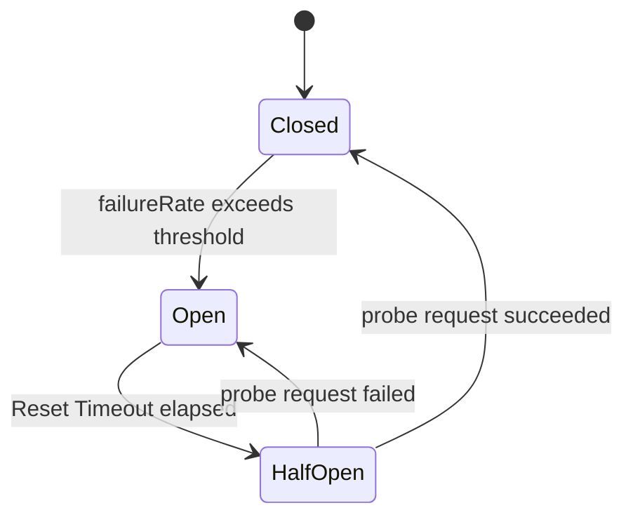

# title
Circuit Breaker Pattern

# description
This lesson dives into the Circuit Breaker pattern, enabling applications to automatically disconnect from overloaded services and recover when stability is restored. The hands-on section builds api-gateway and inventory-service with NestJS and Opossum to observe the three states Closed, Open, and Half-Open.

# body

## 1. Opening

A **Senior Engineer** asks a **Mid-level** candidate: *"A service in your microservices architecture suddenly slows down and starts timing out — how do you prevent that failure from cascading and bringing down the remaining healthy services?"* The candidate answers they would use **Timeout** and **Retry** to handle transient errors, but does not yet describe how to detect a prolonged outage in the target service — no mention of **Fast Fail**, no distinction between the **Open / Half-Open / Closed** states, and no strategy to protect the caller's **Thread Pool** from **Cascading Failure**.

This lesson proceeds in two connected tracks:
- **Part 2.1**: **hands-on** and aligned with the GitHub repository; learners clone the demo repo, run a **NestJS** + **Opossum** stack, force the inventory service to fail, and observe the breaker transition through logs and **Fallback** responses across three test flows.
- **Part 2.2**: **theory** reinforcing the **Closed → Open → Half-Open** state machine, threshold parameters and **Reset Timeout**, and how **Circuit Breaker** relates to **Retry**, **Timeout**, and **Bulkhead**.
By the end, learners can distinguish **Fast Fail** from **Retry**, configure a **Circuit Breaker** with appropriate error thresholds and **Reset Timeout**, read state-transition logs, and design safe **Fallback** functions for dependent services.

## 2. Core concepts

The lesson uses **practice-led theory**. First you run **api-gateway** and **inventory-service**, force errors to observe the **Circuit Breaker** transitioning states through logs and responses. Then the theory section organizes the state machine, configuration parameters, and edge cases — mapping directly to what you observed in **section 2.1**.

### 2.1. Hands-on

#### 2.1.1. Prepare source code and environment

Goal: clone the demo repo containing **api-gateway** (wrapping **Opossum** around calls to inventory) and **inventory-service** (simulating an unstable target) to observe the **Closed → Open → Half-Open** cycle in practice.

Source: [StarCi-Academy/system-design-mastery-module-6-reliability-and-resilience-patterns](https://github.com/StarCi-Academy/system-design-mastery-module-6-reliability-and-resilience-patterns) on GitHub — lesson directory: [`1-circuit-breaker-pattern`](https://github.com/StarCi-Academy/system-design-mastery-module-6-reliability-and-resilience-patterns/tree/main/1-circuit-breaker-pattern).

```bash
# Step 1: Clone the repository locally
git clone https://github.com/StarCi-Academy/system-design-mastery-module-6-reliability-and-resilience-patterns.git

# Step 2: Enter the lesson folder
cd system-design-mastery-module-6-reliability-and-resilience-patterns/1-circuit-breaker-pattern
```

Stack: **Node.js** >= 20, **NestJS**, **Opossum**, **Docker** + **Docker Compose**.

#### 2.1.2. Architecture / components (stack + flow)

- **api-gateway:** system entry point, integrates **Opossum** to wrap calls to **inventory-service** and return **Fallback** when the circuit is **Open**.
- **inventory-service:** simulated inventory service, programmed to start failing from the 4th request onward to push the error rate above threshold.

| Component | Port | Role |
| --- | --- | --- |
| **api-gateway** | 3000 | Wraps **Circuit Breaker** around calls to the target service, defines **Fallback** |
| **inventory-service** | 3001 | Simulates an unstable target service to trigger the breaker |


Figure 1: Client calls api-gateway; Opossum wraps the call to inventory-service and returns Fallback immediately when the circuit transitions to Open.

#### 2.1.3. Prerequisites and startup

##### 2.1.3.1. Prerequisites

- **Node.js** >= 20.
- **Docker** and **Docker Compose**.
- **Windows:** use **`Invoke-RestMethod`** / **`Invoke-WebRequest`** in PowerShell for HTTP requests.

##### 2.1.3.2. Start the stack

```bash
# Step 1: Start the full stack (Compose creates network `1-circuit-breaker-pattern` automatically)
docker compose -f .docker/compose.yaml up -d

# Step 2: Follow api-gateway logs to observe Circuit Breaker state transitions
docker compose -f .docker/compose.yaml logs -f api-gateway
```

#### 2.1.4. Verification

**Three flows** validate **Circuit Breaker** behavior through the **Opossum** library: **(1)** circuit **Closed** — the first three requests return inventory data normally and the `successes` counter increments; **(2)** circuit **Open** — after **inventory-service** starts failing from the 4th request, subsequent requests immediately return **Fallback** without waiting for **Timeout**; **(3)** circuit **Half-Open** — after a 5-second **Reset Timeout**, **Opossum** sends exactly one probe request to decide whether to close the circuit or remain **Open** (advanced).

##### 2.1.4.1. Flow 1 — Closed (normal operation)

- Step 1: Call the inventory API 3 times to confirm **inventory-service** is healthy.

  ```bash
  # Windows (PowerShell)
  Invoke-RestMethod -Uri http://localhost:3000/inventory

  # macOS / Linux
  # → Paste cURL into Postman: Import → Raw text
  curl -s http://localhost:3000/inventory
  ```

  Expected response (HTTP 200):

  ```json
  {
    "status": "success",
    "data": "There are 10 products in stock"
  }
  ```

  *If response returns `"status": "success"` with inventory data:*

  - ***Opossum** increments `successes`, `failures = 0`, circuit stays `Closed` — matching logic in `gateway.service.ts`.*
  - *Requests pass through the **Circuit Breaker** to **inventory-service** with no significant overhead.*

##### 2.1.4.2. Flow 2 — Open (Fast Fail via Fallback)

- Step 1: Continue calling the API for the 4th and 5th times; **inventory-service** is programmed to start failing from the 4th request.

  ```bash
  # Windows (PowerShell)
  Invoke-RestMethod -Uri http://localhost:3000/inventory
  Invoke-RestMethod -Uri http://localhost:3000/inventory

  # macOS / Linux
  # → Paste cURL into Postman: Import → Raw text
  curl -s http://localhost:3000/inventory
  curl -s http://localhost:3000/inventory
  ```

- Step 2: Observe **api-gateway** logs for the state transition.

  Representative output:

  ```text
  [GatewayService] Circuit state changed to: OPEN
  ```

- Step 3: Call the API again immediately — **Opossum** does not send a real request to **inventory-service** but returns **Fallback** instantly.

  ```bash
  # Windows (PowerShell)
  Invoke-RestMethod -Uri http://localhost:3000/inventory

  # macOS / Linux
  # → Paste cURL into Postman: Import → Raw text
  curl -s http://localhost:3000/inventory
  ```

  Expected response (HTTP 200):

  ```json
  {
    "status": "fallback",
    "data": "Inventory system is busy, please try again later",
    "isFallback": true
  }
  ```

  *If response switches to `"status": "fallback"` with `isFallback: true`:*

  - *Error rate exceeded the configured threshold (default 50%), **Opossum** transitioned the circuit to `Open` — matching the event listener in `gateway.service.ts`.*
  - *New requests are released immediately (**Fast Fail**), not holding **Thread / Connection Pool** slots waiting for **Timeout** on the sick service.*
  - *The **Fallback** function returns a safe response so clients can handle **graceful degradation**.*

##### 2.1.4.3. Flow 3 — Half-Open (recovery probe) (advanced)

- Step 1: Wait for the **Reset Timeout** (5 seconds) after the circuit opened.

  ```bash
  # Windows (PowerShell)
  Start-Sleep -Seconds 5

  # macOS / Linux
  sleep 5
  ```

- Step 2: Call the API to probe; **Opossum** transitions to `Half-Open` and allows exactly one request through to **inventory-service**.

  ```bash
  # Windows (PowerShell)
  Invoke-RestMethod -Uri http://localhost:3000/inventory

  # macOS / Linux
  # → Paste cURL into Postman: Import → Raw text
  curl -s http://localhost:3000/inventory
  ```

- Step 3: Observe logs to determine the probe result.

  Representative output:

  ```text
  [GatewayService] Circuit state changed to: HALF_OPEN
  [GatewayService] Circuit state changed to: OPEN     # if probe request still fails
  [GatewayService] Circuit state changed to: CLOSED   # if probe request succeeds
  ```

  *If logs show `HALF_OPEN` after exactly the **Reset Timeout**:*

  - *`Half-Open` provides a **Self-healing** mechanism without manual intervention — matching the `resetTimeout` configuration in **Opossum**.*
  - *A failed probe immediately returns the circuit to `Open` with a new wait cycle, preventing load from hitting the sick service.*
  - *A successful probe returns the circuit to `Closed`, and subsequent requests pass through normally.*

#### 2.1.5. Cleanup

After completing the lesson, you can clean up resources to save memory.

```bash
# Stop and remove lesson containers + volumes + network
docker compose -f .docker/compose.yaml down -v
```

#### 2.1.6. Further reading

- **Opossum:** official **Circuit Breaker** library for **Node.js**, supporting `open`, `halfOpen`, `close`, `fallback` events. ([Opossum Docs](https://nodeshift.dev/opossum/))
- **Resilience4j:** popular **Circuit Breaker** library on **JVM**, with clear metrics for `failureRate`, `slowCallRate`, `bufferedCalls`. ([Resilience4j Docs](https://resilience4j.readme.io/docs/circuitbreaker))
- **Polly:** **Resilience** library for **.NET**, combining **Retry**, **Circuit Breaker**, **Timeout**, **Bulkhead** in a single pipeline. ([Polly GitHub](https://github.com/App-vNext/Polly))
- **Release It! — Michael Nygard:** foundational book introducing **Circuit Breaker** alongside **Bulkhead** and **Timeout** for fault-tolerant system design. ([Pragmatic Bookshelf](https://pragprog.com/titles/mnee2/release-it-second-edition/))
- **Martin Fowler — CircuitBreaker:** classic article describing the three states and rationale for the pattern. ([Martin Fowler](https://martinfowler.com/bliki/CircuitBreaker.html))

### 2.2. Theory — Circuit Breaker Pattern

#### 2.2.1. Definition and purpose

**Circuit Breaker** is a resilience pattern that wraps calls to a remote dependency and proactively trips the circuit when the dependency shows sustained failure. Instead of letting every request wait for **Timeout**, the **Circuit Breaker** tracks error rates in a statistical window and "trips" if the rate exceeds a threshold, causing all subsequent requests to be rejected immediately (**Fast Fail**) until the target recovers.

Core purposes:

- Prevent **Cascading Failure**: failures in downstream services do not exhaust the caller's **Thread / Connection Pool**.
- Protect user experience: return responses quickly instead of holding connections for seconds-long **Timeouts**.
- Create a "self-healing" window: reduce load so the sick service has a chance to recover instead of being flooded with more traffic.

#### 2.2.2. State machine: Closed, Open, Half-Open



Figure 2: The state transition lifecycle of a Circuit Breaker.

- **Closed:** default state. Requests pass through; the **Circuit Breaker** counts `successes` and `failures` in a statistical window. When `failureRate` exceeds the threshold (e.g. 50% over the last 10 requests), the circuit transitions to **Open**.
- **Open:** all new requests are rejected immediately with **Fallback** or a `CircuitBreakerOpenError`; no actual request is sent to the dependency. This state lasts exactly as long as the configured **Reset Timeout**.
- **Half-Open:** after **Reset Timeout** expires, the **Circuit Breaker** allows exactly one (or a few) probe requests. Success returns the circuit to **Closed**; failure pushes it back to **Open** with a new wait cycle.

#### 2.2.3. Typical configuration parameters

| Parameter | Meaning | Reference value |
| --- | --- | --- |
| `errorThresholdPercentage` | Error rate threshold to trip the circuit | 50% |
| `volumeThreshold` | Minimum requests in the window before calculating rate | 10 |
| `timeout` | **Timeout** for each call through the **Circuit Breaker** | 1000–3000 ms |
| `resetTimeout` | Duration of **Open** state before transitioning to **Half-Open** | 5000–30000 ms |
| `rollingCountTimeout` | Statistical window for `failureRate` | 10000 ms |

#### 2.2.4. Relationship with Retry, Timeout, Bulkhead, Fallback

- **Timeout:** prevents hung calls. A prerequisite for **Circuit Breaker** to count `failure` promptly instead of waiting indefinitely.
- **Retry:** suited for transient errors like brief network blips. Must be placed **inside** the **Circuit Breaker** so that when the circuit is **Open**, **Retry** is not triggered.
- **Bulkhead:** isolates resources per dependency. Complements **Circuit Breaker** in that even before the circuit trips, **Bulkhead** limits concurrent requests to avoid exhausting the **Thread Pool**.
- **Fallback:** mandatory companion to **Circuit Breaker**. When the circuit is **Open**, the **Fallback** response determines how clients degrade (stale cache, default values, deferred queue).

#### 2.2.5. Edge cases to internalize

- **Circuit never trips to Open despite slow target:** The call **Timeout** is longer than the statistical window, so requests "hang" without being counted as `failure`. **Impact:** the caller's **Thread Pool** drains gradually and the **Circuit Breaker** loses its protective effect. **Mitigation:** set **Timeout** shorter than the window and enable `errorThresholdPercentage` together with `volumeThreshold`.
- **Circuit flaps continuously between Open and Closed:** `volumeThreshold` is too low, so a few early failures push `failureRate` to 100%. **Impact:** user experience oscillates and logs become noisy. **Mitigation:** increase `volumeThreshold`, lengthen `rollingCountTimeout`, and consider enabling `rollingPercentilesEnabled` to filter outliers.
- **Aggressive Retry keeps the Circuit Breaker open:** **Retry** placed outside the **Circuit Breaker** means each retry attempt is counted as a separate `failure`. **Impact:** `failureRate` inflates artificially, the circuit trips prematurely and stays open longer. **Mitigation:** wrap **Retry** **inside** a call already protected by the **Circuit Breaker**, limit `maxRetries`, and use **Exponential Backoff**.

## 3. Wrap-up

### 3.1. Common interview questions

- **Question 1:** How does a **Circuit Breaker** differ from **Retry**?
  - What interviewers want: distinction between handling transient vs sustained failures.
  - Sample short answer: **Retry** handles *transient* errors (brief network blips, short deadlocks) by retrying with **Backoff**. **Circuit Breaker** handles sustained failures (service down, overloaded) by stopping requests so the target can recover. In practice, **Retry** is nested **inside** the **Circuit Breaker**.

- **Question 2:** What problem does the **Half-Open** state solve?
  - What interviewers want: understanding of **Self-healing** without manual intervention.
  - Sample short answer: **Half-Open** is the probe phase: after **Reset Timeout**, the **Circuit Breaker** allows a few requests through. Success → circuit returns to **Closed**; failure → back to **Open** with a new wait cycle. The system self-balances without human intervention.

- **Question 3:** How do you choose `errorThresholdPercentage` and `resetTimeout`?
  - What interviewers want: reasoning based on SLO/SLA and real traffic patterns, not just default values.
  - Sample short answer: Start with `errorThresholdPercentage = 50%` and `volumeThreshold` large enough (10–20) to avoid flapping. Set `resetTimeout` short (5–10s) for internal services that recover quickly, longer (30–60s) for third-party dependencies. Fine-tune based on `failureRate`, `circuitOpenCount`, and `latency p95` dashboards.

- **Question 4:** Why must **Fallback** accompany a **Circuit Breaker**?
  - What interviewers want: design for **graceful degradation** rather than throwing exceptions at the client.
  - Sample short answer: When the circuit is **Open**, requests are rejected immediately; without **Fallback**, clients receive 5xx errors. A good **Fallback** returns stale cached data, safe default values, or defers requests to a queue, along with an `isFallback=true` flag so clients can distinguish degraded responses.

# references
## 0
### alias
Opossum Circuit Breaker
### url
https://nodeshift.dev/opossum/
## 1
### alias
Resilience4j Circuit Breaker
### url
https://resilience4j.readme.io/docs/circuitbreaker
## 2
### alias
Martin Fowler — CircuitBreaker
### url
https://martinfowler.com/bliki/CircuitBreaker.html

# minutesRead
30
