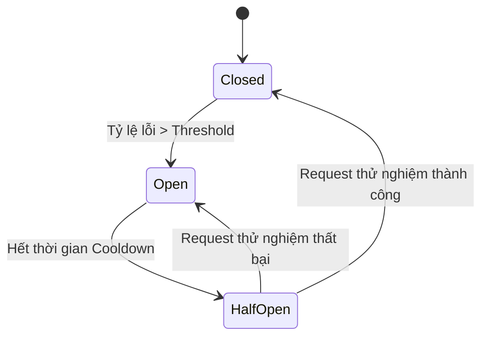

# title
Mẫu thiết kế Circuit Breaker (Circuit Breaker Pattern)

# description
Bài lab đi sâu vào nguyên lý hoạt động của **Circuit Breaker**, giúp ứng dụng tự động ngắt kết nối (**Fast Fail**) đến các dịch vụ đang quá tải và tự động khôi phục khi dịch vụ ổn định trở lại.

# body
## 1. Lời mở đầu
Trong các buổi phỏng vấn thiết kế hệ thống **Microservices**, câu hỏi: *"Làm sao để ngăn chặn thảm họa dây chuyền (Cascading Failures) khi một service cốt lõi bị nghẽn?"* luôn là đề tài kinh điển. 

Nếu một service đích đang quá tải mà hàng ngàn request vẫn cố gắng kết nối và chờ đợi **Timeout**, thì **Thread Pool** của ứng dụng gọi đi sẽ bị cạn kiệt, dẫn đến sập cả hệ thống vốn đang lành lặn. Bài học này sẽ hướng dẫn bạn triển khai **Circuit Breaker** (Cầu dao điện). Cơ chế này theo dõi tỷ lệ lỗi; nếu lỗi vượt ngưỡng, cầu dao sẽ "Mở" (**Open**), lập tức chặn mọi request tiếp theo và trả về lỗi ngay lập tức (**Fast Fail**) để bảo vệ hệ thống.

## 2. Các khái niệm cốt lõi
### 2.1. Cỗ máy trạng thái (State Machine) của Circuit Breaker
Circuit Breaker duy trì 3 trạng thái chính:
-   **Closed (Đóng):** Trạng thái bình thường. Mọi request đi qua bình thường. Nếu tỷ lệ lỗi vượt ngưỡng (ví dụ 50%), cầu dao chuyển sang **Open**.
-   **Open (Mở):** Trạng thái bảo vệ. Mọi request gọi đến lập tức bị từ chối (**Fast Fail**) mà không gửi request thực tế xuống service đích.
-   **Half-Open (Nửa mở):** Sau một khoảng thời gian chờ (**Reset Timeout**), cầu dao cho phép một vài request "thử nghiệm" đi qua. Nếu thành công, cầu dao đóng lại (**Closed**). Nếu vẫn lỗi, nó tiếp tục mở (**Open**).


*Hình 1: Vòng đời chuyển đổi trạng thái của Circuit Breaker.*

## 2.2. Thực hành: Kiểm chứng luồng cắt mạch
### 2.2.1. Chuẩn bị source code và môi trường
Source tham chiếu: `1-circuit-breaker-pattern`

```bash
# Bước 1: Clone repository demo về máy local
git clone https://github.com/StarCi-Academy/system-design-mastery-module-6-reliability-and-resilience-patterns.git

# Bước 2: Di chuyển vào thư mục bài học
cd system-design-mastery-module-6-reliability-and-resilience-patterns/1-circuit-breaker-pattern
```

### 2.2.2. Kiến trúc và các thành phần
-   **api-gateway (Port 3000):** Tích hợp thư viện **Opossum** để triển khai Circuit Breaker bảo vệ lệnh gọi sang kho hàng.
-   **inventory-service (Port 3001):** Dịch vụ kho hàng, được lập trình để tự động lỗi sau 3 lần gọi thành công.

| Thành phần | Trách nhiệm | Công nghệ |
|---|---|---|
| **api-gateway** | Triển khai cầu dao bảo vệ | **NestJS**, **Opossum** |
| **inventory-service** | Giả lập dịch vụ đích không ổn định | **NestJS** |

### 2.2.3. Chuẩn bị
**2.2.3.1. Điều kiện cần trước**
-   Đã cài đặt **Node.js >= 20**.
-   Đã cài đặt **Docker**.

**2.2.3.2. Cài đặt và khởi chạy bằng Docker**

```bash
# Bước 0: tạo network dùng chung (chỉ cần chạy một lần trên máy)
docker network create starci-network

# Bước 1: chạy toàn bộ stack
docker compose -f .docker/backend.yaml up -d --build

# Bước 2: theo dõi log API Gateway
docker compose -f .docker/backend.yaml logs -f api-gateway
```

### 2.2.4. Kiểm thử
#### Luồng 1 — Mạch đóng (Closed - Hoạt động bình thường)
Bước 1: Gọi API lấy dữ liệu kho hàng 3 lần đầu tiên.
```bash
curl -s http://localhost:3000/inventory
```
Response trả về thành công:
```json
{
  "status": "success",
  "data": "There are 10 products in stock"
}
```

#### Luồng 2 — Mạch mở (Open - Chặn request lập tức)
Bước 1: Tiếp tục gọi API lần thứ 4 và thứ 5. Vì **inventory-service** bắt đầu báo lỗi từ lần gọi thứ 4, tỷ lệ lỗi sẽ tăng vọt.
Bước 2: Quan sát log tại Terminal của **api-gateway**. Bạn sẽ thấy thông báo:
```plaintext
[GatewayService] Circuit state changed to: OPEN
```
Bước 3: Gọi lại API. Lúc này bạn sẽ nhận được kết quả từ hàm **Fallback** ngay lập tức (không mất thời gian chờ xử lý):
```json
{
  "status": "fallback",
  "data": "Inventory system is busy, please try again later",
  "isFallback": true
}
```
*Kết luận: Cầu dao đã ngắt mạch thành công để bảo vệ tài nguyên hệ thống khỏi các request vô vọng.*

#### Luồng 3 — Khôi phục mạch (Half-Open)
Bước 1: Đợi 5 giây (**Reset Timeout**).
Bước 2: Gọi lại API. Lúc này cầu dao chuyển sang **Half-Open** và cho phép 1 request đi qua để thăm dò.
Bước 3: Nếu **inventory-service** vẫn lỗi, cầu dao sẽ tiếp tục **Open**. Nếu thành công (trong thực tế khi service phục hồi), mạch sẽ đóng lại (**Closed**).

### 2.2.5. Dọn tài nguyên
Dừng toàn bộ dịch vụ:

```bash
docker compose -f .docker/backend.yaml down
```

## 3. Tổng kết
### 3.1. Các câu hỏi dễ bị phỏng vấn
-   **Câu hỏi 1: Circuit Breaker khác gì so với Retry?**
    -   **Trả lời:** **Retry** cố gắng gửi thêm request để vượt qua lỗi tạm thời. Ngược lại, **Circuit Breaker** ngăn chặn không cho request bay đi khi biết chắc dịch vụ đích đang gặp sự cố. Thông thường, **Retry** sẽ được bọc bên trong **Circuit Breaker**.
-   **Câu hỏi 2: Trạng thái Half-Open giải quyết bài toán gì?**
    -   **Trả lời:** Nó cung cấp cơ chế tự phục hồi (**Self-healing**). Thay vì phải chờ con người can thiệp để đóng mạch, hệ thống tự động cho "nhỏ giọt" vài request để thăm dò sức khỏe dịch vụ đích.

# references
## 0
### alias
Opossum Circuit Breaker
### url
https://nodeshift.dev/opossum/

# minutesRead
25
