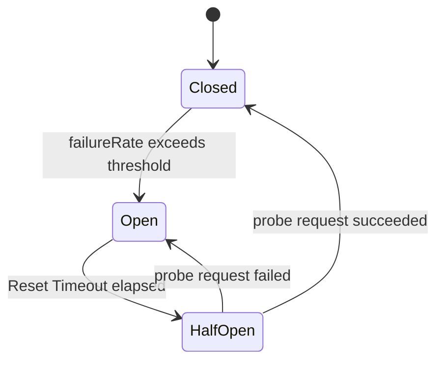

# title
Circuit Breaker Pattern

# description
Bài học đi sâu vào nguyên lý hoạt động của Circuit Breaker, giúp ứng dụng tự động ngắt kết nối đến các dịch vụ đang quá tải và tự động khôi phục khi dịch vụ ổn định trở lại. Bài có phần thực hành dựng api-gateway và inventory-service bằng NestJS cùng thư viện Opossum để quan sát ba trạng thái Closed, Open và Half-Open.

# body

## 1. Lời mở đầu

"Một service trong kiến trúc microservices của bạn đột nhiên chậm và bắt đầu timeout, làm sao bạn ngăn lỗi đó kéo sập các service đang lành lặn còn lại?" — một **Senior Engineer** đặt câu hỏi trong phiên phỏng vấn system design. Một **Mid-level Developer** trả lời: "Em sẽ dùng **Timeout** và **Retry** để xử lý lỗi tạm thời ạ." Câu trả lời đúng về kỹ thuật xử lý lỗi transient, nhưng vẫn thiếu chiều sâu về cách phát hiện service đích đang gặp sự cố kéo dài — không nhắc tới cơ chế **Fast Fail**, không phân biệt được trạng thái **Open / Half-Open / Closed**, và chưa biết cách bảo vệ **Thread Pool** của service gọi đi khỏi **Cascading Failure**.

Bài này dẫn qua hai mạch liên tiếp:
- **Phần 2.1**: **thực hành** đồng bộ với repository trên GitHub; học viên clone repo demo, chạy stack **NestJS** + **Opossum**, ép service kho hàng lỗi và quan sát cầu dao chuyển trạng thái qua log cùng response **Fallback** qua ba luồng kiểm thử.
- **Phần 2.2**: **lý thuyết** làm rõ cỗ máy trạng thái **Closed → Open → Half-Open**, các tham số ngưỡng lỗi cùng **Reset Timeout**, và mối quan hệ giữa **Circuit Breaker** với **Retry**, **Timeout**, **Bulkhead**.
Mục tiêu sau bài là phân biệt được **Fast Fail** với **Retry**, thiết lập được **Circuit Breaker** với ngưỡng lỗi và **Reset Timeout** phù hợp, đọc được log chuyển trạng thái và thiết kế hàm **Fallback** an toàn cho service phụ thuộc.

## 2. Các khái niệm cốt lõi

Cấu trúc bài học áp dụng phương pháp **Thực hành dẫn dắt Lý thuyết**. Khởi đầu, học viên sẽ trực tiếp chạy **api-gateway** và **inventory-service**, ép lỗi để quan sát **Circuit Breaker** chuyển trạng thái qua log và response. Tiếp theo, **phần lý thuyết** sẽ hệ thống hóa cỗ máy trạng thái, tham số cấu hình và các **edge cases** — giúp đối chiếu và củng cố trực tiếp những kết quả vừa thực nghiệm tại **phần 2.1**.

### 2.1. Thực hành

#### 2.1.1. Chuẩn bị source code và môi trường

Mục tiêu: clone repo demo gồm **api-gateway** (đã bọc **Opossum** quanh lệnh gọi xuống kho hàng) và **inventory-service** (giả lập service đích không ổn định) để quan sát chu trình **Closed → Open → Half-Open** trên thực tế.

Source: [StarCi-Academy/system-design-mastery-module-6-reliability-and-resilience-patterns](https://github.com/StarCi-Academy/system-design-mastery-module-6-reliability-and-resilience-patterns) trên GitHub — thư mục bài học: [`1-circuit-breaker-pattern`](https://github.com/StarCi-Academy/system-design-mastery-module-6-reliability-and-resilience-patterns/tree/main/1-circuit-breaker-pattern); **Docker Compose** và file hands-on nằm trong [`1-circuit-breaker-pattern/.docker`](https://github.com/StarCi-Academy/system-design-mastery-module-6-reliability-and-resilience-patterns/tree/main/1-circuit-breaker-pattern/.docker).

```bash
# Bước 1: Clone repository demo về máy local
git clone https://github.com/StarCi-Academy/system-design-mastery-module-6-reliability-and-resilience-patterns.git

# Bước 2: Vào thư mục bài học
cd system-design-mastery-module-6-reliability-and-resilience-patterns/1-circuit-breaker-pattern
```

Stack chính: **Node.js** >= 20, **NestJS**, **Opossum**, **Docker** + **Docker Compose**.

#### 2.1.2. Kiến trúc/thành phần (stack + luồng)

- **api-gateway:** cổng vào của hệ thống, tích hợp **Opossum** để bọc lệnh gọi sang **inventory-service** và trả **Fallback** khi mạch **Open**.
- **inventory-service:** dịch vụ kho hàng giả lập, được lập trình để báo lỗi từ request thứ 4 trở đi nhằm ép tỷ lệ lỗi vượt ngưỡng.

| Thành phần | Cổng (Port) | Vai trò |
| --- | --- | --- |
| **api-gateway** | 3000 | Bọc **Circuit Breaker** quanh lệnh gọi xuống service đích, định nghĩa **Fallback** |
| **inventory-service** | 3001 | Giả lập service đích không ổn định để kích hoạt cầu dao |


Hình 1: Client gọi api-gateway; Opossum bọc lệnh gọi xuống inventory-service và trả Fallback ngay khi mạch chuyển sang Open.

#### 2.1.3. Chuẩn bị & Khởi chạy

##### 2.1.3.1. Điều kiện cần trước

- **Node.js** >= 20.
- **Docker** và **Docker Compose**.
- **Windows:** dùng **`Invoke-RestMethod`** / **`Invoke-WebRequest`** trong PowerShell cho các lệnh HTTP.

##### 2.1.3.2. Khởi động stack

```bash
# Bước 1: Chạy toàn bộ stack (Compose tự tạo network `1-circuit-breaker-pattern`)
docker compose -f .docker/compose.yaml up -d

# Bước 2: Theo dõi log api-gateway để quan sát chuyển trạng thái Circuit Breaker
docker compose -f .docker/compose.yaml logs -f api-gateway
```

#### 2.1.4. Kiểm thử

**3 luồng** kiểm thử xác nhận hành vi của **Circuit Breaker** qua thư viện **Opossum**: **(1)** mạch **Closed**, ba request đầu trả dữ liệu kho hàng bình thường và bộ đếm `successes` tăng đều; **(2)** mạch **Open** sau khi **inventory-service** bắt đầu lỗi từ request thứ 4, request kế tiếp lập tức trả **Fallback** mà không chờ **Timeout** xuống service đích; **(3)** mạch **Half-Open** sau **Reset Timeout** 5 giây, **Opossum** thả đúng một request thăm dò để quyết định đóng mạch lại hay tiếp tục **Open** (luồng nâng cao).

##### 2.1.4.1. Luồng 1 — Closed (mạch đóng, hoạt động bình thường)

- Bước 1: Gọi API kho hàng 3 lần đầu để xác nhận **inventory-service** còn lành.

  ```bash
  # Windows (PowerShell)
  Invoke-RestMethod -Uri http://localhost:3000/inventory

  # macOS / Linux
  # → Paste cURL into Postman: Import → Raw text
  curl -s http://localhost:3000/inventory
  ```

  Response phải trả về (HTTP 200):

  ```json
  {
    "status": "success",
    "data": "There are 10 products in stock"
  }
  ```

  *Kết luận: Nếu response trả về `"status": "success"` với dữ liệu kho hàng, hệ thống xác nhận:*

  - ***Opossum** đếm `successes` tăng đều, `failures = 0`, mạch giữ trạng thái `Closed` — khớp logic trong `gateway.service.ts`.*
  - *Request đi xuyên qua **Circuit Breaker** xuống **inventory-service** không có overhead đáng kể.*

##### 2.1.4.2. Luồng 2 — Open (mạch mở, Fast Fail bằng Fallback)

- Bước 1: Tiếp tục gọi API lần thứ 4 và thứ 5; **inventory-service** đã được lập trình để báo lỗi từ request thứ 4.

  ```bash
  # Windows (PowerShell)
  Invoke-RestMethod -Uri http://localhost:3000/inventory
  Invoke-RestMethod -Uri http://localhost:3000/inventory

  # macOS / Linux
  # → Paste cURL into Postman: Import → Raw text
  curl -s http://localhost:3000/inventory
  curl -s http://localhost:3000/inventory
  ```

- Bước 2: Quan sát log của **api-gateway** để thấy chuyển trạng thái.

  Kết quả trả về trên terminal:

  ```text
  [GatewayService] Circuit state changed to: OPEN
  ```

- Bước 3: Gọi lại API ngay sau đó, **Opossum** không gửi request thực tế xuống **inventory-service** mà trả ngay **Fallback**.

  ```bash
  # Windows (PowerShell)
  Invoke-RestMethod -Uri http://localhost:3000/inventory

  # macOS / Linux
  # → Paste cURL into Postman: Import → Raw text
  curl -s http://localhost:3000/inventory
  ```

  Response phải trả về (HTTP 200):

  ```json
  {
    "status": "fallback",
    "data": "Inventory system is busy, please try again later",
    "isFallback": true
  }
  ```

  *Kết luận: Nếu response chuyển sang `"status": "fallback"` với `isFallback: true`, hệ thống xác nhận:*

  - *Tỷ lệ lỗi vượt ngưỡng cấu hình (mặc định 50%), **Opossum** chuyển mạch sang `Open` — khớp event listener trong `gateway.service.ts`.*
  - *Request mới được giải phóng ngay (**Fast Fail**), không chiếm **Thread / Connection Pool** của **api-gateway** chờ **Timeout** xuống service ốm.*
  - *Hàm **Fallback** trả response an toàn để client xử lý theo nhánh suy giảm tính năng (**graceful degradation**).*

##### 2.1.4.3. Luồng 3 — Half-Open (thăm dò phục hồi) (luồng nâng cao)

- Bước 1: Đợi đủ **Reset Timeout** (5 giây) sau khi mạch **Open**.

  ```bash
  # Windows (PowerShell)
  Start-Sleep -Seconds 5

  # macOS / Linux
  sleep 5
  ```

- Bước 2: Gọi API thăm dò; **Opossum** chuyển sang `Half-Open` và cho phép đúng một request đi xuống **inventory-service**.

  ```bash
  # Windows (PowerShell)
  Invoke-RestMethod -Uri http://localhost:3000/inventory

  # macOS / Linux
  # → Paste cURL into Postman: Import → Raw text
  curl -s http://localhost:3000/inventory
  ```

- Bước 3: Quan sát log để xác định kết quả thăm dò.

  Kết quả trả về trên terminal:

  ```text
  [GatewayService] Circuit state changed to: HALF_OPEN
  [GatewayService] Circuit state changed to: OPEN     # neu request tham do van loi
  [GatewayService] Circuit state changed to: CLOSED   # neu request tham do thanh cong
  ```

  *Kết luận: Nếu log hiển thị `HALF_OPEN` sau đúng **Reset Timeout**, hệ thống xác nhận:*

  - *`Half-Open` cung cấp cơ chế tự phục hồi (**Self-healing**) mà không cần can thiệp thủ công — khớp cấu hình `resetTimeout` trong **Opossum**.*
  - *Một request thử nghiệm thất bại lập tức kéo mạch quay về `Open` cộng thêm chu kỳ chờ mới, tránh dội tải lên service đang ốm.*
  - *Một request thử nghiệm thành công kéo mạch về `Closed`, các request tiếp theo đi qua bình thường.*

#### 2.1.5. Dọn tài nguyên

Sau khi kết thúc bài, bạn có thể dọn tài nguyên để tiết kiệm bộ nhớ. Trong thư mục **`.../1-circuit-breaker-pattern`** (cùng nơi đã chạy **`docker compose up`**), chạy **`docker compose -f .docker/compose.yaml down -v`**: **`-v`** xóa **anonymous / named volumes** và **Compose** tự dọn network `1-circuit-breaker-pattern`.

```bash
# Dừng và xoá container + volumes + network của bài học
docker compose -f .docker/compose.yaml down -v
```

#### 2.1.6. Đọc thêm

- **Opossum:** thư viện **Circuit Breaker** chính thức cho **Node.js**, hỗ trợ event `open`, `halfOpen`, `close`, `fallback`. ([Opossum Docs](https://nodeshift.dev/opossum/))
- **Resilience4j:** thư viện **Circuit Breaker** phổ biến trên **JVM**, định nghĩa rõ các metric `failureRate`, `slowCallRate`, `bufferedCalls`. ([Resilience4j Docs](https://resilience4j.readme.io/docs/circuitbreaker))
- **Polly:** thư viện **Resilience** cho **.NET**, gộp **Retry**, **Circuit Breaker**, **Timeout**, **Bulkhead** vào cùng một pipeline. ([Polly GitHub](https://github.com/App-vNext/Polly))
- **Release It! — Michael Nygard:** sách gốc giới thiệu mẫu **Circuit Breaker** cùng **Bulkhead** và **Timeout** trong thiết kế hệ thống chịu lỗi. ([Pragmatic Bookshelf](https://pragprog.com/titles/mnee2/release-it-second-edition/))
- **Martin Fowler — CircuitBreaker:** bài viết kinh điển mô tả ngắn gọn ba trạng thái và lý do tồn tại của mẫu này. ([Martin Fowler](https://martinfowler.com/bliki/CircuitBreaker.html))

### 2.2. Lý thuyết — Circuit Breaker Pattern

#### 2.2.1. Định nghĩa và mục đích

**Circuit Breaker** *(cầu dao điện)* là một mẫu thiết kế chịu lỗi (*resilience pattern*) bọc quanh lệnh gọi tới một dependency từ xa và chủ động ngắt mạch khi dependency đó cho thấy dấu hiệu hỏng kéo dài. Thay vì để mỗi request đều gửi đi rồi đợi **Timeout**, **Circuit Breaker** đếm tỷ lệ lỗi trong cửa sổ thống kê và "bật cầu dao" nếu vượt ngưỡng, khiến mọi request kế tiếp bị từ chối ngay (**Fast Fail**) cho đến khi service đích phục hồi.

Mục đích chính:

- Ngăn **Cascading Failure**: lỗi ở service dưới không kéo sập service trên qua hiện tượng kiệt **Thread / Connection Pool**.
- Bảo vệ trải nghiệm người dùng: trả response nhanh thay vì giữ kết nối chờ **Timeout** hàng giây.
- Tạo điểm "tự phục hồi" cho service đích: giảm tải để service ốm có cơ hội hồi phục thay vì bị dội thêm lưu lượng.

#### 2.2.2. Cỗ máy trạng thái Closed, Open, Half-Open



Hình 2: Vòng đời chuyển trạng thái của Circuit Breaker.

- **Closed:** trạng thái mặc định. Request đi xuyên qua, **Circuit Breaker** chỉ đếm `successes` và `failures` trong cửa sổ thống kê. Khi `failureRate` vượt ngưỡng (ví dụ 50% trên 10 request gần nhất), mạch chuyển sang **Open**.
- **Open:** mọi request mới bị từ chối ngay với **Fallback** hoặc lỗi `CircuitBreakerOpenError`, **Circuit Breaker** không gửi request thực tế xuống dependency. Trạng thái này tồn tại đúng bằng **Reset Timeout** đã cấu hình.
- **Half-Open:** sau khi **Reset Timeout** hết, **Circuit Breaker** thả đúng một (hoặc một vài) request thăm dò. Thành công kéo mạch về **Closed**; thất bại đẩy mạch quay lại **Open** và bắt đầu chu kỳ chờ mới.

#### 2.2.3. Tham số cấu hình điển hình

| Tham số | Ý nghĩa | Giá trị tham khảo |
| --- | --- | --- |
| `errorThresholdPercentage` | Ngưỡng tỷ lệ lỗi để mở mạch | 50% |
| `volumeThreshold` | Số request tối thiểu trong cửa sổ trước khi tính tỷ lệ | 10 |
| `timeout` | **Timeout** cho mỗi lệnh gọi qua **Circuit Breaker** | 1000–3000 ms |
| `resetTimeout` | Thời gian ở trạng thái **Open** trước khi sang **Half-Open** | 5000–30000 ms |
| `rollingCountTimeout` | Cửa sổ thống kê cho `failureRate` | 10000 ms |

#### 2.2.4. Quan hệ với Retry, Timeout, Bulkhead, Fallback

- **Timeout** *(giới hạn thời gian)*: chặn lệnh gọi treo. Là tiền đề để **Circuit Breaker** đếm `failure` đúng lúc thay vì chờ vô hạn.
- **Retry** *(thử lại)*: hợp với lỗi tạm thời như mạng chớp tắt. Phải đặt **bên trong** **Circuit Breaker** để khi mạch **Open**, **Retry** không được kích hoạt.
- **Bulkhead** *(vách ngăn)*: cô lập tài nguyên cho từng dependency. Bổ trợ cho **Circuit Breaker** ở chỗ kể cả khi mạch chưa kịp mở, **Bulkhead** đã giới hạn số request đồng thời để tránh nuốt **Thread Pool**.
- **Fallback** *(phương án thay thế)*: bắt buộc đi cùng **Circuit Breaker**. Khi mạch **Open**, response **Fallback** quyết định client suy giảm tính năng ra sao (cache cũ, giá trị mặc định, hàng đợi xử lý sau).

#### 2.2.5. Các trường hợp biên (edge cases) cần lưu ý

- **Mạch không bao giờ chuyển sang Open dù service đích đã chậm:** **Timeout** của lệnh gọi lớn hơn cửa sổ thống kê nên request "treo" chưa được tính là `failure`. **Hệ quả:** **Thread Pool** của caller cạn dần, **Circuit Breaker** mất tác dụng. **Giải pháp:** đặt **Timeout** ngắn hơn cửa sổ và bật `errorThresholdPercentage` cùng `volumeThreshold`.
- **Mạch nháy liên tục giữa Open và Closed:** `volumeThreshold` quá thấp khiến vài request lỗi đầu cửa sổ đã đẩy `failureRate` lên 100%. **Hệ quả:** trải nghiệm người dùng dao động và log nhiễu. **Giải pháp:** tăng `volumeThreshold`, kéo dài `rollingCountTimeout`, và xem xét bật `rollingPercentilesEnabled` để loại bỏ outlier.
- **Retry quá mạnh tay khiến Circuit Breaker mở liên tục:** **Retry** đặt bên ngoài **Circuit Breaker** và mỗi lần thử lại đều bị tính là `failure` riêng. **Hệ quả:** `failureRate` tăng giả tạo, mạch mở oan và kéo dài thời gian khôi phục. **Giải pháp:** bọc **Retry** **bên trong** một lệnh gọi đã được **Circuit Breaker** bảo vệ, đồng thời giới hạn `maxRetries` và dùng **Exponential Backoff**.

## 3. Tổng kết

### 3.1. Các câu hỏi dễ bị phỏng vấn

- **Câu hỏi 1:** **Circuit Breaker** khác gì so với **Retry**?
  - Ý interviewer muốn nghe: phân biệt hai mẫu chống lỗi tạm thời và lỗi kéo dài.
  - Trả lời mẫu (ngắn): **Retry** dành cho lỗi *transient* (mạng chớp tắt, deadlock ngắn) bằng cách thử lại với **Backoff**. **Circuit Breaker** dành cho lỗi kéo dài (service down, quá tải) bằng cách ngừng gửi request để service đích có cơ hội phục hồi. Trong thực tế, **Retry** được lồng **bên trong** **Circuit Breaker**.

- **Câu hỏi 2:** Trạng thái **Half-Open** giải quyết bài toán gì?
  - Ý interviewer muốn nghe: cơ chế **Self-healing** thay vì chờ vận hành đóng mạch tay.
  - Trả lời mẫu (ngắn): **Half-Open** là pha thăm dò: sau **Reset Timeout**, **Circuit Breaker** thả một số ít request đi qua. Thành công → mạch về **Closed**; thất bại → quay lại **Open** với chu kỳ chờ mới. Hệ thống tự cân bằng mà không cần con người can thiệp.

- **Câu hỏi 3:** Chọn `errorThresholdPercentage` và `resetTimeout` như thế nào?
  - Ý interviewer muốn nghe: suy luận theo SLO/SLA và đặc tính traffic thật, không chỉ copy giá trị mặc định.
  - Trả lời mẫu (ngắn): Bắt đầu với `errorThresholdPercentage = 50%` và `volumeThreshold` đủ lớn (10–20) để tránh nháy mạch. `resetTimeout` đặt ngắn (5–10s) cho service nội bộ, dài hơn (30–60s) cho bên thứ ba. Tinh chỉnh dựa trên dashboard `failureRate`, `circuitOpenCount` và `latency p95`.

- **Câu hỏi 4:** Vì sao cần **Fallback** đi kèm **Circuit Breaker**?
  - Ý interviewer muốn nghe: thiết kế cho **graceful degradation** thay vì ném exception cho client.
  - Trả lời mẫu (ngắn): Khi mạch **Open**, request bị từ chối ngay; không có **Fallback** → client nhận lỗi 5xx. Một **Fallback** tốt trả về dữ liệu cache cũ, giá trị mặc định an toàn, hoặc đẩy yêu cầu vào hàng đợi, kèm cờ `isFallback=true` để client phân biệt.

# references
## 0
### alias
Opossum Circuit Breaker
### url
https://nodeshift.dev/opossum/
## 1
### alias
Resilience4j Circuit Breaker
### url
https://resilience4j.readme.io/docs/circuitbreaker
## 2
### alias
Martin Fowler — CircuitBreaker
### url
https://martinfowler.com/bliki/CircuitBreaker.html

# minutesRead
30
