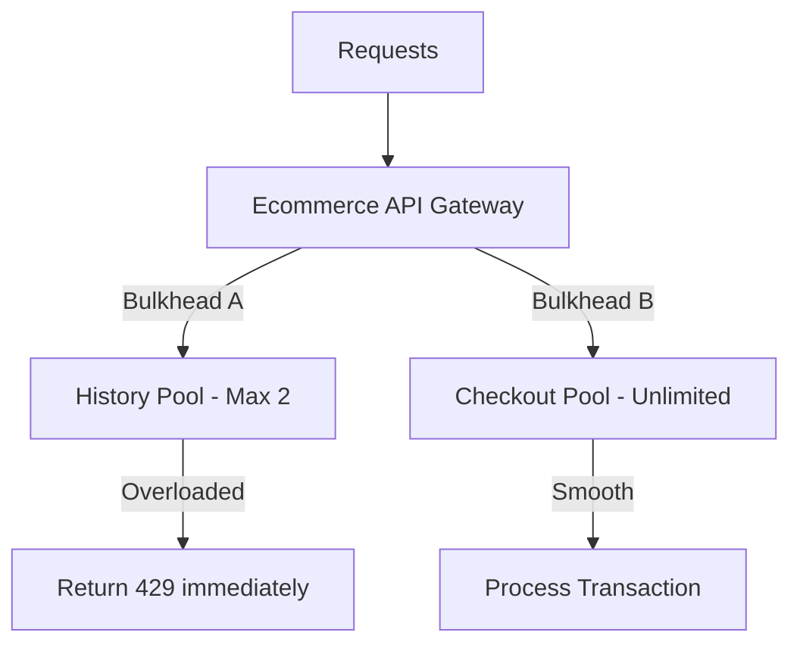

# title
Building Unsinkable Compartments: Bulkhead Pattern

# description
Prevent a localized failure from overflowing memory and spreading to crash the entire system. Learn from the ocean-going shipbuilding industry to protect critical core functions in **NestJS**.

# body
## 1. Introduction
In **Senior Backend** interviews, a classic resource allocation problem is: *"Your E-commerce system has 2 APIs: `GET /history` (Transaction History) and `GET /checkout` (Payment). Today, the History API has a DB connection error and is processing extremely slowly. Customers are spamming F5 on the History API. Consequently, the entire server hangs, and customers calling the Checkout API also receive errors. Can you explain the cause and the solution?"*

A common answer is: *"I think the server is too weak, so it crashed. I would use a Circuit Breaker to trip the History API."* In reality, before a **Circuit Breaker** can even recognize the error, thousands of hanging requests have already consumed the server's entire **Thread Pool**. At this point, the server has no threads left to process new **Checkout** requests. To prevent a secondary function (History) from "hijacking" the resources of a critical function (Checkout), we must divide the server into independent compartments. This technique is called the **Bulkhead Pattern**.

## 2. Core Concepts
### 2.1. The Essence of the Bulkhead Pattern
The name **Bulkhead** is inspired by the hull structure of ships. The bottom of the ship is divided into dozens of small, sealed compartments. If the ship hits an underwater rock and punctures one compartment, water only floods that specific area; the other compartments remain dry, allowing the ship to float and continue its journey.

In software architecture, instead of letting all APIs share a single pool of concurrent processing resources, we divide them into independent "compartments":
-   **Priority Pool:** Reserved for critical functions (Checkout, Payment).
-   **Secondary Pool:** For auxiliary functions that don't directly impact revenue (History, Profile).

If the Secondary Pool becomes overloaded or hangs, it will only exhaust resources within its own partition. Requests belonging to the Priority Pool still have their own dedicated path and continue to function normally.


*Figure 1: Bulkhead partitions limit the concurrent request explosion of slow features.*

## 2.2. Practice: Verifying the Bulkhead Mechanism
### 2.2.1. Codebase and Environment Setup
Reference Source: `2-bulkhead-pattern`

```bash
# Step 1: Clone the demo repository
git clone https://github.com/StarCi-Academy/system-design-mastery-module-6-reliability-and-resilience-patterns.git

# Step 2: Navigate to the lesson directory
cd system-design-mastery-module-6-reliability-and-resilience-patterns/2-bulkhead-pattern
```

### 2.2.2. Architecture and Components
The system simulates an E-commerce API with two features having different priorities:
-   **History Feature:** Configured with a "bulkhead" that only allows processing of up to 2 concurrent requests. This feature is intentionally delayed (5 seconds).
-   **Checkout Feature:** Not limited by a bulkhead and processes extremely fast.

| Component | Responsibility | Technology |
|---|---|---|
| **ecommerce-api** | Partitions processing resources between History and Checkout | **NestJS**, **Concurrency Limiter** |

### 2.2.3. Setup
Run the service with Docker:

```bash
# Step 0: create shared network (run once per machine)
docker network create starci-network

# Step 1: run the service
docker compose -f .docker/backend.yaml up -d --build

# Step 2: inspect logs
docker compose -f .docker/backend.yaml logs -f ecommerce-api
```

### 2.2.4. Testing
#### Scenario 1 — Flooding the History Compartment
Step 1: Use a `for` loop to send 5 concurrent requests to the History API.
```bash
for i in {1..5}; do curl -s -w "\n" http://localhost:3000/history & done
```
Responses will be returned immediately for the 3 requests blocked by the Bulkhead, while the remaining 2 requests will wait for 5 seconds:
```json
{"statusCode":429,"message":"Bulkhead Error: History API is overloaded..."}
{"statusCode":429,"message":"Bulkhead Error: History API is overloaded..."}
{"statusCode":429,"message":"Bulkhead Error: History API is overloaded..."}
{"status":"success","message":"Transaction history: ..."}
{"status":"success","message":"Transaction history: ..."}
```
*Conclusion: The bulkhead mechanism is working. When the History compartment is full (2 threads), excess requests are "pushed away" immediately to avoid consuming further resources.*

#### Scenario 2 — Verifying the Checkout Compartment remains Safe
Step 1: Re-run Scenario 1 to flood the History compartment.
Step 2: Immediately call the Checkout API in another terminal.
```bash
curl -s http://localhost:3000/checkout
```
The response returns successfully and instantly:
```json
{
  "status": "success",
  "message": "Checkout successful"
}
```
*Conclusion: Even though the History function is "flooded" and overloaded, the Checkout function remains smooth because it resides in a completely separate resource partition.*

### 2.2.5. Resource Cleanup
Stop the service:

```bash
docker compose -f .docker/backend.yaml down
```

## 3. Summary
### 3.1. Common Interview Questions
-   **Question 1: How does Bulkhead differ from Rate Limiting?**
    -   **Answer:** **Rate Limiting** limits the *number of calls* in a period (e.g., 10 requests/minute). **Bulkhead** limits the *number of concurrent tasks* being processed (e.g., 5 people downloading files at the same time).
-   **Question 2: Why do you need a Bulkhead when you already have Auto-scaling?**
    -   **Answer:** **Auto-scaling** takes time to start new instances. In the meantime, a faulty feature could have already crashed all existing instances. **Bulkhead** provides immediate protection at a local level.

# references
## 0
### alias
Bulkhead Pattern - Microsoft Azure
### url
https://learn.microsoft.com/en-us/azure/architecture/patterns/bulkhead

# minutesRead
20
