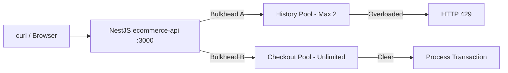

# title
Bulkhead Pattern

# description
This lesson analyzes the resource partitioning mechanism that prevents a localized failure from cascading and crashing the entire system. The hands-on section isolates concurrent processing resources between APIs in NestJS and compares behavior under overload.

# body

## 1. Opening

A **Senior Engineer** asks a **Mid-level** candidate: *"Your E-commerce system has two APIs: `GET /history` (transaction history) and `GET /checkout` (payment). Today the History API slows to a crawl due to a Database connection error, customers spam F5 on History, and suddenly the Checkout API starts failing too. Explain the root cause and how you would fix it."* The candidate answers they would use a **Circuit Breaker** to trip the History API, but does not yet explain why — before the **Circuit Breaker** can even detect the failure, thousands of hanging requests have already exhausted the server's entire **Thread Pool**, leaving no threads to process **Checkout** requests. The candidate misses the technique of isolating resources at the per-function level.

This lesson proceeds in two connected tracks. **Part 2.1** is **hands-on** and aligned with the GitHub repository; learners clone the demo repo, run two APIs with different priorities, and compare behavior when one compartment is overloaded across three test flows. **Part 2.2** reinforces the theory — the definition of **Bulkhead Pattern**, the partitioning model, and edge cases when configuring concurrency limiters. By the end, learners can distinguish **Bulkhead Pattern** from **Rate Limiting** and **Circuit Breaker**, configure per-route **concurrency** limits in **NestJS**, and interpret **HTTP 429** responses when a compartment is full.

## 2. Core concepts

The lesson uses **practice-led theory**. First you run **ecommerce-api**, fire concurrent requests to observe the bulkhead rejecting excess requests with **HTTP 429** while the other compartment continues operating normally. Then the theory section organizes definitions, the partitioning model, and edge cases — mapping directly to what you observed in **section 2.1**.

### 2.1. Hands-on

#### 2.1.1. Prepare source code and environment

Goal: clone the demo repo containing **ecommerce-api** with two routes `GET /history` (bulkhead-limited to 2 concurrent) and `GET /checkout` (unlimited) to observe resource isolation in action.

Source: [StarCi-Academy/system-design-mastery-module-6-reliability-and-resilience-patterns](https://github.com/StarCi-Academy/system-design-mastery-module-6-reliability-and-resilience-patterns) on GitHub — lesson directory: [`2-bulkhead-pattern`](https://github.com/StarCi-Academy/system-design-mastery-module-6-reliability-and-resilience-patterns/tree/main/2-bulkhead-pattern); **Docker Compose** and hands-on files live under [`2-bulkhead-pattern/.docker`](https://github.com/StarCi-Academy/system-design-mastery-module-6-reliability-and-resilience-patterns/tree/main/2-bulkhead-pattern/.docker).

```bash
# Step 1: Clone the repository locally
git clone https://github.com/StarCi-Academy/system-design-mastery-module-6-reliability-and-resilience-patterns.git

# Step 2: Enter the lesson folder
cd system-design-mastery-module-6-reliability-and-resilience-patterns/2-bulkhead-pattern
```

The repo already includes default values in **`ecommerce-api/.env`**, and **`ConfigModule`** reads those settings. When running through **Docker Compose** (`.docker/compose.yaml`), runtime variables come directly from `environment:` in Compose, so you do not need to create or edit **`.env`**. Edit **`.env`** only when running **`ecommerce-api`** directly on the host (`nest start`) or when changing default host/port/concurrency values.

Stack: **Node.js**, **NestJS**, **Concurrency Limiter**, **Docker** + **Docker Compose**.

#### 2.1.2. Architecture / components (stack + flow)

- **ecommerce-api:** a **NestJS** service exposing two routes `GET /history` (slow, bulkhead-limited to max 2 concurrent) and `GET /checkout` (fast, unlimited). Uses a **Concurrency Limiter** middleware for resource isolation.

| Component | Port | Role |
| --- | --- | --- |
| **ecommerce-api** | 3000 | Partitions processing resources between History (max 2 concurrent) and Checkout (unlimited) |



Figure 1: Client calls NestJS ecommerce-api; History Pool limits to 2 concurrent threads, Checkout Pool is unlimited; overload on History returns 429 without affecting Checkout.

#### 2.1.3. Prerequisites and startup

##### 2.1.3.1. Prerequisites

- **Docker** and **Docker Compose**.
- **Windows:** use **`Invoke-RestMethod`** / **`Invoke-WebRequest`** in PowerShell for HTTP requests.

##### 2.1.3.2. Start the stack

```bash
# Step 1: Start ecommerce-api (Compose creates network `2-bulkhead-pattern` automatically)
docker compose -f .docker/compose.yaml up -d

# Step 2: Follow logs to confirm service readiness
docker compose -f .docker/compose.yaml logs -f ecommerce-api
```

#### 2.1.4. Verification

**Three flows** validate the **Bulkhead Pattern** on **ecommerce-api**: **(1)** flood the History compartment to observe excess requests rejected with **HTTP 429**; **(2)** verify the Checkout compartment remains operational while History is overloaded; **(3)** happy path on both routes under low load.

##### 2.1.4.1. Flow 1 — Flood the History compartment

- Step 1: Fire 5 concurrent requests at the History API.

  ```bash
  # macOS / Linux
  for i in {1..5}; do curl -s -w "\n" http://localhost:3000/history & done

  # Windows (PowerShell)
  1..5 | ForEach-Object { Start-Job { Invoke-RestMethod -Uri http://localhost:3000/history } }
  Get-Job | Wait-Job | Receive-Job
  ```

  Expected response (HTTP 429 for 3 excess requests, HTTP 200 for 2 that enter the bulkhead):

  ```json
  {"statusCode":429,"message":"Bulkhead Error: History API is overloaded (exceeded 2 concurrent threads). Please try again later!"}
  {"statusCode":429,"message":"Bulkhead Error: History API is overloaded (exceeded 2 concurrent threads). Please try again later!"}
  {"statusCode":429,"message":"Bulkhead Error: History API is overloaded (exceeded 2 concurrent threads). Please try again later!"}
  {"status":"success","message":"Transaction history: ..."}
  {"status":"success","message":"Transaction history: ..."}
  ```

  *If exactly 3 requests return HTTP 429 and 2 return HTTP 200:*

  - *The History compartment holds a maximum of 2 concurrent threads, matching the **Concurrency Limiter** configuration on route `/history`.*
  - *The 3 excess requests are rejected immediately with **HTTP 429** instead of queuing, so they do not consume additional server processing resources.*

##### 2.1.4.2. Flow 2 — Checkout compartment stays safe while History is overloaded

- Step 1: Open terminal 1 and fire 5 concurrent requests at History to fill the compartment.

  ```bash
  # macOS / Linux
  for i in {1..5}; do curl -s -w "\n" http://localhost:3000/history & done

  # Windows (PowerShell)
  1..5 | ForEach-Object { Start-Job { Invoke-RestMethod -Uri http://localhost:3000/history } }
  ```

- Step 2: Open terminal 2 and call the Checkout API while History is overloaded.

  ```bash
  # Windows (PowerShell)
  Invoke-RestMethod -Uri http://localhost:3000/checkout

  # macOS / Linux
  # → Paste cURL into Postman: Import → Raw text
  curl -s http://localhost:3000/checkout
  ```

  Expected response (HTTP 200):

  ```json
  {
    "status": "success",
    "message": "Checkout successful"
  }
  ```

  *If `/checkout` returns HTTP 200 while `/history` is overloaded:*

  - *The Checkout compartment does not share a bulkhead with History, so `/checkout` requests are not blocked — matching the isolation logic in middleware.*
  - *This is the exact outcome **Bulkhead Pattern** targets: isolate failures in secondary functions so critical functions (payment) continue operating normally.*

##### 2.1.4.3. Flow 3 — Happy path under low load

- Step 1: Call each route sequentially when there is no load.

  ```bash
  # Windows (PowerShell)
  Invoke-RestMethod -Uri http://localhost:3000/history
  Invoke-RestMethod -Uri http://localhost:3000/checkout

  # macOS / Linux
  # → Paste cURL into Postman: Import → Raw text
  curl -s http://localhost:3000/history
  curl -s http://localhost:3000/checkout
  ```

  Expected response — History (HTTP 200, after ~5 seconds):

  ```json
  {"status":"success","message":"Transaction history: ..."}
  ```

  Expected response — Checkout (HTTP 200, near-instant):

  ```json
  {"status":"success","message":"Checkout successful"}
  ```

  *If both routes return HTTP 200:*

  - *Under low load, **Bulkhead Pattern** adds no significant overhead: both routes return successfully.*
  - *The 5-second delay on `/history` is due to simulated slow logic in code, not the bulkhead mechanism.*

#### 2.1.5. Cleanup

When you are done, tear down to free resources. From **`.../2-bulkhead-pattern`** (where you ran **`docker compose up`**), run **`docker compose -f .docker/compose.yaml down -v`**: **`-v`** removes **anonymous / named volumes** and **Compose** cleans up the `2-bulkhead-pattern` network automatically.

```bash
# Stop and remove lesson containers + volumes + network
docker compose -f .docker/compose.yaml down -v
```

#### 2.1.6. Further reading

- **Bulkhead Pattern:** original pattern description and cloud deployment trade-offs. ([Azure Architecture — Bulkhead](https://learn.microsoft.com/en-us/azure/architecture/patterns/bulkhead))
- **Concurrency Limiter (NestJS):** guide to building middleware that limits concurrent requests per route. ([NestJS Middleware](https://docs.nestjs.com/middleware))
- **Thread Pool starvation:** explains why one slow API can crash an entire service without resource isolation. ([Microsoft Learn](https://learn.microsoft.com/en-us/dotnet/standard/threading/the-managed-thread-pool))
- **Resilience4j Bulkhead:** reference for **JVM** ecosystem bulkhead configuration with `maxConcurrentCalls` and `maxWaitDuration`. ([Resilience4j Docs](https://resilience4j.readme.io/docs/bulkhead))
- **Circuit Breaker vs Bulkhead:** comparison of two complementary reliability patterns. ([Azure Architecture — Circuit Breaker](https://learn.microsoft.com/en-us/azure/architecture/patterns/circuit-breaker))

### 2.2. Theory — Bulkhead Pattern

#### 2.2.1. Definition and partitioning model

**Bulkhead Pattern** is a technique that divides concurrent processing resources (**Thread Pool**, **Connection Pool**, **Semaphore**) into independent groups per function or function group. When one group exhausts its resources due to overload or dependency failure, only requests in that group are affected; remaining groups continue operating.

The name **Bulkhead** is inspired by ship hull construction: the hull is divided into dozens of small sealed compartments. If the ship strikes an underwater rock and punctures one compartment, water only floods that area; other compartments remain dry, allowing the ship to float and continue its journey.

Minimal **NestJS** example using a **Concurrency Limiter** on a route:

```typescript
// history.controller.ts
@UseInterceptors(new ConcurrencyLimitInterceptor({ max: 2 }))
@Get('history')
async getHistory() {
  await new Promise((r) => setTimeout(r, 5000))
  return { status: 'success', message: 'Transaction history' }
}
```

#### 2.2.2. Comparing Bulkhead with Rate Limiting and Circuit Breaker

| Criteria | **Bulkhead** | **Rate Limiting** | **Circuit Breaker** |
| --- | --- | --- | --- |
| What it limits | Number of **concurrent tasks** | Number of **calls** in a time window | **Error rate** in a statistical window |
| Purpose | Isolate failures between functions | Protect API from abuse/DDoS | Trip circuit when dependency fails for extended periods |
| On violation | HTTP 429 immediately | HTTP 429 after quota exhausted | **Fast Fail** + **Fallback** |
| Scope | Within a single service | Edge / Gateway | Between caller and dependency |

#### 2.2.3. Edge cases to internalize

- **Concurrency limit too low, legitimate requests rejected:** Setting `max` too small relative to actual traffic causes normal requests to receive HTTP 429 even though the service is not truly overloaded. **Mitigation:** benchmark traffic patterns before choosing `max`, combine with monitoring `429 rate` to fine-tune.
- **Concurrency limit too high, bulkhead loses its purpose:** `max` exceeds the actual **Thread Pool** size, so an overloaded compartment still drains all processing threads without protecting the remaining compartments. **Mitigation:** ensure the sum of all compartment `max` values is less than or equal to the actual **Thread Pool** size.
- **Bulkhead without Fallback, client receives 429 continuously:** When a compartment is full, requests are rejected but clients don't know what to do. **Mitigation:** return 429 response with a `Retry-After` header and guide clients to retry after a specific interval.

## 3. Wrap-up

### 3.1. Common interview questions

- **Question 1:** How does **Bulkhead** differ from **Rate Limiting**?
  - What interviewers want: distinction between concurrency limits and throughput limits.
  - Sample short answer: **Rate Limiting** limits the *number of calls* in a time period (e.g. 10 requests/minute). **Bulkhead** limits the *number of concurrent tasks* being processed (e.g. max 5 concurrent). **Rate Limiting** protects against abuse, **Bulkhead** isolates failures between functions.

- **Question 2:** Why do you need **Bulkhead** when you already have **Auto-scaling**?
  - What interviewers want: understanding that scaling takes time and cannot isolate localized failures.
  - Sample short answer: **Auto-scaling** takes time to start new instances. Meanwhile, a faulty feature could have already crashed all existing instances through **Thread Pool** starvation. **Bulkhead** provides immediate protection at a local level, independent of scaling speed.

- **Question 3:** How do **Bulkhead** and **Circuit Breaker** complement each other?
  - What interviewers want: understanding that the two patterns protect at different layers.
  - Sample short answer: **Bulkhead** limits concurrency upfront so the **Thread Pool** is never fully drained. **Circuit Breaker** detects high error rates and trips the circuit entirely. Combined: **Bulkhead** keeps the caller from exhausting resources while the **Circuit Breaker** has not yet tripped, then the **Circuit Breaker** cuts off completely when failures persist.

# references
## 0
### alias
Bulkhead Pattern - Microsoft Azure
### url
https://learn.microsoft.com/en-us/azure/architecture/patterns/bulkhead
## 1
### alias
Resilience4j Bulkhead
### url
https://resilience4j.readme.io/docs/bulkhead
## 2
### alias
Circuit Breaker Pattern - Microsoft Azure
### url
https://learn.microsoft.com/en-us/azure/architecture/patterns/circuit-breaker

# minutesRead
20
