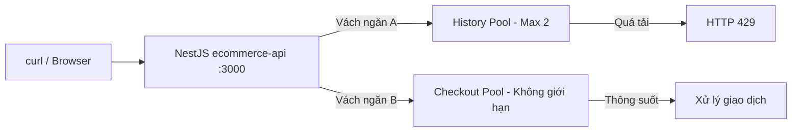

# title
Bulkhead Pattern

# description
Bài học phân tích cơ chế vách ngăn tài nguyên giúp một lỗi cục bộ không lan rộng đánh sập toàn hệ thống. Phần thực hành cô lập tài nguyên xử lý đồng thời giữa các API trong NestJS và đối chiếu hành vi khi quá tải.

# body

## 1. Lời mở đầu

"Hệ thống E-commerce của bạn có hai API là `GET /history` (xem lịch sử) và `GET /checkout` (thanh toán). Hôm nay API History chậm vì kết nối **Database** lỗi, khách hàng spam F5 vào API History, kết quả là API Checkout cũng văng lỗi theo. Bạn giải thích nguyên nhân và cách khắc phục?" — một **Senior Engineer** đặt câu hỏi trong vòng phỏng vấn **Backend**. Một **Mid-level Developer** trả lời: "Em sẽ dùng **Circuit Breaker** để ngắt mạch API History ạ." Câu trả lời đúng về kỹ thuật ngắt lỗi, nhưng vẫn thiếu chiều sâu về nguyên nhân gốc: trước khi **Circuit Breaker** kịp nhận diện lỗi, hàng ngàn request treo đã ăn sạch **Thread Pool** của Server, khiến API Checkout không còn luồng để xử lý — và chưa nêu được kỹ thuật cô lập tài nguyên ở mức từng chức năng.

Bài này dẫn qua hai mạch liên tiếp:
- **Phần 2.1**: **thực hành** đồng bộ với repository trên GitHub; học viên clone repo demo, chạy hai API có độ ưu tiên khác nhau và đối chiếu hành vi khi một khoang bị quá tải qua ba luồng kiểm thử.
- **Phần 2.2**: **lý thuyết** làm rõ định nghĩa **Bulkhead Pattern**, mô hình vách ngăn, và các tình huống biên khi cấu hình concurrency limiter.
Mục tiêu sau bài là phân biệt được **Bulkhead Pattern** với **Rate Limiting** và **Circuit Breaker**, thiết lập được giới hạn **concurrency** cho từng route trong **NestJS**, và đọc được response **HTTP 429** khi khoang đầy để biện luận về cô lập tài nguyên.

## 2. Các khái niệm cốt lõi

Cấu trúc bài học áp dụng phương pháp **Thực hành dẫn dắt Lý thuyết**. Khởi đầu, học viên sẽ trực tiếp chạy **ecommerce-api**, bắn request đồng thời để quan sát vách ngăn reject request thừa bằng **HTTP 429** trong khi khoang còn lại vẫn hoạt động bình thường. Tiếp theo, **phần lý thuyết** sẽ hệ thống hóa định nghĩa, mô hình vách ngăn và các **edge cases** — giúp đối chiếu và củng cố trực tiếp những kết quả vừa thực nghiệm tại **phần 2.1**.

### 2.1. Thực hành

#### 2.1.1. Chuẩn bị source code và môi trường

Mục tiêu: clone repo demo gồm **ecommerce-api** với hai route `GET /history` (có vách ngăn, giới hạn 2 luồng đồng thời) và `GET /checkout` (không giới hạn) để quan sát cơ chế cô lập tài nguyên.

Source: [StarCi-Academy/system-design-mastery-module-6-reliability-and-resilience-patterns](https://github.com/StarCi-Academy/system-design-mastery-module-6-reliability-and-resilience-patterns) trên GitHub — thư mục bài học: [`2-bulkhead-pattern`](https://github.com/StarCi-Academy/system-design-mastery-module-6-reliability-and-resilience-patterns/tree/main/2-bulkhead-pattern); **Docker Compose** và file hands-on nằm trong [`2-bulkhead-pattern/.docker`](https://github.com/StarCi-Academy/system-design-mastery-module-6-reliability-and-resilience-patterns/tree/main/2-bulkhead-pattern/.docker).

```bash
# Bước 1: Clone repository demo về máy local
git clone https://github.com/StarCi-Academy/system-design-mastery-module-6-reliability-and-resilience-patterns.git

# Bước 2: Vào thư mục bài học
cd system-design-mastery-module-6-reliability-and-resilience-patterns/2-bulkhead-pattern
```

File **`ecommerce-api/.env`** trong repo đã có sẵn giá trị mặc định và **`ConfigModule`** đọc các biến cấu hình tương ứng. Khi service chạy qua **Docker Compose** (`.docker/compose.yaml`), biến môi trường runtime được lấy trực tiếp từ `environment:` trong compose nên không cần tạo hay sửa **`.env`**. Chỉ chỉnh **`.env`** khi chạy **`ecommerce-api`** trực tiếp trên máy (**`nest start`**) hoặc khi cần host / cổng / ngưỡng concurrency khác mặc định.

Stack: **Node.js**, **NestJS**, **Concurrency Limiter**, **Docker** + **Docker Compose**.

#### 2.1.2. Kiến trúc/thành phần (stack + luồng)

- **ecommerce-api:** service **NestJS** expose hai route `GET /history` (chậm, có vách ngăn max 2 concurrent) và `GET /checkout` (nhanh, không giới hạn). Dùng **Concurrency Limiter** middleware để cô lập tài nguyên.

| Thành phần | Cổng (Port) | Vai trò |
| --- | --- | --- |
| **ecommerce-api** | 3000 | Phân tách tài nguyên xử lý giữa History (max 2 concurrent) và Checkout (không giới hạn) |



Hình 1: Client gọi NestJS ecommerce-api; History Pool giới hạn 2 luồng đồng thời, Checkout Pool không giới hạn; quá tải trên History trả 429 mà không ảnh hưởng Checkout.

#### 2.1.3. Chuẩn bị & Khởi chạy

##### 2.1.3.1. Điều kiện cần trước

- **Docker** và **Docker Compose**.
- **Windows:** dùng **`Invoke-RestMethod`** / **`Invoke-WebRequest`** trong PowerShell cho các lệnh HTTP.

##### 2.1.3.2. Khởi động stack

```bash
# Bước 1: Khởi chạy ecommerce-api (Compose tự tạo network `2-bulkhead-pattern`)
docker compose -f .docker/compose.yaml up -d

# Bước 2: Theo dõi log để xác nhận service đã sẵn sàng
docker compose -f .docker/compose.yaml logs -f ecommerce-api
```

#### 2.1.4. Kiểm thử

**3 luồng** kiểm thử xác nhận cơ chế **Bulkhead Pattern** trên **ecommerce-api**: **(1)** làm ngập khoang History để quan sát request thừa bị reject bằng **HTTP 429**; **(2)** kiểm chứng khoang Checkout vẫn hoạt động bình thường khi khoang History đang quá tải; **(3)** happy path đơn lẻ trên cả hai route khi tải thấp.

##### 2.1.4.1. Luồng 1 — Làm ngập khoang History

- Bước 1: Bắn 5 request đồng thời vào API History.

  ```bash
  # macOS / Linux
  for i in {1..5}; do curl -s -w "\n" http://localhost:3000/history & done

  # Windows (PowerShell)
  1..5 | ForEach-Object { Start-Job { Invoke-RestMethod -Uri http://localhost:3000/history } }
  Get-Job | Wait-Job | Receive-Job
  ```

  Response phải trả về (HTTP 429 cho 3 request thừa, HTTP 200 cho 2 request lọt vách ngăn):

  ```json
  {"statusCode":429,"message":"Bulkhead Error: History API is overloaded (exceeded 2 concurrent threads). Please try again later!"}
  {"statusCode":429,"message":"Bulkhead Error: History API is overloaded (exceeded 2 concurrent threads). Please try again later!"}
  {"statusCode":429,"message":"Bulkhead Error: History API is overloaded (exceeded 2 concurrent threads). Please try again later!"}
  {"status":"success","message":"Transaction history: ..."}
  {"status":"success","message":"Transaction history: ..."}
  ```

  *Kết luận: Nếu đúng 3 request trả về HTTP 429 và 2 request trả về HTTP 200, hệ thống xác nhận:*

  - *Khoang History chỉ giữ tối đa 2 luồng xử lý đồng thời, đúng với cấu hình **Concurrency Limiter** trên route `/history`.*
  - *3 request thừa bị đẩy văng ngay lập tức bằng **HTTP 429** thay vì xếp hàng chờ, nên không tiếp tục chiếm thêm tài nguyên xử lý của Server.*

##### 2.1.4.2. Luồng 2 — Khoang Checkout vẫn an toàn khi History quá tải

- Bước 1: Mở terminal 1 và bắn 5 request đồng thời vào API History để lấp đầy khoang.

  ```bash
  # macOS / Linux
  for i in {1..5}; do curl -s -w "\n" http://localhost:3000/history & done

  # Windows (PowerShell)
  1..5 | ForEach-Object { Start-Job { Invoke-RestMethod -Uri http://localhost:3000/history } }
  ```

- Bước 2: Mở terminal 2 và gọi API Checkout ngay khi khoang History đang quá tải.

  ```bash
  # Windows (PowerShell)
  Invoke-RestMethod -Uri http://localhost:3000/checkout

  # macOS / Linux
  # → Dán cURL vào Postman: Import → Raw text
  curl -s http://localhost:3000/checkout
  ```

  Response phải trả về (HTTP 200):

  ```json
  {
    "status": "success",
    "message": "Checkout successful"
  }
  ```

  *Kết luận: Nếu `/checkout` trả về HTTP 200 trong khi `/history` đang quá tải, hệ thống xác nhận:*

  - *Khoang Checkout không chia sẻ vách ngăn với khoang History, nên request `/checkout` không bị block — khớp logic cô lập trong middleware.*
  - *Đây chính là kết quả mà **Bulkhead Pattern** hướng tới: cô lập sự cố ở chức năng phụ để chức năng sinh tử (thanh toán) vẫn vận hành bình thường.*

##### 2.1.4.3. Luồng 3 — Happy path khi tải thấp

- Bước 1: Gọi tuần tự một request vào mỗi route khi không có tải.

  ```bash
  # Windows (PowerShell)
  Invoke-RestMethod -Uri http://localhost:3000/history
  Invoke-RestMethod -Uri http://localhost:3000/checkout

  # macOS / Linux
  # → Dán cURL vào Postman: Import → Raw text
  curl -s http://localhost:3000/history
  curl -s http://localhost:3000/checkout
  ```

  Response phải trả về — History (HTTP 200, sau khoảng 5 giây):

  ```json
  {"status":"success","message":"Transaction history: ..."}
  ```

  Response phải trả về — Checkout (HTTP 200, gần như tức thời):

  ```json
  {"status":"success","message":"Checkout successful"}
  ```

  *Kết luận: Nếu cả hai route đều trả về HTTP 200, hệ thống xác nhận:*

  - *Khi tải thấp, **Bulkhead Pattern** không gây overhead đáng kể: cả hai route đều trả thành công.*
  - *Độ trễ 5 giây trên `/history` là do logic mô phỏng chậm trong code, không phải do cơ chế vách ngăn.*

#### 2.1.5. Dọn tài nguyên

Sau khi kết thúc bài, bạn có thể dọn tài nguyên để tiết kiệm bộ nhớ. Trong thư mục **`.../2-bulkhead-pattern`** (cùng nơi đã chạy **`docker compose up`**), chạy **`docker compose -f .docker/compose.yaml down -v`**: **`-v`** xóa **anonymous / named volumes** và **Compose** tự dọn network `2-bulkhead-pattern`.

```bash
# Dừng và xoá container + volumes + network của bài học
docker compose -f .docker/compose.yaml down -v
```

#### 2.1.6. Đọc thêm

- **Bulkhead Pattern:** mô tả gốc của pattern và các trade-off khi triển khai trên cloud. ([Azure Architecture — Bulkhead](https://learn.microsoft.com/en-us/azure/architecture/patterns/bulkhead))
- **Concurrency Limiter (NestJS):** hướng dẫn dựng middleware giới hạn số request đồng thời theo route. ([NestJS Middleware](https://docs.nestjs.com/middleware))
- **Thread Pool starvation:** giải thích vì sao một API chậm có thể đánh sập toàn service nếu không cô lập tài nguyên. ([Microsoft Learn](https://learn.microsoft.com/en-us/dotnet/standard/threading/the-managed-thread-pool))
- **Resilience4j Bulkhead:** tham chiếu cách hệ sinh thái **JVM** cấu hình bulkhead theo `maxConcurrentCalls` và `maxWaitDuration`. ([Resilience4j Docs](https://resilience4j.readme.io/docs/bulkhead))
- **Circuit Breaker vs Bulkhead:** so sánh hai pattern reliability bổ trợ nhau. ([Azure Architecture — Circuit Breaker](https://learn.microsoft.com/en-us/azure/architecture/patterns/circuit-breaker))

### 2.2. Lý thuyết — Bulkhead Pattern

#### 2.2.1. Định nghĩa và mô hình vách ngăn

**Bulkhead Pattern** *(vách ngăn tài nguyên)* là kỹ thuật chia tài nguyên xử lý đồng thời (**Thread Pool**, **Connection Pool**, **Semaphore**) thành các nhóm độc lập theo từng chức năng hoặc nhóm chức năng. Khi một nhóm cạn tài nguyên do quá tải hoặc lỗi phụ thuộc, chỉ các request thuộc nhóm đó bị ảnh hưởng; các nhóm còn lại tiếp tục hoạt động.

Tên gọi **Bulkhead** lấy cảm hứng từ cấu trúc hầm tàu thủy: đáy tàu được chia thành hàng chục khoang nhỏ bịt kín. Nếu tàu đâm phải đá ngầm thủng một khoang, nước chỉ ngập khoang đó, các khoang khác vẫn khô ráo giúp con tàu nổi và đi tiếp được.

Ví dụ tối giản với **NestJS** dùng **Concurrency Limiter** trên một route:

```typescript
// history.controller.ts
@UseInterceptors(new ConcurrencyLimitInterceptor({ max: 2 }))
@Get('history')
async getHistory() {
  await new Promise((r) => setTimeout(r, 5000))
  return { status: 'success', message: 'Transaction history' }
}
```

#### 2.2.2. So sánh Bulkhead với Rate Limiting và Circuit Breaker

| Tiêu chí | **Bulkhead** | **Rate Limiting** | **Circuit Breaker** |
| --- | --- | --- | --- |
| Giới hạn gì | Số **tác vụ đồng thời** | Số **lần gọi** trong khoảng thời gian | **Tỷ lệ lỗi** trong cửa sổ thống kê |
| Mục đích | Cô lập sự cố giữa các chức năng | Bảo vệ API khỏi abuse/DDoS | Ngắt mạch khi dependency lỗi kéo dài |
| Khi vi phạm | HTTP 429 ngay lập tức | HTTP 429 sau khi hết quota | **Fast Fail** + **Fallback** |
| Phạm vi | Trong cùng một service | Edge / Gateway | Giữa caller và dependency |

#### 2.2.3. Các trường hợp biên (edge cases) cần lưu ý

- **Concurrency limit quá thấp, request hợp lệ bị reject oan:** Đặt `max` quá nhỏ so với traffic thực tế khiến request bình thường cũng nhận HTTP 429 dù service không thực sự quá tải. **Giải pháp:** benchmark traffic pattern trước khi chọn `max`, kết hợp monitoring `429 rate` để tinh chỉnh.
- **Concurrency limit quá cao, vách ngăn mất tác dụng:** `max` lớn hơn **Thread Pool** thực tế nên khoang bị quá tải vẫn ăn hết luồng xử lý, không bảo vệ được khoang còn lại. **Giải pháp:** đảm bảo tổng `max` của tất cả khoang nhỏ hơn hoặc bằng kích thước **Thread Pool** thực tế.
- **Bulkhead không có Fallback, client nhận lỗi 429 liên tục:** Khi khoang đầy, request bị reject nhưng client không biết phải làm gì. **Giải pháp:** trả response 429 kèm `Retry-After` header và hướng dẫn client thử lại sau khoảng thời gian cụ thể.

## 3. Tổng kết

### 3.1. Các câu hỏi dễ bị phỏng vấn

- **Câu hỏi 1:** **Bulkhead** khác gì với **Rate Limiting**?
  - Ý interviewer muốn nghe: phân biệt giới hạn concurrency và giới hạn throughput.
  - Trả lời mẫu (ngắn): **Rate Limiting** giới hạn *số lần gọi* trong một khoảng thời gian (ví dụ 10 request/phút). **Bulkhead** giới hạn *số lượng tác vụ xử lý đồng thời* (ví dụ max 5 concurrent). **Rate Limiting** bảo vệ khỏi abuse, **Bulkhead** cô lập sự cố giữa các chức năng.

- **Câu hỏi 2:** Tại sao cần **Bulkhead** khi đã có **Auto-scaling**?
  - Ý interviewer muốn nghe: hiểu rằng scaling mất thời gian và không cô lập được sự cố cục bộ.
  - Trả lời mẫu (ngắn): **Auto-scaling** mất thời gian để khởi động instance mới. Trong lúc chờ, một tính năng lỗi có thể đã đánh sập sạch các instance hiện có qua **Thread Pool** starvation. **Bulkhead** bảo vệ ngay lập tức ở mức cục bộ, không phụ thuộc vào tốc độ scaling.

- **Câu hỏi 3:** **Bulkhead** và **Circuit Breaker** bổ trợ nhau như thế nào?
  - Ý interviewer muốn nghe: hiểu rằng hai pattern bảo vệ ở hai tầng khác nhau.
  - Trả lời mẫu (ngắn): **Bulkhead** giới hạn concurrent ngay từ đầu để **Thread Pool** không bị cạn. **Circuit Breaker** phát hiện tỷ lệ lỗi cao và ngắt mạch hoàn toàn. Kết hợp cả hai: **Bulkhead** giữ cho caller không bị kiệt tài nguyên trong khi **Circuit Breaker** chưa kịp trip, sau đó **Circuit Breaker** ngắt hoàn toàn khi lỗi kéo dài.

# references
## 0
### alias
Bulkhead Pattern - Microsoft Azure
### url
https://learn.microsoft.com/en-us/azure/architecture/patterns/bulkhead
## 1
### alias
Resilience4j Bulkhead
### url
https://resilience4j.readme.io/docs/bulkhead
## 2
### alias
Circuit Breaker Pattern - Microsoft Azure
### url
https://learn.microsoft.com/en-us/azure/architecture/patterns/circuit-breaker

# minutesRead
20
