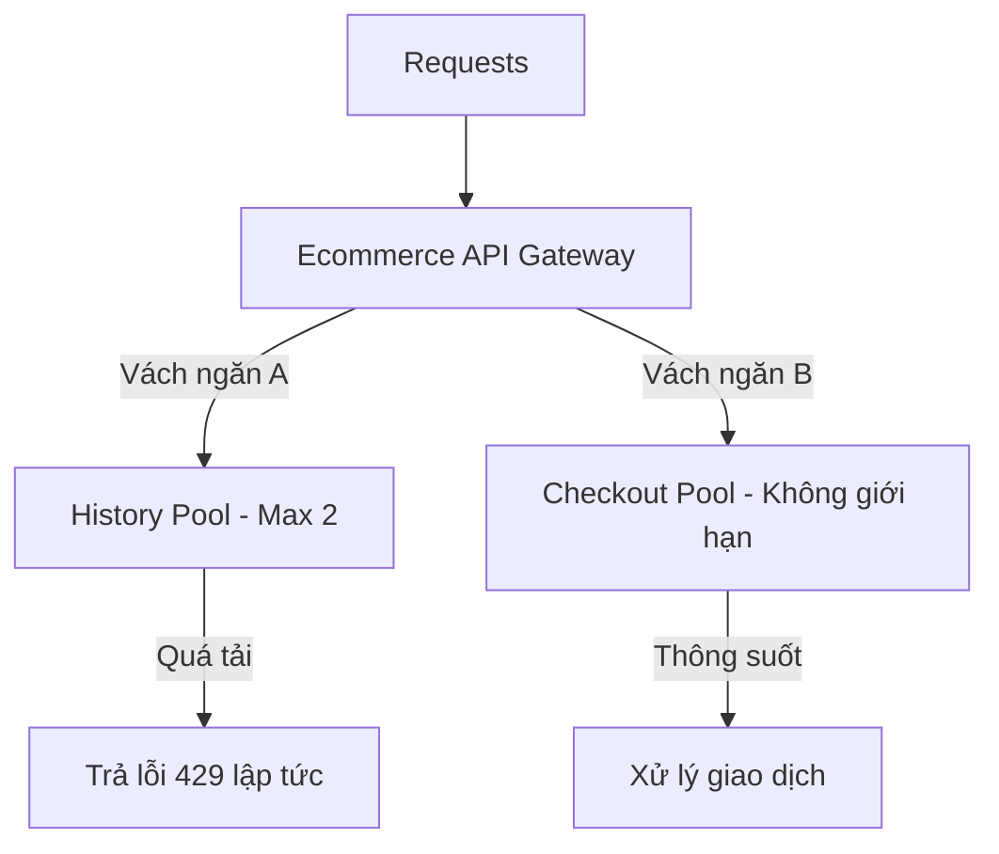

# title
Xây khoang chống chìm: Bulkhead Pattern

# description
Ngăn chặn một lỗi cục bộ làm tràn bộ nhớ và lan rộng đánh sập toàn hệ thống. Học ý tưởng từ ngành đóng tàu viễn dương để bảo vệ các chức năng quan trọng cốt lõi trong **NestJS**.

# body
## 1. Lời mở đầu
Trong phỏng vấn **Senior Backend**, một bài toán kinh điển về phân bổ tài nguyên: *"Hệ thống E-commerce của em có 2 API: `GET /history` (Xem lịch sử) và `GET /checkout` (Thanh toán). Hôm nay API History bị lỗi kết nối DB, xử lý cực chậm. Khách hàng spam F5 liên tục vào API History. Hậu quả là toàn bộ Server bị treo, khách hàng gọi API Checkout cũng bị văng lỗi. Em giải thích nguyên nhân và cách khắc phục?"*

Một câu trả lời thường thấy: *"Em nghĩ do Server yếu nên bị sập ạ. Em sẽ dùng Circuit Breaker để ngắt mạch API History."* Thực tế, trước khi **Circuit Breaker** kịp nhận diện lỗi, hàng ngàn request treo đã kịp ăn sạch toàn bộ **Thread Pool** (Hồ chứa luồng xử lý) của Server. Lúc này Server không còn luồng nào để xử lý request **Checkout** mới. Để ngăn chặn việc một chức năng phụ (History) "chiếm đoạt" tài nguyên của chức năng sinh tử (Checkout), ta phải chia Server thành các khoang độc lập. Kỹ thuật này gọi là **Bulkhead Pattern** (Khoang tàu chống chìm).

## 2. Các khái niệm cốt lõi
### 2.1. Bản chất của Bulkhead Pattern
Tên gọi **Bulkhead** lấy cảm hứng từ cấu trúc hầm tàu thủy. Đáy tàu được chia thành hàng chục khoang nhỏ bịt kín. Nếu tàu đâm phải đá ngầm thủng một khoang, nước chỉ ngập khoang đó, các khoang khác vẫn khô ráo giúp con tàu nổi và đi tiếp được.

Trong kiến trúc phần mềm, thay vì để tất cả API xài chung một tài nguyên xử lý đồng thời, ta chia chúng thành các "khoang" độc lập:
-   **Khoang Ưu tiên (Priority Pool):** Dành riêng cho các chức năng quan trọng (Checkout, Payment).
-   **Khoang Phụ trợ (Secondary Pool):** Dành cho các chức năng không ảnh hưởng trực tiếp đến doanh thu (History, Profile).

Nếu khoang Phụ trợ bị quá tải hoặc treo, nó sẽ chỉ làm cạn kiệt tài nguyên trong vách ngăn của chính nó. Các request thuộc khoang Ưu tiên vẫn có đường chạy riêng và hoạt động bình thường.


*Hình 1: Vách ngăn Bulkhead giới hạn sự bùng nổ số lượng request đồng thời của tính năng chậm.*

## 2.2. Thực hành: Kiểm chứng cơ chế vách ngăn Bulkhead
### 2.2.1. Chuẩn bị source code và môi trường
Source tham chiếu: `2-bulkhead-pattern`

```bash
# Bước 1: Clone repository demo về máy local
git clone https://github.com/StarCi-Academy/system-design-mastery-module-6-reliability-and-resilience-patterns.git

# Bước 2: Di chuyển vào thư mục bài học
cd system-design-mastery-module-6-reliability-and-resilience-patterns/2-bulkhead-pattern
```

### 2.2.2. Kiến trúc và các thành phần
Hệ thống mô phỏng một API Ecommerce với hai chức năng có độ ưu tiên khác nhau:
-   **Chức năng History:** Được cấu hình một "vách ngăn" chỉ cho phép xử lý tối đa 2 request đồng thời. Chức năng này được cố tình làm chậm (5 giây).
-   **Chức năng Checkout:** Không bị giới hạn vách ngăn, xử lý cực nhanh.

| Thành phần | Trách nhiệm | Công nghệ |
|---|---|---|
| **ecommerce-api** | Phân tách tài nguyên xử lý giữa History và Checkout | **NestJS**, **Concurrency Limiter** |

### 2.2.3. Chuẩn bị
Khởi chạy dịch vụ bằng Docker:

```bash
# Bước 0: tạo network dùng chung (chỉ cần chạy một lần trên máy)
docker network create starci-network

# Bước 1: chạy service
docker compose -f .docker/backend.yaml up -d --build

# Bước 2: xem log
docker compose -f .docker/backend.yaml logs -f ecommerce-api
```

### 2.2.4. Kiểm thử
#### Luồng 1 — Làm ngập khoang History
Bước 1: Sử dụng lệnh `for` để bắn 5 request đồng thời vào API History.
```bash
for i in {1..5}; do curl -s -w "\n" http://localhost:3000/history & done
```
Response sẽ trả về ngay lập tức cho 3 request bị chặn bởi Bulkhead, và 2 request còn lại sẽ phải đợi 5 giây:
```json
{"statusCode":429,"message":"Bulkhead Error: History API is overloaded..."}
{"statusCode":429,"message":"Bulkhead Error: History API is overloaded..."}
{"statusCode":429,"message":"Bulkhead Error: History API is overloaded..."}
{"status":"success","message":"Transaction history: ..."}
{"status":"success","message":"Transaction history: ..."}
```
*Kết luận: Cơ chế vách ngăn đã hoạt động. Khi khoang History đầy (2 luồng), các request thừa bị "đẩy văng" ra ngay lập tức để không chiếm dụng thêm tài nguyên.*

#### Luồng 2 — Kiểm chứng khoang Checkout vẫn an toàn
Bước 1: Chạy lại Luồng 1 để làm ngập khoang History.
Bước 2: Ngay lập tức gọi API Checkout ở một terminal khác.
```bash
curl -s http://localhost:3000/checkout
```
Response trả về thành công ngay lập tức:
```json
{
  "status": "success",
  "message": "Checkout successful"
}
```
*Kết luận: Dù chức năng History đang "ngập lụt" và quá tải, chức năng Checkout vẫn hoạt động mượt mà vì nằm ở một vách ngăn tài nguyên hoàn toàn riêng biệt.*

### 2.2.5. Dọn tài nguyên
Dừng dịch vụ:

```bash
docker compose -f .docker/backend.yaml down
```

## 3. Tổng kết
### 3.1. Các câu hỏi dễ bị phỏng vấn
-   **Câu hỏi 1: Bulkhead khác gì với Rate Limiting?**
    -   **Trả lời:** **Rate Limiting** giới hạn *số lần gọi* trong một khoảng thời gian (ví dụ: 10 request/phút). **Bulkhead** giới hạn *số lượng tác vụ xử lý đồng thời* (ví dụ: 5 người đang tải file cùng lúc).
-   **Câu hỏi 2: Tại sao cần Bulkhead khi đã có Auto-scaling?**
    -   **Trả lời:** **Auto-scaling** mất thời gian để khởi động instance mới. Trong lúc chờ đợi, một tính năng lỗi có thể đã đánh sập sạch các instance hiện có. **Bulkhead** giúp bảo vệ hệ thống ngay lập tức ở mức độ cục bộ.

# references
## 0
### alias
Bulkhead Pattern - Microsoft Azure
### url
https://learn.microsoft.com/en-us/azure/architecture/patterns/bulkhead

# minutesRead
20
