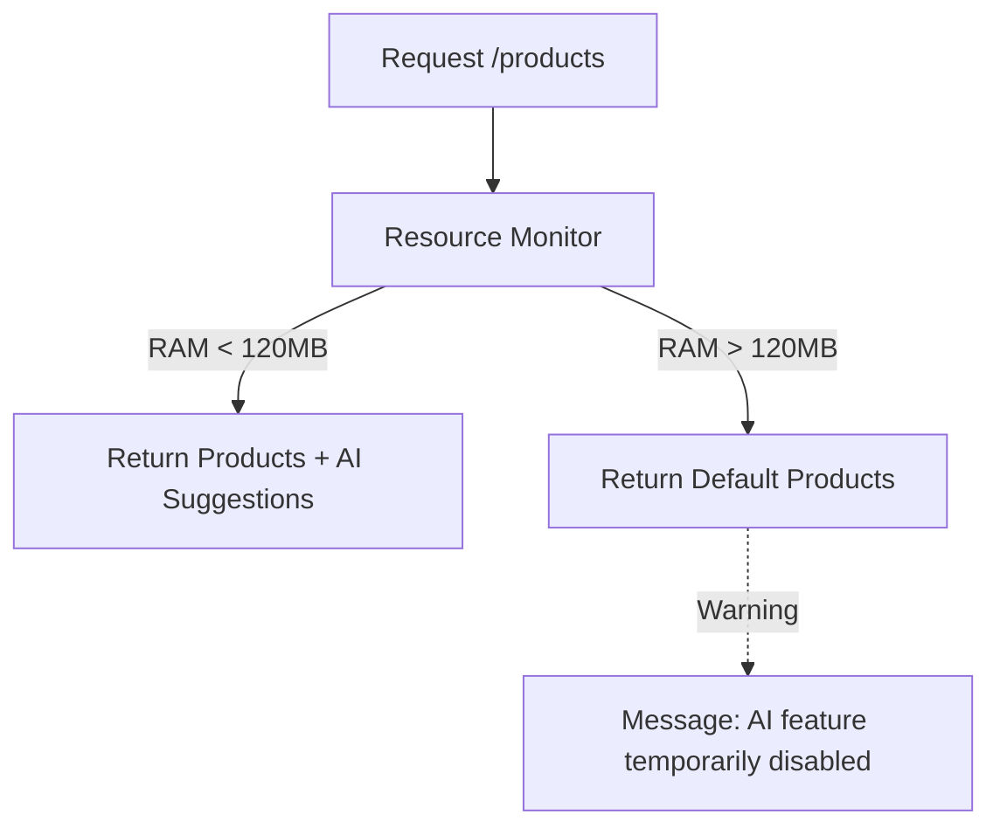

# title
Health Checks and Graceful Degradation

# description
Learn to use **Health Checks** to report system vitality and **Graceful Degradation** techniques to maintain core functionality when resources are depleted.

# body
## 1. Introduction
A "Resilient" system is not just one that never crashes, but one that knows how to "survive" in adversity. In modern architectures like **Kubernetes**, the fact that your service process is running does not necessarily mean it is serving well. If the **Database** is disconnected but the API still reports success (HTTP 200), you are deceiving the monitoring system.

This lesson will guide you through two survival techniques:
1.  **Health Checks:** Providing a standard endpoint (`/health`) so orchestrators know when to restart the application.
2.  **Graceful Degradation:** Proactively disabling non-essential, resource-intensive features (such as AI Recommendations or Advanced Search) when the server is overloaded to protect core functions.

## 2. Core Concepts
### 2.1. Health Checks: Liveness and Readiness
-   **Liveness:** Indicates if the application is still "alive." If this check fails, Kubernetes will kill the container and restart it.
-   **Readiness:** Indicates if the application is ready to receive traffic (e.g., has it finished connecting to the DB?).

### 2.2. Graceful Degradation: Sacrifice to Survive
When the system is resource-constrained (high RAM/CPU usage), instead of allowing the server to crash and making the website inaccessible to everyone, we apply a "graceful degradation" mechanism:
-   **Healthy State:** Returns full features (e.g., product list with personalized AI recommendations).
-   **Overloaded State:** Automatically disables AI and only returns a default product list from the Cache. The system remains operational; users can still buy products, even if the experience is slightly degraded.


*Figure 1: Graceful Degradation mechanism automatically adjusting features based on system health.*

## 2.2. Practice: Implementing Health Checks and Graceful Degradation
### 2.2.1. Codebase and Environment Setup
Reference Source: `3-health-checks-and-graceful-degradation`

```bash
# Step 1: Clone the demo repository
git clone https://github.com/StarCi-Academy/system-design-mastery-module-6-reliability-and-resilience-patterns.git

# Step 2: Navigate to the lesson directory
cd system-design-mastery-module-6-reliability-and-resilience-patterns/3-health-checks-and-graceful-degradation
```

### 2.2.2. Architecture and Components
-   **ecommerce-app (Port 3000):** Integrates the **Terminus** library for health checks and custom RAM monitoring logic for feature degradation.

| Component | Responsibility | Technology |
|---|---|---|
| **ecommerce-app** | Monitors resources and provides health endpoints | **NestJS**, **Terminus** |

### 2.2.3. Setup
Run the service with Docker:

```bash
# Step 0: create shared network (run once per machine)
docker network create starci-network

# Step 1: run the service
docker compose -f .docker/backend.yaml up -d --build

# Step 2: inspect logs
docker compose -f .docker/backend.yaml logs -f ecommerce-app
```

### 2.2.4. Testing
#### Scenario 1 — System Health Check
Step 1: Call the health endpoint.
```bash
curl -s http://localhost:3000/health
```
The response returns the status of components (RAM, DB):
```json
{
  "status": "ok",
  "info": {
    "memory_heap": { "status": "up" },
    "database": { "status": "up" }
  }
}
```

#### Scenario 2 — Triggering Graceful Degradation by Pumping RAM
Step 1: Check the product list when the system is normal.
```bash
curl -s http://localhost:3000/products
```
Response (With AI Suggestion):
```json
{
  "status": "success",
  "data": [
    { "id": 1, "name": "AI Suggestion - Premium Product" }
  ]
}
```

Step 2: Use the `stress-memory` API to consume RAM (each call allocates 50MB). Call it about 3 times.
```bash
curl -X POST http://localhost:3000/stress-memory
```

Step 3: Call the product list API again. The system now detects that RAM has exceeded the 120MB threshold.
```bash
curl -s http://localhost:3000/products
```
Response (Degraded Mode):
```json
{
  "status": "degraded",
  "message": "System is overloaded. AI Suggestion feature is temporarily disabled.",
  "data": [
    { "id": 1, "name": "Default Product A" }
  ]
}
```
*Conclusion: The system automatically protected itself by disabling heavy features, ensuring the server does not crash completely.*

### 2.2.5. Resource Cleanup
Stop the service:

```bash
docker compose -f .docker/backend.yaml down
```

## 3. Summary
### 3.1. Common Interview Questions
-   **Question 1: How do Liveness and Readiness differ in Kubernetes?**
    -   **Answer:** **Liveness** determines if a container is still alive (restarts if failed). **Readiness** determines if a container is ready to accept traffic (removed from the Load Balancer if failed).
-   **Question 2: When should Graceful Degradation be applied?**
    -   **Answer:** When the system has features that are "resource-intensive but not core." Examples include recommendation systems, advanced search, or notification emails.

# references
## 0
### alias
NestJS Terminus (Health Checks)
### url
https://docs.nestjs.com/recipes/terminus

# minutesRead
20
