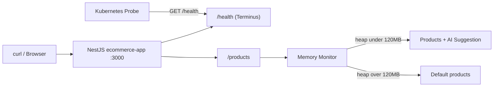
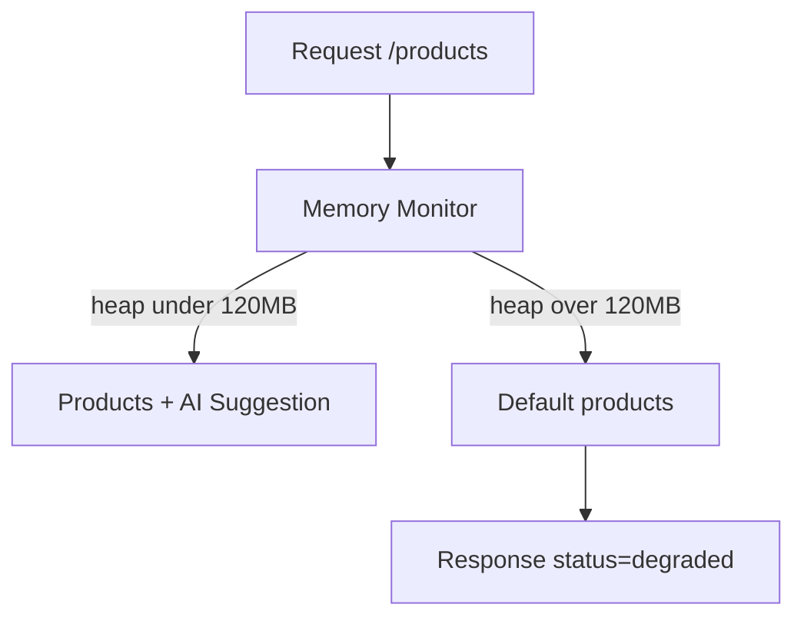

# title
Health Checks and Graceful Degradation

# description
This lesson explains how to use Health Checks to report service vitality in orchestrated systems such as Kubernetes, and how to apply Graceful Degradation to preserve core functionality when resources are constrained. The hands-on section demonstrates NestJS Terminus, Docker Compose, and a product endpoint that automatically degrades when RAM crosses a threshold.

# body

## 1. Opening

A **Senior Engineer** asks a **Mid-level** candidate: *"Your NestJS service runs fine inside Kubernetes, but how does the cluster decide when to restart the container versus simply removing it from the Load Balancer?"* The candidate answers they would configure **livenessProbe** and **readinessProbe** hitting `curl /health`, but does not yet distinguish the case where **Database** loses connectivity while the **Node.js** process stays alive — `/health` still returns HTTP 200, **Kubernetes** sees nothing wrong, yet clients get errors in bulk.

This lesson proceeds in two connected tracks:
- **Part 2.1**: **hands-on** and aligned with the GitHub repository; learners run a **NestJS** demo with **Terminus**, then verify `/health` behavior and `/products` auto-degradation under RAM pressure via three test flows.
- **Part 2.2**: **theory** reinforcing the difference between **Liveness** and **Readiness**, the core mechanics of **Graceful Degradation**, and common edge cases when services are overloaded or dependencies fail.
By the end, learners can distinguish **Liveness** vs **Readiness**, implement `/health` with **Terminus**, and reason about RAM-monitoring logic that temporarily disables non-core features in **NestJS**.

## 2. Core concepts

The lesson uses **practice-led theory**. First you run **Terminus** health checks and trigger **Graceful Degradation** by stressing heap memory, then verify responses against the demo API. Then the theory section organizes concepts and edge cases — mapping directly to what you observed in **section 2.1**.

### 2.1. Hands-on

#### 2.1.1. Prepare source code and environment

Goal: run `ecommerce-app` with `/health` (Terminus) and `/products` that applies Graceful Degradation based on heap RAM thresholds.

Source: [StarCi-Academy/system-design-mastery-module-6-reliability-and-resilience-patterns](https://github.com/StarCi-Academy/system-design-mastery-module-6-reliability-and-resilience-patterns) on GitHub — lesson directory: [`3-health-checks-and-graceful-degradation`](https://github.com/StarCi-Academy/system-design-mastery-module-6-reliability-and-resilience-patterns/tree/main/3-health-checks-and-graceful-degradation).

```bash
# Step 1: Clone the repository locally
git clone https://github.com/StarCi-Academy/system-design-mastery-module-6-reliability-and-resilience-patterns.git

# Step 2: Enter the lesson folder
cd system-design-mastery-module-6-reliability-and-resilience-patterns/3-health-checks-and-graceful-degradation
```

The repo already includes default values in **`ecommerce-app/.env`**, and **`ConfigModule`** reads those settings. When running through **Docker Compose** (`.docker/compose.yaml`), runtime variables come directly from `environment:` in Compose, so you do not need to create or edit **`.env`**. Edit **`.env`** only when running **`ecommerce-app`** directly on the host (`nest start`) or when changing default host/port/RAM-threshold values.

Stack: **Node.js**, **NestJS**, **Terminus**, **Docker**, **Docker Compose**.

#### 2.1.2. Architecture / components (stack + flow)

- **ecommerce-app:** a **NestJS** service exposing `/health`, `/products`, and `/stress-memory`. It uses **Terminus** for health checks and monitors `process.memoryUsage().heapUsed` to decide between AI Suggestion and default products.
- **3-health-checks-and-graceful-degradation network:** a Compose-managed network created for this lesson.

| Component | Host port | Role |
| --- | --- | --- |
| **ecommerce-app** | 3000 | Serves `/health`, `/products`, `/stress-memory`; runs **Graceful Degradation** logic with a 120MB heap threshold. |



Figure 1: Client requests /products through a heap monitor; Kubernetes probes /health to drive liveness/readiness decisions.

#### 2.1.3. Prerequisites and startup

##### 2.1.3.1. Prerequisites

- **Docker Engine** and **Docker Compose** v2.
- **Windows:** use **`Invoke-RestMethod`** / **`Invoke-WebRequest`** in PowerShell for HTTP requests.

##### 2.1.3.2. Start the stack

```bash
# Step 1: Keep terminal at lesson root (do not cd into .docker)
# .../3-health-checks-and-graceful-degradation

# Step 2: Start ecommerce-app using compose file in .docker
docker compose -f .docker/compose.yaml up -d

# Step 3: Tail logs to ensure service readiness
docker compose -f .docker/compose.yaml logs -f ecommerce-app
```

#### 2.1.4. Verification

**Three flows** validate **Terminus** on `/health`, **Graceful Degradation** on `/products`, and recovery behavior: **(1)** happy path **GET /health** returns `status=ok` for **memory_heap** and **database**; **(2)** multiple **POST /stress-memory** calls push heap above 120MB so **GET /products** switches to `status=degraded` and disables AI Suggestion; **(3)** container restart frees heap and **GET /products** returns to full AI Suggestion mode (advanced).

##### 2.1.4.1. Flow 1 — Happy path /health

- Step 1: Call the health endpoint.

  ```bash
  # Windows (PowerShell)
  Invoke-RestMethod -Uri http://localhost:3000/health

  # macOS / Linux
  # → Paste cURL into Postman: Import → Raw text
  curl -s http://localhost:3000/health
  ```

  Expected response (HTTP 200):

  ```json
  {
    "status": "ok",
    "info": {
      "memory_heap": { "status": "up" },
      "database": { "status": "up" }
    }
  }
  ```

  *If both indicators show `"status": "up"`:*

  - ***Terminus** aggregates **MemoryHealthIndicator** and **Database** indicator results into one response — matching `HealthController.check()` in `health.controller.ts`.*
  - *Both indicators at `up` support keeping the container in **Service / Load Balancer** via **Kubernetes readinessProbe**.*

##### 2.1.4.2. Flow 2 — Trigger Graceful Degradation

- Step 1: Check `/products` in normal conditions.

  ```bash
  # Windows (PowerShell)
  Invoke-RestMethod -Uri http://localhost:3000/products

  # macOS / Linux
  # → Paste cURL into Postman: Import → Raw text
  curl -s http://localhost:3000/products
  ```

  Expected response (HTTP 200):

  ```json
  {
    "status": "success",
    "data": [
      { "id": 1, "name": "AI Suggestion - Premium Product" },
      { "id": 2, "name": "AI Suggestion - Popular Product" }
    ]
  }
  ```

- Step 2: Pump RAM 3 times (each `stress-memory` call allocates roughly 50MB) to cross the 120MB heap threshold.

  ```bash
  # Windows (PowerShell)
  Invoke-RestMethod -Method Post -Uri http://localhost:3000/stress-memory
  Invoke-RestMethod -Method Post -Uri http://localhost:3000/stress-memory
  Invoke-RestMethod -Method Post -Uri http://localhost:3000/stress-memory

  # macOS / Linux
  # → Paste cURL into Postman: Import → Raw text
  curl -X POST http://localhost:3000/stress-memory
  curl -X POST http://localhost:3000/stress-memory
  curl -X POST http://localhost:3000/stress-memory
  ```

- Step 3: Call `/products` again.

  ```bash
  # Windows (PowerShell)
  Invoke-RestMethod -Uri http://localhost:3000/products

  # macOS / Linux
  # → Paste cURL into Postman: Import → Raw text
  curl -s http://localhost:3000/products
  ```

  Expected response (HTTP 200):

  ```json
  {
    "status": "degraded",
    "message": "System is overloaded. AI Suggestion feature is temporarily disabled.",
    "data": [
      { "id": 1, "name": "Default Product A" },
      { "id": 2, "name": "Default Product B" }
    ]
  }
  ```

  *If response switches to `"status": "degraded"` with default products:*

  - *The service monitors `process.memoryUsage().heapUsed`; beyond 120MB it skips AI Suggestion and returns cached defaults — matching the threshold logic in `app.service.ts`.*
  - *Users keep core functionality (view products), while non-core features are sacrificed to avoid full outage.*

##### 2.1.4.3. Flow 3 — Return to normal state (advanced)

- Step 1: Restart the container to release heap.

  ```bash
  # Windows (PowerShell)
  docker compose -f .docker/compose.yaml restart ecommerce-app

  # macOS / Linux
  docker compose -f .docker/compose.yaml restart ecommerce-app
  ```

- Step 2: Call `/products` again.

  ```bash
  # Windows (PowerShell)
  Invoke-RestMethod -Uri http://localhost:3000/products

  # macOS / Linux
  # → Paste cURL into Postman: Import → Raw text
  curl -s http://localhost:3000/products
  ```

  Expected response (HTTP 200):

  ```json
  {
    "status": "success",
    "data": [
      { "id": 1, "name": "AI Suggestion - Premium Product" },
      { "id": 2, "name": "AI Suggestion - Popular Product" }
    ]
  }
  ```

  *If response returns to `"status": "success"` with AI Suggestion products:*

  - *Once heap drops below threshold, monitoring logic in `app.service.ts` automatically re-enables AI Suggestion without code changes.*
  - *This informs stricter **Kubernetes livenessProbe** policies (for example restart when heap exceeds 200MB) when restart is preferred over degradation.*

#### 2.1.5. Cleanup

After completing the lesson, you can clean up resources to save memory.

```bash
# Stop and remove lesson containers + volumes
docker compose -f .docker/compose.yaml down -v
```

#### 2.1.6. Further reading

- **NestJS Terminus:** official **NestJS** health-check library with memory, db, and http indicators. ([NestJS Terminus Docs](https://docs.nestjs.com/recipes/terminus))
- **Kubernetes Probes:** official docs for **livenessProbe**, **readinessProbe**, **startupProbe**, and `httpGet`, `tcpSocket`, `exec` configuration. ([Kubernetes Probes Docs](https://kubernetes.io/docs/tasks/configure-pod-container/configure-liveness-readiness-startup-probes/))
- **Graceful Degradation pattern:** degraded-mode framing and relation to **Throttling** / **Bulkhead** in cloud architecture. ([Azure Architecture — Throttling](https://learn.microsoft.com/en-us/azure/architecture/patterns/throttling))
- **Node.js process.memoryUsage:** V8 heap metrics API used for service self-monitoring. ([Node.js Docs](https://nodejs.org/api/process.html#processmemoryusage))
- **TypeOrmHealthIndicator:** **Database** indicator in **Terminus** for `pingCheck` against **PostgreSQL**. ([NestJS Terminus — Database](https://docs.nestjs.com/recipes/terminus#database-health-check))

### 2.2. Theory — Health Checks and Graceful Degradation

#### 2.2.1. Health Checks: Liveness, Readiness, Startup

A **Health Check** endpoint (typically `/health`) reports whether a service is operating correctly. In **Kubernetes**, three probe types are common:

- **Liveness Probe:** checks whether a container is still alive. On failure, **Kubernetes** kills and restarts it.
- **Readiness Probe:** checks whether a container is ready for traffic. On failure, the container is removed from **Service / Load Balancer** but not restarted.
- **Startup Probe:** for slow-booting services; runs first to delay **Liveness** during startup.

Minimal **Terminus** example in **NestJS**:

```typescript
@Controller('health')
export class HealthController {
	constructor(
		private health: HealthCheckService,
		private memory: MemoryHealthIndicator,
		private db: TypeOrmHealthIndicator,
	) {}

	@Get()
	@HealthCheck()
	check() {
		return this.health.check([
			() => this.memory.checkHeap('memory_heap', 200 * 1024 * 1024),
			() => this.db.pingCheck('database'),
		])
	}
}
```

#### 2.2.2. Graceful Degradation

**Graceful Degradation** is a proactive strategy to disable resource-heavy non-core features under overload, preserving core user paths. Instead of full failure, the app detects thresholds (RAM, CPU, latency, downstream error rate) and switches to lighter execution branches.

Minimal **NestJS** example:

```typescript
@Get('products')
async getProducts() {
	const heapUsed = process.memoryUsage().heapUsed
	const THRESHOLD = 120 * 1024 * 1024

	if (heapUsed > THRESHOLD) {
		return {
			status: 'degraded',
			message: 'System is overloaded. AI Suggestion feature is temporarily disabled.',
			data: this.productService.getDefault(),
		}
	}

	return {
		status: 'success',
		data: await this.productService.getWithAiSuggestion(),
	}
}
```



Figure 2: Heap-based branching chooses full mode or degraded mode.

#### 2.2.3. Edge cases to internalize

- **/health returns 200 while business APIs still time out:** Health checks validate process liveness only and skip critical dependencies such as **Database**, **Redis**, or **Kafka**. The impact is that **Kubernetes** keeps routing traffic to a broken pod and client-side errors spike. **Mitigation:** split `/health/live` for **Liveness** (process-only) and `/health/ready` for **Readiness** (dependency-aware checks).
- **/products oscillates between success and degraded:** The RAM threshold is too close to normal operating usage, and **V8** GC cycles move heap usage around that boundary, causing response flicker. **Mitigation:** introduce **hysteresis** (different enter/exit thresholds) or use moving averages instead of instant heap readings.

## 3. Wrap-up

### 3.1. Common interview questions

- **Question 1:** How do **Liveness Probe** and **Readiness Probe** differ in **Kubernetes**?
  - What interviewers want: practical understanding of probe consequences, not just textbook definitions.
  - Sample short answer: **Liveness** checks if a container is alive; failure triggers **Kubernetes** restart. **Readiness** checks if a container is ready for traffic; failure removes it from **Service / Load Balancer** without restart. Example: fail **Readiness** during cache warm-up to block traffic; fail **Liveness** when memory leaks freeze the process so the pod restarts.

- **Question 2:** When should you apply **Graceful Degradation** instead of failing fast?
  - What interviewers want: ability to separate core and non-core product capabilities.
  - Sample short answer: Apply **Graceful Degradation** when features are resource-heavy but non-core, such as AI suggestions, advanced search, or notification emails. When RAM/CPU/latency exceeds thresholds, disable non-core branches while keeping checkout/login/payment alive. For strictly correct transactional operations (inventory write, ledger commit), fail-fast plus **Circuit Breaker** / **Retry** is usually safer than returning synthetic output.

- **Question 3:** Why can `/health` return 200 while **Database** is disconnected, and how do you fix it?
  - What interviewers want: depth in health-check design beyond endpoint existence.
  - Sample short answer: This happens when `/health` checks process liveness only and does not test dependencies. Fix with **Terminus** indicators such as **TypeOrmHealthIndicator.pingCheck**, **MemoryHealthIndicator.checkHeap**, and **HttpHealthIndicator.pingCheck**. Also split `/health/live` (process only) for **Liveness** and `/health/ready` (dependency-aware) for **Readiness**, so **Kubernetes** does not make wrong restart/routing decisions during transient DB issues.

# references
## 0
### alias
NestJS Terminus (Health Checks)
### url
https://docs.nestjs.com/recipes/terminus
## 1
### alias
Kubernetes Liveness, Readiness and Startup Probes
### url
https://kubernetes.io/docs/tasks/configure-pod-container/configure-liveness-readiness-startup-probes/
## 2
### alias
Microsoft Azure Architecture - Throttling pattern
### url
https://learn.microsoft.com/en-us/azure/architecture/patterns/throttling
## 3
### alias
Node.js process.memoryUsage
### url
https://nodejs.org/api/process.html#processmemoryusage

# minutesRead
20
