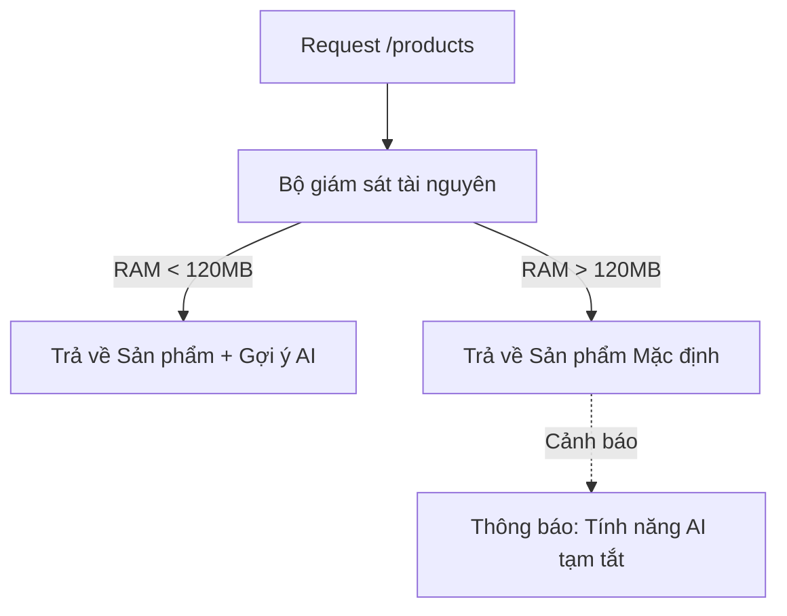

# title
Health Checks và Graceful Degradation (Suy giảm có kiểm soát)

# description
Học cách sử dụng **Health Checks** để thông báo trạng thái sống còn của hệ thống và kỹ thuật **Graceful Degradation** để duy trì các tính năng cốt lõi khi tài nguyên bị cạn kiệt.

# body
## 1. Lời mở đầu
Một hệ thống "trâu bò" (Resilient) không chỉ là hệ thống không bao giờ sập, mà là hệ thống biết cách "sinh tồn" trong nghịch cảnh. Trong các kiến trúc hiện đại như **Kubernetes**, việc service của bạn vẫn đang chạy (Process is running) không đồng nghĩa với việc nó đang phục vụ tốt. Nếu **Database** bị ngắt kết nối nhưng API vẫn báo thành công (HTTP 200), bạn đang lừa dối hệ thống giám sát.

Bài học này sẽ hướng dẫn bạn hai kỹ thuật sống còn:
1.  **Health Checks:** Cung cấp một endpoint chuẩn (`/health`) để các hệ thống điều phối biết khi nào cần khởi động lại ứng dụng.
2.  **Graceful Degradation:** Chủ động tắt bỏ các tính năng phụ tốn tài nguyên (như Gợi ý AI, Search nâng cao) khi server bị quá tải để bảo vệ các chức năng sống còn.

## 2. Các khái niệm cốt lõi
### 2.1. Health Checks: Liveness và Readiness
-   **Liveness:** Cho biết ứng dụng có còn "sống" hay không. Nếu kiểm tra thất bại, Kubernetes sẽ giết container và khởi động lại.
-   **Readiness:** Cho biết ứng dụng đã sẵn sàng nhận traffic chưa (ví dụ: đã kết nối xong DB chưa).

### 2.2. Graceful Degradation: Hy sinh để tồn tại
Khi hệ thống bị thiếu hụt tài nguyên (RAM/CPU tăng cao), thay vì để server sập nguồn và không ai vào được trang web, ta áp dụng cơ chế "suy giảm có kiểm soát":
-   **Trạng thái tốt:** Trả về đầy đủ tính năng (ví dụ: Danh sách sản phẩm kèm gợi ý cá nhân hóa từ AI).
-   **Trạng thái quá tải:** Tự động tắt AI, chỉ trả về danh sách sản phẩm mặc định từ Cache. Hệ thống vẫn chạy, người dùng vẫn mua được hàng, dù trải nghiệm có kém đi một chút.


*Hình 1: Cơ chế Graceful Degradation tự động điều chỉnh tính năng dựa trên sức khỏe hệ thống.*

## 2.2. Thực hành: Triển khai Health Check và Graceful Degradation
### 2.2.1. Chuẩn bị source code và môi trường
Source tham chiếu: `3-health-checks-and-graceful-degradation`

```bash
# Bước 1: Clone repository demo về máy local
git clone https://github.com/StarCi-Academy/system-design-mastery-module-6-reliability-and-resilience-patterns.git

# Bước 2: Di chuyển vào thư mục bài học
cd system-design-mastery-module-6-reliability-and-resilience-patterns/3-health-checks-and-graceful-degradation
```

### 2.2.2. Kiến trúc và các thành phần
-   **ecommerce-app (Port 3000):** Tích hợp thư viện **Terminus** để làm Health Check và logic tự giám sát RAM để hạ cấp tính năng.

| Thành phần | Trách nhiệm | Công nghệ |
|---|---|---|
| **ecommerce-app** | Giám sát tài nguyên và cung cấp endpoint sức khỏe | **NestJS**, **Terminus** |

### 2.2.3. Chuẩn bị
Khởi chạy dịch vụ bằng Docker:

```bash
# Bước 0: tạo network dùng chung (chỉ cần chạy một lần trên máy)
docker network create starci-network

# Bước 1: chạy service
docker compose -f .docker/backend.yaml up -d --build

# Bước 2: xem log
docker compose -f .docker/backend.yaml logs -f ecommerce-app
```

### 2.2.4. Kiểm thử
#### Luồng 1 — Kiểm tra sức khỏe hệ thống (Health Check)
Bước 1: Gọi endpoint sức khỏe.
```bash
curl -s http://localhost:3000/health
```
Response trả về trạng thái của các thành phần (RAM, DB):
```json
{
  "status": "ok",
  "info": {
    "memory_heap": { "status": "up" },
    "database": { "status": "up" }
  }
}
```

#### Luồng 2 — Kích hoạt Graceful Degradation bằng cách bơm RAM
Bước 1: Kiểm tra danh sách sản phẩm khi hệ thống bình thường.
```bash
curl -s http://localhost:3000/products
```
Response (Có AI Suggestion):
```json
{
  "status": "success",
  "data": [
    { "id": 1, "name": "AI Suggestion - Premium Product" }
  ]
}
```

Bước 2: Sử dụng API `stress-memory` để chiếm dụng RAM (mỗi lần gọi chiếm 50MB). Gọi khoảng 3 lần.
```bash
curl -X POST http://localhost:3000/stress-memory
```

Bước 3: Gọi lại API lấy sản phẩm. Lúc này hệ thống nhận thấy RAM đã vượt ngưỡng 120MB.
```bash
curl -s http://localhost:3000/products
```
Response (Chế độ dự phòng):
```json
{
  "status": "degraded",
  "message": "System is overloaded. AI Suggestion feature is temporarily disabled.",
  "data": [
    { "id": 1, "name": "Default Product A" }
  ]
}
```
*Kết luận: Hệ thống đã tự động bảo vệ mình bằng cách tắt tính năng nặng, giúp server không bị sập hoàn toàn.*

### 2.2.5. Dọn tài nguyên
Dừng dịch vụ:

```bash
docker compose -f .docker/backend.yaml down
```

## 3. Tổng kết
### 3.1. Các câu hỏi dễ bị phỏng vấn
-   **Câu hỏi 1: Liveness và Readiness khác nhau thế nào trong Kubernetes?**
    -   **Trả lời:** **Liveness** dùng để biết container còn sống không (nếu chết thì restart). **Readiness** dùng để biết container đã sẵn sàng nhận khách chưa (nếu chưa thì tách ra khỏi Load Balancer).
-   **Câu hỏi 2: Khi nào thì nên áp dụng Graceful Degradation?**
    -   **Trả lời:** Khi hệ thống có những tính năng "tiêu tốn tài nguyên nhưng không phải là cốt lõi". Ví dụ: Hệ thống tìm kiếm, Hệ thống gợi ý, Gửi email thông báo.

# references
## 0
### alias
NestJS Terminus (Health Checks)
### url
https://docs.nestjs.com/recipes/terminus

# minutesRead
20
