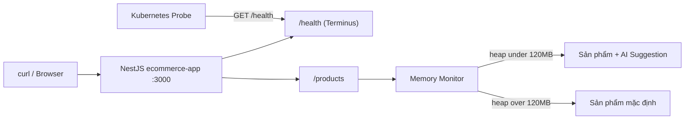
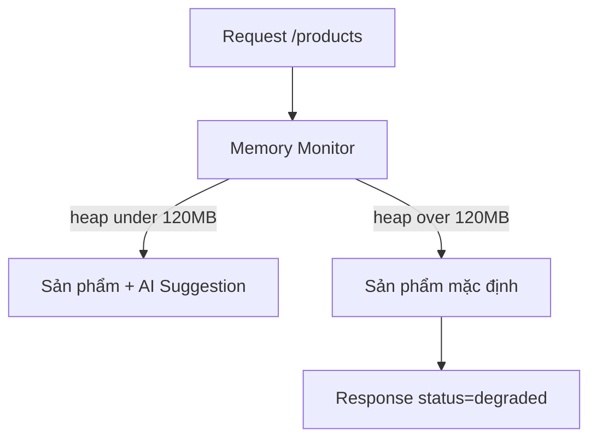

# title
Health Checks và Graceful Degradation

# description
Bài viết hướng dẫn cách dùng Health Checks để báo trạng thái sống còn của service trong các hệ thống điều phối như Kubernetes, cùng kỹ thuật Graceful Degradation để duy trì chức năng cốt lõi khi tài nguyên cạn kiệt. Phần thực hành minh hoạ với NestJS Terminus, Docker Compose và endpoint sản phẩm tự hạ cấp khi RAM vượt ngưỡng.

# body

## 1. Lời mở đầu

"Service NestJS của bạn đã chạy ổn trong Kubernetes, nhưng làm sao cluster biết khi nào cần restart container và khi nào chỉ cần tách container ra khỏi Load Balancer?" — một **Senior Engineer** đặt câu hỏi trong phiên phỏng vấn. Một **Mid-level Developer** trả lời: "Em sẽ cấu hình **livenessProbe** và **readinessProbe** gọi `curl /health` ạ." Câu trả lời đúng về công cụ, nhưng vẫn thiếu chiều sâu về trường hợp **Database** mất kết nối trong khi tiến trình **Node.js** vẫn còn sống — endpoint `/health` vẫn trả HTTP 200, **Kubernetes** không thấy bất thường nhưng client thì lỗi hàng loạt.

Bài này dẫn qua hai mạch liên tiếp. **Phần 2.1** là **thực hành** đồng bộ với repository trên GitHub; học viên clone repo, chạy demo **NestJS** với **Terminus**, rồi kiểm thử hành vi của `/health` và cơ chế tự hạ cấp của `/products` khi bơm RAM qua ba luồng kiểm thử. **Phần 2.2** làm rõ lý thuyết — sự khác biệt giữa **Liveness** và **Readiness**, nguyên lý **Graceful Degradation**, và các tình huống biên thường gặp khi service quá tải hoặc dependency lỗi. Mục tiêu sau bài là phân biệt rõ **Liveness** vs **Readiness**, thiết lập được `/health` với **Terminus**, và đọc được logic giám sát RAM để chủ động tắt tính năng phụ trong **NestJS**.

## 2. Các khái niệm cốt lõi

Cấu trúc bài học áp dụng phương pháp **Thực hành dẫn dắt Lý thuyết**. Khởi đầu, học viên sẽ trực tiếp chạy **Terminus** health checks và kích hoạt **Graceful Degradation** bằng cách bơm heap memory, rồi đối chiếu response với API demo. Tiếp theo, **phần lý thuyết** sẽ hệ thống hóa **các khái niệm cốt lõi** và các **edge cases** — giúp đối chiếu và củng cố trực tiếp những kết quả vừa thực nghiệm tại **phần 2.1**.

### 2.1. Thực hành

#### 2.1.1. Chuẩn bị source code và môi trường

Mục tiêu: chạy được service `ecommerce-app` có endpoint `/health` (Terminus) và endpoint `/products` áp dụng Graceful Degradation theo ngưỡng heap RAM.

Source: [StarCi-Academy/system-design-mastery-module-6-reliability-and-resilience-patterns](https://github.com/StarCi-Academy/system-design-mastery-module-6-reliability-and-resilience-patterns) trên GitHub — thư mục bài học: [`3-health-checks-and-graceful-degradation`](https://github.com/StarCi-Academy/system-design-mastery-module-6-reliability-and-resilience-patterns/tree/main/3-health-checks-and-graceful-degradation); **Docker Compose** và file hands-on nằm trong [`3-health-checks-and-graceful-degradation/.docker`](https://github.com/StarCi-Academy/system-design-mastery-module-6-reliability-and-resilience-patterns/tree/main/3-health-checks-and-graceful-degradation/.docker).

```bash
# Bước 1: Clone repository demo về máy local
git clone https://github.com/StarCi-Academy/system-design-mastery-module-6-reliability-and-resilience-patterns.git

# Bước 2: Vào thư mục bài học
cd system-design-mastery-module-6-reliability-and-resilience-patterns/3-health-checks-and-graceful-degradation
```

File **`ecommerce-app/.env`** trong repo đã có sẵn giá trị mặc định và **`ConfigModule`** đọc các biến cấu hình tương ứng. Khi service chạy qua **Docker Compose** (file `.docker/compose.yaml`), biến môi trường runtime được lấy trực tiếp từ `environment:` trong compose nên không cần tạo hay sửa **`.env`**. Chỉ chỉnh **`.env`** khi chạy **`ecommerce-app`** trực tiếp trên máy (**`nest start`**) hoặc khi cần đổi host / cổng / ngưỡng RAM khác mặc định.

Stack: **Node.js**, **NestJS**, **Terminus**, **Docker**, **Docker Compose**.

#### 2.1.2. Kiến trúc/thành phần (stack + luồng)

- **ecommerce-app:** service **NestJS** expose `/health`, `/products`, `/stress-memory`. Dùng **Terminus** cho health check; có service tự giám sát `process.memoryUsage().heapUsed` để quyết định trả AI Suggestion hay danh sách sản phẩm mặc định.
- **3-health-checks-and-graceful-degradation network:** network do Compose tự tạo cho riêng bài này.

| Thành phần | Cổng (Port) | Vai trò |
| --- | --- | --- |
| **ecommerce-app** | 3000 | Cung cấp `/health`, `/products`, `/stress-memory`; chạy logic **Graceful Degradation** theo ngưỡng heap 120MB. |



Hình 1: Client gọi /products đi qua bộ giám sát heap; Kubernetes probe gọi /health để quyết định liveness/readiness.

#### 2.1.3. Chuẩn bị & Khởi chạy

##### 2.1.3.1. Điều kiện cần trước

- **Docker Engine** và **Docker Compose** v2.
- **Windows:** dùng **`Invoke-RestMethod`** / **`Invoke-WebRequest`** trong PowerShell cho các lệnh HTTP.

##### 2.1.3.2. Khởi động stack

```bash
# Bước 1: Giữ terminal ở thư mục bài học (không cd vào .docker)
# .../3-health-checks-and-graceful-degradation

# Bước 2: Khởi chạy ecommerce-app bằng file compose trong .docker
docker compose -f .docker/compose.yaml up -d

# Bước 3: Theo dõi log để chắc chắn service đã sẵn sàng
docker compose -f .docker/compose.yaml logs -f ecommerce-app
```

#### 2.1.4. Kiểm thử

**3 luồng** kiểm thử xác nhận **Terminus** trên `/health`, cơ chế **Graceful Degradation** trên `/products`, và đường dẫn quay về trạng thái bình thường: **(1)** happy path **GET /health** trả `status=ok` cho **memory_heap** và **database**; **(2)** **POST /stress-memory** nhiều lần đẩy heap vượt ngưỡng 120MB, sau đó **GET /products** chuyển sang `status=degraded`, AI Suggestion bị tắt; **(3)** restart container giải phóng heap, rồi **GET /products** trở lại trạng thái đầy đủ AI Suggestion (luồng nâng cao).

##### 2.1.4.1. Luồng 1 — Happy path /health

- Bước 1: Gọi endpoint sức khỏe.

  ```bash
  # Windows (PowerShell)
  Invoke-RestMethod -Uri http://localhost:3000/health

  # macOS / Linux
  # → Dán cURL vào Postman: Import → Raw text
  curl -s http://localhost:3000/health
  ```

  Response phải trả về (HTTP 200):

  ```json
  {
    "status": "ok",
    "info": {
      "memory_heap": { "status": "up" },
      "database": { "status": "up" }
    }
  }
  ```

  *Kết luận: Nếu cả hai indicator đều hiển thị `"status": "up"`, hệ thống xác nhận:*

  - ***Terminus** tổng hợp kết quả của **MemoryHealthIndicator** và indicator **Database** thành response chung — khớp với `HealthController.check()` trong `health.controller.ts`.*
  - *Trạng thái `up` của cả hai indicator là điều kiện để **Kubernetes** **readinessProbe** giữ container trong **Service / Load Balancer**.*

##### 2.1.4.2. Luồng 2 — Kích hoạt Graceful Degradation

- Bước 1: Kiểm tra `/products` khi hệ thống bình thường.

  ```bash
  # Windows (PowerShell)
  Invoke-RestMethod -Uri http://localhost:3000/products

  # macOS / Linux
  # → Dán cURL vào Postman: Import → Raw text
  curl -s http://localhost:3000/products
  ```

  Response phải trả về (HTTP 200):

  ```json
  {
    "status": "success",
    "data": [
      { "id": 1, "name": "AI Suggestion - Premium Product" },
      { "id": 2, "name": "AI Suggestion - Popular Product" }
    ]
  }
  ```

- Bước 2: Bơm RAM 3 lần (mỗi lần `stress-memory` chiếm khoảng 50MB) để đẩy heap vượt ngưỡng 120MB.

  ```bash
  # Windows (PowerShell)
  Invoke-RestMethod -Method Post -Uri http://localhost:3000/stress-memory
  Invoke-RestMethod -Method Post -Uri http://localhost:3000/stress-memory
  Invoke-RestMethod -Method Post -Uri http://localhost:3000/stress-memory

  # macOS / Linux
  # → Dán cURL vào Postman: Import → Raw text
  curl -X POST http://localhost:3000/stress-memory
  curl -X POST http://localhost:3000/stress-memory
  curl -X POST http://localhost:3000/stress-memory
  ```

- Bước 3: Gọi lại `/products`.

  ```bash
  # Windows (PowerShell)
  Invoke-RestMethod -Uri http://localhost:3000/products

  # macOS / Linux
  # → Dán cURL vào Postman: Import → Raw text
  curl -s http://localhost:3000/products
  ```

  Response phải trả về (HTTP 200):

  ```json
  {
    "status": "degraded",
    "message": "System is overloaded. AI Suggestion feature is temporarily disabled.",
    "data": [
      { "id": 1, "name": "Default Product A" },
      { "id": 2, "name": "Default Product B" }
    ]
  }
  ```

  *Kết luận: Nếu response chuyển sang `"status": "degraded"` với danh sách sản phẩm mặc định, hệ thống xác nhận:*

  - *Service tự đo `process.memoryUsage().heapUsed`; vượt ngưỡng 120MB sẽ bỏ nhánh AI Suggestion, trả danh sách mặc định từ cache — khớp logic ngưỡng trong `app.service.ts`.*
  - *Người dùng vẫn dùng được chức năng cốt lõi (xem sản phẩm); hệ thống đánh đổi tính năng phụ để tránh sập hoàn toàn.*

##### 2.1.4.3. Luồng 3 — Quay lại trạng thái bình thường (luồng nâng cao)

- Bước 1: Restart container để giải phóng heap.

  ```bash
  # Windows (PowerShell)
  docker compose -f .docker/compose.yaml restart ecommerce-app

  # macOS / Linux
  docker compose -f .docker/compose.yaml restart ecommerce-app
  ```

- Bước 2: Gọi lại `/products`.

  ```bash
  # Windows (PowerShell)
  Invoke-RestMethod -Uri http://localhost:3000/products

  # macOS / Linux
  # → Dán cURL vào Postman: Import → Raw text
  curl -s http://localhost:3000/products
  ```

  Response phải trả về (HTTP 200):

  ```json
  {
    "status": "success",
    "data": [
      { "id": 1, "name": "AI Suggestion - Premium Product" },
      { "id": 2, "name": "AI Suggestion - Popular Product" }
    ]
  }
  ```

  *Kết luận: Nếu response trở lại `"status": "success"` với sản phẩm AI Suggestion, hệ thống xác nhận:*

  - *Sau khi heap về dưới ngưỡng, logic giám sát trong `app.service.ts` tự bật lại nhánh AI Suggestion mà không cần thay đổi code.*
  - *Đây là cơ sở để cấu hình **Kubernetes** **livenessProbe** ở mức nghiêm ngặt hơn (ví dụ heap vượt 200MB) khi muốn pod tự restart thay vì chỉ degrade.*

#### 2.1.5. Dọn tài nguyên

Sau khi kết thúc bài, bạn có thể dọn tài nguyên để tiết kiệm bộ nhớ. Trong thư mục **`.../3-health-checks-and-graceful-degradation`** (cùng nơi đã chạy **`docker compose up`**), chạy **`docker compose -f .docker/compose.yaml down -v`**: **`-v`** xóa **anonymous / named volumes** mà các service khai báo trong Compose project của bài này.

```bash
# Dừng và xóa container + volumes của bài học
docker compose -f .docker/compose.yaml down -v
```

#### 2.1.6. Đọc thêm

- **NestJS Terminus:** thư viện chính thức của **NestJS** để dựng `/health` với nhiều indicator như memory, db, http. ([NestJS Terminus Docs](https://docs.nestjs.com/recipes/terminus))
- **Kubernetes Probes:** tài liệu chính thức về **livenessProbe**, **readinessProbe**, **startupProbe** và cách cấu hình `httpGet`, `tcpSocket`, `exec`. ([Kubernetes Probes Docs](https://kubernetes.io/docs/tasks/configure-pod-container/configure-liveness-readiness-startup-probes/))
- **Graceful Degradation pattern:** mô tả cấp độ "degraded" và quan hệ với **Throttling**, **Bulkhead** trong kiến trúc cloud. ([Azure Architecture — Throttling](https://learn.microsoft.com/en-us/azure/architecture/patterns/throttling))
- **Node.js process.memoryUsage:** API đo heap của **V8**, cơ sở để self-monitor RAM trong service. ([Node.js Docs](https://nodejs.org/api/process.html#processmemoryusage))
- **TypeOrmHealthIndicator:** chỉ báo **Database** trong **Terminus**, dùng cho `pingCheck` xuống **PostgreSQL**. ([NestJS Terminus — Database](https://docs.nestjs.com/recipes/terminus#database-health-check))

### 2.2. Lý thuyết — Health Checks và Graceful Degradation

#### 2.2.1. Health Checks: Liveness, Readiness, Startup

**Health Check** *(kiểm tra sức khỏe)* là một endpoint chuẩn (thường là `/health`) cho biết service có đang hoạt động đúng hay không. Trong **Kubernetes** có ba loại probe phổ biến:

- **Liveness Probe:** kiểm tra container có còn "sống" hay không. Thất bại → **Kubernetes** giết và restart container.
- **Readiness Probe:** kiểm tra container đã sẵn sàng nhận traffic chưa. Thất bại → tách container khỏi **Service / Load Balancer** nhưng không restart.
- **Startup Probe:** dành cho service có thời gian boot dài; chạy đầu tiên để tạm hoãn **Liveness** trong giai đoạn khởi động.

Ví dụ tối giản với **Terminus** trong **NestJS**:

```typescript
@Controller('health')
export class HealthController {
	constructor(
		private health: HealthCheckService,
		private memory: MemoryHealthIndicator,
		private db: TypeOrmHealthIndicator,
	) {}

	@Get()
	@HealthCheck()
	check() {
		return this.health.check([
			() => this.memory.checkHeap('memory_heap', 200 * 1024 * 1024),
			() => this.db.pingCheck('database'),
		])
	}
}
```

#### 2.2.2. Graceful Degradation

**Graceful Degradation** *(suy giảm có kiểm soát)* là chiến lược chủ động tắt các tính năng phụ tốn tài nguyên khi hệ thống bị quá tải, để giữ chức năng cốt lõi tiếp tục phục vụ. Thay vì để toàn bộ service sập, ứng dụng phát hiện ngưỡng (RAM, CPU, latency, error rate phía downstream) rồi chuyển sang nhánh xử lý nhẹ hơn.

Ví dụ tối giản trong **NestJS**:

```typescript
@Get('products')
async getProducts() {
	const heapUsed = process.memoryUsage().heapUsed
	const THRESHOLD = 120 * 1024 * 1024

	if (heapUsed > THRESHOLD) {
		return {
			status: 'degraded',
			message: 'System is overloaded. AI Suggestion feature is temporarily disabled.',
			data: this.productService.getDefault(),
		}
	}

	return {
		status: 'success',
		data: await this.productService.getWithAiSuggestion(),
	}
}
```



Hình 2: Logic chia nhánh dựa trên heap để chọn nhánh đầy đủ hay nhánh degrade.

#### 2.2.3. Các trường hợp biên (edge cases) cần lưu ý

- **/health trả 200 nhưng luồng nghiệp vụ vẫn timeout:** Health check chỉ kiểm tra tiến trình còn chạy mà không kiểm tra dependency quan trọng như **Database**, **Redis**, **Kafka**. Hệ quả là **Kubernetes** không restart, traffic vẫn đổ vào pod lỗi và error rate phía client tăng mạnh. **Giải pháp:** tách `/health/live` cho **Liveness** (process-only) và `/health/ready` cho **Readiness** (kèm dependency checks).
- **/products dao động liên tục giữa success và degraded:** Ngưỡng RAM đặt sát mức sử dụng thực tế, cộng với chu kỳ GC của **V8** làm heap nhảy quanh ngưỡng nên response bị "nhấp nháy". **Giải pháp:** thêm **hysteresis** (ngưỡng bật/tắt khác nhau) hoặc dùng trung bình trượt thay vì đo tức thời.

## 3. Tổng kết

### 3.1. Các câu hỏi dễ bị phỏng vấn

- **Câu hỏi 1:** **Liveness Probe** và **Readiness Probe** trong **Kubernetes** khác nhau ra sao?
  - Ý interviewer muốn nghe: hiểu hậu quả thực tế của từng loại probe, không chỉ học vẹt định nghĩa.
  - Trả lời mẫu (ngắn): **Liveness** kiểm tra container còn sống không; thất bại → **Kubernetes** restart container. **Readiness** kiểm tra container đã sẵn sàng nhận traffic chưa; thất bại → container bị tách khỏi **Service / Load Balancer** nhưng không bị restart. Ví dụ khi service đang warm-up cache, dùng **Readiness** fail để chặn traffic; khi memory leak khiến tiến trình treo, dùng **Liveness** fail để pod được restart.

- **Câu hỏi 2:** Khi nào nên áp dụng **Graceful Degradation** thay vì để hệ thống fail nhanh?
  - Ý interviewer muốn nghe: khả năng phân loại tính năng cốt lõi và tính năng phụ trong sản phẩm thực.
  - Trả lời mẫu (ngắn): Áp dụng **Graceful Degradation** khi service có những tính năng "tốn tài nguyên nhưng không phải core" — ví dụ AI Suggestion, search nâng cao, gửi email thông báo. Khi RAM/CPU/latency vượt ngưỡng, ta tắt nhánh phụ và giữ luồng mua hàng / đăng nhập / thanh toán hoạt động. Ngược lại, với chức năng bắt buộc đúng nghiệp vụ (trừ kho, ghi giao dịch), nên fail nhanh và để **Circuit Breaker** / **Retry** xử lý hơn là trả dữ liệu giả.

- **Câu hỏi 3:** Endpoint `/health` trả 200 nhưng **Database** đã mất kết nối — vì sao và xử lý thế nào?
  - Ý interviewer muốn nghe: chiều sâu khi thiết kế health check, không chỉ "có endpoint là xong".
  - Trả lời mẫu (ngắn): Lỗi này xảy ra khi `/health` chỉ kiểm tra tiến trình còn chạy mà không gọi xuống các dependency. Cách xử lý: dùng **Terminus** với nhiều indicator như **TypeOrmHealthIndicator.pingCheck**, **MemoryHealthIndicator.checkHeap**, **HttpHealthIndicator.pingCheck**. Đồng thời tách `/health/live` (chỉ kiểm tra process) cho **Liveness** và `/health/ready` (kiểm tra cả dependency) cho **Readiness**, để **Kubernetes** không restart nhầm container chỉ vì DB tạm gián đoạn.

# references
## 0
### alias
NestJS Terminus (Health Checks)
### url
https://docs.nestjs.com/recipes/terminus
## 1
### alias
Kubernetes Liveness, Readiness and Startup Probes
### url
https://kubernetes.io/docs/tasks/configure-pod-container/configure-liveness-readiness-startup-probes/
## 2
### alias
Microsoft Azure Architecture - Throttling pattern
### url
https://learn.microsoft.com/en-us/azure/architecture/patterns/throttling
## 3
### alias
Node.js process.memoryUsage
### url
https://nodejs.org/api/process.html#processmemoryusage

# minutesRead
20
