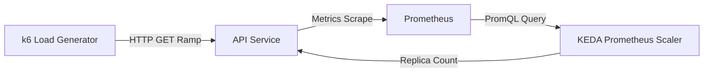

# title
Tư duy về Scaling

# description
Thực hành autoscaling trên Kubernetes với HPA, VPA và KEDA kết hợp Prometheus. Triển khai NestJS API Service với k6 Load Generator, kiểm thử 3 luồng scaling: resource-based (HPA), right-sizing (VPA) và event-driven (KEDA + RPS).

# body

## 1. Lời mở đầu

*"Hệ thống xử lý đơn hàng bị nghẽn nghiêm trọng trong ngày Flash Sale, CPU server luôn duy trì ở mức 100%. Em sẽ thiết lập cơ chế tự động mở rộng như thế nào?"* — một **Senior Engineer** đặt câu hỏi. Một **Mid-level Developer** trả lời: *"Em sẽ cấu hình autoscaler để khi CPU chạm ngưỡng 80% thì hệ thống tự động thêm server."* Câu trả lời đúng về công cụ nhưng thiếu chiều sâu về **Scaling strategy**: **CPU** là tín hiệu trễ và mơ hồ (**lagging & ambiguous signal**) — CPU cao không nhất thiết đồng nghĩa với throughput nghiệp vụ đang tăng, ví dụ vòng lặp vô tận cũng đốt hết CPU mà request không đổi.

Bài học này triển khai **Kubernetes Autoscaling** thông qua 2 phần:
- **Phần 2.1**: **thực hành** triển khai **NestJS** API Service + **k6 Load Generator** trên **Kubernetes**, kiểm thử qua 3 luồng: **HPA** (resource-based), **VPA** (right-sizing) và **KEDA + Prometheus** (event-driven RPS).
- **Phần 2.2**: **lý thuyết** hệ thống hóa **HPA vs VPA vs KEDA**, **rate vs increase**, **threshold design** và các edge cases.

Sau bài học, bạn sẽ phân biệt rõ khi nào dùng metric tài nguyên, khi nào dùng metric nghiệp vụ để scaling.

## 2. Các khái niệm cốt lõi

Cấu trúc bài học áp dụng phương pháp **Thực hành dẫn dắt Lý thuyết**. Khởi đầu, học viên clone repo, cài đặt operators qua Helm, triển khai 3 kịch bản scaling và quan sát hành vi autoscaler. Tiếp theo, **phần lý thuyết** sẽ hệ thống hóa **HPA**, **VPA**, **KEDA** và edge cases — giúp đối chiếu và củng cố trực tiếp những kết quả vừa thực nghiệm tại **phần 2.1**.

### 2.1. Thực hành

#### 2.1.1. Chuẩn bị source code và môi trường

Mục đích: chạy đúng stack đã được định nghĩa trong manifests Kubernetes của repository (NestJS API Service, k6 Load Generator, Prometheus, KEDA).

Source: [StarCi-Academy/system-design-mastery-module-5-scalability-and-performance](https://github.com/StarCi-Academy/system-design-mastery-module-5-scalability-and-performance) trên GitHub — thư mục bài học: [`0-the-scaling-mindset`](https://github.com/StarCi-Academy/system-design-mastery-module-5-scalability-and-performance/tree/main/0-the-scaling-mindset).

```bash
# Bước 1: Clone repository về máy local
git clone https://github.com/StarCi-Academy/system-design-mastery-module-5-scalability-and-performance.git

# Bước 2: Vào thư mục bài học
cd system-design-mastery-module-5-scalability-and-performance/0-the-scaling-mindset
```

#### 2.1.2. Kiến trúc/thành phần (stack + luồng)

- **k6 Load Generator:** Deployment dùng image **k6** chạy kịch bản load test từ **ConfigMap**. Tạo tải ramp-up tới **api-service**.
- **API Service (:3000):** NestJS app phục vụ HTTP và export **metrics** endpoint. **Prometheus** thu thập metrics từ service này.
- **Prometheus (:9090):** Lưu trữ metrics theo thời gian để **KEDA** truy vấn qua **PromQL**.
- **KEDA:** Tự động điều chỉnh số replica của **api-service** dựa trên kết quả truy vấn **Prometheus**.

| Thành phần | Cổng (Port) | Vai trò |
|---|---|---|
| k6 Load Generator | — | Tạo tải giả lập |
| API Service | 3000 | Xử lý request + export metrics |
| Prometheus | 9090 | Thu thập và lưu trữ metrics |
| KEDA | — | Điều phối scaling |



Hình 1: **k6** tạo tải HTTP lên **api-service**; **Prometheus** thu thập metrics; **KEDA** phân tích dữ liệu và scale ngang **api-service**.

#### 2.1.3. Chuẩn bị & khởi chạy

##### 2.1.3.1. Điều kiện cần trước

- **Docker Desktop** / **Docker Engine**.
- **Minikube**, CLI **kubectl** và **Helm** đã cài đặt.

##### 2.1.3.2. Khởi động stack

```bash
# Bước 1: Khởi tạo cluster Minikube (bắt buộc trước khi chạy Kubernetes)
minikube start --driver=docker

# Bước 2: Thêm Helm repos cho KEDA và VPA
helm repo add kedacore https://kedacore.github.io/charts
helm repo add fairwinds-stable https://charts.fairwinds.com/stable

# Bước 3: Cập nhật metadata chart
helm repo update

# Bước 4: Cài đặt Bitnami Prometheus (OCI chart)
helm install prometheus oci://registry-1.docker.io/bitnamicharts/prometheus -f .helm/prometheus/values.yaml

# Bước 5: Cài đặt KEDA và VPA operators
helm install keda kedacore/keda -f .helm/keda/values.yaml
helm install vpa fairwinds-stable/vpa

# Bước 6: Cài đặt Metrics Server (bắt buộc cho HPA)
kubectl apply -f https://github.com/kubernetes-sigs/metrics-server/releases/latest/download/components.yaml

# Bước 7: Patch TLS cho môi trường Local (Docker Desktop/Minikube)
kubectl patch deployment metrics-server -n kube-system --type='json' -p='[{"op": "add", "path": "/spec/template/spec/containers/0/args/-", "value": "--kubelet-insecure-tls"}]'
```

Đợi tất cả Pods chuyển sang trạng thái **Running**:

```bash
kubectl get pods -w
```

#### 2.1.4. Kiểm thử

3 luồng kiểm thử 3 chiến lược autoscaling khác nhau:
- **Luồng 1:** Scaling theo tài nguyên (**HPA** — CPU threshold).
- **Luồng 2:** Tối ưu kích cỡ Pod (**VPA** — right-sizing).
- **Luồng 3:** Scaling theo sự kiện (**KEDA** + **Prometheus** RPS) — **nâng cao**.

##### 2.1.4.1. Luồng 1 — Scaling theo tài nguyên với HPA

- Bước 1: Triển khai API Service và cấu hình HPA (ngưỡng 10% CPU).

  ```bash
  kubectl apply -f .kubernetes/1-hpa/
  ```

- Bước 2: Kiểm tra trạng thái HPA ban đầu.

  ```bash
  kubectl get hpa api-service-hpa
  ```

  Kết quả trả về trên terminal:

  ```text
  NAME              REFERENCE                TARGETS   MINPODS   MAXPODS   REPLICAS
  api-service-hpa   Deployment/api-service   0%/10%    1         5         1
  ```

- Bước 3: Theo dõi HPA tự động tăng replica khi có tải.

  ```bash
  kubectl get hpa api-service-hpa -w
  ```

  Kết quả trả về trên terminal:

  ```text
  NAME              REFERENCE                TARGETS    MINPODS   MAXPODS   REPLICAS
  api-service-hpa   Deployment/api-service   15%/10%    1         5         1
  api-service-hpa   Deployment/api-service   45%/10%    1         5         4
  api-service-hpa   Deployment/api-service   20%/10%    1         5         5
  ```

- Bước 4: Gỡ bỏ tài nguyên HPA.

  ```bash
  kubectl delete -f .kubernetes/1-hpa/
  ```

*Kết luận: Nếu replica tự động tăng, hệ thống xác nhận:*

- *Phản ứng tức thời nhờ behavior config — `stabilizationWindowSeconds: 0` bỏ qua thời gian chờ 5 phút mặc định.*
- *Hạn chế reactive của HPA — HPA chỉ thêm Pod khi tài nguyên đã tiệm cận giới hạn, luôn có độ trễ so với áp lực thực tế.*

##### 2.1.4.2. Luồng 2 — Tối ưu kích cỡ Pod với VPA

- Bước 1: Triển khai API Service và VPA (chế độ Auto).

  ```bash
  kubectl apply -f .kubernetes/2-vpa/
  ```

- Bước 2: Kiểm tra mức tiêu thụ tài nguyên lúc nhàn rỗi.

  ```bash
  kubectl top pods -l app=api-service
  ```

  Kết quả trả về trên terminal:

  ```text
  NAME                           CPU(cores)   MEMORY(bytes)
  api-service-6d545bb767-4s4np   5m           34Mi
  api-service-6d545bb767-whcll   5m           34Mi
  ```

- Bước 3: Kiểm tra Requests phần cứng đang được cấp phát tĩnh.

  ```bash
  kubectl describe pod -l app=api-service | grep -A 2 Requests
  ```

  Kết quả trả về trên terminal:

  ```text
  Requests:
    cpu:      10m
    memory:   64Mi
  ```

- Bước 4: Kích hoạt k6 phát tải cho VPA Recommender.

  ```bash
  kubectl scale deployment k6-vpa-load-generator --replicas=1
  ```

- Bước 5: Kiểm tra khuyến nghị từ VPA sau 3–5 phút.

  ```bash
  kubectl describe vpa api-service-vpa
  ```

  Kết quả trả về trên terminal (phần **Recommendation**):

  ```text
  Recommendation:
    Target:
      Cpu:     1101m
      Memory:  100Mi
  ```

- Bước 6: Gỡ bỏ tài nguyên VPA.

  ```bash
  kubectl delete -f .kubernetes/2-vpa/
  ```

*Kết luận: Nếu VPA Recommender cập nhật target, hệ thống xác nhận:*

- *Phát hiện Resource Drift — VPA nhận diện ứng dụng cần CPU cao gấp 100 lần (1000m) so với mức khai báo (10m).*
- *Right-sizing tự động — VPA Recommender thu thập đúng chu kỳ tải và tự động cập nhật Requests ở chế độ Auto.*
- *Tối ưu chi phí — VPA đề xuất giảm Memory xuống 100Mi dựa trên mức sử dụng thực tế thấp (38Mi).*

##### 2.1.4.3. Luồng 3 — Event-driven Scaling với KEDA và Prometheus

- Bước 1: Triển khai toàn bộ stack KEDA bao gồm ScaledObject.

  ```bash
  kubectl apply -f .kubernetes/3-keda/
  ```

- Bước 2: Kích hoạt k6 phát tải mô phỏng traffic thực tế (ramp-up lên 1000 RPS).

  ```bash
  kubectl scale deployment k6-load-generator --replicas=1
  ```

- Bước 3: Theo dõi diễn biến Scale-out. Truy cập **http://localhost:9090** và nhập query `sum by (app) (rate(http_requests_total{app="api-service"}[1m]))`.

  ```bash
  kubectl get pods -l app=api-service -w
  ```

  Kết quả trả về trên terminal:

  ```text
  NAME                           READY   STATUS    RESTARTS   AGE
  api-service-6d545bb767-px2f4   1/1     Running   0          5m
  api-service-6d545bb767-vj8k2   0/1     Pending   0          2s
  ```

- Bước 4: Gỡ bỏ tài nguyên KEDA.

  ```bash
  kubectl delete -f .kubernetes/3-keda/
  ```

*Kết luận: Nếu Pod tăng khi RPS chạm ngưỡng, hệ thống xác nhận:*

- *Proactive Scaling — KEDA khởi tạo Pod tăng cường ngay khi traffic chạm mốc RPS, đi trước việc cạn kiệt tài nguyên.*
- *Tối ưu tài nguyên thông minh — Scale-to-Min + CooldownPeriod giải phóng tài nguyên khi nhu cầu giảm.*

#### 2.1.5. Dọn tài nguyên

Sau khi kết thúc bài, bạn có thể dọn tài nguyên để tiết kiệm bộ nhớ.

```bash
kubectl delete -f .kubernetes/1-hpa/
kubectl delete -f .kubernetes/2-vpa/
kubectl delete -f .kubernetes/3-keda/
helm uninstall prometheus
helm uninstall keda
helm uninstall vpa
```

#### 2.1.6. Đọc thêm

- **KEDA Prometheus scaler:** Tham số `query`, `threshold`, `serverAddress` và hành vi so sánh giá trị scalar. ([KEDA Prometheus scaler](https://keda.sh/docs/latest/scalers/prometheus/))
- **Prometheus rate function:** Tài liệu hàm `rate` và `increase` để tránh nhầm đơn vị khi đặt ngưỡng. ([Prometheus query basics](https://prometheus.io/docs/prometheus/latest/querying/basics/))
- **Kubernetes HPA:** Cách cấu hình `behavior`, `stabilizationWindowSeconds` và custom metrics. ([Kubernetes HPA docs](https://kubernetes.io/docs/tasks/run-application/horizontal-pod-autoscale/))
- **VPA:** Right-sizing recommendation modes và integration với admission controller. ([VPA GitHub](https://github.com/kubernetes/autoscaler/tree/master/vertical-pod-autoscaler))

### 2.2. Lý thuyết — Autoscaling Strategies

#### 2.2.1. HPA (Horizontal Pod Autoscaler)

**HPA** thay đổi số lượng **replica** dựa trên mức bão hòa tài nguyên (CPU/Memory). Là lựa chọn tiêu chuẩn khi bottleneck liên quan trực tiếp đến phần cứng. Hạn chế: tín hiệu **reactive** — chỉ scale khi tài nguyên đã tiệm cận giới hạn.

#### 2.2.2. VPA (Vertical Pod Autoscaler)

**VPA** phân tích dữ liệu sử dụng quá khứ để khuyến nghị **requests/limits** tối ưu cho mỗi Pod. Giúp right-sizing trước khi scale ngang — tránh lãng phí tài nguyên hoặc OOMKill do cấu hình sai.

#### 2.2.3. KEDA (Kubernetes Event-driven Autoscaling)

**KEDA** cho phép scale dựa trên sự kiện bên ngoài hoặc metrics chi tiết (RPS, queue depth, v.v.). Sử dụng **ScaledObject** liên kết với **Prometheus** scaler, KEDA cung cấp tín hiệu **proactive** — scale ngay khi traffic tăng, không chờ tài nguyên cạn kiệt.

#### 2.2.4. rate vs increase trong Prometheus

- `rate(counter[interval])`: tốc độ tăng trung bình mỗi giây → khớp nghĩa "requests per second".
- `increase(counter[interval])`: tổng tăng tuyệt đối trong khoảng thời gian → phản ánh quá khứ, không phải áp lực hiện tại.

Khi đặt threshold cho **KEDA ScaledObject**, luôn dùng `rate` nếu ngưỡng tính theo "per second".

#### 2.2.5. Các trường hợp biên (edge cases) cần lưu ý

- **Metric gap (Prometheus restart):** Prometheus restart → mất dữ liệu metrics → KEDA không có dữ liệu để quyết định. **Giải pháp:** Prometheus HA (thanos/cortex) hoặc fallback về HPA CPU.
- **Thrashing (scale flap):** Scale-up và scale-down liên tục do metric dao động quanh threshold. **Giải pháp:** tăng `stabilizationWindowSeconds`, cấu hình `cooldownPeriod` trong KEDA.
- **VPA eviction storm:** VPA mode Auto evict Pod để áp dụng recommendation mới → nhiều Pod restart cùng lúc. **Giải pháp:** dùng VPA mode `Off` hoặc `Initial` + apply thủ công, hoặc chạy đủ replicas (minReplicas ≥ 2) để tránh downtime.
- **CPU spike không do traffic:** Infinite loop, GC pressure, hoặc background job đốt CPU → HPA scale-up vô nghĩa. **Giải pháp:** dùng KEDA + business metric (RPS) thay vì CPU thuần.

## 3. Tổng kết

### 3.1. Các câu hỏi dễ bị phỏng vấn

- **Câu hỏi 1:** Khi nào nên scale bằng **KEDA** (RPS) và khi nào **HPA** (CPU) là đủ?
  - Ý interviewer muốn nghe: Phân biệt metric chủ động (RPS) và metric trễ (CPU).
  - Trả lời mẫu (ngắn): Khi **SLO** gắn với throughput hoặc queue depth, **KEDA** đọc **Prometheus** gần với tải thật hơn CPU thuần. **HPA** CPU phù hợp khi bottleneck là xử lý đồng bộ và CPU phản ánh đúng áp lực.

- **Câu hỏi 2:** VPA khác HPA cơ bản thế nào?
  - Ý interviewer muốn nghe: Vertical vs Horizontal scaling.
  - Trả lời mẫu (ngắn): **VPA** tối ưu **requests/limits** trên từng Pod (chiều dọc). **HPA** thay đổi số Pod (chiều ngang). Thường dùng VPA để right-size trước, rồi HPA/KEDA để scale ngang.

- **Câu hỏi 3:** Vì sao ScaledObject Prometheus dùng `rate` thay cho `increase`?
  - Ý interviewer muốn nghe: Đơn vị đo lường vận tốc (per second).
  - Trả lời mẫu (ngắn): `rate` ước lượng tốc độ tăng counter theo giây → threshold 1000 nghĩa là ~1000 request/giây. `increase` trả tổng tuyệt đối trong khoảng thời gian, không khớp đơn vị per-second.

### 3.2. Khắc phục sự cố (Troubleshooting)

- **Lỗi `/health` trả 404 và JSON `Cannot POST /health`:** Đây là do bạn đang gọi bằng phương thức **POST**. Hãy đổi sang **GET** (ví dụ: `curl -X GET http://localhost:3000/health`).
- **Lỗi Metrics Server không lấy được dữ liệu:** Đảm bảo bạn đã áp dụng lệnh patch `--kubelet-insecure-tls` trong bước khởi chạy nếu chạy trên môi trường local (Docker Desktop/Minikube).
- **KEDA không scale Pod:** Kiểm tra kết nối giữa KEDA và Prometheus. Bạn có thể dùng `kubectl logs` của pod `keda-operator` (trong namespace `keda`) để xem lỗi truy vấn PromQL.
- **VPA không đưa ra Recommendation:** VPA cần ít nhất 3-5 phút quan sát. Hãy đảm bảo bạn đã phát tải đủ lâu bằng k6. Đừng vội vã.

# references
## 0
### alias
KEDA Concepts
### url
https://keda.sh/docs/latest/concepts/
## 1
### alias
KEDA Prometheus scaler
### url
https://keda.sh/docs/latest/scalers/prometheus/
## 2
### alias
Kubernetes HPA
### url
https://kubernetes.io/docs/tasks/run-application/horizontal-pod-autoscale/
## 3
### alias
Vertical Pod Autoscaler
### url
https://github.com/kubernetes/autoscaler/tree/master/vertical-pod-autoscaler
## 4
### alias
Prometheus query basics
### url
https://prometheus.io/docs/prometheus/latest/querying/basics/

# minutesRead
30
