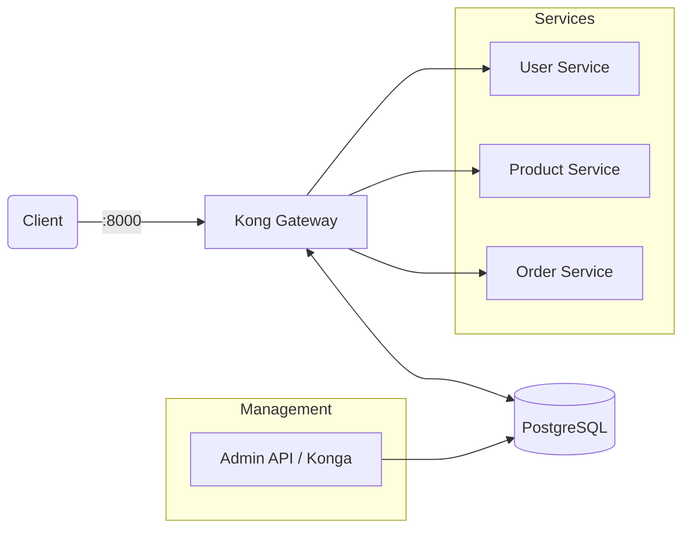

# Công thức prompt ra nội dung của StarCi Academy

# **Công thức prompt ra nội dung của StarCi Academy**

## **System Instruction**

- Sử dụng giọng văn trung lập, tránh các từ mang tính khẩu ngữ hoặc hình ảnh như “nhai”, “nghiền”. Dùng tiếng phổ thông.
- Các thuật ngữ IT words (ví dụ: **Database, CAP Theorem, Cassandra, Sharding, Replication, Load Balancer**, v.v.) phải được in đậm và không dịch sang tiếng Việt.
- Riêng trường `# description` phải là plain string, không dùng markdown (không `**bold**`, không link, không code inline).
- Nội dung được tổng hợp và tham chiếu từ nhiều nguồn khác nhau, bao gồm các bài viết công nghệ, **GitHub**, và các hệ thống thực tế ở quy mô lớn.
- **In ra kế hoạch tổng thể trước, chốt rồi mới làm tiếp.**
- Màu đen biểu thị template, màu tím biểu thị định hướng, và màu đỏ biểu thị ví dụ.

---

## **Đầu vào từ người nhập**

### **1. Key takeaways**

- Nhập danh sách Key Takeaways gồm các thuật ngữ IT (ví dụ: **Database, CAP Theorem, Cassandra, Sharding, Replication, Load Balancer**, v.v.) để AI hiểu nội dung sẽ xoay quanh những chủ đề gì.

### **2. Tên khóa học**

Tùy theo tên khóa học, AI điều chỉnh cách trình bày cho phù hợp:

- **Fullstack Mastery:** Nội dung được xây dựng bởi một fullstack developer, có hiểu biết sâu về phát triển API và frontend, với mục tiêu hướng đến việc làm chủ monolithic application.
- **System Design Mastery:** Nội dung được xây dựng bởi một solution architect, có hiểu biết về trade-off trong hệ thống, cách thiết kế hệ thống lớn và các công nghệ liên quan như Kubernetes (K8S).

---

## **Kế hoạch tổng thể (in ra trước)**

1. Xác nhận bối cảnh (tên khóa học) và danh sách **Key takeaways**.
2. Viết **Lời mở đầu** theo đúng format của khóa học (tình huống phỏng vấn).
3. Liệt kê và triển khai các mục **Các khái niệm cốt lõi** theo **Key takeaways**:
    - Nhóm khái niệm mang tính lý thuyết: giải thích + ví dụ hệ thống lớn.
    - Nhóm khái niệm gắn với lập trình/pattern: có repo demo + hướng dẫn thao tác + kết luận.
4. (Nếu có) Tổng hợp lại: các trade-off, checklist áp dụng vào production, và kết luận.

---

## **Challenge framework (4 level) — giao cho học sinh**

Mục tiêu: giúp học sinh hiểu sâu từng **Key takeaway** qua 4 mức độ: Easy → Medium → Hard (production) → Insane (scale 1M users). Trình bày theo steps, có requirements và output cần đạt. 1 challenge = 1 **Key takeaway** hoặc nhiều **Key takeaways** liên quan.

### **Format chuẩn cho mỗi challenge**

- **Challenge title:** <tên challenge>
- **Key takeaway(s):** **<key takeaway 1>**, **<key takeaway 2>** (nếu có)
- **Bối cảnh:** 2–4 câu mô tả context
- **Input (đầu vào):** <dữ liệu / ràng buộc / giả định>
- **Requirements:** checklist ngắn, rõ ràng
- **Steps:** làm theo từng bước (1, 2, 3, …)
- **Output cần đạt:** artifact cụ thể (diagram, checklist, quyết định trade-off, pseudo-code, API contract, config, test plan, v.v.)
- **Tiêu chí đạt/không đạt:** 3–5 bullet

### **Level 1 — Easy (tiệm cận bài đọc, khác context — cơ bản)**

Kỳ vọng: hiểu định nghĩa, giải thích đúng bằng lời, và nêu được 1 ví dụ tối giản.

- **Requirements (Easy):**
    - Không dùng production constraint (SLO/SLA, HA, multi-region).
    - Chỉ cần 1 instance/service, dữ liệu ít.
    - Không yêu cầu benchmark; chỉ cần lập luận đúng.
- **Output cần đạt (Easy):**
    - 1 đoạn giải thích (5–8 câu) + 1 ví dụ (3–5 bullet) + 1 kết luận “khi nào dùng/không dùng”.

### **Level 2 — Medium (nâng cao hơn)**

Kỳ vọng: bắt đầu có trade-off và ràng buộc kỹ thuật cụ thể (latency, throughput, data model, failure case).

- **Requirements (Medium):**
    - Có ít nhất 2 luồng workload khác nhau (read vs write, batch vs realtime, v.v.).
    - Có failure scenario tối thiểu (timeout, retry, idempotency, ordering).
    - Có 1 diagram (Mermaid) mô tả thành phần và luồng.
- **Output cần đạt (Medium):**
    - Diagram + quyết định trade-off (bảng “Option A/B + pros/cons”) + checklist rủi ro.

### **Level 3 — Hard (production)**

Kỳ vọng: thiết kế như đang triển khai thật: observability, rollout, data correctness, resiliency.

- **Requirements (Hard):**
    - Nêu rõ SLO/SLA (ví dụ p95 latency, error rate, freshness/staleness).
    - Có chiến lược vận hành: monitoring/alerting, retry policy, DLQ (nếu có event), rollback/feature flag.
    - Có threat/abuse case hoặc data integrity case (tuỳ bài).
- **Output cần đạt (Hard):**
    - Runbook ngắn (các bước khi sự cố) + dashboards/metrics đề xuất + checklist production readiness.

### **Level 4 — Insane (scale 1M users)**

Kỳ vọng: tư duy về scale-out, cost, multi-region, partitioning, cache, and “blast radius”.

- **Requirements (Insane):**
    - Đặt giả định tải: 1M users, ước lượng RPS, storage growth, peak traffic.
    - Có chiến lược scale: sharding/partitioning, caching, rate limit, backpressure.
    - Có phương án multi-region / DR (RPO/RTO) và giảm blast radius.
- **Output cần đạt (Insane):**
    - Capacity plan (ước lượng) + topology đề xuất (region/AZ) + chiến lược degrade khi quá tải + cost trade-off (high-level).

### **Danh sách challenge (template)**

Dùng danh sách dưới để tạo challenge theo từng **Key takeaway** của bài. Mỗi challenge copy format ở trên và điền nội dung theo 4 level.

- Quy ước:
    - Một bài/content có thể có **nhiều challenges** ở cùng một level (ví dụ: Level Easy có 3 challenges tương ứng 3 **Key takeaways**).
    - Level **Easy là bắt buộc** (tối thiểu 1 challenge Easy cho mỗi bài/content).
    - Level **Medium/Hard/Insane là tuỳ chọn**: có thể không có nếu bài/content không nhắm tới mức đó, hoặc nếu học sinh chưa sẵn sàng.
- **Challenge 1 — <Key takeaway>:** <tên>
    - **Easy**
    - **Medium**
    - **Hard**
    - **Insane**
- **Challenge 2 — <Key takeaway>:** <tên>
    - **Easy**
    - **Medium**
    - **Hard**
    - **Insane**

## **Dàn bài chi tiết**

Quy ước tiêu đề theo ngôn ngữ:
- Bản **VI**: dùng `Lời mở đầu`, `Các khái niệm cốt lõi`, `Tổng kết`.
- Bản **EN**: dùng `Introduction`, `Core Concepts`, `Summary`.

### **1. Lời mở đầu**

#### **1.1. Fullstack Mastery**

- Mở bài bằng tình huống phỏng vấn giữa một fullstack developer và một junior developer.
- Fullstack developer đặt câu hỏi thực tế về thiết kế hệ thống hoặc xử lý tải lớn.
- Ứng viên/junior developer trả lời dựa trên kiến thức nền tảng: đúng về khái niệm nhưng còn thiên về lý thuyết, chưa phản ánh đủ các vấn đề production.
- Fullstack developer phản hồi: chỉ ra vì sao cách tiếp cận đó chưa phù hợp trong thực tế.
- Chuyển mạch tự nhiên sang danh sách **Key takeaways**, nhấn mạnh các khái niệm cốt lõi cần nắm.

Yêu cầu chất lượng:

- Câu hỏi phải thực tế, độ khó vừa phải để junior developer có thể trả lời, nhưng vẫn thể hiện rõ khoảng cách giữa lý thuyết và thực hành.
- Câu trả lời của junior developer không được quá sai hoặc ngây ngô; vấn đề chính là “chưa đủ sâu để áp dụng”.

#### **1.2. System Design Mastery**

- Bối cảnh: phỏng vấn giữa một solution architect và một ứng viên.
- Solution architect đặt câu hỏi thiết kế hệ thống thực tế, tập trung vào trade-off, khả năng mở rộng, độ trễ, và độ tin cậy trong hệ thống lớn.
- Ứng viên trả lời dựa trên lý thuyết hoặc kinh nghiệm giới hạn: đúng về khái niệm nhưng chưa phản ánh đầy đủ cách hệ thống vận hành trong production.
- Solution architect phân tích: chỉ ra điểm chưa phù hợp và giải thích cách xử lý thực tế dựa trên scalability, reliability, consistency và kiến trúc phân tán.
- Chuyển mạch sang **Key takeaways**, tổng hợp các khái niệm cốt lõi liên quan (bao gồm Kubernetes (K8S) và hệ thống phân tán nếu phù hợp).

---

### **2. Các khái niệm cốt lõi**

Mỗi mục tương ứng với một **Key Takeaways** (ví dụ: Scalability, Reliability, Consistency, v.v.).

Sẽ triển khai nội dung theo dạng đánh số index (1, 2, 3, …) để người học dễ bám theo từng ý, và dễ tham chiếu lại khi cần
Với bài thiên về thực hành (hands-on), có thể bỏ toàn bộ nhánh **2.1. Khái niệm có thể giải thích bằng lý thuyết** và đi thẳng theo flow thực hành ở nhánh lập trình/pattern.

#### **2.1. Khái niệm có thể giải thích bằng lý thuyết**

Dàn bài:

**<index>.<khái niệm>** (Ví dụ: 1. CAP Theorem)

**2.1.1. Ví dụ thực tế ở quy mô lớn**

- (Ví dụ 1: Tách luồng tối ưu workload)
    - Bối cảnh: hệ thống có write workload thấp–vừa nhưng yêu cầu đúng đắn (update hồ sơ khách), và read workload cao (tìm kiếm/lọc khách hàng).
    - Áp dụng: **Command** ghi vào **PostgreSQL**, publish event qua **RabbitMQ**; **Query** đọc từ **Elasticsearch** để phục vụ search/filter nhanh.
    - Kết quả: có thể scale read độc lập (tăng node/replica của **Elasticsearch**) mà không làm nặng đường ghi ở **PostgreSQL**.
- (Ví dụ 2: Eventual consistency và cách xử lý trong production)
    - Hiện tượng: projection cập nhật chậm 1–3 giây làm **Query** trả dữ liệu “cũ” so với **Command**.
    - Nguyên nhân: event được publish lên **RabbitMQ** nhưng consumer/projection xử lý theo batch hoặc bị backlog.
    - Cách xử lý: UI hiển thị “Đang đồng bộ”, retry GET, hoặc cho phép đọc tạm từ Write Model ở một số màn critical (tùy yêu cầu).

**2.1.2. Định nghĩa ngắn gọn và mục tiêu** của **<khái niệm>**.

- (Ví dụ: **CAP Theorem** nói rằng trong một hệ thống phân tán, khi xảy ra network partition, hệ thống không thể đồng thời đảm bảo cả **Consistency** và **Availability**; phải chọn ưu tiên một trong hai.)
- (Mục tiêu: giúp người thiết kế nhận diện trade-off “đúng ngay” vs “luôn phản hồi” trong bối cảnh phân tán, từ đó chọn chiến lược nhất quán dữ liệu phù hợp cho từng luồng **Command**/**Query** và cho pipeline projection.)

**2.1.3. Kết luận (khi nào áp dụng / rủi ro / trade-off)**

- (Ví dụ: Khi thiết kế hệ thống có nhiều node/service giao tiếp qua network (microservices, multi-region, message-driven), dùng **CAP Theorem** để xác định khi partition xảy ra thì hệ thống ưu tiên C hay A, và áp dụng khác nhau cho từng luồng **Command**/**Query**.)

**2.1.4. Kiến thức nâng cao (Key takeaways):**

- (Ví dụ: Khi link giữa 2 AZ bị gián đoạn (partition), cụm service vẫn phải quyết định: trả lỗi/timeout để giữ **Consistency**, hay vẫn trả response để giữ **Availability** — dù dữ liệu có thể không đồng bộ ngay.)
- (Ví dụ: Nhiều người hiểu sai **CAP Theorem** là “chọn đúng 2 trong 3” trong mọi trạng thái; thực tế chỉ khi xảy ra partition thì hệ thống mới bị ép chọn giữa C và A.)
- (Ví dụ: Trong **CQRS Pattern**, luồng **Command** (write) thường ưu tiên **Consistency** để đảm bảo ghi đúng vào **PostgreSQL**, còn luồng **Query** (read/search) ưu tiên **Availability** và latency bằng cách đọc từ **Elasticsearch**, chấp nhận dữ liệu có thể “cũ” vài giây do projection.)
- Định hướng: Event bus như **RabbitMQ** + projection khiến Read Model có độ trễ; cần thống nhất SLA/expectation về eventual consistency và cách hiển thị/truy hồi ở client/UI.

#### **2.2. Khái niệm gắn với lập trình/pattern**

Dàn bài:

**<index>.<khái niệm>** (Ví dụ: 1. **CQRS Pattern**)

**2.2.1. Chuẩn bị source code và môi trường**

- Để hiểu về **<khái niệm>**, cần clone và tham chiếu source code sau: **<link> (clone source về để lấy context)**. (Ví dụ: Để hiểu về CQRS, cần clone và tham chiếu source code sau)
- Quy ước riêng cho module `0-backend-environment-nestjs-introduction`:
    - Chỉ dùng source từ repo module: `https://github.com/StarCi-Academy/fullstack.mastery.module1.backend-environment-nestjs-introduction`
    - `Source tham chiếu / Reference source` phải trỏ đúng theo từng content:
        - `0-environment-setup-and-nestjs-core` -> `.../tree/main/0-environment-setup-and-nestjs-core`
        - `1-request-lifecycle` -> `.../tree/main/1-request-lifecycle`
        - `2-production-ready-config-and-logging` -> `.../tree/main/2-production-ready-config-and-logging`
    - Label của link chỉ giữ tên bài, không thêm prefix kiểu `StarCi module repo - ...`.
    - Block clone/source của 3 content trên dùng thống nhất:
        - `git clone https://github.com/StarCi-Academy/fullstack.mastery.module1.backend-environment-nestjs-introduction.git`
        - `cd fullstack.mastery.module1.backend-environment-nestjs-introduction/<lesson-folder>`
    - Không thêm bước `git pull origin main` trong block hướng dẫn chuẩn của 3 content trên.

Người học có thể thao tác API bằng **curl** (khuyến nghị để copy/paste nhanh) hoặc **Postman** (tùy chọn) để phù hợp trên cả Windows và Linux/macOS.

**2.2.2. Kiến trúc / thành phần (stack + luồng)**

Đây là một **<stack / framework / architecture>** gồm:

- **<component 1>:** <mô tả component 1> (ví dụ: xử lý <responsibility 1>)
- **<component 2>:** <mô tả component 2> (ví dụ: xử lý <responsibility 2>)
- **<component 3> (optional):** <mô tả component 3> (ví dụ: xử lý <responsibility 3>)

Dữ liệu/luồng xử lý được truyền hoặc đồng bộ thông qua **<communication mechanism / integration pattern>** (ví dụ: **message broker / event bus / pub-sub system / API call**), nhằm đảm bảo **<system goal>** theo đúng nguyên lý của **<pattern / concept>**.

(Ví dụ:

Đây là một **NestJS monorepo architecture** gồm:

- **Write Service:** xử lý việc ghi dữ liệu và lưu vào **PostgreSQL** (ví dụ: tạo mới order, update trạng thái)
- **Read Service:** xử lý truy vấn dữ liệu và trả về kết quả từ **Elasticsearch** (ví dụ: search order, filter theo trạng thái)
- **Sync Worker:** xử lý đồng bộ dữ liệu từ write model sang read model.

Dữ liệu/luồng xử lý được truyền hoặc đồng bộ thông qua **Redis Pub/Sub**, nhằm đảm bảo tách biệt giữa luồng ghi và luồng đọc theo đúng nguyên lý của **CQRS Pattern**.)

Phần tiếp là vẽ bảng thành phần, cung cấp cái nhìn tổng quan cho kiến trúc trên.

| System / Service | Cách triển khai | Cấu hình / Topology | Quy mô (Pods / Nodes / Replicas) | Endpoint / Service |
| --- | --- | --- | --- | --- |
| System A | <helm chart / docker / manual deploy> | <cluster mode / standalone / HA / sharding> | <number> | <service endpoint> |
| System B | <helm chart / docker / manual deploy> | <cluster mode / standalone / HA / sharding> | <number> | <service endpoint> |
| System C (optional) | <helm chart / docker / manual deploy> | <cluster mode / standalone / HA / sharding> | <number> | <service endpoint |

(Ví dụ:

| **Hệ thống / Dịch vụ** | **Cách triển khai** | **Cấu hình / Topology** | **Quy mô (Pods/Replicas)** | **Endpoint / Service** |
| --- | --- | --- | --- | --- |
| **PostgreSQL** (Write DB) | Helm Chart (Bitnami) | Primary - Standby (Replication) | 3 (1 Primary, 2 Standby) | `postgres-rw.db.svc.cluster.local:5432` |
| **Elasticsearch** (Read DB) | Helm Chart | Cluster Mode (Master + Data nodes) | 3 nodes | `elasticsearch.search.svc.cluster.local:9200` |
| **Redis** (Message Broker) | Helm Chart | Cluster Mode / Sentinel | 3 nodes | `redis-pubsub.cache.svc.cluster.local:6379` |
| **Write Service** | Docker / K8s Deployment | Stateless | 2 - 5 (HPA) | `write-service.api.svc.cluster.local:3000` |
| **Read Service** | Docker / K8s Deployment | Stateless | 3 - 10 (Ưu tiên scale đọc) | `read-service.api.svc.cluster.local:3000` |
| **Sync Worker** | Docker / K8s Deployment | Consumer Group | 2 | N/A (Chạy ngầm) |

)

Phần tiếp theo là vẽ **Mermaid diagram**, giữ ở mức đơn giản nhằm mục đích biểu diễn tổng quan kiến trúc hệ thống.

Sơ đồ chỉ cần thể hiện các thành phần chính và luồng kết nối giữa chúng, không đi quá chi tiết về implementation.
Bên dưới diagram luôn thêm chú thích theo format: ‘Hình {index}: {diagram title}’.

(Ví dụ:



Hình 1: Sơ đồ hệ thống.

)

**2.2.3. Chuẩn bị**

**2.2.3.1. Điều kiện cần trước**

- Thiết bị đã cài sẵn <ứng dụng A>,<ứng dụng B>,<ứng dụng C>,…

(Ví dụ: Thiết bị đã được cài sẵn Docker Desktop, Minikube, NodeJS LTS.  Chạy được lệnh `docker version`, `minikube status`, `node -v`.)

**2.2.3.2. Clone source ở trên**
Mục đích là thực hiện các lệnh sau để tải mã nguồn và di chuyển vào đúng thư mục bài học.
Với các ví dụ command-line, luôn khai báo ngôn ngữ cho code block (ưu tiên `bash`) và thêm comment step-by-step trước từng lệnh.
Quy tắc trình bày command-line:
- Nếu các bước thuộc cùng một flow (ví dụ: chạy local rồi chạy production để so sánh), đặt trong **một code block duy nhất**, không tách thành nhiều block rời.
- Viết comment step rõ ràng theo thứ tự (`# Bước 1`, `# Bước 2`, ...) ngay trong cùng code block để người học copy/paste liền mạch.
- Khi mô tả hành vi do code tạo ra file/thư mục (ví dụ log file), dùng ngôn ngữ tự nhiên dễ hiểu cho người học, tránh câu máy móc.
- Với bài về logging, cần nói rõ log đi ra **những đâu** (ví dụ: terminal/console và file), không mô tả mơ hồ.
****(Ví dụ:

```bash
# Bước 1: Clone repository về máy local
git clone https://github.com/StarCi-Academy/resources.git

# Bước 2: Di chuyển vào đúng thư mục bài học
cd resources\system-design-mastery\1-cqrs-pattern

# Bước 3: Đồng bộ nhánh main mới nhất
git pull origin main
```

)

**2.2.4. Khởi chạy
Mục đích là hướng dẫn người học chạy các thành phần.**

Mục đích là hướng dẫn người học khởi chạy các thành phần theo đúng thứ tự, để môi trường sẵn sàng cho phần thao tác API.

(Ví dụ:

```bash
# - Chạy các service hạ tầng bằng **Docker Compose**
# - Cài dependency cho project
# - Mở 2 terminal để chạy **Command** và **Query** song song

# 1) Khởi chạy hạ tầng (chạy trước)
# PostgreSQL (Write Model)
docker compose -f .docker/postgresql.yaml up --build -d

# Elasticsearch (Read Model)
docker compose -f .docker/elasticsearch.yaml up --build -d

# RabbitMQ (EventBus)
docker compose -f .docker/rabbitmq.yaml up --build -d

# 2) Cài dependency (chạy ở thư mục service / project root)
npm install

# 3) Khởi chạy Command và Query
# Mở 2 terminal và chạy 2 lệnh dưới (thứ tự có thể đổi, miễn cả hai cùng chạy)
# Terminal 1
npx nest start command --watch
# Terminal 2
npx nest start query --watch
```

)

**2.2.5. Kiểm tra tín hiệu thành công**

Mục đích là hướng dẫn người học tự kiểm tra xem các thành phần đã khởi chạy thành công chưa, dựa trên các bước ở mục (3): hạ tầng chạy bằng **Docker Compose** và 2 service **Command**/**Query** chạy bằng **NestJS**.

(Ví dụ:

```bash
# 1) Kiểm tra các container hạ tầng đã up (kỳ vọng STATUS = running)
docker compose -f .docker/postgresql.yaml ps
docker compose -f .docker/elasticsearch.yaml ps
docker compose -f .docker/rabbitmq.yaml ps

# 2) (Tùy chọn) Ping nhanh các cổng dịch vụ hạ tầng từ máy local
# PostgreSQL thường ở :5432, Elasticsearch thường ở :9200, RabbitMQ mgmt thường ở :15672
curl -sS http://localhost:9200 | head -n 5
curl -sS http://localhost:15672 | head -n 5

# 3) Kiểm tra 2 service NestJS đã chạy (mở đúng 2 terminal như ở bước 3)
# Nếu service expose health check, có thể gọi thử:
curl -sS http://localhost:3000/health | head -n 5
curl -sS http://localhost:3001/health | head -n 5

# 4) Nếu có lỗi, xem log container hạ tầng / log terminal của NestJS để định vị vấn đề
docker compose -f .docker/postgresql.yaml logs --tail=100
docker compose -f .docker/elasticsearch.yaml logs --tail=100
docker compose -f .docker/rabbitmq.yaml logs --tail=100
```

Kỳ vọng:

- Hạ tầng: các lệnh `docker compose ... ps` hiển thị container ở trạng thái `running` (không restart liên tục).
- NestJS: cả 2 terminal đều đang chạy (không crash) và log hiển thị app “listening”/“started”.

)

**2.2.6. Kiểm thử**

Mục đích là hướng dẫn người học tự kiểm thử end-to-end để xác nhận demo **CQRS Pattern** hoạt động đúng: luồng ghi qua **Command**, publish event qua **RabbitMQ**, và luồng đọc qua **Query** sau khi projection cập nhật **Elasticsearch**.

Template trình bày:

- Dùng heading đánh số cho luồng, không dùng bullet cho tên luồng:
    - Bản **VI**: `#### 2.1.6.<index>. Luồng <index> - <tên luồng>`
    - Bản **EN**: `#### 2.1.6.<index>. Flow <index> - <flow name>`
- Trong mỗi luồng:
    - Bước <index>: <hành động> (endpoint + method)
        - Lệnh chạy thật (bắt buộc): cung cấp command `curl` đầy đủ trong code block `bash`.
        - Nếu có body/header/query params thì ghi rõ trong command, không mô tả chung chung.
        - Kỳ vọng của bước: ghi ngay dưới chính bước đó, ưu tiên minh họa bằng response JSON cụ thể (hoặc fragment JSON có ý nghĩa), không chỉ mô tả chung chung theo field.
        - Với luồng kiểm tra wrapper/contract response, bắt buộc ghi mẫu wrapper JSON rõ ràng để người học đối chiếu trực tiếp.
- Kết luận:
    - Viết *in nghiêng*, là một dòng văn bản thường, không dùng bullet.
    - Đặt ở dòng riêng, không thụt dòng để tránh lệch block render.

Quy tắc bắt buộc cho mục **Kiểm thử**:
- Không bắt buộc mỗi luồng phải có 2 bước. Có thể chỉ cần 1 bước nếu mục tiêu kiểm thử là một request-response hoàn chỉnh.
- Định nghĩa chuẩn: 1 bước = gửi request + nhận/đối chiếu response kỳ vọng.
- Mỗi bước phải có command `curl` tương ứng ngay dưới bước đó (không gộp 1 lệnh cho nhiều bước nếu mục tiêu kiểm thử khác nhau).
- Tránh viết kiểu "gọi API bằng Postman/curl"; phải ghi lệnh chạy thật để người học copy chạy ngay.
- Không tạo mục riêng kiểu "Kết quả mong đợi/Expected" cho cả luồng; mọi kỳ vọng phải gắn trực tiếp vào từng bước.

(Ví dụ:

- **Luồng 1 — Ghi rồi đọc: Read Model khớp dữ liệu**
    - **Bước 1:** Cập nhật khách qua **Command** (write). **Command — cập nhật khách — POST [http://localhost:3000/customer/update](http://localhost:3000/customer/update)**
        
        ```bash
        curl -s -X POST http://localhost:3000/customer/update \
          -H "Content-Type: application/json" \
          -d "{\"id\":\"123\",\"name\":\"John Doe\",\"email\":\"john@example.com\"}"
        ```
        
        - Kỳ vọng của bước: Response **HTTP 2xx** (hoặc xác nhận command đã được chấp nhận); **Write Model** tại **PostgreSQL** cập nhật và event được publish lên **RabbitMQ**.
    - **Bước 2:** Đọc lại qua **Query** (read), sau khi **projection** kịp chạy. **Query — lấy profile — GET [http://localhost:3001/customer/123](http://localhost:3001/customer/123)**
        
        ```bash
        curl -s http://localhost:3001/customer/123
        ```
        
        - Kỳ vọng của bước: Body có **name**: **John Doe** và **email** khớp bước 1 (phục vụ từ **Elasticsearch** sau khi **Query** đã projection).
    - *Kết luận:* **Write** và **Read** khớp trên cùng **id** — luồng **CQRS** trong demo chạy trọn từ ghi đến đọc.
- **Luồng 2 — Update nhiều lần: Read Model phản ánh bản cập nhật mới nhất**
    - **Bước 1:** Update cùng **id** qua **Command** lần 2. **POST [http://localhost:3000/customer/update](http://localhost:3000/customer/update)**
        
        ```bash
        curl -s -X POST http://localhost:3000/customer/update \
          -H "Content-Type: application/json" \
          -d "{\"id\":\"123\",\"name\":\"John Doe (v2)\",\"email\":\"john.v2@example.com\"}"
        ```
        
    - **Bước 2:** Đọc lại qua **Query**. **GET [http://localhost:3001/customer/123](http://localhost:3001/customer/123)**
        
        ```bash
        curl -s http://localhost:3001/customer/123
        ```
        
    - Kỳ vọng theo bước 2: trả về **name**/**email** theo bản mới nhất (v2). Nếu có độ trễ projection, cho phép retry sau vài giây.
    - *Kết luận:* **Read Model** bám theo event stream và cập nhật về trạng thái cuối.
- **Luồng 3 — Hai khách hàng khác nhau: Read Model không “dính” dữ liệu**
    - **Bước 1:** Tạo/cập nhật khách thứ 2 qua **Command**. **POST [http://localhost:3000/customer/update](http://localhost:3000/customer/update)**
        
        ```bash
        curl -s -X POST http://localhost:3000/customer/update \
          -H "Content-Type: application/json" \
          -d "{\"id\":\"456\",\"name\":\"Alice\",\"email\":\"alice@example.com\"}"
        ```
        
    - **Bước 2:** Đọc riêng từng khách qua **Query**
        
        ```bash
        curl -s http://localhost:3001/customer/123
        curl -s http://localhost:3001/customer/456
        ```
        
    - Kỳ vọng theo bước 2: mỗi **id** trả về đúng **name/email** tương ứng; không bị overwrite chéo giữa các record.
    - *Kết luận:* Partition theo **id** và luồng projection hoạt động đúng khi có nhiều entity.

)

**2.1.5. Khái niệm**

- Tóm tắt 2–4 gạch đầu dòng về định nghĩa + mục tiêu, dùng từ khóa rõ ràng.
- (Ví dụ: **CQRS Pattern** là tách riêng luồng **Command** (ghi) và **Query** (đọc) để tối ưu workload và mô hình dữ liệu cho từng phía.)
- (Ví dụ: Trong demo, **Command** ghi vào **PostgreSQL** (Write Model), publish event qua **RabbitMQ**; **Query** đọc từ **Elasticsearch** (Read Model) sau khi projection đồng bộ dữ liệu.)
- (Ví dụ: Mục tiêu là cho phép scale đọc độc lập (tăng replica/node của **Elasticsearch**) mà không làm nặng đường ghi ở **PostgreSQL**, đồng thời tách trách nhiệm code/service rõ ràng.)

**2.1.7. Đọc thêm**

- Sau phần **2.1.6. Kiểm thử**, thêm mục **2.1.7. Đọc thêm** (VI) / **2.1.7. Further Reading** (EN).
- Với khóa **Fullstack Mastery**, trong mục **2.1.7** mỗi bullet bắt buộc gắn ít nhất 1 link tham chiếu kỹ thuật ngay trong chính bullet đó, theo đúng keyword đang nói; ưu tiên docs **NestJS**, hoặc link repo/source chính thống liên quan trực tiếp đến keyword. Có thể dùng format: `([NestJS Docs](https://docs.nestjs.com/...))` hoặc `(Reference: [Repo/Source](https://...))`.
- Với khóa **System Design Mastery**, không bắt buộc gắn link docs NestJS; ưu tiên giải thích khái niệm, trade-off, và bối cảnh áp dụng.
- Không dùng duy nhất một dòng/bullet "([NestJS Docs](...))" hoặc "(Reference: ...)" tổng ở đầu mục cho **Fullstack Mastery** nếu các bullet phía dưới chưa có link riêng.
- Liệt kê 6–10 ý nâng cao, tập trung vào hiểu lầm thường gặp, edge case, vận hành production, và guideline triển khai.
- Mỗi ý bắt buộc mở đầu bằng một **Keyword** in đậm (ví dụ: **Observability**, **Fallback Strategy**, **Validation Strategy**), sau đó mới giải thích.
- Nội dung phải mở rộng từ keyword cốt lõi của bài học hiện tại, tránh liệt kê chung chung không bám context bài.
- Mỗi ý phải có đủ 3 thành phần, viết trong cùng một bullet:
    1) **Lý thuyết ngắn:** keyword này là gì/đóng vai trò gì trong kiến trúc.
    2) **Trường hợp áp dụng:** giải quyết tình huống nào trong thực tế (production/interview/debugging).
    3) **Rủi ro nếu làm sai:** hệ quả thường gặp hoặc anti-pattern cần tránh.
- Tránh viết dạng keyword rời rạc hoặc xuống dòng vỡ mạch (ví dụ tách `requestId`, `executionMs` thành dòng riêng). Nội dung phải là câu hoàn chỉnh, liền mạch, đọc độc lập vẫn hiểu.
- Ưu tiên dùng cấu trúc câu kiểu: `**Keyword:** <lý thuyết>. <giải quyết trường hợp nào>. <rủi ro/anti-pattern>.`
- Định hướng theo khóa học:
    - **Fullstack Mastery:** ưu tiên góc nhìn code-level (NestJS docs, decorator/module/provider/controller/service/pipes/guards/interceptors/config API), hạn chế mở rộng sang hạ tầng/system design nếu bài không yêu cầu.
    - **System Design Mastery:** có thể mở rộng mạnh hơn về trade-off, topology, scale, reliability, và vận hành production.
- Số lượng ý linh hoạt theo độ sâu bài (thường 6–10), không ép đủ số nếu bài code-level chỉ cần ít ý nhưng phải đủ chất lượng.
- (Ví dụ: Hiểu nhầm phổ biến: **CQRS Pattern** = microservices. Thực tế CQRS là cách tách luồng read/write; có thể áp dụng trong monolith (module tách), hoặc tách thành 2 service.)
- (Ví dụ: Edge case trong demo kiểu **CQRS Pattern**: **RabbitMQ** backlog làm projection lag → **Query** trả dữ liệu cũ. Production guideline: đo lag (queue depth/consumer lag), đặt SLO “read staleness”, và cho retry/“Đang đồng bộ” ở UI.)
- (Ví dụ: Guideline: events/projection cần **idempotency** (xử lý event trùng), thứ tự event (version/timestamp), và cơ chế replay/rebuild read model khi mapping thay đổi.)
- (Ví dụ: Guideline: với thao tác nhạy (ví dụ đổi email khách), đảm bảo **Command** trả về trạng thái ghi “đã commit” ở **PostgreSQL**; còn **Query** có thể vẫn trả dữ liệu cũ vài giây — nên thiết kế UI/UX và API contract để người dùng hiểu trạng thái đồng bộ.)

### **3. Tổng kết**

Mục tiêu: chốt lại “học xong dùng được gì” và gợi ý các câu hỏi phỏng vấn thường gặp để người học tự luyện.
Lưu ý: mục **3.1. Ứng dụng trên production** là tùy chọn. Nếu bài không có ngữ cảnh production rõ ràng thì bỏ qua hoàn toàn, không viết cho đủ form. Khi bỏ mục này, phần **Các câu hỏi dễ bị phỏng vấn** phải đổi số thành **3.1** (không để 3.2).

#### **3.1. Ứng dụng trên production**

Template trình bày:

- Ứng dụng <index> — <tên ứng dụng>
    - Bối cảnh: <mô tả ngắn>
    - Áp dụng: <cách áp dụng khái niệm/chủ đề của bài trong bối cảnh này>
    - Kết quả: <lợi ích / trade-off>

(Ví dụ:

- **Ứng dụng 1 — Tối ưu search/filter ở hệ thống khách hàng**
    - Bối cảnh: Người dùng search/filter khách hàng rất nhiều, nhưng thao tác update hồ sơ khách chỉ ở mức thấp–vừa.
    - Áp dụng: Dùng **Command** để ghi chuẩn vào **PostgreSQL**; publish event qua **RabbitMQ**; projection cập nhật **Elasticsearch** cho luồng **Query**.
    - Kết quả: Scale đọc độc lập bằng cách tăng replica/node **Elasticsearch**; chấp nhận eventual consistency vài giây và cần UI thể hiện “đang đồng bộ”.
- **Ứng dụng 2 — Giảm tải database khi có spike đọc**
    - Bối cảnh: Có đợt traffic spike, nếu đọc thẳng **PostgreSQL** sẽ dễ bottleneck connection/CPU.
    - Áp dụng: Route các API read sang **Query** service (đọc **Elasticsearch**), giữ **Command** service cho write path, đảm bảo transaction đúng.
    - Kết quả: Write path ổn định hơn (ít bị ảnh hưởng bởi read spike); cần giám sát projection lag (queue depth/consumer lag) để không “trễ quá lâu”.
- **Ứng dụng 3 — Cho phép rebuild Read Model khi schema thay đổi**
    - Bối cảnh: Khi thay đổi mapping/search requirement, cần re-index lại dữ liệu mà không downtime write path.
    - Áp dụng: Projection có cơ chế replay event hoặc batch rebuild từ **PostgreSQL** sang **Elasticsearch**; tách biệt read/write giúp rebuild không ảnh hưởng command processing.
    - Kết quả: Dễ tiến hóa search; trade-off là cần thiết kế **idempotency** và versioning để rebuild an toàn.

)

#### **3.2. Các câu hỏi dễ bị phỏng vấn** (hoặc **3.1** nếu không có mục ứng dụng trên production)

Template trình bày:

- Câu hỏi <index>: <câu hỏi>
    - Ý interviewer muốn nghe: <gạch đầu dòng>
    - Trả lời mẫu (ngắn): <2–4 câu>

(Ví dụ:

- **Câu hỏi 1:** Khi nào nên dùng **CQRS Pattern**? Khi nào không nên?
    - Ý interviewer muốn nghe: Read-heavy workload, cần scale read/write độc lập, search/filter phức tạp; không dùng nếu domain nhỏ hoặc team chưa đủ năng lực vận hành event-driven.
    - Trả lời mẫu (ngắn): Dùng CQRS khi read/write có profile khác nhau và read cần tối ưu riêng (ví dụ search). Tránh CQRS nếu hệ đơn giản vì tăng độ phức tạp vận hành, đặc biệt phần projection và eventual consistency.
- **Câu hỏi 2:** Eventual consistency trong CQRS là gì và xử lý thế nào?
    - Ý interviewer muốn nghe: Projection lag, retry/backoff, UI indicator, read-your-writes cho màn critical, SLA “read staleness”.
    - Trả lời mẫu (ngắn): Read model có thể cập nhật chậm vài giây do queue/projection. Production cần đo lag, đặt SLO, cho UI hiển thị trạng thái đồng bộ và có cơ chế retry; với case critical có thể đọc tạm từ write model hoặc dùng kỹ thuật read-your-writes.
- **Câu hỏi 3:** Tại sao trong demo dùng **PostgreSQL** cho write và **Elasticsearch** cho read?
    - Ý interviewer muốn nghe: Write DB ưu tiên transaction/correctness; read DB tối ưu search/aggregation; tách storage theo workload.
    - Trả lời mẫu (ngắn): PostgreSQL phù hợp cho write vì transaction và constraint mạnh. Elasticsearch phù hợp cho read vì search/filter nhanh và scale đọc tốt. CQRS cho phép chọn storage đúng mục tiêu cho từng luồng.
- **Câu hỏi 4:** Làm sao đảm bảo projection/consumer không xử lý event trùng hoặc sai thứ tự?
    - Ý interviewer muốn nghe: Idempotency key, versioning, upsert theo version, dead-letter queue, retry policy.
    - Trả lời mẫu (ngắn): Consumer phải idempotent: mỗi event có id/version, projection upsert theo version và bỏ qua event cũ. Khi lỗi cần retry có backoff, và có DLQ để cô lập event hỏng để không kẹt pipeline.
- **Câu hỏi 5:** Nếu **RabbitMQ** backlog tăng và read model lag, bạn làm gì?
    - Ý interviewer muốn nghe: Quan sát queue depth/consumer lag, scale consumer, tối ưu batch, backpressure, degrade query.
    - Trả lời mẫu (ngắn): Trước tiên đo queue depth/lag, kiểm tra lỗi consumer. Sau đó scale worker/projection, tối ưu xử lý batch và giảm chi phí indexing. Trong thời gian lag cao, query có thể gắn warning “data may be stale” hoặc degrade để bảo toàn availability.

)