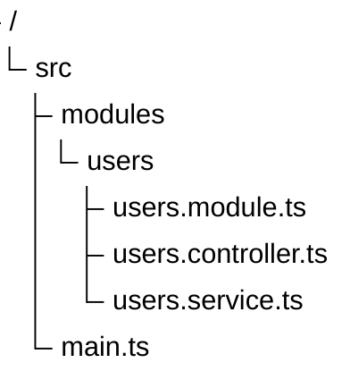
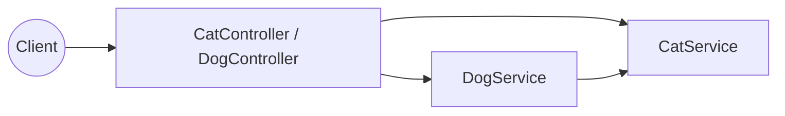
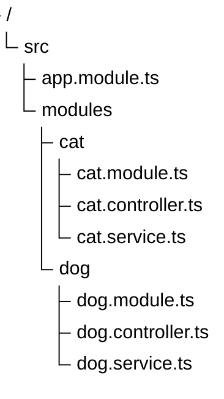
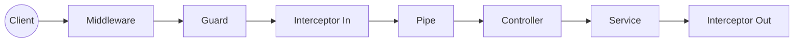
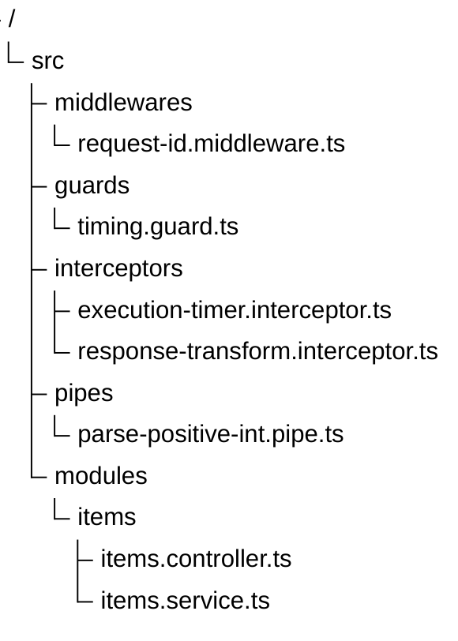
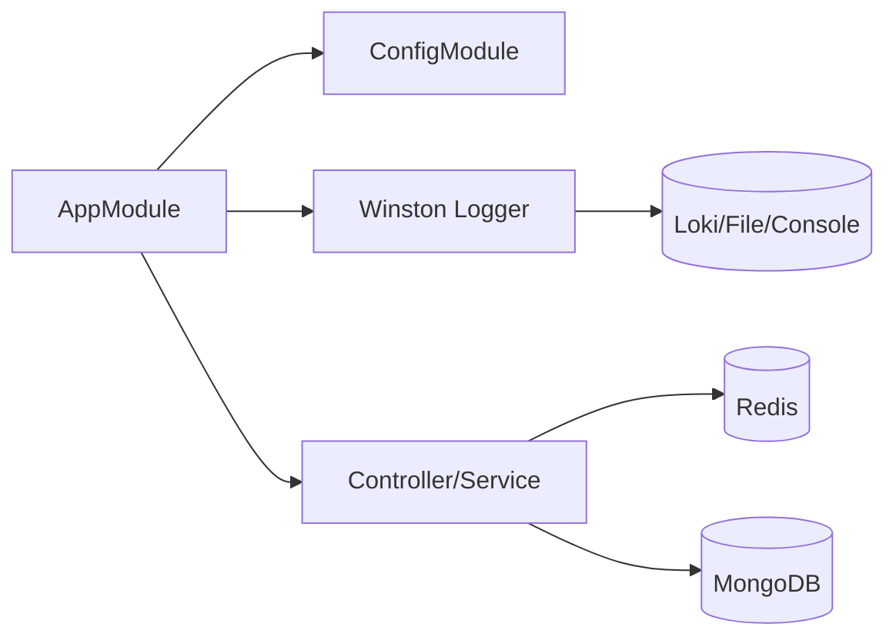
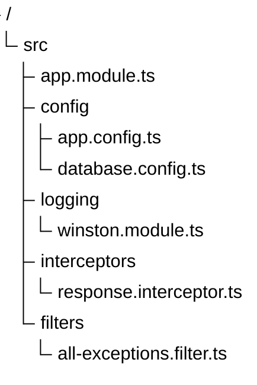

# Quy định soạn thảo Phần II (Bản chất - Code-first cho Fullstack)

Tài liệu này quy định cấu trúc bắt buộc cho **Phần II** theo tư duy **code-level**: học viên phải nhìn được source, hiểu dependency runtime, và theo dõi được luồng gọi code từng bước như một backend engineer.

### Tiêu đề bắt buộc
Phần 2 phải bắt đầu bằng:
`## II. Bản chất`

**Strict mode (bắt buộc):**
- Không dùng `## II. Nội dung chính`.
- Không dùng section `## III. Thực hành` kiểu cũ.
- Thay bằng đúng 2 heading H3: `### Chuẩn bị Môi trường và Luồng Cài đặt` và `### Kiểm thử ứng dụng`.
- BẮT BUỘC cho mọi bài `contents/**/{vi,en}.md` của Fullstack: phải có đủ 2 heading sau trong phần II:
  - `### Sơ đồ phụ thuộc runtime` kèm block `mermaid` mô tả dependency runtime.
  - `### Sơ đồ cây source code (file-level)` kèm block `mermaid` dạng `treeView-beta`.
- Không được bỏ qua 2 sơ đồ trên khi dịch sang `en.md`; cấu trúc phải giữ tương đương `vi.md`.

### Quy tắc dịch EN bắt buộc (áp dụng cho `contents/**/en.md`)

- `en.md` phải được dịch từ `vi.md` tương ứng trong cùng thư mục.
- Bắt buộc thống nhất header tiếng Anh như sau:
  - `## I. Lời mở đầu` -> `## I. Introduction`
  - `## II. Bản chất` -> `## II. Essence`
  - `### Chuẩn bị Môi trường và Luồng Cài đặt` -> `### Environment Setup and Run Flow`
  - `### Kiểm thử ứng dụng` -> `### Application Testing`
  - `## III. Các khái niệm cốt lõi` -> `## III. Core Concepts`
  - `## IV. Kỹ thuật nâng cao` -> `## IV. Advanced Techniques`
  - `## V. Các mẫu câu phỏng vấn` -> `## V. Interview Questions`
- Nhãn con trong phần test/phỏng vấn phải dùng tiếng Anh nhất quán:
  - `Tiêu đề API` -> `API Title`
  - `Hướng dẫn gọi API` -> `How to call API`
  - `Kết quả mong đợi` -> `Expected result`
  - `Kết luận` -> `Conclusion`
  - `Câu hỏi phỏng vấn` -> `Interview Question`

---

### Cấu trúc Nội dung (Trường hợp 1 - Có Source Code Demo)

Phần II **ưu tiên source trước**, không đi theo hướng infra-level.

**Thứ tự bắt buộc:**

1. **Giới thiệu source demo** (repo giải quyết bài toán gì, module nào quan trọng).
2. Dòng clone chuẩn: `Clone tại [đây](url)`.
3. **Sơ đồ phụ thuộc runtime** bằng Mermaid (app, ***Redis***, ***MongoDB***, external API...).
4. **Sơ đồ cây source code** bằng Mermaid (`treeView-beta`) ở mức file/module.
5. **Explain step by step**: vừa test API, vừa giải thích code execution.

---

### 1) Giới thiệu source code trước

- Mở phần II bằng đoạn ngắn mô tả repo đang demo cái gì (auth, lifecycle, config/logging...).
- Không mở bằng định nghĩa lý thuyết dài.
- Dùng ngôn ngữ backend: endpoint, controller, service, repository, dto, adapter.

### 2) Clone source bắt buộc

Ngay sau đoạn giới thiệu phải có:

`Clone tại [đây](url)`

Không chôn link clone trong đoạn văn.

**BẮT BUỘC:** Agent phải thao tác trên source thật trước khi viết nội dung:

1. Pull source mới nhất (`git pull`).
2. Chạy app local thành công.
3. Gọi endpoint thật để lấy response thật.
4. Đối chiếu response với code trước khi ghi tài liệu.

Không được viết tài liệu theo trí nhớ hoặc tự suy diễn response/code.

### 3) Sơ đồ thành phần phụ thuộc (runtime dependencies)

- Bắt buộc có 1 sơ đồ Mermaid mô tả thành phần hệ thống và phụ thuộc ngoài ứng dụng.
- Tối thiểu thể hiện:
  - backend app/module chính
  - database/cache chính (ví dụ ***MongoDB***, ***Redis***)
  - chiều phụ thuộc đọc/ghi

Ví dụ hướng biểu diễn:
- `API -> Service -> Redis`
- `Service -> MongoDB`
- Tránh đặt label node Mermaid theo kiểu `Node[Text (A)]` dễ gây parse lỗi ở một số renderer; ưu tiên:
  - `Node["Text - A"]`
  - hoặc tách ngắn: `Node[Text A]`

### 4) Sơ đồ cây source code (file-level)

- Bắt buộc có 1 sơ đồ Mermaid dạng cây source code, ưu tiên `treeView-beta`.
- Trọng tâm là **file-level / module-level**, không phải topology hạ tầng.
- Tối thiểu thể hiện:
  - thư mục `src/`
  - module chính của bài
  - các file then chốt: `controller`, `service`, `repository`, `dto`, `module`

Mẫu cú pháp:



### 5) Explain step by step (giải thích code + demo luồng)

Sau sơ đồ phải có phần giải thích tuần tự theo luồng chạy thật, gồm **2 lớp song song**:

- **Lớp A - API flow:** request đi qua endpoint nào, thành phần nào.
- **Lớp B - code execution trace:** class/method/file nào execute theo thứ tự.

Checklist bắt buộc trong phần step-by-step:

1. Request vào `Controller.method` nào.
2. Controller gọi service nào.
3. Service A gọi service B/repository nào.
4. Điểm chạm ***Redis*** / ***MongoDB*** (nếu có) ở bước nào.
5. Response chuẩn hoá và trả về ra sao.
6. Ghi rõ file:line (ví dụ `src/users/users.service.ts:42`) cho các điểm execute chính.
7. Có block `ts` ngắn để học viên nhìn logic trực tiếp.

---

### Thêm tiêu đề H3 `### Chuẩn bị Môi trường và Luồng Cài đặt`

Tác giả bắt buộc tạo header cấp 3 này, liệt kê rõ công cụ cần chuẩn bị và luồng chạy source:

- **Quy ước trình bày:** Không dùng block quote (`>`). Mỗi bước viết dạng list (`- **1. Prerequisites:**`, `- **2. Cài dependency:**`...), code block thụt vào bên trong bước.
- **Prerequisites:** công cụ cần có (Node, package manager, DB local/container...).
- **Cài dependency:** lệnh cài trong đúng thư mục project.
- **Lệnh khởi chạy:** lệnh run dev/test chính.
- **Tín hiệu thành công:** log hoặc endpoint health xác nhận app đã sẵn sàng.
- Mẫu gợi ý:
  - `- **1. Prerequisites:** ...`
  - `- **2. Clone source demo:** ...`
  - `- **3. Cài dependency:** ...`
  - `- **4. Lệnh khởi chạy:** ...`
  - `- **5. Tín hiệu thành công:** ...`

---

### Thêm tiêu đề H3 `### Kiểm thử ứng dụng`

Mỗi flow test bắt buộc đi theo cấu trúc chi tiết như sau:

- **Quy ước trình bày:** Không dùng block quote (`>`). Mỗi flow là `- **Bước X:**`.
- **Mỗi một API call** phải có đủ 4 lớp:

  1. **Tiêu đề API:**  
     `**{Ngữ cảnh} — {hành động} — {METHOD} {URL}:**`
  2. **Hướng dẫn gọi API:** câu ngắn cho Postman/Insomnia/Bruno.
  3. **Body JSON** (nếu có): block `json` pretty-print.
  4. **Câu dẫn curl:** dùng đúng câu `Hoặc dùng **curl** (WSL2 / Bash / macOS):` rồi block `bash` copy-paste được.

- Sau khi gọi API, bắt buộc có 2 đoạn:
  - `*Kết quả mong đợi:*` (HTTP code, response shape, log quan sát được)
  - `*Kết luận:*` (ý nghĩa kỹ thuật của flow)
- Khi đã có `*Kết quả mong đợi:*`, bắt buộc thêm **response mẫu** dạng block `json` (ít nhất gồm HTTP code + payload chính).
- Response mẫu phải lấy từ lần gọi API thật trên source đã pull/chạy, không tự bịa payload.
- Mẫu bullet tối thiểu:
  - `- **Bước 1:**` smoke test flow cơ bản.
  - `- **Bước 2:**` flow chính có đủ 4 lớp (Tiêu đề API, Hướng dẫn gọi API, Body JSON, curl).

---

### Quy tắc BẮT BUỘC - Giải thích code execution trong flow test

Sau mỗi flow API, thêm một cụm “giải thích code execution”:

- Ghi thứ tự execute theo file:line, ví dụ:
  - `src/modules/dog/dog.controller.ts` -> `DogController.spyOnCat()`
  - `src/modules/dog/dog.service.ts` -> `DogService.spyOnCat()`
  - `src/modules/cat/cat.service.ts` -> `CatService.introduce()`
- Mỗi dòng trace phải ghi rõ dạng `file.ts:line -> method` (ví dụ `src/modules/dog/dog.controller.ts:36 -> DogController.spyOnCat()`).
- Mỗi dòng trace phải kèm link GitHub tới đúng file + line (`blob/...#Lx`) để người học bấm vào source ngay.
- Kèm block `ts` mô tả **full hàm theo execution path trong một block duy nhất** (controller -> service -> dependency/module wiring), không chỉ snippet rời rạc.
- Chỉ rõ nơi orchestration, nơi persist, và đường dữ liệu trả ngược về client.
- Block `ts` phải dùng nội dung hàm thật từ source (copy đúng tên hàm, tham số, return), không đổi tên hàm cho "đẹp docs".
- **BẮT BUỘC đồng bộ trace <-> code block:** mọi hàm đã liệt kê trong mục `Trace code execution` phải xuất hiện trong cùng block `ts` (đúng thứ tự chạy), không bỏ sót.
- **BẮT BUỘC format theo paragraph cho từng trace trong block `ts`:** mỗi dòng trace trong danh sách phải có đúng 1 đoạn code tương ứng (phân tách bằng dòng trống), mở đầu bằng comment ngữ cảnh như `// Phase X - ...` + `// src/...:line`, rồi mới tới hàm thật; không gộp nhiều trace vào một paragraph mơ hồ.
- Ưu tiên format dễ đọc:
  1. Danh sách trace theo file (kèm link).
  2. Một block `ts` duy nhất, tách từng hàm bằng comment `// src/...`.
  3. Mỗi hàm giữ phần cốt lõi để đọc nhanh nhưng vẫn đúng tên hàm, tham số và return path.

---

### Cấu trúc Nội dung (Trường hợp 2 - Lý thuyết thuần túy, Không có Source Code)

Nếu bài chưa có repo demo, vẫn giữ tư duy backend:

1. **The Bottleneck Scenario:** pain-point production thật.
2. **Evolutionary Architecture:** tối thiểu 2 sơ đồ Mermaid (naive vs improved).
3. **Under-the-hood Mechanics:** data flow, retry, transaction boundary, read/write path.
4. **Tech Debt & Trade-offs:** chi phí/rủi ro khi đưa vào production.

Lưu ý: Không viết “lý thuyết suông”; phải có luồng gọi service cụ thể (ví dụ ***API Gateway*** -> ***Order Service*** -> ***Inventory Service*** -> ***PostgreSQL*** -> ***Kafka***).

---

### 3 ví dụ tham khảo (theo module Backend Environment)

**Ví dụ 1 (Bài Environment Setup and NestJS Core):**

- **Giới thiệu source demo:** Repo minh hoạ kiến trúc module của ***NestJS*** và luồng ***Dependency Injection*** xuyên module.
- **Clone source:** `Clone tại [đây](https://github.com/StarCi-Academy/resources/tree/main/system-design-mastery/introduction-to-kubernetes)`
- **Sơ đồ phụ thuộc runtime (Mermaid):**

- **Sơ đồ cây source code (Mermaid):**

- **Bước 1: Mở Postman test API**

  **Dog API — spy cat data — GET http://localhost:3000/dogs/spy:**

  Dùng **Postman** gửi **GET** vào `http://localhost:3000/dogs/spy`.

  Body JSON: không có body với request **GET**.

  Hoặc dùng **curl**:
  ```bash
  curl http://localhost:3000/dogs/spy
  ```

  *Kết quả mong đợi:* Response trả về dữ liệu từ `DogService` và thể hiện `DogService` đã gọi được `CatService`. Tác giả phải **đọc response trả về** (field nào, shape nào) rồi đối chiếu ngược lại source để học viên check code nhanh.

- **Bước 2: Giải thích code execution theo thứ tự chạy**

  Tác giả phải ghi rõ từng hàm theo thứ tự execute, kèm comment logic để học viên vừa mở code vừa đọc docs:

  - `src/modules/dog/dog.controller.ts` -> `DogController.spyOnCat()`
  - `src/modules/dog/dog.service.ts` -> `DogService.spyOnCat()`
  - `src/modules/cat/cat.service.ts` -> `CatService.introduce()`

  ```ts
  // Phase 1 - Entry point tại Controller (nhận HTTP request)
  // src/modules/dog/dog.controller.ts:18
  @Get('spy')
  spyOnCat() {
    // Controller không xử lý business logic, chỉ delegate sang service
    return this.dogService.spyOnCat();
  }

  // Phase 2 - Orchestration tại DogService (service A call service B)
  // src/modules/dog/dog.service.ts:12
  spyOnCat() {
    // DogService gọi CatService để lấy lời giới thiệu từ module Cat
    return this.catService.introduce();
  }

  // Phase 3 - Business data source tại CatService
  // src/modules/cat/cat.service.ts
  introduce() {
    // Trả về lời giới thiệu của CatService
    return '🐱 Hello! I am a Cat. I am managed by the NestJS IoC Container.';
  }
  ```

  Flow tổng cần ghi ngay dưới block code:  
  `DogController -> DogService -> CatService -> DogService -> DogController -> client`

  *Kết luận:* Luồng `Controller -> Service -> Cross-module Service` hoạt động khi module nguồn đã `export` provider đúng cách.

**Ví dụ 2 (Bài Request Lifecycle):**

- **Giới thiệu source demo:** Repo tập trung vào pipeline request của ***NestJS*** ở code-level.
- **Clone source:** `Clone tại [đây](https://github.com/StarCi-Academy/resources/tree/main/system-design-mastery/introduction-to-kubernetes)`
- **Sơ đồ phụ thuộc runtime (Mermaid):**

- **Sơ đồ cây source code (Mermaid):**

- **Bước 1: Mở Postman test API**

  **Items API — get item by id — GET http://localhost:3000/items/5:**

  Dùng **Postman** gửi **GET** vào `http://localhost:3000/items/5`.

  Body JSON: không có body với request **GET**.

  Hoặc dùng **curl**:
  ```bash
  curl http://localhost:3000/items/5
  ```

  *Kết quả mong đợi:* Request đi qua `Middleware -> Guard -> Interceptor -> Pipe -> Controller -> Service` và trả response chuẩn hoá.

- **Bước 2: Giải thích code execution**

  - `src/modules/items/items.controller.ts:14` -> `ItemsController.getById(id)`
  - `src/pipes/parse-positive-int.pipe.ts:9` -> `ParsePositiveIntPipe.transform(value)`
  - `src/modules/items/items.service.ts:22` -> `ItemsService.findOne(id)`

  ```ts
  // src/modules/items/items.controller.ts:14
  @Get(':id')
  getById(@Param('id', ParsePositiveIntPipe) id: number) {
    return this.itemsService.findOne(id);
  }
  ```

- **Bước 3: Failure path**

  Gọi `GET /items/abc`.

  *Kết quả mong đợi:* `ParsePositiveIntPipe` chặn sớm với lỗi **400**, controller không chạy.

  *Kết luận:* Validation ở pipeline giúp chặn dữ liệu rác trước khi vào business logic.

**Ví dụ 3 (Bài Production-ready Config and Logging):**

- **Giới thiệu source demo:** Repo minh hoạ cấu hình đa môi trường và logging có cấu trúc.
- **Clone source:** `Clone tại [đây](https://github.com/StarCi-Academy/resources/tree/main/system-design-mastery/introduction-to-kubernetes)`
- **Sơ đồ phụ thuộc runtime (Mermaid):**

- **Sơ đồ cây source code (Mermaid):**

- **Bước 1: Mở Postman test API**

  **Health API — verify config and logging flow — GET http://localhost:3000/:**

  Dùng **Postman** gửi **GET** vào `http://localhost:3000/` sau khi chạy app với `NODE_ENV=production`.

  Body JSON: không có body với request **GET**.

  Hoặc dùng **curl**:
  ```bash
  curl http://localhost:3000/
  ```

  *Kết quả mong đợi:* App nạp đúng file `.env` theo `NODE_ENV`, response được interceptor chuẩn hoá, log xuất ra đúng transport đã cấu hình.

- **Bước 2: Giải thích code execution**

  - `src/main.ts:8` -> bootstrap `NestFactory.create(AppModule)`
  - `src/app.module.ts:24` -> `ConfigModule.forRoot(...)`
  - `src/logging/winston.module.ts:11` -> `WinstonModule.forRootAsync(...)`
  - `src/filters/all-exceptions.filter.ts:17` -> bắt lỗi và ghi log

  ```ts
  // src/logging/winston.module.ts:11
  WinstonModule.forRootAsync({
    inject: [ConfigService],
    useFactory: (config: ConfigService) => ({ /* transports */ }),
  });
  ```

- **Bước 3: Runtime flow**

  - Request vào `Controller -> Service`.
  - `ResponseInterceptor` chuẩn hoá payload.
  - Khi có lỗi, `AllExceptionsFilter` ghi log chi tiết ở server, trả lỗi an toàn cho client.

  *Kết luận:* Luồng bootstrap config + runtime logging là luồng bắt buộc để đưa backend lên production mà không sửa logic nghiệp vụ.
