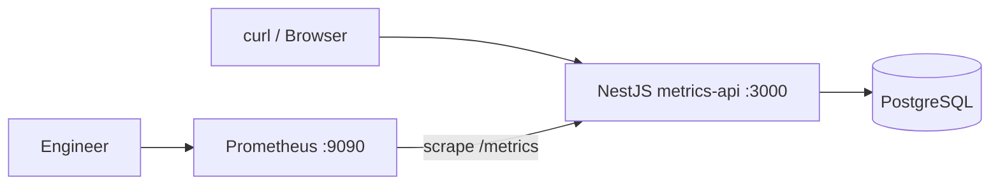

# Cập nhật §2.2 — Thực hành (theo repo module 5 Monitoring)

Tài liệu này **thay thế / chỉnh** phần **§2.2** trong bài *Giới thiệu về Monitoring và Observability*, căn cứ trực tiếp mã nguồn và `compose.yaml` tại repo:

**[StarCi-Academy/system-design-mastery-module-5-monitoring-and-observability](https://github.com/StarCi-Academy/system-design-mastery-module-5-monitoring-and-observability)**

> **Lưu ý:** README trong repo vẫn ghi tiêu đề `module-7` — đây là lệch tên giữa repo GitHub (module **5**) và text trong README; **URL clone** dùng đúng module **5** như trên.

---

## Khác biệt quan trọng so với bản lesson cũ

| Nội dung cũ | Thực tế trong repo |
|-------------|---------------------|
| Clone `system-design-mastery-module-**7**-…` | Dùng repo **module-5** (URL trên). |
| Stack có **Grafana :3001** | **`compose.yaml` gốc không có Grafana** — chỉ có Prometheus **9090**, và các service lesson khác (Loki, Consul, Jaeger…) trong full stack. Muốn Grafana phải **tự thêm** hoặc dùng UI của Prometheus (**9090**). |
| Chỉ `docker compose up` ở root lesson | Repo định nghĩa **hai luồng**: (A) chỉ lesson 0 trong `.docker/`; (B) **full stack** ở root với network **`starci-network`** + **PostgreSQL**. |
| Job Prometheus `nestjs-app` | Phụ thuộc file config: **`nestjs-app-lesson0`** (lesson `.docker/prometheus.yml`) hoặc **`nestjs-metrics-api`** (`.docker/prometheus.yml` ở root cho full stack). |
| `npm install` ở thư mục lesson `0-…` | Ứng dụng Nest nằm trong **`0-monitoring-and-observability/metrics-api/`** (ở đó mới có `package.json`). |
| `/cats` chỉ là ví dụ | Code thật **đọc/ghi PostgreSQL** (`TypeOrmModule` → `metrics_lab`). Lab đầy đủ **cần Postgres** — stack root đã có **`postgres-metrics`** (host **5433** → container **5432**). |

---

### 2.2.1. Chuẩn bị source code và môi trường

**Mục đích:** có mã **NestJS** (`metrics-api`) + Prometheus; đối với luồng đầy đủ có thêm Postgres như README repo.

```bash
git clone https://github.com/StarCi-Academy/system-design-mastery-module-5-monitoring-and-observability.git
cd system-design-mastery-module-5-monitoring-and-observability
```

**Hai cách chạy (chọn một):**

---

#### Cách 1 — Chỉ bài 0: Prometheus + container `app` (theo `0-monitoring-and-observability/.docker/`)

README repo: compose **tự tạo** network tên `0-monitoring-and-observability`, **không** cần `docker network create`.

```bash
cd 0-monitoring-and-observability/.docker
docker compose up -d
```

- **NestJS:** host **http://localhost:3000** (service Compose tên **`app`**).
- **Prometheus:** **http://localhost:9090**.
- File scrape: `prometheus.yml` cạnh compose — **job_name:** `nestjs-app-lesson0`, target **`app:3000`**.

**Cảnh báo:** `metrics-api` trong repo **kết nối Postgres** (`POSTGRES_*`). Compose lesson chỉ có **`app` + `prometheus`** — nếu image `app` không có DB đi kèm, **GET `/cats` có thể lỗi** cho đến khi bạn cung cấp Postgres (xem Cách 2 hoặc chạy app local kèm Postgres).

---

#### Cách 2 — Full stack một file `compose.yaml` ở root (khuyến nghị cho lab có Postgres + đúng README)

README yêu cầu **network Docker external** trước:

```bash
docker network create starci-network
docker compose -f compose.yaml up -d --build
```

- **`postgres-metrics`:** host port **5433** → DB trong network docker **`postgres-metrics:5432`**, database **`metrics_lab`**.
- **`metrics-api`:** build từ `./0-monitoring-and-observability/metrics-api`, host **3000**, env trỏ vào Postgres trên.
- **Prometheus:** **9090**, scrape target **`metrics-api:3000`** (file `.docker/prometheus.yml` ở root repo — **job_name:** `nestjs-metrics-api`).
- **Không có Grafana** trong file compose này.

---

### 2.2.2. Kiến trúc/thành phần (stack + luồng) — chỉnh lại

| Thành phần | Cổng host (full stack root) | Vai trò |
|------------|------------------------------|---------|
| **metrics-api** (NestJS) | **3000** | `/cats`, `/metrics` (`prom-client`), TypeORM → Postgres |
| **postgres-metrics** | **5433** | Postgres cho lab metrics (`metrics_lab`) |
| **Prometheus** | **9090** | Scrape pull `/metrics`, PromQL |

*(Lesson-only `.docker/`: chỉ **app 3000** + **Prometheus 9090**, không có Postgres trong compose.)*



---

### 2.2.3. Chuẩn bị & khởi chạy — chạy Nest **local** (không Docker app)

Khi debug middleware hoặc mô phỏng High Cardinality, chạy API trực tiếp:

```bash
cd 0-monitoring-and-observability/metrics-api
npm install
```

**Bắt buộc có Postgres** (ví dụ đã chạy `postgres-metrics` từ full stack, hoặc container Postgres riêng). Ví dụ env kết nối tới DB full stack trên máy host:

```bash
set POSTGRES_HOST=localhost
set POSTGRES_PORT=5433
set POSTGRES_USER=postgres
set POSTGRES_PASSWORD=postgres
set POSTGRES_DB=metrics_lab
npm run start:dev
```

*(Linux/macOS: `export POSTGRES_HOST=localhost` …)*

Prometheus trong Docker phải scrape được máy host: có thể dùng `host.docker.internal` (Docker Desktop Windows/macOS) trong `prometheus.yml` hoặc giữ nguyên full stack trong Docker và chỉ sửa code + rebuild image.

---

### 2.2.4. Kiểm thử — chỉnh `jq` / job cho đúng compose

Giữ nguyên **ý** các luồng 1–4; chỉ đổi **lệnh** cho khớp repo.

#### Luồng 3 — Prometheus target `health=up`

**Nếu dùng full stack root** (`metrics-api`):

```bash
curl -s http://localhost:9090/api/v1/targets | jq ".data.activeTargets[] | select(.labels.job==\"nestjs-metrics-api\")"
```

**Nếu dùng lesson `.docker/`** (`app`, job `nestjs-app-lesson0`):

```bash
curl -s http://localhost:9090/api/v1/targets | jq ".data.activeTargets[] | select(.labels.job==\"nestjs-app-lesson0\")"
```

`scrapeUrl` sẽ là `http://app:3000/metrics` hoặc `http://metrics-api:3000/metrics` tương ứng; **`health`** phải là **`up`** khi scrape thành công.

#### Luồng 1 & 2 — `grep` trên `/metrics`

Metric và label trong code khớp bài (**`http_requests_total`**, labels **`method`**, **`route`**, **`status_code`** — snake_case). Route có thể là `/cats` (template Nest); nếu `grep` không khớp, mở raw:

```bash
curl -s http://localhost:3000/metrics | findstr http_requests_total
```

*(Git Bash/WSL: dùng `grep` như trong bài gốc.)*

#### Luồng 4 — PromQL `histogram_quantile`

Histogram tên **`http_request_duration_seconds`**, labels **`method`**, **`route`** (không có `status_code` trên histogram). Ví dụ:

```bash
curl -s --get http://localhost:9090/api/v1/query --data-urlencode "query=histogram_quantile(0.95, sum by (le, route) (rate(http_request_duration_seconds_bucket{route=\"/cats\"}[5m])))"
```

Phần mô phỏng High Cardinality: sửa file **`0-monitoring-and-observability/metrics-api/src/metrics/http-metrics.middleware.ts`** (đồng thời cập nhật **`prometheus.ts`** — thêm `request_id` vào `labelNames` của `Counter` nếu không TypeScript/registry sẽ không nhận label). Sau lab **revert** và restart.

---

### 2.2.5. Dọn tài nguyên

**Lesson `.docker/`:**

```bash
cd 0-monitoring-and-observability/.docker
docker compose down -v
```

**Full stack root:**

```bash
docker compose -f compose.yaml down -v
```

*(Giữ hoặc xóa network `starci-network` tùy nhu cầu: `docker network rm starci-network`.)*

---

### 2.2.6. Đọc thêm (giữ như bài gốc)

- [Prometheus — Labels best practices](https://prometheus.io/docs/practices/naming/#labels)
- [Google SRE Book — Monitoring distributed systems](https://sre.google/sre-book/monitoring-distributed-systems/)
- [OpenTelemetry Docs](https://opentelemetry.io/docs/)
- [Grafana Loki — Labels](https://grafana.com/docs/loki/latest/get-started/labels/)
- [Grafana Tempo](https://grafana.com/docs/tempo/latest/getting-started/)

Repo demo đầy đủ lesson (Loki, Consul, Jaeger) nằm trong các thư mục **`1-*`**, **`2-*`**, **`3-*`** và được **gom** trong **`compose.yaml`** root sau khi tạo **`starci-network`**.
