Confirm Goal — v1

| Item | Scope |
| --- | --- |
| Biz/Goal | Recover a workflow |
| Impact: routes | app: /flow |
| Impact: code | app (/repo/app): flow boundary |
| Workflow forecast | Not established |
| Done when | Not established |
| Target | Not established |
| In scope | Not established |
| Out of scope | Not established |
| Outputs | Not established |
| Verification reach | Not established |
| Example | Not established |

Kiến trúc — bản khảo sát, không phải bằng chứng triển khai

```mermaid
flowchart LR
  n0["Giao diện: UI #34;quoted#34; #35;1 #124; #96;code#96; #91;locale#93; tiếng Việt #60;script#62; #38; #92; #124; Chủ sở hữu: ui owner #40;app#41; #124; Đã khảo sát #91;1#93;"]
  n1["API: api boundary #124; Chủ sở hữu: api owner #40;app#41; #124; Đã khảo sát #91;1#93;"]
  n2["Dịch vụ: service boundary #124; Chủ sở hữu: service owner #40;app#41; #124; Đã khảo sát #91;1#93;"]
  n3["Dữ liệu: data boundary #124; Chủ sở hữu: data owner #40;app#41; #124; Đã khảo sát #91;1#93;"]
  n4["Phụ thuộc ngoài: external boundary #124; Chủ sở hữu: external owner #124; Chưa kiểm chứng"]
  n0 -->|"calls #34;API#34; #124; #35; #96;edge#96; Unicode #8594; #124; Đã khảo sát #91;1#93;"| n1
  n1 -->|"requests / persists #124; Đã khảo sát #91;1#93;"| n2
  n2 -->|"requests / persists #124; Đã khảo sát #91;1#93;"| n3
  n3 -.->|"requests / persists #124; Đề xuất"| n4
```

Nét liền: đã khảo sát, có trích dẫn. Nét đứt: đề xuất/chưa kiểm chứng. Quan hệ còn thiếu: chưa xác định.
1. source:contract-and-ownership-review

Workflow forecast: planned, not executed or verified. Missing values remain unresolved; this preview grants no authority.
