Confirm Goal — v1

| Item | Scope |
| --- | --- |
| Biz/Goal | Recover a workflow |
| Impact: routes | app: /flow |
| Impact: code | app (/repo/app): flow boundary |
| Workflow forecast | Not established |
| Done when | Not established |
| Target | Not established |
| In scope | Not established |
| Out of scope | Not established |
| Outputs | Not established |
| Verification reach | Not established |
| Example | Not established |

Architecture — discovery sketch, not implementation proof

```mermaid
flowchart LR
  n0["UI: ui boundary #124; Owner: ui owner #40;app#41; #124; Discovered #91;1#93;"]
  n1["API: api boundary #124; Owner: api owner #40;app#41; #124; Discovered #91;1#93;"]
  n2["Service: service boundary #124; Owner: service owner #40;app#41; #124; Discovered #91;1#93;"]
  n3["Data: data boundary #124; Owner: data owner #40;app#41; #124; Discovered #91;1#93;"]
  n4["External dependency: external boundary #124; Owner: external owner #124; Unverified"]
  n0 -->|"requests / persists #124; Discovered #91;1#93;"| n1
  n1 -->|"requests / persists #124; Discovered #91;1#93;"| n2
  n2 -->|"requests / persists #124; Discovered #91;1#93;"| n3
  n3 -.->|"requests / persists #124; Proposed"| n4
```

Solid: cited discovery. Dashed: proposed/unverified. Missing relationships: unresolved.
1. source:contract-and-ownership-review

Workflow forecast: planned, not executed or verified. Missing values remain unresolved; this preview grants no authority.
