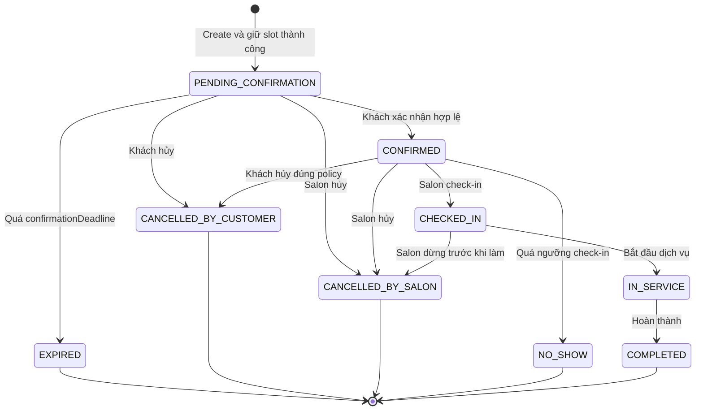
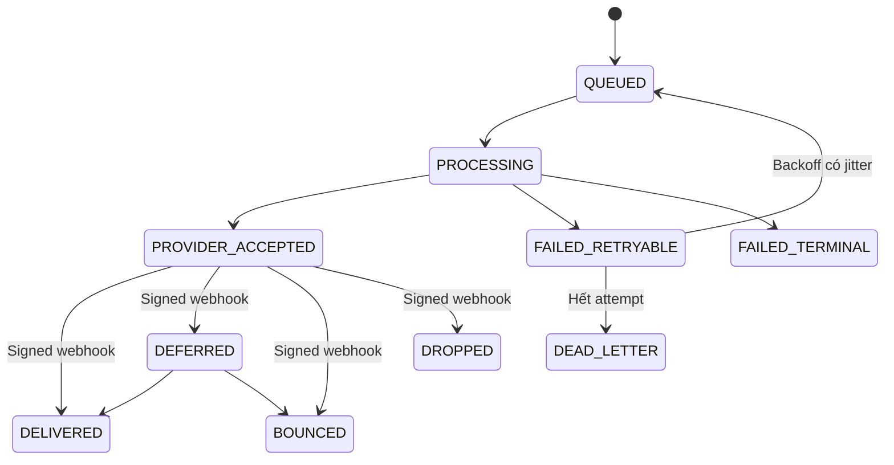

# YABAI NAIL — Đặc tả đặt lịch và thiết kế E2E conceptual

> Trạng thái: Bản thiết kế đề xuất, sẵn sàng để Product/Engineering/QA duyệt
>
> Phạm vi: Khách hàng chọn lịch, tạo cuộc hẹn, xem cuộc hẹn, nhận email và xác nhận
>
> Mục đích: Nguồn sự thật nghiệp vụ để thiết kế API, UI, dữ liệu và bộ E2E. Tài liệu này mô tả hành vi cần kiểm chứng, chưa phải mã kiểm thử.

## 1. Kết luận thiết kế

Luồng chuẩn được xác định như sau:

1. Khách hàng đăng nhập và mở tab `Đặt lịch`.
2. Khách hàng chọn chi nhánh, dịch vụ, nhân viên hoặc `Bất kỳ nhân viên nào` nếu các thông tin này chưa có trong context.
3. Khách hàng chọn một ngày theo múi giờ của chi nhánh và chọn một khung giờ còn trống.
4. Backend kiểm tra lại toàn bộ điều kiện ngay tại thời điểm ghi, tạo cuộc hẹn ở trạng thái `PENDING_CONFIRMATION`, giữ slot và tạo sự kiện gửi email trong cùng transaction.
5. Client chỉ hiển thị `Đã giữ lịch, vui lòng xác nhận trước ...`; chưa được hiển thị `Lịch hẹn đã được xác nhận`.
6. Cuộc hẹn xuất hiện ngay trong `Lịch hẹn của tôi` với trạng thái `Chờ xác nhận`.
7. Email được gửi bất đồng bộ. Email thất bại không rollback cuộc hẹn và không biến API tạo lịch thành lỗi.
8. Khách hàng xác nhận bằng nút trong ứng dụng hoặc liên kết một lần trong email.
9. Xác nhận hợp lệ chuyển cuộc hẹn sang `CONFIRMED`. Hết hạn mà chưa xác nhận chuyển sang `EXPIRED` và giải phóng slot.

Ba nguyên tắc không được thay đổi khi triển khai:

- Kết quả tra cứu availability chỉ mang tính tham khảo; transaction tạo lịch mới là nơi quyết định slot có còn hay không.
- Thành công của cuộc hẹn và thành công của email là hai state machine độc lập.
- Retry từ client, queue hoặc webhook không được tạo thêm cuộc hẹn, gửi email lặp ngoài chủ đích hoặc áp dụng một transition hai lần.

## 2. Phạm vi và giả định

### 2.1 Trong phạm vi

- Luồng khách hàng tự đặt lịch trên web/mobile.
- Tính availability theo chi nhánh, dịch vụ, nhân viên và thời lượng.
- Tạo, giữ chỗ, xác nhận, hết hạn và hiển thị cuộc hẹn.
- Chống đặt trùng và chống request lặp.
- Email xác nhận, retry, webhook trạng thái giao nhận và gửi lại email.
- Các trạng thái hủy, đổi lịch, check-in, hoàn thành và no-show ở mức lifecycle/E2E conceptual.
- Phân quyền, bảo mật token, logging, metrics và recovery.

### 2.2 Ngoài phạm vi phiên bản này

- Thanh toán hoặc đặt cọc.
- Đồng bộ Google Calendar/Apple Calendar hai chiều.
- Danh sách chờ tự động.
- Ghép nhiều nhân viên cho nhiều công đoạn trong cùng một cuộc hẹn.
- Quy trình salon duyệt thủ công sau khi khách đã xác nhận.

Nếu Product yêu cầu salon duyệt thủ công, phải bổ sung state riêng `PENDING_SALON_APPROVAL`; không được dùng lại `PENDING_CONFIRMATION`, vì hai trạng thái có actor và SLA khác nhau.

### 2.3 Giá trị mặc định đề xuất

Mọi giá trị phải lấy từ cấu hình, không hard-code trong handler hoặc test:

| Cấu hình | Mặc định đề xuất | Ý nghĩa |
|---|---:|---|
| `BOOKING_WINDOW_DAYS` | 90 ngày | Khoảng thời gian tối đa được đặt trước |
| `MIN_BOOKING_LEAD_MINUTES` | 60 phút | Khoảng cách tối thiểu từ hiện tại đến giờ bắt đầu |
| `CONFIRMATION_HOLD_MINUTES` | 15 phút | Thời gian giữ slot khi chờ khách xác nhận |
| `RESEND_CONFIRMATION_COOLDOWN_SECONDS` | 60 giây | Thời gian chờ giữa hai lần gửi lại |
| `MAX_RESENDS_PER_APPOINTMENT` | 5 | Giới hạn gửi lại cho một cuộc hẹn |
| `IDEMPOTENCY_RETENTION_HOURS` | 24 giờ | Thời gian lưu kết quả để replay request |
| `CANCELLATION_CUTOFF_HOURS` | Product quyết định | Mốc cho phép khách tự hủy/đổi lịch |

## 3. Actor và trách nhiệm

| Actor | Trách nhiệm | Không được phép |
|---|---|---|
| Khách hàng đã đăng nhập (`CUSTOMER`) | Xem availability, tạo/xem/xác nhận/hủy/đổi lịch của chính mình | Xem hoặc thay đổi lịch của khách khác; đặt thay chi nhánh bằng ID không được phép |
| Lễ tân/Quản lý chi nhánh (`STAFF`, `BRANCH_MANAGER`) | Xem và vận hành lịch trong phạm vi chi nhánh được cấp quyền | Truy cập chi nhánh khác chỉ vì biết appointment ID |
| Nhân viên thực hiện dịch vụ | Có lịch làm việc, nghỉ, kỹ năng và các block thời gian làm đầu vào availability | Tự mở slot ngoài phạm vi được cấu hình nếu không có quyền |
| Booking API | Xác thực, phân quyền, tính lại điều kiện, giữ invariant và ghi transaction | Tin availability cũ từ client; gọi email provider trong transaction |
| PostgreSQL | Nguồn sự thật cho appointment, reservation, idempotency và outbox | Dựa vào `SELECT` trước `INSERT` để chống race |
| Outbox relay/queue | Chuyển sự kiện đã commit thành job bền vững | Giả định message chỉ đến một lần |
| Notification worker | Render và gửi email idempotently; cập nhật trạng thái attempt | Thay đổi trạng thái cuộc hẹn dựa vào việc email gửi được hay không |
| Email provider | Nhận email và phát delivery event | Là nguồn sự thật của trạng thái cuộc hẹn |
| Expiration scheduler | Tìm hold quá hạn và phát lệnh expire theo lô có giới hạn | Chạy công việc không idempotent hoặc xử lý vô hạn row trong một tick |
| Support/Admin | Quan sát trạng thái, replay job đã sửa nguyên nhân theo audit trail | Đọc token thô hoặc PII không cần thiết từ log |

## 4. Thuật ngữ và nguồn sự thật

| Thuật ngữ | Định nghĩa |
|---|---|
| Availability | Kết quả tính tại một thời điểm; có thể hết hiệu lực ngay sau khi trả về |
| Slot | Khoảng thời gian ứng viên, biểu diễn theo dạng nửa kín `[startAt, endAt)` |
| Hold | Reservation có hạn, đã chiếm capacity nhưng chưa phải lịch xác nhận |
| Appointment | Aggregate nghiệp vụ của một cuộc hẹn |
| Confirmation token | Secret một lần, chỉ lưu bản băm, có hạn và có thể bị thu hồi |
| Idempotency key | Khóa do client tạo, ổn định cho một ý định nghiệp vụ qua mọi lần retry |
| Outbox event | Bản ghi sự kiện commit cùng appointment để không mất tác vụ gửi email |
| Delivery status | Tình trạng kỹ thuật của email; không phải appointment status |

Nguồn sự thật cho màn hình `Lịch hẹn của tôi` là write database của booking. Không dùng projection eventual-consistent cho read-after-write quan trọng này. Mutation tạo lịch phải trả luôn appointment vừa tạo để UI hiển thị ngay cả trước lần refetch đầu tiên.

## 5. Máy trạng thái

### 5.1 Trạng thái cuộc hẹn



Quy tắc transition:

| Từ | Sang | Actor/trigger | Hậu điều kiện bắt buộc |
|---|---|---|---|
| — | `PENDING_CONFIRMATION` | Customer/CreateAppointment | Slot bị giữ; deadline được lưu; outbox `AppointmentCreated` tồn tại |
| `PENDING_CONFIRMATION` | `CONFIRMED` | Customer/ConfirmAppointment | Token được dùng đúng một lần; slot tiếp tục bị chiếm |
| `PENDING_CONFIRMATION` | `EXPIRED` | Scheduler hoặc lazy-expire | Slot được giải phóng; token bị thu hồi |
| `PENDING_CONFIRMATION`, `CONFIRMED` | `CANCELLED_*` | Customer hoặc salon có quyền | Slot được giải phóng; lý do và actor được audit |
| `CONFIRMED` | `CHECKED_IN` | Staff đúng chi nhánh | Ghi thời điểm check-in |
| `CHECKED_IN` | `IN_SERVICE` | Staff đúng chi nhánh | Ghi thời điểm bắt đầu thực tế |
| `IN_SERVICE` | `COMPLETED` | Staff đúng chi nhánh | Ghi thời điểm kết thúc thực tế |
| `CONFIRMED` | `NO_SHOW` | Staff/scheduler theo policy | Không được tự suy diễn trước ngưỡng cấu hình |

Mọi transition không có trong bảng phải bị từ chối bằng mã lỗi ổn định `INVALID_APPOINTMENT_TRANSITION` và không thay đổi dữ liệu.

### 5.2 Trạng thái slot/resource

| Trạng thái | Tồn tại ở đâu | Có chiếm capacity |
|---|---|---:|
| `AVAILABLE` | Kết quả query | Không |
| `SELECTED` | State cục bộ của client | Không |
| `HELD` | Reservation gắn với `PENDING_CONFIRMATION` | Có |
| `BOOKED` | Reservation gắn với trạng thái từ `CONFIRMED` đến khi kết thúc/hủy | Có |
| `RELEASED` | Reservation đã expire/hủy | Không |
| `BLOCKED` | Lịch nghỉ, đóng cửa, maintenance hoặc block của staff | Có/không khả dụng |

Chọn một ngày hoặc bấm vào một slot không tạo hold. Hold chỉ được tạo khi mutation tạo lịch commit thành công.

### 5.3 Trạng thái confirmation token

```text
ACTIVE -> USED
ACTIVE -> EXPIRED
ACTIVE -> REVOKED
```

- `USED`, `EXPIRED`, `REVOKED` là terminal.
- Gửi lại email có thể giữ nguyên token đang còn hạn hoặc rotate token. Nếu rotate, token cũ phải chuyển `REVOKED` trong cùng transaction tạo token mới.
- Xác nhận lặp bằng token đã dùng trả kết quả idempotent `ALREADY_CONFIRMED` nếu appointment đã `CONFIRMED`; không phát lại side effect.

### 5.4 Trạng thái notification



`PROVIDER_ACCEPTED` chỉ có nghĩa provider nhận yêu cầu. `DELIVERED` chỉ có nghĩa mail server người nhận đã chấp nhận email, không chứng minh khách đã đọc. Không dùng email open tracking làm điều kiện xác nhận lịch.

### 5.5 Trạng thái UI/client

UI không được dùng một boolean `success` cho toàn bộ flow. Các trạng thái tối thiểu cần biểu diễn riêng:

| State | Ý nghĩa | Hành động khả dụng |
|---|---|---|
| `LOADING_CONTEXT` | Đang tải branch/service/staff đã chọn | Skeleton; chưa cho submit |
| `CALENDAR_READY` | Calendar sẵn sàng, chưa chọn ngày | Chọn ngày hợp lệ |
| `LOADING_SLOTS` | Đang tải slot của ngày | Giữ ngày được chọn; khóa chọn slot cũ |
| `NO_SLOTS` | Ngày hợp lệ nhưng không còn slot | Chọn ngày khác/refresh |
| `SLOTS_READY` | Có slot và chưa chọn | Chọn một slot |
| `REVIEW_READY` | Đã đủ dữ liệu để xem lại | Sửa lựa chọn hoặc submit |
| `SUBMITTING` | Create đang chạy | Disable nút và giữ nguyên idempotency key |
| `PENDING_CONFIRMATION` | Backend đã giữ slot | Xác nhận trong app, resend email, hủy |
| `CONFIRMING` | Confirm đang chạy | Disable CTA, giữ cùng idempotency key khi retry |
| `CONFIRMED` | Appointment đã xác nhận | Xem chi tiết, hủy/đổi theo policy |
| `SLOT_STALE` | Slot hết trong lúc submit | Refresh đúng ngày, giữ branch/service preference |
| `RECOVERABLE_ERROR` | Mất mạng, timeout, dependency tạm lỗi | Retry với cùng key nếu intent không đổi |
| `VALIDATION_ERROR` | Dữ liệu/policy không hợp lệ | Sửa field tương ứng; không retry tự động |
| `RATE_LIMITED` | Bị giới hạn tần suất | Hiện countdown từ `retryAfter` |
| `SESSION_EXPIRED` | Phiên hết hạn | Đăng nhập lại và quay về flow an toàn |
| `EXPIRED` | Hold hết hạn trước xác nhận | Tạo booking mới; không cho confirm lại |
| `OFFLINE` | Thiết bị mất mạng trước request | Không báo đặt thành công; giữ draft cục bộ không chứa secret |

Nếu client không biết request create đã tới server hay chưa do timeout, UI phải query theo idempotency key hoặc retry cùng key trước khi cho tạo intent mới. Không được tự kết luận thất bại rồi mint key mới ngay lập tức.

## 6. Luồng chính chuẩn

```mermaid
sequenceDiagram
    actor C as Customer
    participant UI as Web/Mobile
    participant API as Booking API
    participant DB as PostgreSQL
    participant R as Outbox/Queue
    participant W as Notification Worker
    participant E as Email Provider

    C->>UI: Mở tab Đặt lịch
    UI->>API: Query availability theo ngày
    API->>DB: Đọc giờ mở cửa, lịch staff, block và reservation
    DB-->>API: Candidate slots
    API-->>UI: Availability + generatedAt + timeZone
    C->>UI: Chọn slot và gửi đặt lịch
    UI->>API: CreateAppointment + idempotencyKey
    API->>DB: BEGIN; claim key; revalidate; insert appointment/reservation/outbox; COMMIT
    DB-->>API: PENDING_CONFIRMATION + deadline
    API-->>UI: Thành công: Đã giữ lịch
    UI-->>C: Hiển thị lịch chờ xác nhận ngay
    R->>W: AppointmentCreated (at-least-once)
    W->>E: Gửi email với idempotency key
    E-->>W: Accepted
    C->>UI: Xác nhận trong app hoặc từ email
    UI->>API: ConfirmAppointment
    API->>DB: Transition có điều kiện ACTIVE -> USED và PENDING -> CONFIRMED
    API-->>UI: CONFIRMED
    UI-->>C: Đặt lịch thành công
```

## 7. Quy tắc nghiệp vụ

### BR-01 — Xác thực và ownership

Chỉ customer đã xác thực mới được tạo và xem lịch cá nhân. Mọi query/mutation theo appointment ID phải ràng buộc thêm `customerId` hoặc phạm vi chi nhánh ngay trong truy vấn. Trường hợp không tồn tại và không có quyền trả cùng một lỗi để tránh dò ID.

### BR-02 — Dữ liệu đầu vào

`branchId`, `serviceIds`, `staffPreference`, `startAt`, `timeZone`, thông tin liên hệ và version policy phải được validate tại boundary. Client không gửi `endAt`, giá hay duration làm nguồn sự thật; backend tính lại từ catalog hiện hành.

### BR-03 — Múi giờ

- Lưu instant dưới UTC và lưu kèm IANA time zone của chi nhánh dùng khi đặt.
- Ngày trên lịch được hiểu theo local date của chi nhánh, không theo time zone thiết bị.
- Response phải trả cả instant và time zone để client render đúng.
- Slot rơi vào giờ không tồn tại do DST bị loại; giờ lặp do DST phải có offset rõ ràng. Dù thị trường hiện tại không DST, behavior vẫn phải xác định.

### BR-04 — Cửa sổ đặt lịch

Từ chối thời điểm trong quá khứ, nhỏ hơn lead time, vượt booking window, ngoài giờ mở cửa, ngày đóng cửa, ngày lễ, thời gian nghỉ hoặc block của resource.

### BR-05 — Năng lực phục vụ

Staff được chọn phải đang hoạt động, thuộc chi nhánh, có kỹ năng cho toàn bộ dịch vụ và đủ thời gian liên tục gồm service duration cộng buffer. Với `ANY_STAFF`, backend phân bổ staff còn hợp lệ ngay trong transaction; client không tự chọn từ dữ liệu cũ.

### BR-06 — Availability không phải reservation

Response availability phải có `generatedAt`, `branchTimeZone` và có thể có TTL UX ngắn. Backend luôn tính lại điều kiện khi create. Client nhận `SLOT_NO_LONGER_AVAILABLE` phải refresh ngày đang xem và giữ nguyên các lựa chọn không xung đột.

### BR-07 — Chống overlap tại database

Reservation dùng khoảng nửa kín `[startAt, endAt)`, vì vậy lịch 10:00–11:00 và 11:00–12:00 được phép đứng cạnh nhau. Database phải có unique/exclusion constraint theo resource và time range cho các trạng thái đang chiếm capacity. Application pre-check chỉ giúp trả lỗi đẹp, không phải khóa chống race.

### BR-08 — Tạo lịch nguyên tử

Claim idempotency key, appointment, resource reservation, confirmation token và outbox event phải commit hoặc rollback cùng nhau. Không gọi email provider hay queue bên trong transaction.

### BR-09 — Idempotency

- Mọi unsafe write nhận idempotency key theo một business intent.
- Key được scope theo actor và operation, có request hash và unique constraint.
- Cùng key, cùng payload: replay chính xác result ban đầu.
- Cùng key, payload khác: `IDEMPOTENCY_KEY_REUSED`.
- Request đầu rollback: key không được giữ ở trạng thái thành công; retry có thể thực thi lại.
- Request timeout sau commit: retry không tạo appointment thứ hai.

### BR-10 — Ý nghĩa của success

API create chỉ trả success sau khi transaction DB commit. Success có nghĩa slot đã được giữ và appointment tồn tại; không có nghĩa email đã gửi hoặc appointment đã confirmed.

### BR-11 — Xác nhận

- Appointment chờ xác nhận chiếm slot đến `confirmationDeadline`.
- Customer có thể xác nhận trong app không phụ thuộc email.
- Xác nhận phải atomically kiểm tra ownership/token, deadline và current state.
- Request xác nhận đến sau deadline không được hồi sinh slot, kể cả scheduler chưa chạy; API phải lazy-expire rồi trả `CONFIRMATION_EXPIRED`.
- Xác nhận đồng thời với expiration chỉ có đúng một transition thắng.

### BR-12 — Email không nằm trên critical path

Email fail không rollback, không xóa, không tự hủy appointment trước deadline. UI hiển thị trạng thái gửi riêng và cung cấp `Xác nhận ngay` cùng `Gửi lại email`. Sau retry cuối, job vào dead-letter và phát cảnh báo vận hành.

### BR-13 — Gửi lại email

Resend bị rate limit theo appointment, customer và IP. Resend không kéo dài confirmation deadline trừ khi Product quy định rõ; mặc định không kéo dài để tránh giữ slot vô hạn.

### BR-14 — Webhook email

Webhook phải xác minh chữ ký trên raw body, chống replay bằng event ID của provider và xử lý out-of-order bằng transition/version hợp lệ. Duplicate webhook không tạo duplicate audit/action.

### BR-15 — Expiration

Scheduler quét theo page/batch có giới hạn, có lease khi chạy nhiều replica và dispatch mỗi appointment như một job idempotent. Điều kiện thực thi là `status = PENDING_CONFIRMATION AND confirmationDeadline <= now`.

### BR-16 — Read-your-own-write

Mutation trả appointment vừa ghi. Query `myAppointments` đọc nguồn sự thật và phải thấy appointment sau commit. Cache authenticated response là `no-store`; nếu có cache nội bộ cho availability, write phải invalidate theo branch/resource và luôn có TTL hữu hạn.

### BR-17 — Hủy và đổi lịch

- Hủy chỉ hợp lệ từ trạng thái cho phép và theo cutoff policy.
- Đổi lịch là một mutation nguyên tử: kiểm tra và chiếm slot mới, cập nhật appointment, giải phóng slot cũ trong cùng transaction.
- Nếu slot mới xung đột, lịch cũ phải giữ nguyên.
- Hủy/đổi lặp lại cùng idempotency key trả result ban đầu.

### BR-18 — Thông báo và lỗi

Mọi lỗi có machine-readable code ổn định và message được dịch. Client không branch theo prose. Không trả lỗi ORM, stack trace, provider reason thô hoặc dữ liệu của appointment khác.

### BR-19 — Audit và dữ liệu nhạy cảm

Ghi actor ID dạng opaque, appointment ID, branch ID, transition, outcome, error code, correlation ID và thời gian. Không ghi full email, confirmation token, authorization header, cookie hoặc request body nhạy cảm.

### BR-20 — Giới hạn tải và abuse

Availability luôn giới hạn phạm vi ngày và số slot. Create/resend/confirm có rate limit theo subject và IP. Queue có concurrency, timeout, retry/backoff và dead-letter hữu hạn. Rate limit không được làm hai customer dùng chung IP khóa lẫn nhau nếu subject limit chưa vượt.

## 8. Hợp đồng dữ liệu conceptual

Tên field cuối cùng có thể theo GraphQL code-first của repo; ý nghĩa dưới đây là bắt buộc.

### 8.1 Query availability

```ts
type AppointmentAvailabilityInput = {
  branchId: string
  serviceIds: string[]
  staffPreference: { kind: "ANY" } | { kind: "SPECIFIC"; staffId: string }
  localDate: string
  branchTimeZone: string
}

type AppointmentAvailabilityData = {
  generatedAt: string
  branchTimeZone: string
  slots: Array<{
    startAt: string
    endAt: string
    staffId?: string
  }>
}
```

`staffId` có thể bị ẩn với lựa chọn `ANY` cho đến khi create, tùy UX. Client không được gửi lại toàn bộ slot object như bằng chứng slot còn trống.

### 8.2 Create appointment

```ts
type CreateAppointmentInput = {
  idempotencyKey: string
  branchId: string
  serviceIds: string[]
  staffPreference: { kind: "ANY" } | { kind: "SPECIFIC"; staffId: string }
  startAt: string
  branchTimeZone: string
  contactEmail: string
  notes?: string
  acceptedPolicyVersion: string
}

type CreateAppointmentData = {
  appointment: {
    id: string
    code: string
    status: "PENDING_CONFIRMATION"
    startAt: string
    endAt: string
    branchTimeZone: string
    confirmationDeadline: string
  }
  notificationStatus: "QUEUED"
}
```

### 8.3 Confirm appointment

```ts
type ConfirmAppointmentInput = {
  idempotencyKey: string
  appointmentId: string
  confirmationToken?: string
}

type ConfirmAppointmentData = {
  appointmentId: string
  status: "CONFIRMED"
  confirmedAt: string
  replayed: boolean
}
```

Customer đang đăng nhập có thể xác nhận trong app bằng ownership và step-up policy nếu cần. Flow từ email gửi token ở URL fragment, ví dụ `https://app.example/appointments/confirm#token=...`; frontend đọc fragment và POST token trong body để token không đi vào access log hoặc `Referer`.

### 8.4 Các operation tối thiểu

- `appointmentAvailability`
- `createAppointment`
- `confirmAppointment`
- `resendAppointmentConfirmation`
- `myAppointments` có cursor và server-side limit
- `appointment` theo ownership
- `cancelAppointment`
- `rescheduleAppointment`
- REST webhook versioned cho delivery event của email provider

### 8.5 Mã lỗi ổn định

| Code | Khi dùng | Retry tự động |
|---|---|---:|
| `UNAUTHENTICATED` | Chưa/hết phiên | Không; yêu cầu đăng nhập |
| `APPOINTMENT_NOT_FOUND` | Không tồn tại hoặc không có quyền | Không |
| `INVALID_BOOKING_INPUT` | Input sai format/combination | Không |
| `BRANCH_CLOSED` | Ngoài giờ/ngày đóng | Không cho cùng payload |
| `SERVICE_UNAVAILABLE` | Dịch vụ ngừng hoạt động/không thuộc chi nhánh | Không |
| `STAFF_UNAVAILABLE` | Staff không hoạt động/không đủ kỹ năng/nghỉ | Không |
| `OUTSIDE_BOOKING_WINDOW` | Quá sớm hoặc quá xa | Không |
| `SLOT_NO_LONGER_AVAILABLE` | Slot vừa bị giữ/đặt/block | Không; refresh availability |
| `IDEMPOTENCY_KEY_REUSED` | Cùng key nhưng payload khác | Không; tạo key mới cho intent mới |
| `CONFIRMATION_EXPIRED` | Hold/token hết hạn | Không; tạo booking mới |
| `INVALID_CONFIRMATION_TOKEN` | Token sai/revoked | Không |
| `ALREADY_CONFIRMED` | Appointment đã confirmed | Xem như idempotent success ở UI |
| `INVALID_APPOINTMENT_TRANSITION` | Transition không hợp lệ | Không |
| `RATE_LIMITED` | Vượt giới hạn | Có sau `retryAfter` |
| `DEPENDENCY_UNAVAILABLE` | Hạ tầng tạm lỗi trước commit | Có với cùng idempotency key |

## 9. Ma trận các tình huống lỗi quan trọng

| Tình huống | Trạng thái appointment | Trạng thái slot | Hành vi người dùng | Recovery |
|---|---|---|---|---|
| Hai người cùng đặt một slot | Một request `PENDING_CONFIRMATION`, request còn lại không tạo row | Một hold | Người thua thấy slot vừa hết | Refresh availability |
| Client bấm nút hai lần | Một appointment | Một hold | Cả hai response cùng appointment | Replay theo idempotency key |
| API commit nhưng response bị mất | `PENDING_CONFIRMATION` | Held | Client có thể thấy lỗi mạng | Retry cùng key trả result đã commit |
| DB lỗi trước commit | Không có appointment | Available | Báo lỗi có thể thử lại | Retry cùng key |
| DB commit, queue đang down | `PENDING_CONFIRMATION` | Held | Lịch vẫn hiển thị; email đang chờ | Outbox relay retry khi queue hồi phục |
| Worker down | Không đổi | Không đổi | Có thể xác nhận trong app | Job nằm bền vững và chạy lại |
| Email provider timeout sau khi nhận mail | Không đổi | Không đổi | Có thể nhận một email trễ | Retry với provider idempotency key/dedupe |
| Email bounce/dropped | Không đổi | Không đổi đến deadline | Hiển thị không giao được; cho confirm app/resend địa chỉ hợp lệ | Terminal notification + support signal |
| Email không bao giờ gửi và khách không xác nhận | `EXPIRED` khi đến hạn | Released | Lịch chuyển hết hạn | Scheduler/lazy-expire |
| Khách confirm trước khi email đến | `CONFIRMED` | Booked | Email đến sau mở ra trả already confirmed | Consumer/confirm idempotent |
| Khách confirm đúng lúc scheduler expire | Chỉ một trong `CONFIRMED` hoặc `EXPIRED` | Booked hoặc Released tương ứng | Kết quả nhất quán | Conditional update/lock |
| Availability cache cũ | Chưa có thay đổi cho đến create | Theo DB | Create có thể bị từ chối | Revalidate + invalidate/TTL |
| Reschedule slot mới bị tranh mất | Lịch cũ giữ nguyên | Slot cũ vẫn booked | Báo slot mới hết | Transaction rollback toàn bộ |
| Duplicate/out-of-order email webhook | Không đổi | Không đổi | Không có tác động UI sai | Event dedupe + transition guard |

## 10. Chiến lược E2E

### 10.1 Mục tiêu

E2E phải chứng minh behavior xuyên qua boundary thật, không chỉ chứng minh một service method được gọi:

- Nest application/composition root thật.
- GraphQL hoặc HTTP boundary thật.
- Auth guard và ownership thật, với identity test fixture hợp lệ.
- PostgreSQL thật, migration/schema và constraint thật.
- Transaction, idempotency, outbox và query read-back thật.
- Redis/BullMQ thật cho nhóm test worker/expiration khi CI lane cho phép.
- Chỉ script/mock các hệ thống bên ngoài quyền kiểm soát: email provider và đồng hồ, hoặc email sandbox có deterministic webhook ở lane integration riêng.

Định hướng giống ví dụ Supertest đính kèm: controller/resolver, handler và database chạy thật; chỉ kết quả xác minh/gửi của provider được điều khiển. Mỗi test phải kiểm tra cả response lẫn hậu trạng thái DB/job, đặc biệt với retry và concurrency.

### 10.2 Test oracle bắt buộc

Tùy scenario, kiểm tra đủ các lớp sau:

1. Response/envelope và error code.
2. Appointment status, version và timestamp.
3. Resource reservation có đúng một row và đúng time range.
4. Idempotency record chứa request hash/result phù hợp.
5. Confirmation token chỉ lưu hash và đúng state.
6. Outbox/job/notification attempt đúng số lượng logic.
7. Query `myAppointments` trả đúng owner và trạng thái.
8. Audit event có correlation ID nhưng không lộ PII/token.

### 10.3 Kiểm soát tính xác định

- Dùng fake clock được inject; không dùng `sleep` để chờ deadline.
- Mỗi scenario seed branch time zone, opening hours, staff skills và block rõ ràng.
- Test concurrency dùng barrier để hai transaction tranh cùng constraint, không chỉ `Promise.all` may rủi.
- Reset database/queue giữa test; không phụ thuộc thứ tự test.
- Email provider mock trả provider message ID ổn định và hỗ trợ timeout-before/after-acceptance.
- Assertion email kiểm tra template key, locale, opaque appointment ID và link; không snapshot secret token thô.

## 11. Danh mục E2E conceptual

### A. Điều hướng, xác thực và phân quyền

| ID | Given / When | Then |
|---|---|---|
| BA-001 | Customer hợp lệ mở tab đặt lịch | Tải được context và ngày khả dụng mặc định |
| BA-002 | Người chưa đăng nhập mở route được bảo vệ | Chuyển SignIn và lưu return route nội bộ |
| BA-003 | Đăng nhập xong từ flow đặt lịch | Quay lại đúng bước, không mất lựa chọn hợp lệ |
| BA-004 | Access token hết hạn khi query availability | Trả `UNAUTHENTICATED`; không rò dữ liệu |
| BA-005 | Session hết hạn ngay trước create | Không tạo appointment/reservation/outbox |
| BA-006 | Customer A query appointment ID của B | Trả `APPOINTMENT_NOT_FOUND` như ID không tồn tại |
| BA-007 | Branch manager của chi nhánh A truy cập lịch chi nhánh B | Bị từ chối ở predicate theo object |
| BA-008 | Role không phải customer gọi self-booking | Bị từ chối theo policy đã định, không ghi DB |

### B. Availability và tính thời gian

| ID | Given / When | Then |
|---|---|---|
| AV-001 | Ngày mở cửa, staff đủ kỹ năng và chưa có lịch | Trả đúng các slot liên tục |
| AV-002 | Chọn ngày trong quá khứ theo branch time zone | Trả `OUTSIDE_BOOKING_WINDOW` hoặc không có slot theo contract |
| AV-003 | Chọn hôm nay nhưng slot nhỏ hơn lead time | Slot bị loại |
| AV-004 | Chọn ngày sau booking window | Bị từ chối ổn định |
| AV-005 | Chi nhánh đóng cửa cả ngày | Không có slot và reason `BRANCH_CLOSED` nếu contract expose reason |
| AV-006 | Slot nằm một phần ngoài giờ mở cửa | Không trả slot đó |
| AV-007 | Slot giao với giờ nghỉ staff | Không trả slot đó |
| AV-008 | Staff nghỉ phép | Không trả slot của staff |
| AV-009 | Staff inactive hoặc không thuộc branch | Không được phân bổ |
| AV-010 | Staff thiếu một kỹ năng trong service list | Không trả slot với staff đó |
| AV-011 | Tổng duration cộng buffer không vừa | Không trả slot ngắn |
| AV-012 | Hai appointment đứng cạnh nhau ở boundary | Khoảng `[end, nextStart)` hợp lệ, không bị coi overlap |
| AV-013 | Appointment hiện hữu overlap một phần | Toàn bộ candidate conflict bị loại |
| AV-014 | `ANY_STAFF` có ít nhất một staff hợp lệ | Slot được trả dù staff khác bận |
| AV-015 | `SPECIFIC_STAFF` đang bận nhưng người khác rảnh | Không tự đổi người; slot không khả dụng |
| AV-016 | Resource dùng chung đạt capacity | Slot bị loại dù staff rảnh |
| AV-017 | Cùng instant nhưng client ở time zone khác | Hiển thị local branch time đúng, payload instant không đổi |
| AV-018 | Local time không tồn tại do DST | Không sinh slot giả |
| AV-019 | Local time lặp do DST | Hai instant có offset rõ hoặc policy chọn một; không nhập nhằng |
| AV-020 | Availability cache/response đã cũ | Create vẫn kiểm tra DB và không double-book |

### C. Tạo lịch, transaction, concurrency và idempotency

| ID | Given / When | Then |
|---|---|---|
| CR-001 | Input hợp lệ và slot còn trống | Tạo một `PENDING_CONFIRMATION`, một reservation, token hash và outbox |
| CR-002 | Create thành công | Response có code, deadline, time zone và `notificationStatus=QUEUED` |
| CR-003 | Create thành công rồi query `myAppointments` ngay | Thấy appointment mới, đúng owner, không chờ projection |
| CR-004 | Client gửi `endAt`, price hoặc duration giả nếu schema còn nhận | Backend bỏ/từ chối và dùng catalog source of truth |
| CR-005 | Service bị disable sau lúc xem availability | Create trả `SERVICE_UNAVAILABLE`, không ghi một phần |
| CR-006 | Branch đóng khẩn cấp sau lúc xem availability | Create bị từ chối, không giữ slot |
| CR-007 | Staff nghỉ/block sau lúc xem availability | Create trả `STAFF_UNAVAILABLE` hoặc slot conflict |
| CR-008 | Hai customer tranh đúng một resource/time range | Chính xác một create thắng; request còn lại `SLOT_NO_LONGER_AVAILABLE` |
| CR-009 | Hai customer đặt hai staff khác nhau cùng giờ | Cả hai thành công nếu không tranh resource khác |
| CR-010 | Hai interval overlap một phần dưới concurrency | Constraint chỉ cho một reservation chiếm resource |
| CR-011 | Cùng customer tạo appointment overlap với chính mình theo policy | Bị chặn nếu business rule cấm; rule phải nhất quán ở DB/use case |
| CR-012 | Double-click gửi cùng key và payload tuần tự | Một appointment; response replay giống nhau |
| CR-013 | Hai request cùng key/payload chạy đồng thời | Một effect; request thứ hai chờ/replay result |
| CR-014 | Cùng key nhưng khác slot/service | Trả `IDEMPOTENCY_KEY_REUSED`; appointment đầu không đổi |
| CR-015 | Hai customer dùng cùng chuỗi idempotency key | Không replay dữ liệu chéo do key được scope theo actor |
| CR-016 | Transaction lỗi trước commit | Không appointment/reservation/token/outbox/idempotency success |
| CR-017 | Commit xong nhưng response bị ngắt | Retry cùng key trả appointment đã commit |
| CR-018 | Queue/Redis down lúc create | Create vẫn commit và trả queued/pending; outbox còn để relay retry |
| CR-019 | Outbox insert lỗi | Toàn bộ create rollback |
| CR-020 | Mất cache availability | Đọc-through DB; cache không làm request đúng trở thành lỗi |

### D. Xác nhận và expiration

| ID | Given / When | Then |
|---|---|---|
| CF-001 | Owner xác nhận trong app trước deadline | Appointment `CONFIRMED`, token `USED`, reservation `BOOKED` |
| CF-002 | Link email có token hợp lệ trước deadline | Kết quả như CF-001 |
| CF-003 | Token sai | `INVALID_CONFIRMATION_TOKEN`, không đổi appointment |
| CF-004 | Token thuộc appointment khác | Bị từ chối, không tiết lộ appointment đích |
| CF-005 | Customer B dùng token của A khi đang đăng nhập | Bị từ chối theo ownership/token binding |
| CF-006 | Xác nhận cùng key hai lần | Replay result, chỉ một transition/audit side effect |
| CF-007 | Xác nhận bằng hai key sau khi đã confirmed | Trả `ALREADY_CONFIRMED` hoặc confirmed success theo contract, không lặp effect |
| CF-008 | Token đã rotate/revoked | Bị từ chối; token mới vẫn hoạt động |
| CF-009 | Token quá hạn nhưng scheduler chưa chạy | API atomically expire và trả `CONFIRMATION_EXPIRED` |
| CF-010 | Scheduler expire hold quá hạn | Appointment `EXPIRED`, reservation `RELEASED`, token revoked |
| CF-011 | Scheduler chạy lại cùng candidate | Không đổi thêm, không phát duplicate effect |
| CF-012 | Hai scheduler replica quét cùng lúc | Một transition logic nhờ lease/conditional update |
| CF-013 | Confirm và expire chạy đồng thời | Chỉ một terminal outcome, appointment/reservation nhất quán |
| CF-014 | Appointment đã hủy rồi token được dùng | `INVALID_APPOINTMENT_TRANSITION`, không hồi sinh lịch |
| CF-015 | Hold expire xong customer khác đặt slot | Customer mới đặt thành công |

### E. Email, queue và webhook

| ID | Given / When | Then |
|---|---|---|
| EM-001 | Appointment commit | Một logical notification job được tạo từ outbox |
| EM-002 | Cùng outbox event được deliver hai lần | Worker dedupe; không tạo hai logical send |
| EM-003 | Provider accept email | Notification `PROVIDER_ACCEPTED`, lưu provider message ID |
| EM-004 | Provider lỗi 4xx terminal | Không retry vô ích; `FAILED_TERMINAL`/dead-letter theo policy |
| EM-005 | Provider 429/5xx/timeout retryable | Retry hữu hạn với backoff+jitter và cùng idempotency key |
| EM-006 | Timeout xảy ra sau provider đã nhận | Retry không tạo hai email nếu provider hỗ trợ key; nếu không, dedupe/reconciliation giảm duplicate |
| EM-007 | Worker chết sau send trước khi ack | Redelivery không áp dụng side effect logic hai lần |
| EM-008 | Hết retry | Job vào dead-letter, appointment không bị rollback/hủy ngay |
| EM-009 | Email không gửi được | Customer vẫn thấy appointment và có thể confirm trong app |
| EM-010 | Customer bấm resend sau cooldown | Tạo một notification attempt mới, deadline mặc định không đổi |
| EM-011 | Resend trước cooldown | `RATE_LIMITED` kèm retryAfter, không tạo job |
| EM-012 | Resend quá giới hạn | Bị chặn, có audit nhưng không spam provider |
| EM-013 | Resend đồng thời hai request cùng key | Một logical resend |
| EM-014 | Provider webhook chữ ký sai | Từ chối trước xử lý body, không đổi status |
| EM-015 | Webhook `processed/accepted` hợp lệ | Map đúng `PROVIDER_ACCEPTED` |
| EM-016 | Webhook `delivered` hợp lệ | Map `DELIVERED`; không auto-confirm appointment |
| EM-017 | Webhook `deferred` rồi `delivered` | Transition hợp lệ theo event time/version |
| EM-018 | Webhook `bounce` hoặc `dropped` | Map terminal delivery status, hiện khả năng resend/chỉnh email theo policy |
| EM-019 | Duplicate provider event ID | Xử lý đúng một lần |
| EM-020 | Webhook cũ đến sau trạng thái mới hơn | Không làm status lùi |
| EM-021 | Email đến sau khi customer đã confirm trong app | Link trả already confirmed, không gây lỗi gây hiểu nhầm |
| EM-022 | Template render lỗi | Retry/terminal theo loại lỗi; không gửi email rỗng và không đổi appointment |

### F. Hiển thị lịch và tính nhất quán

| ID | Given / When | Then |
|---|---|---|
| RD-001 | Appointment chờ xác nhận | Hiện ở upcoming với badge và countdown đúng branch time zone |
| RD-002 | Appointment confirmed | Badge đổi `Đã xác nhận`, không còn CTA confirm |
| RD-003 | Appointment expired/cancelled | Không còn chiếm availability; vẫn xuất hiện trong history theo policy |
| RD-004 | Reload ngay sau create | Appointment vẫn tồn tại; không tạo thêm create event |
| RD-005 | Hai browser của cùng customer | Cả hai đọc cùng trạng thái source of truth |
| RD-006 | Hai customer trên hai browser | Không lẫn appointment, cache hoặc token |
| RD-007 | Danh sách nhiều hơn server page size | Cursor pagination ổn định, không trùng/mất row khi có insert mới |
| RD-008 | Authenticated appointment response | Có `Cache-Control: no-store` ở HTTP boundary phù hợp |

### G. Hủy, đổi lịch và vận hành salon

| ID | Given / When | Then |
|---|---|---|
| LC-001 | Owner hủy pending trước deadline | `CANCELLED_BY_CUSTOMER`, release slot và revoke token |
| LC-002 | Owner hủy confirmed trong policy | Hủy thành công, release slot, queue notification |
| LC-003 | Owner hủy ngoài cutoff | Từ chối theo policy, appointment giữ nguyên |
| LC-004 | Hủy lặp/retry sau timeout | Một transition và một logical notification |
| LC-005 | Reschedule sang slot còn trống | Appointment đổi range/resource atomically; slot cũ release |
| LC-006 | Reschedule sang slot vừa bị tranh | Toàn bộ rollback; lịch cũ còn nguyên |
| LC-007 | Staff đúng chi nhánh check-in/complete | Transition hợp lệ và có audit |
| LC-008 | Staff chi nhánh khác thao tác | Trả not-found/deny, không đổi row |
| LC-009 | Complete trước check-in/in-service | `INVALID_APPOINTMENT_TRANSITION` |
| LC-010 | No-show được đánh dấu sau ngưỡng | `NO_SHOW`, không thể check-in lại nếu policy không cho |

### H. Resilience, security và observability

| ID | Given / When | Then |
|---|---|---|
| RS-001 | DB unavailable trước create | Fail nhanh, không trả success giả |
| RS-002 | Pool acquire/query timeout | Request kết thúc hữu hạn và có error code đúng |
| RS-003 | Redis/queue unavailable | Booking path degrade qua outbox; health/readiness phản ánh đúng vai trò dependency |
| RS-004 | Availability cache chứa dữ liệu customer A | Key/response không thể phục vụ sang B; dữ liệu cá nhân không được cache chung |
| RS-005 | Input notes chứa script/HTML | Được validate/escape tại nơi render; email/UI không thực thi payload |
| RS-006 | Confirmation token xuất hiện trong flow | DB/log/outbox chỉ giữ hash hoặc secret tối thiểu; access log không có token |
| RS-007 | Request có correlation ID | ID được truyền qua outbox, job, provider metadata an toàn và webhook mapping |
| RS-008 | Create success/failure | Có đúng một wide structured operation event với outcome/error code |
| RS-009 | Kiểm tra log sau toàn flow | Không có email đầy đủ, token, cookie, authorization header hoặc body nhạy cảm |
| RS-010 | Metrics được phát | Có rate/error/duration theo operation; queue depth/oldest age/failure; không dùng customer/appointment ID làm metric label |
| RS-011 | Rate limit create theo customer | Chặn abuse nhưng không ảnh hưởng customer khác dùng cùng IP trong giới hạn riêng |
| RS-012 | Rate limit theo IP bị vượt | Trả `RATE_LIMITED` và `retryAfter`; không ghi appointment |

## 12. Bộ test tối thiểu bắt buộc trước release

Nếu chưa tự động hóa toàn bộ catalog, release đầu tiên tối thiểu phải pass các scenario sau:

- `CR-001`, `CR-003`: happy path và read-your-own-write.
- `CR-008`, `CR-010`: chống double-book/overlap thật ở database.
- `CR-012`, `CR-013`, `CR-017`: idempotency tuần tự, đồng thời và timeout sau commit.
- `CR-018`, `EM-008`, `EM-009`: email/queue lỗi không làm mất booking.
- `CF-001`, `CF-009`, `CF-013`, `CF-015`: confirm, expire và race tại deadline.
- `EM-002`, `EM-007`, `EM-014`, `EM-019`: at-least-once và webhook security.
- `BA-006`, `BA-007`: object-level authorization.
- `LC-006`: reschedule thất bại không làm mất lịch cũ.
- `RS-006`, `RS-009`: secret/PII không lọt vào storage/log ngoài chủ đích.

## 13. Tiêu chí nghiệm thu

- Một business intent chỉ tạo tối đa một appointment.
- Một resource không có hai reservation chiếm capacity bị overlap.
- Create success luôn có appointment, reservation, token hash và outbox đã commit.
- Create failure không để lại partial state.
- Appointment mới xuất hiện ngay trong lịch của đúng customer.
- Email fail không rollback appointment và có đường xác nhận trong app.
- Hold không được giữ vô hạn; expiration tự phục hồi sau missed tick.
- Confirm/expire/cancel/reschedule đều idempotent và an toàn dưới concurrency.
- Không transition trái state machine.
- Không actor nào truy cập appointment ngoài ownership/branch scope.
- Không log/cache/URL chứa confirmation token hoặc credential.
- Mọi lỗi có code ổn định, message localized và retry behavior rõ ràng.
- Có thể lần theo một create từ request qua DB, outbox, job và email attempt bằng correlation ID.

## 14. Các quyết định Product cần duyệt

Các điểm dưới đây đã có mặc định kỹ thuật trong tài liệu nhưng cần Product xác nhận trước implementation:

1. Có bắt buộc khách xác nhận hay create là confirmed ngay? Tài liệu này chọn bắt buộc xác nhận.
2. Hold 15 phút có phù hợp vận hành salon không?
3. Resend có được kéo dài deadline không? Tài liệu này chọn không.
4. Khách được đặt chồng hai cuộc hẹn của chính mình không? Khuyến nghị không cho overlap.
5. Cancellation/reschedule cutoff là bao lâu và có phí không?
6. Có cần salon duyệt thủ công sau customer confirmation không?
7. Khi email bounce, khách có được sửa email ngay trên appointment hay phải sửa hồ sơ trước?
8. History giữ appointment expired/cancelled bao lâu?

## 15. Cơ sở kỹ thuật và nguồn tham khảo

- PostgreSQL mô tả range type và exclusion constraint để ngăn các reservation overlap trực tiếp ở database: [PostgreSQL 18 — Range Types](https://www.postgresql.org/docs/current/rangetypes.html).
- Transactional outbox ghi state change và event trong cùng transaction; consumer phải idempotent vì delivery có thể lặp: [AWS Prescriptive Guidance — Transactional outbox pattern](https://docs.aws.amazon.com/prescriptive-guidance/latest/cloud-design-patterns/transactional-outbox.html).
- Các trạng thái email `processed`, `delivered`, `deferred`, `bounce`, `dropped` và event ID dùng cho dedupe được mô tả tại: [Twilio SendGrid — Event Webhook Reference](https://www.twilio.com/docs/sendgrid/for-developers/tracking-events/event).
- HTTP semantics phân biệt method idempotent và cảnh báo retry tự động với request không idempotent: [RFC 9110 — HTTP Semantics](https://www.rfc-editor.org/rfc/rfc9110.html#name-idempotent-methods).
- Thiết kế cũng tuân thủ canon nội bộ của repo về API idempotency, transaction boundary, outbox, at-least-once consumer, background job, resilience, authorization và observability trong `.claude/canon/be/`.
