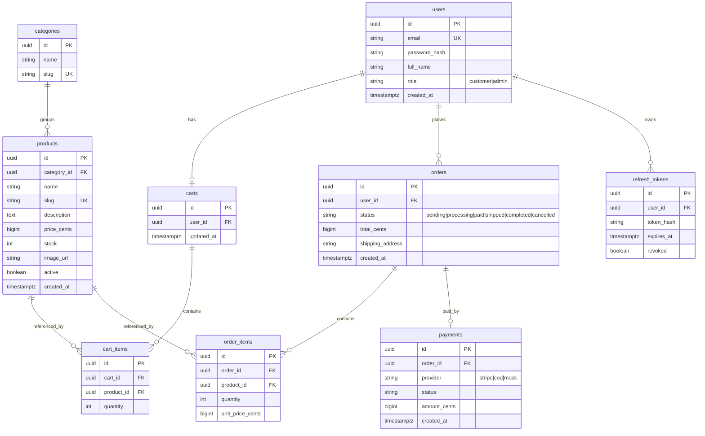
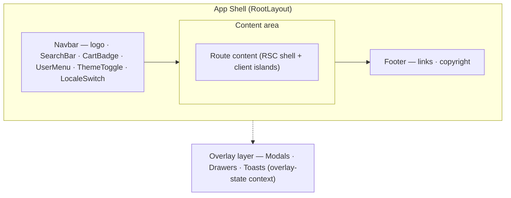
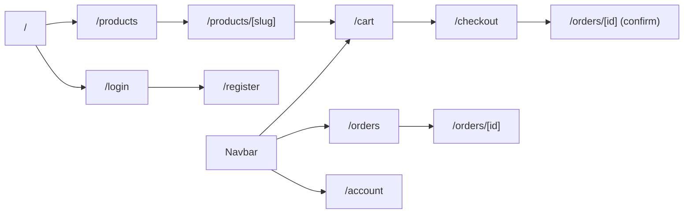
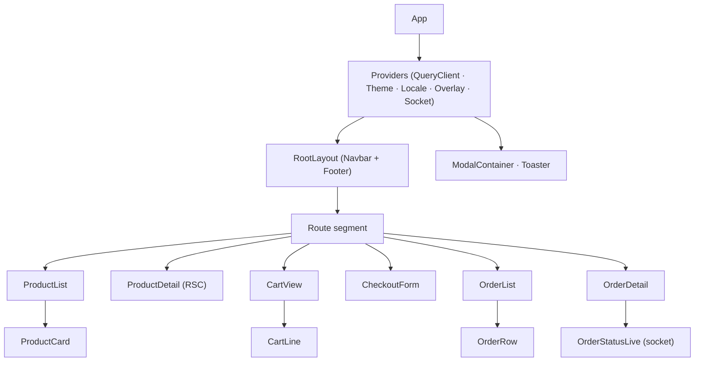
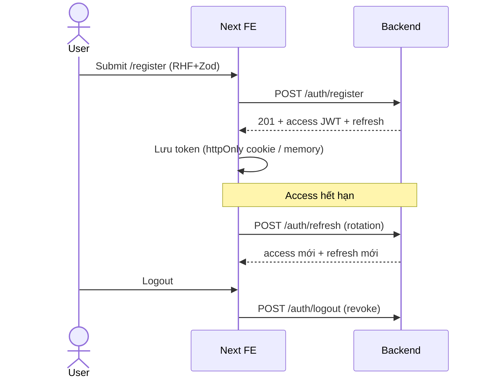
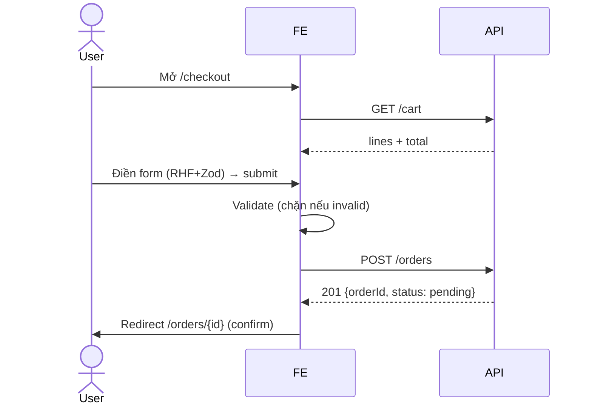

# StarCi Shop — Frontend Roadmap & Design (Personal Project V2)

> Lộ trình + thiết kế chi tiết Frontend cho capstone "StarCi Shop" (Fullstack). Design DB kĩ, kèm sơ đồ mermaid (ER / navigation / sequence / component-tree / layout-vùng) và reference. Để thầy duyệt khung FE.
>
> Liên quan: `personal-project-v2-master-plan.md`, `personal-project-v2-fullstack-roadmap.md`. FE repo thật: `C:\Repositories\starci-academy` (design system `.claude/design/`).

---

## 1. Mục tiêu & phạm vi FE
StarCi Shop FE = một **storefront ecommerce hoàn chỉnh**: khách đăng ký/đăng nhập → duyệt & tìm sản phẩm → xem chi tiết → thêm giỏ → checkout → theo dõi đơn realtime → quản lý tài khoản. Build dần qua các milestone, kết thúc tích hợp với BE + deploy live. Pixel-polish + a11y + i18n + performance là tiêu chuẩn xuyên suốt.

## 2. Tech stack & convention
- **Framework**: Next.js (App Router, RSC + client islands).
- **UI**: **HeroUI v3** + Tailwind v4 (token màu/spacing theo `.claude/design/`).
- **Server state**: TanStack Query (cache, refetch, mutation).
- **Client state**: Zustand (cart, UI) / Jotai (atom cục bộ).
- **Form**: React Hook Form + Zod (`zodResolver`, `z.infer`).
- **i18n**: next-intl (en/vi), không hardcode chuỗi.
- **Realtime**: Socket.IO client.
- **Convention** (theo memory FE): component = folder + `index.tsx`; global state đọc trực tiếp (không prop-drill); modal theo overlay-state context; loading SWR giữ text + Spinner.

## 3. Domain model — DB design (StarCi Shop)
Đây là schema BE mà FE tiêu thụ. Tiền lưu **integer cents** (tránh float). UUID v4 PK. Mọi bảng có `created_at`/`updated_at`.

### Bảng chi tiết (ràng buộc quan trọng)
| Bảng | Khóa/Index | Ràng buộc nghiệp vụ |
|---|---|---|
| `users` | UNIQUE(email) | password_hash bcrypt/argon2; role default `customer` |
| `refresh_tokens` | INDEX(user_id), token_hash | rotation: revoke cũ khi refresh; TTL |
| `products` | UNIQUE(slug), INDEX(category_id, active) | price_cents > 0; stock ≥ 0 |
| `carts` | UNIQUE(user_id) | 1 cart / user |
| `cart_items` | UNIQUE(cart_id, product_id) | quantity > 0; merge khi add trùng |
| `orders` | INDEX(user_id, created_at) | total_cents = Σ(order_items) chốt lúc tạo |
| `order_items` | INDEX(order_id) | unit_price_cents **snapshot** giá lúc mua |
| `payments` | INDEX(order_id) | idempotent theo provider ref |

> **Snapshot giá**: `order_items.unit_price_cents` chụp giá tại thời điểm đặt — đổi giá product sau không ảnh hưởng đơn cũ.

## 4. API surface FE tiêu thụ
| Nhóm | Endpoint | Dùng ở màn |
|---|---|---|
| Auth | `POST /auth/register` · `POST /auth/login` · `POST /auth/refresh` · `POST /auth/logout` | Auth pages |
| Catalog | `GET /products?page&limit&q&category` · `GET /products/:slug` | Storefront, Detail |
| Cart | `GET /cart` · `POST /cart/items` · `PATCH /cart/items/:id` · `DELETE /cart/items/:id` | Cart |
| Order | `POST /orders` · `GET /orders` · `GET /orders/:id` | Checkout, Orders |
| Realtime | `ws /orders` (event `order.status`) | Order detail |
| Me | `GET /me` | Account |

## 5. App shell & layout (sơ đồ vùng)

- Navbar + Footer = server component khung; CartBadge/UserMenu = client island đọc store.
- Overlay (modal/drawer/toast) tách layer riêng, điều khiển qua overlay-state context.

## 6. Routing & navigation map

Route bảo vệ (cần auth): `/checkout`, `/orders*`, `/account`. Guest xem được `/products*`, `/cart` (giỏ tạm).

## 7. Screen catalog (đầy đủ)
| # | Route | Màn hình | Trạng thái hiện tại |
|---|---|---|---|
| 1 | `/login`, `/register` | Auth forms | ❌ **chưa có task** |
| 2 | `/` | Home/landing (featured) | ⚠️ tuỳ chọn |
| 3 | `/products` | Danh sách + filter + phân trang | ✅ M5.0/M5.1 |
| 4 | `/products/[slug]` | Chi tiết sản phẩm (RSC) | ✅ M5.2 |
| 5 | `/cart` | Giỏ hàng | ✅ M6.1 |
| 6 | `/checkout` | Form checkout + tóm tắt | ✅ M6.0 |
| 7 | `/orders` | Lịch sử đơn | ❌ **chưa có task** |
| 8 | `/orders/[id]` | Chi tiết đơn + realtime status | ❌ **chưa có task** |
| 9 | `/account` | Hồ sơ | ⚠️ optional |
| — | App shell/Navbar | Khung + nav state | ❌ **chưa có task riêng** |

## 8. Component architecture

## 9. State management strategy
| Loại state | Công cụ | Ví dụ |
|---|---|---|
| Server state (nguồn = API) | TanStack Query | products, orders, me |
| Client state bền | Zustand (persist) | cart (guest), theme, locale |
| Client state cục bộ | Jotai / useState | filter mở/đóng, form nháp |
| Overlay/UI | overlay-state context | modal, drawer, toast |
- **Nguyên tắc** (theo memory): global state component tự đọc trực tiếp, KHÔNG prop-drill; CẤM `useEffect` trong hook fetch.

## 10. Data fetching (TanStack Query + RSC)
- RSC fetch lần đầu (SEO + first paint nhanh) cho list/detail; client island hydrate + dùng Query cho tương tác.
- `queryKey` derive từ URL search params (filter/page) → back/forward + share link đồng bộ.
- `staleTime`/`gcTime` cấu hình; mutation (add cart, tạo order) `invalidateQueries`.
- `<Suspense>` + skeleton HeroUI cho streaming.

## 11. Auth flow

## 12. Storefront (list / filter / detail)
- `/products`: grid HeroUI `Card`, `Skeleton` khi loading, empty state; filter `Select`/`Slider`/`Input` + `Pagination`, tất cả đẩy lên URL.
- `/products/[slug]`: RSC fetch server-side, `<Suspense>` fallback skeleton; nút "Thêm giỏ" (client).

## 13. Cart
- Guest: cart trong Zustand (persist localStorage). Đăng nhập: merge vào `/cart` server.
- CartBadge ở navbar đọc store; CartView = `Table`/`Card` HeroUI, sửa qty + xoá, tính total client (đối chiếu server).

## 14. Checkout flow

## 15. Orders + realtime
- `/orders`: danh sách đơn (newest first), status `Chip` HeroUI.
- `/orders/[id]`: chi tiết + **OrderStatusLive**: subscribe `ws /orders`, nhận `order.status` → cập nhật `Chip` không reload (chỉ chủ đơn nhận).

## 16. Forms (RHF + Zod)
- 1 Zod schema/`z.infer` type; `zodResolver`; field error inline qua HeroUI `Input isInvalid errorMessage`; submit chỉ khi valid; lỗi server map về field/toast.

## 17. UI system (HeroUI mapping)
| Nhu cầu | HeroUI v3 |
|---|---|
| Nút/CTA | `Button` |
| Form | `Form` · `Input` · `Select` · `Checkbox` |
| Sản phẩm | `Card` · `Image` · `Chip` · `Badge` |
| Điều hướng | `Navbar` · `Tabs` · `Pagination` · `Breadcrumbs` |
| Overlay | `Modal` · `Drawer` · `addToast`/`ToastProvider` |
| Loading | `Skeleton` · `Spinner` |
| Theme | `ThemeProvider` (dark mode) |

## 18. Performance
- `next/image` (no CLS, lazy below-the-fold); code-split widget nặng (`dynamic`); memo hoá nơi cần; bundle trim; đo LCP/CLS.

## 19. Accessibility & i18n
- Keyboard-operable toàn luồng mua hàng; focus visible + focus-trap modal; ARIA role/label; `axe` không lỗi critical.
- next-intl en/vi, không hardcode; số/tiền/ngày format theo locale.

## 20. Error / loading / empty states
- Mỗi data view có 3 trạng thái: loading (skeleton), error (retry), empty (CTA). Mutation: optimistic + rollback khi lỗi + toast.

## 21. FE → capstone task mapping (hiện tại + đề xuất bổ sung)
| Lộ trình FE đề xuất | Task hiện có | Bổ sung cần |
|---|---|---|
| FE-1 App shell + Auth UI | — | ❌ navbar/shell + login/register |
| FE-2 Storefront | M5.0/M5.1/M5.2 ✅ | — |
| FE-3 Cart + Checkout | M6.0/M6.1 ✅ | — |
| FE-4 Orders + Realtime | — | ❌ order history/detail + ws status UI |
| FE-5 Polish/Perf/A11y | M5.3/M7.0/M7.1 ✅ | — |
→ Hụt 3 mảng: **App shell+Auth UI**, **Orders UI**, **Realtime UI**.

## 22. References
- HeroUI v3: https://www.heroui.com/docs
- Next.js App Router / RSC: https://nextjs.org/docs/app
- TanStack Query: https://tanstack.com/query/latest
- React Hook Form: https://react-hook-form.com · Zod: https://zod.dev
- Zustand: https://zustand.docs.pmnd.rs · Jotai: https://jotai.org
- next-intl: https://next-intl.dev
- Socket.IO client: https://socket.io/docs/v4/client-api
- A11y (WAI-ARIA APG): https://www.w3.org/WAI/ARIA/apg
- Deploy ref (VPS+nginx+certbot): https://www.digitalocean.com/community/tutorials/how-to-secure-nginx-with-let-s-encrypt
- Mermaid (sơ đồ doc này): https://mermaid.js.org
- Nội bộ: FE repo `C:\Repositories\starci-academy` · design system `.claude/design/` · memory [[fs-course-overview]] [[frontend-stack]] [[frontend-modal-overlay-pattern]]

---

## Cần thầy chốt
1. **Bổ sung 3 mảng hụt** (App shell+Auth UI / Orders UI / Realtime UI) thành lộ trình FE đầy đủ — đồng ý?
2. **Domain model DB §3** — ổn chưa (thêm categories/payments/refresh_tokens; có cần wishlist/review/coupon)?
3. Mermaid trong doc — thầy render thử coi OK không; cần thêm sơ đồ nào nữa không (vd component state flow)?
