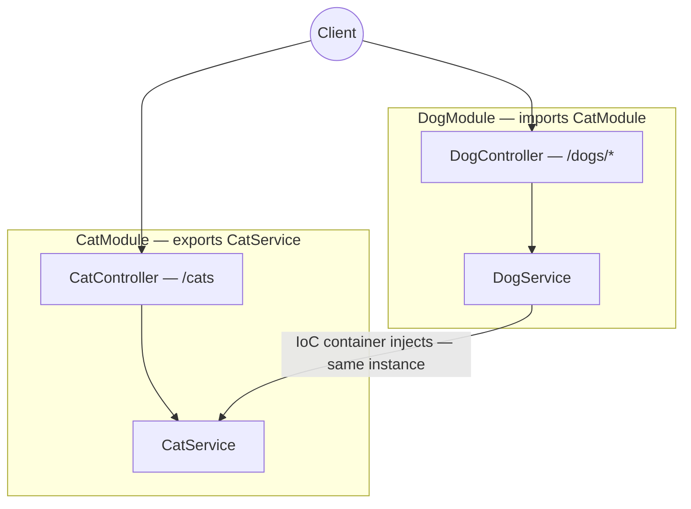

# sortIndex
<!-- @starci/seperator -->
1
<!-- @starci/seperator -->
# lang
<!-- @starci/seperator -->
typescript
<!-- @starci/seperator -->
# body
<!-- @starci/seperator -->
## 1. Opening

*"When one service depends on another, who creates it and who decides both share a single instance?"* — a **Senior Engineer** asks. A **Mid-level Developer** replies: *"I just `new` it wherever I need it."* The answer lacks depth: hand-rolling `new` hard-wires the consumer to a concrete implementation, every service spins up its own copy (losing sharing), and as the dependency graph grows the startup order becomes fragile and tests get locked to real objects.

This lesson ships **NestJS** (runs on the host, no Docker):

- **Part 2.1**: **hands-on** runs a backend with two business areas (`Cat`, `Dog`) and calls a few endpoints to **observe** the framework create and wire dependencies — without a single `new`.
- **Part 2.2**: **theory** consolidates two foundational concepts — *modules and boundaries* (where the framework puts your code) and *inversion of control* (who creates and wires components) — plus typical **edge cases**.

## 2. Core concepts

This lesson follows **practice-led theory**. Students clone the source, run **NestJS** via `nest start --watch`, and call the API to **observe** the container auto-inject a service across modules and share one instance. The theory part then consolidates modules/boundaries, **Dependency Injection**, the **IoC container**, and deep edge cases.

### 2.1. Hands-on

#### 2.1.1. Prepare source code and environment

Purpose: run the demo to see `DogService` reuse `CatService` through the container — without self-instantiation — and both endpoints return the *same* instance.

Source: [StarCi-Academy/fs-1-framework-core-and-request-lifecycle-0-frameworks-in-backend](https://github.com/StarCi-Academy/fs-1-framework-core-and-request-lifecycle-0-frameworks-in-backend) on GitHub.

```bash
# Step 1: Clone the repository locally
git clone https://github.com/StarCi-Academy/fs-1-framework-core-and-request-lifecycle-0-frameworks-in-backend.git

# Step 2: Navigate to the lesson directory
cd fs-1-framework-core-and-request-lifecycle-0-frameworks-in-backend
```

#### 2.1.2. Architecture / components

The demo has two **modules** — each a *bounded context* with its own public surface:

- **`CatModule`:** wraps `CatController` + `CatService`, and `exports: [CatService]` to open the service up.
- **`DogModule`:** `imports: [CatModule]` to be allowed to use `CatService`; holds `DogController` + `DogService`.
- **`CatService`:** a singleton provider, the shared dependency.
- **`DogService`:** receives `CatService` via the constructor — no `new`.

| Component | File | Role |
| --- | --- | --- |
| `CatModule` | `backend/src/cat/cat.module.ts` | Declares the boundary + `exports: [CatService]` |
| `CatService` | `backend/src/cat/cat.service.ts` | Singleton provider, the shared surface |
| `DogModule` | `backend/src/dog/dog.module.ts` | `imports: [CatModule]` to use `CatService` |
| `DogService` | `backend/src/dog/dog.service.ts` | Injects `CatService` via the constructor |



Figure 1: Module boundary + the IoC container injecting `CatService` (singleton) across `DogModule`.

#### 2.1.3. Code walkthrough and essence

Focus: *why nothing is ever `new`-ed yet the components are wired correctly — and why they share a single instance*.

##### 2.1.3.1. `exports` opens the boundary — the module's public surface

```typescript
@Module({
    controllers: [CatController],
    providers: [CatService],
    exports: [CatService],
})
export class CatModule {}
```

`providers` registers `CatService` *inside* `CatModule`; `exports` is what other modules may use. Drop `exports` and the app throws `Nest can't resolve dependencies` at bootstrap. Essence: the boundary is a **startup-time check** that turns architectural intent into an early error instead of a runtime bug.

##### 2.1.3.2. The constructor declares dependencies — IoC, not self-instantiation

```typescript
@Injectable()
export class DogService {
    constructor(private readonly cat: CatService) {}

    getSpyReport() {
        return { mission: "cross-module-dependency-check", dependency: this.cat.getSpyHint(), status: "ok" }
    }
}
```

`DogService` does not `new CatService()` — it merely *declares* "I need a `CatService`" via the constructor parameter type. The container reads that type, builds the dependency graph, and injects it. This is **inversion of control**: the power to create objects moves from the consumer to the container.

##### 2.1.3.3. `imports` bridges modules — you can only use what was exported

```typescript
@Module({
    imports: [CatModule],
    controllers: [DogController],
    providers: [DogService],
})
export class DogModule {}
```

`DogModule` `imports: [CatModule]`, so `DogService` can resolve `CatService` (the thing `CatModule` `exports`). Without the import the container does not see `CatService` within `DogModule`'s scope → a resolution error. Essence: cross-module dependencies are **explicit** — a module can only consume what another module deliberately opened up.

> This concept is **portable**: IoC/DI is a universal pattern. Quick contrast — ASP.NET Core uses a built-in container + `AddSingleton`/constructor injection, Spring uses `@Component`/`@Autowired` + component scan, and Go has no container so you wire by hand at `main` (the composition root). Same idea: the consumer declares "what I need", and one central place handles creation, wiring, and lifecycle.

#### 2.1.4. Prerequisites and startup

##### 2.1.4.1. Prerequisites

- **Node.js** LTS (≥ 18), **npm** or **pnpm**, **NestJS CLI** (`npm i -g @nestjs/cli`).
- Port **3000** available on the host (the NestJS backend).
- **Windows:** use `Invoke-RestMethod` instead of `curl`.

##### 2.1.4.2. Start

```bash
# Step 1: Enter the directory
cd backend/0-typescript

# Step 2: Install dependencies
npm install

# Step 3: Run (watch)
nest start --watch
```

The app listens at `http://localhost:3000`.

#### 2.1.5. Verification

**3 flows** below — each verifies one goal; expand a flow to run it:

- **Flow 1 — `GET /cats`:** routes map to the right controller → service.
- **Flow 2 — `GET /dogs/spy`:** the dependency comes from `CatService` via cross-module DI.
- **Flow 3 — `GET /dogs/cats-via-di`:** a single `CatService` instance is shared.

::::accordion
:::panel{title="Flow 1 — routes map controller → service"}

- Step 1: call `GET /cats`.

  ```bash
  # Windows (PowerShell)
  Invoke-RestMethod -Uri "http://localhost:3000/cats"

  # macOS / Linux
  # → Paste cURL into Postman: Import → Raw text
  curl -s http://localhost:3000/cats
  ```

  Response should return (HTTP 200):

  ```json
  [{ "id": 1, "name": "Milo" }, { "id": 2, "name": "Luna" }]
  ```

*Conclusion: If the response matches the JSON above, the system confirms:*

- *The app bootstrapped and the container mapped `CatController` → `CatService` correctly.*

:::
:::panel{title="Flow 2 — cross-module DI"}

- Step 1: call `GET /dogs/spy`.

  ```bash
  # Windows (PowerShell)
  Invoke-RestMethod -Uri "http://localhost:3000/dogs/spy"

  # macOS / Linux
  # → Paste cURL into Postman: Import → Raw text
  curl -s http://localhost:3000/dogs/spy
  ```

  Response should return (HTTP 200):

  ```json
  { "mission": "cross-module-dependency-check", "dependency": "cat-network-ready", "status": "ok" }
  ```

*Conclusion: If the response matches the JSON above, the system confirms:*

- *`dependency` comes from `CatService` — the framework injected across modules, with no `new CatService()`.*

:::
:::panel{title="Flow 3 — a single shared instance (singleton)"}

- Step 1: call `GET /dogs/cats-via-di`.

  ```bash
  # Windows (PowerShell)
  Invoke-RestMethod -Uri "http://localhost:3000/dogs/cats-via-di"

  # macOS / Linux
  # → Paste cURL into Postman: Import → Raw text
  curl -s http://localhost:3000/dogs/cats-via-di
  ```

  Response should return (HTTP 200):

  ```json
  { "dog": "Rex", "borrowedCats": [{ "id": 1, "name": "Milo" }, { "id": 2, "name": "Luna" }] }
  ```

*Conclusion: If the response matches the JSON above, the system confirms:*

- *`borrowedCats` matches `GET /cats` exactly — `DogService` and `CatController` share ONE `CatService` instance (singleton).*

:::
::::

#### 2.1.6. Cleanup

This lesson does not use Docker, no resource cleanup is needed. Press `Ctrl+C` in the terminal to stop NestJS.

#### 2.1.7. Further reading

- **Modules:** boundaries that package providers/controllers by domain and control the shared surface via `exports`. ([NestJS Modules](https://docs.nestjs.com/modules))
- **Providers & DI:** how the container resolves and injects dependencies via the constructor. ([NestJS Providers](https://docs.nestjs.com/providers))
- **Injection scopes:** why singleton is the default and when you need `Scope.REQUEST`. ([NestJS Injection Scopes](https://docs.nestjs.com/fundamentals/injection-scopes))

### 2.2. Theory

#### 2.2.1. The essence

The essence of a backend framework like NestJS comes down to one thing: **the framework takes over creating objects, wiring dependencies, and managing lifecycles — the developer only *declares intent*, never `new`s**. This is *inversion of control* (IoC). The three facets below are not three separate concepts but three views of that one essence.

- **Who creates, who wires (Dependency Injection + IoC container).** A component declares its dependencies via *constructor parameter types*; the **IoC container** reads those types, builds the dependency graph, creates instances in the right order, and injects them. Why this is the core and not a convenience: `new CatService()` hard-wires the consumer to one concrete implementation (hard to swap), creates a private copy (loses sharing), and ties tests to the real object. Handing creation to the container buys *testability* (natural mocking), *loose coupling* (swap an implementation without touching consumers), *lifecycle management* (the container owns the lifecycle). Verified in Flow 2: `dependency` comes from `CatService`, which `DogService` never instantiated.
- **Where code lives, what is shared (modules and boundaries).** `@Module` packages a *bounded context* (controllers + providers of one domain); the `exports` array is the **public surface** — only what is in it may be used by another module via `imports`. The essence: a boundary turns architectural intent into a **startup-time check** — cross-module dependencies must stay explicit, and a missing `exports`/`imports` becomes a bootstrap error rather than a silent runtime bug. This is how the framework "puts code in the right place" while still controlling what leaks out.
- **How long it lives, how widely it is shared (providers and scope).** A provider is a **singleton** by default — one instance shared app-wide (Flow 3 proves it), cheap and sufficient for stateless services. Only when each request needs strictly-isolated state (e.g. tenant context) do you reach for `Scope.REQUEST`; but request scope *propagates* up the whole dependency chain (everything that depends on it is also re-created per request) and pays a repeated creation cost — so it is the exception, not the default.

Putting it together: the framework "holds" all three — *create + wire + lifecycle* — while the developer only describes "what I need, what I expose, how long it lives". Learning a new framework is exactly finding how it implements these three facets.

#### 2.2.2. Edge cases to internalize

- **Missing `exports`:** another module fails to resolve at bootstrap. **Solution:** always export exactly what needs sharing.
- **Circular dependency:** `A ↔ B` makes the graph unbuildable. **Solution:** extract the shared part; `forwardRef` is only a last resort.
- **Overusing `Scope.REQUEST`:** lowers throughput via re-creation + scope propagation. **Solution:** default to singleton, request-scope only when required.
- **Hard-coding config into a static module:** hard to reuse/switch environments. **Solution:** use a dynamic module (`forRoot`/`forRootAsync`).

## 3. Wrap-up

### 3.1. Common interview questions

- **Question 1: What does inversion of control solve compared to self-instantiating dependencies?**
  - What interviewers want to hear: it moves object creation to the container for loose coupling + testability.
  - Sample answer (concise): When you `new` things yourself, a component is hard-wired to a concrete implementation, so it is hard to test and hard to swap. IoC moves creation to the container; the component only declares "what it needs" via the constructor. That lets you mock dependencies naturally in tests and swap implementations without touching consumers.
- **Question 2: Why have clear module boundaries instead of lumping everything together?**
  - What interviewers want to hear: `exports`/`imports` make cross-module dependencies explicit and fail early.
  - Sample answer (concise): A boundary forces each area to open only what needs sharing via `exports`, and another module can only use it through `imports`. Cross-module dependencies become explicit and checkable at bootstrap. Lumping everything together makes everything depend on everything, which is hard to split and hard to test.
- **Question 3: When do you use a singleton versus per-request state?**
  - What interviewers want to hear: default to singleton; use `Scope.REQUEST` only when state must not leak across requests.
  - Sample answer (concise): Default to singleton because it is cheap and enough for stateless services. Use `Scope.REQUEST` only when each request carries state that must absolutely not be shared, e.g. tenant context. In exchange you pay the cost of re-creating the instance per request, and the scope propagates up the whole dependency chain.
<!-- @starci/seperator -->
