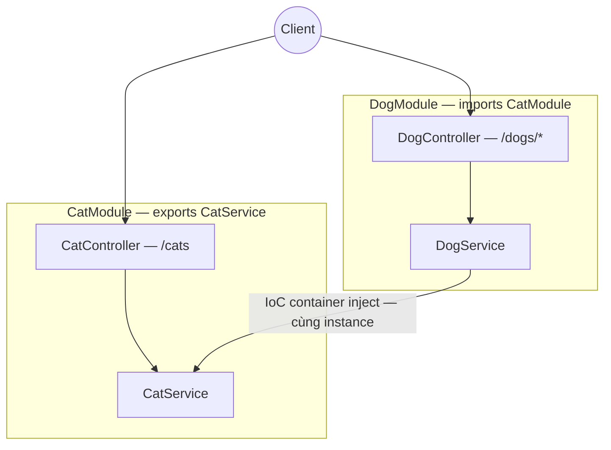

# sortIndex
<!-- @starci/seperator -->
1
<!-- @starci/seperator -->
# lang
<!-- @starci/seperator -->
typescript
<!-- @starci/seperator -->
# body
<!-- @starci/seperator -->
## 1. Lời mở đầu

*"Khi một service phụ thuộc service khác, ai tạo ra nó và ai quyết định cả hai dùng chung một instance?"* — một **Senior Engineer** đặt câu hỏi. **Mid-level Developer** đáp: *"Em `new` ra ở đâu cần là xong."* Câu trả lời thiếu chiều sâu: tự `new` khoá cứng consumer vào một implementation cụ thể, mỗi service sinh ra một bản sao riêng (mất tính dùng chung), và khi **dependency graph** lớn lên thì thứ tự khởi tạo trở nên mong manh, test bị buộc vào object thật.

Bài học triển khai **NestJS** (chạy trên host, không Docker):

- **Phần 2.1**: **thực hành** chạy một backend hai vùng nghiệp vụ (`Cat`, `Dog`) và gọi vài endpoint để **quan sát** framework tự tạo + ghép nối phụ thuộc — không có một dòng `new` nào.
- **Phần 2.2**: **lý thuyết** hệ thống hoá hai khái niệm nền tảng — *module và ranh giới* (framework đặt code vào đâu) và *inversion of control* (ai tạo + ghép nối) — kèm các **edge case** điển hình.

## 2. Các khái niệm cốt lõi

Bài tuân theo **Thực hành dẫn dắt Lý thuyết**. Học viên clone source, chạy **NestJS** bằng `nest start --watch` và gọi API để **quan sát** việc container tự inject service xuyên module và chia sẻ cùng một instance. Sau đó phần lý thuyết hệ thống hoá module/ranh giới, **Dependency Injection**, **IoC container** và phân tích các edge case chuyên sâu.

### 2.1. Thực hành

#### 2.1.1. Chuẩn bị source code và môi trường

Mục đích: chạy demo để thấy `DogService` dùng lại `CatService` qua container — không tự khởi tạo — và cả hai endpoint trả về *cùng một* instance.

Source: [StarCi-Academy/fs-1-framework-core-and-request-lifecycle-0-frameworks-in-backend](https://github.com/StarCi-Academy/fs-1-framework-core-and-request-lifecycle-0-frameworks-in-backend) trên GitHub.

```bash
# Bước 1: Clone repository về máy local
git clone https://github.com/StarCi-Academy/fs-1-framework-core-and-request-lifecycle-0-frameworks-in-backend.git

# Bước 2: Di chuyển vào đúng thư mục bài học
cd fs-1-framework-core-and-request-lifecycle-0-frameworks-in-backend
```

#### 2.1.2. Kiến trúc / thành phần

Demo có hai **module** — mỗi module là một *bounded context* với bề mặt công khai riêng:

- **`CatModule`:** đóng gói `CatController` + `CatService`, và `exports: [CatService]` để mở service ra ngoài.
- **`DogModule`:** `imports: [CatModule]` để được phép dùng `CatService`; chứa `DogController` + `DogService`.
- **`CatService`:** provider singleton, là phụ thuộc được chia sẻ.
- **`DogService`:** nhận `CatService` qua constructor — không `new`.

| Thành phần | File | Vai trò |
| --- | --- | --- |
| `CatModule` | `backend/src/cat/cat.module.ts` | Khai báo ranh giới + `exports: [CatService]` |
| `CatService` | `backend/src/cat/cat.service.ts` | Provider singleton, bề mặt chia sẻ |
| `DogModule` | `backend/src/dog/dog.module.ts` | `imports: [CatModule]` để dùng `CatService` |
| `DogService` | `backend/src/dog/dog.service.ts` | Inject `CatService` qua constructor |



Hình 1: Ranh giới module + IoC container inject `CatService` (singleton) xuyên `DogModule`.

#### 2.1.3. Giải thích code và bản chất

Trọng tâm: *vì sao không có dòng `new` nào mà các thành phần vẫn được ghép nối đúng — và vì sao chúng dùng chung một instance*.

##### 2.1.3.1. `exports` mở ranh giới — bề mặt công khai của module

```typescript
@Module({
    controllers: [CatController],
    providers: [CatService],
    exports: [CatService],
})
export class CatModule {}
```

`providers` đăng ký `CatService` *bên trong* `CatModule`; `exports` mới là thứ cho module khác dùng. Bỏ `exports`, app ném `Nest can't resolve dependencies` ngay lúc bootstrap. Bản chất: ranh giới là **luật kiểm tra lúc khởi động**, biến ý đồ kiến trúc thành lỗi sớm thay vì bug lúc chạy.

##### 2.1.3.2. Constructor khai báo phụ thuộc — IoC, không tự khởi tạo

```typescript
@Injectable()
export class DogService {
    constructor(private readonly cat: CatService) {}

    getSpyReport() {
        return { mission: "cross-module-dependency-check", dependency: this.cat.getSpyHint(), status: "ok" }
    }
}
```

`DogService` không `new CatService()` — nó chỉ *khai báo* "cần một `CatService`" qua kiểu tham số constructor. Container đọc kiểu đó, tự dựng dependency graph và inject vào. Đây là **inversion of control**: quyền tạo object chuyển từ consumer sang container.

##### 2.1.3.3. `imports` bắc cầu liên-module — chỉ dùng được thứ đã export

```typescript
@Module({
    imports: [CatModule],
    controllers: [DogController],
    providers: [DogService],
})
export class DogModule {}
```

`DogModule` `imports: [CatModule]` nên `DogService` mới resolve được `CatService` (cái `CatModule` đã `exports`). Không import thì container không thấy `CatService` trong phạm vi `DogModule` → lỗi resolve. Bản chất: phụ thuộc chéo là **tường minh** — module chỉ tiêu thụ được thứ module khác chủ động mở ra.

> Khái niệm này **portable**: IoC/DI là pattern phổ quát. Đối chiếu ngắn — ASP.NET Core dùng built-in container + `AddSingleton`/constructor injection, Spring dùng `@Component`/`@Autowired` + component scan, Go không có container nên ghép nối thủ công ở `main` (**composition root**). Đều chung ý: consumer khai báo "cần gì", một nơi tập trung lo việc tạo + ghép nối + vòng đời.

#### 2.1.4. Chuẩn bị & khởi chạy

##### 2.1.4.1. Điều kiện cần trước

- **Node.js** LTS (≥ 18), **npm** hoặc **pnpm**, **NestJS CLI** (`npm i -g @nestjs/cli`).
- Port **3000** available trên host (backend NestJS).
- **Windows:** dùng `Invoke-RestMethod` thay cho `curl`.

##### 2.1.4.2. Khởi động

```bash
# Bước 1: Vào thư mục backend
cd backend/0-typescript

# Bước 2: Cài dependency
npm install

# Bước 3: Chạy (watch)
nest start --watch
```

App lắng nghe tại `http://localhost:3000`.

#### 2.1.5. Kiểm thử

**3 luồng** dưới đây, mỗi luồng kiểm chứng một mục tiêu — mở từng luồng để chạy:

- **Luồng 1 — `GET /cats`:** route map đúng controller → service.
- **Luồng 2 — `GET /dogs/spy`:** phụ thuộc đến từ `CatService` qua DI xuyên module.
- **Luồng 3 — `GET /dogs/cats-via-di`:** cùng một instance `CatService` được chia sẻ.

::::accordion
:::panel{title="Luồng 1 — route map controller → service"}

- Bước 1: gọi `GET /cats`.

  ```bash
  # Windows (PowerShell)
  Invoke-RestMethod -Uri "http://localhost:3000/cats"

  # macOS / Linux
  # → Dán cURL vào Postman: Import → Raw text
  curl -s http://localhost:3000/cats
  ```

  Response phải trả về (HTTP 200):

  ```json
  [{ "id": 1, "name": "Milo" }, { "id": 2, "name": "Luna" }]
  ```

*Kết luận: Nếu response khớp JSON trên, hệ thống xác nhận:*

- *App bootstrap thành công, container map đúng `CatController` → `CatService`.*

:::
:::panel{title="Luồng 2 — DI xuyên module"}

- Bước 1: gọi `GET /dogs/spy`.

  ```bash
  # Windows (PowerShell)
  Invoke-RestMethod -Uri "http://localhost:3000/dogs/spy"

  # macOS / Linux
  # → Dán cURL vào Postman: Import → Raw text
  curl -s http://localhost:3000/dogs/spy
  ```

  Response phải trả về (HTTP 200):

  ```json
  { "mission": "cross-module-dependency-check", "dependency": "cat-network-ready", "status": "ok" }
  ```

*Kết luận: Nếu response khớp JSON trên, hệ thống xác nhận:*

- *`dependency` đến từ `CatService` — framework đã inject xuyên module, không có `new CatService()`.*

:::
:::panel{title="Luồng 3 — cùng một instance (singleton)"}

- Bước 1: gọi `GET /dogs/cats-via-di`.

  ```bash
  # Windows (PowerShell)
  Invoke-RestMethod -Uri "http://localhost:3000/dogs/cats-via-di"

  # macOS / Linux
  # → Dán cURL vào Postman: Import → Raw text
  curl -s http://localhost:3000/dogs/cats-via-di
  ```

  Response phải trả về (HTTP 200):

  ```json
  { "dog": "Rex", "borrowedCats": [{ "id": 1, "name": "Milo" }, { "id": 2, "name": "Luna" }] }
  ```

*Kết luận: Nếu response khớp JSON trên, hệ thống xác nhận:*

- *`borrowedCats` trùng đúng `GET /cats` — `DogService` và `CatController` dùng chung MỘT instance `CatService` (singleton).*

:::
::::

#### 2.1.6. Dọn tài nguyên

Bài này không sử dụng Docker, không cần dọn tài nguyên. Nhấn `Ctrl+C` trong terminal để dừng NestJS.

#### 2.1.7. Đọc thêm

- **Modules:** ranh giới đóng gói provider/controller theo domain và kiểm soát bề mặt chia sẻ qua `exports`. ([NestJS Modules](https://docs.nestjs.com/modules))
- **Providers & DI:** cách container resolve và inject phụ thuộc qua constructor. ([NestJS Providers](https://docs.nestjs.com/providers))
- **Injection scopes:** vì sao singleton là mặc định và khi nào cần `Scope.REQUEST`. ([NestJS Injection Scopes](https://docs.nestjs.com/fundamentals/injection-scopes))

### 2.2. Lý thuyết

#### 2.2.1. Bản chất

Bản chất của một backend framework như NestJS gói gọn trong một điều: **framework giành lấy quyền tạo object, ghép nối phụ thuộc và quản vòng đời — dev chỉ *khai báo ý đồ*, không tự `new`**. Đây là *inversion of control* (IoC). Ba mặt dưới đây không phải ba khái niệm rời rạc mà là ba góc nhìn của cùng một bản chất đó.

- **Ai tạo, ai ghép (Dependency Injection + IoC container).** Thành phần khai báo phụ thuộc qua *kiểu tham số constructor*; **IoC container** đọc kiểu đó, dựng dependency graph, tạo instance đúng thứ tự rồi inject. Vì sao điều này là cốt lõi chứ không phải tiện ích: tự `new CatService()` khoá cứng consumer vào một implementation cụ thể (khó swap), tạo bản sao riêng (mất chia sẻ), và buộc test vào object thật. Chuyển quyền tạo cho container đổi lấy *testability* (mock tự nhiên), *loose coupling* (đổi implementation không sửa consumer), *lifecycle management* (container quản vòng đời). Verify ở Luồng 2: `dependency` đến từ `CatService` mà `DogService` không hề khởi tạo.
- **Code đặt đâu, gì được chia sẻ (module và ranh giới).** `@Module` đóng gói một *bounded context* (controller + provider cùng domain); mảng `exports` là **bề mặt công khai** — chỉ thứ trong đó mới được module khác dùng qua `imports`. Bản chất: ranh giới biến ý đồ kiến trúc thành **luật kiểm tra lúc khởi động** — phụ thuộc chéo phải tường minh, thiếu `exports`/`imports` thành lỗi bootstrap chứ không phải bug runtime âm thầm. Đây là cách framework "đặt code vào đúng chỗ" mà vẫn kiểm soát được cái gì lộ ra ngoài.
- **Sống bao lâu, dùng chung tới đâu (provider và scope).** Provider mặc định là **singleton** — một instance dùng chung toàn app (Luồng 3 chứng minh), rẻ và đủ cho service stateless. Khi mỗi request cần state riêng tuyệt đối không được lẫn (vd tenant context) mới dùng `Scope.REQUEST`; nhưng request scope *lan* lên cả chuỗi phụ thuộc (mọi thứ phụ thuộc nó cũng bị tạo lại mỗi request) và có chi phí khởi tạo lặp lại — nên là ngoại lệ, không phải mặc định.

Gộp lại: framework "cầm" cả ba — *tạo + ghép + vòng đời* — còn dev chỉ mô tả "cần gì, mở gì, sống bao lâu". Hiểu một framework mới chính là tìm xem nó hiện thực ba mặt này thế nào.

#### 2.2.2. Các trường hợp biên (edge cases) cần lưu ý

- **Thiếu `exports`:** module khác lỗi resolve lúc bootstrap. **Giải pháp:** luôn export đúng thứ cần chia sẻ.
- **Circular dependency:** `A ↔ B` khiến đồ thị không dựng được. **Giải pháp:** tách phần chung ra; `forwardRef` chỉ là cứu cánh.
- **Lạm dụng `Scope.REQUEST`:** hạ throughput do tạo lại + lan scope. **Giải pháp:** mặc định singleton, chỉ request-scope khi bắt buộc.
- **Hard-code config vào module tĩnh:** khó tái dùng/đổi môi trường. **Giải pháp:** dùng dynamic module (`forRoot`/`forRootAsync`).

## 3. Tổng kết

### 3.1. Các câu hỏi dễ bị phỏng vấn

- **Câu hỏi 1: Inversion of control giải quyết vấn đề gì so với tự khởi tạo phụ thuộc?**
  - Ý interviewer muốn nghe: chuyển quyền tạo object sang container để loose coupling + testability.
  - Trả lời mẫu (ngắn): Khi tự `new`, thành phần bị khoá cứng vào một implementation cụ thể nên khó test và khó swap. IoC chuyển quyền tạo cho container; thành phần chỉ khai báo "cần gì" qua constructor. Nhờ đó ta mock phụ thuộc tự nhiên khi test, và đổi implementation mà không sửa consumer.
- **Câu hỏi 2: Vì sao cần ranh giới module rõ thay vì gom hết một chỗ?**
  - Ý interviewer muốn nghe: `exports`/`imports` biến phụ thuộc chéo thành khai báo tường minh, lỗi sớm.
  - Trả lời mẫu (ngắn): Ranh giới buộc mỗi vùng chỉ mở đúng thứ cần chia sẻ qua `exports`, và module khác chỉ dùng được khi `imports`. Phụ thuộc chéo trở nên tường minh và kiểm tra được lúc bootstrap. Gom hết một chỗ làm mọi thứ phụ thuộc mọi thứ, khó tách và khó test.
- **Câu hỏi 3: Khi nào dùng singleton, khi nào cần state riêng mỗi request?**
  - Ý interviewer muốn nghe: mặc định singleton; chỉ `Scope.REQUEST` khi state không được lẫn giữa request.
  - Trả lời mẫu (ngắn): Mặc định singleton vì rẻ và đủ cho service stateless. Chỉ dùng `Scope.REQUEST` khi mỗi request mang state riêng tuyệt đối không được lẫn, ví dụ tenant context. Đổi lại phải chịu chi phí tạo lại instance mỗi request và scope lan lên cả chuỗi phụ thuộc.
<!-- @starci/seperator -->
