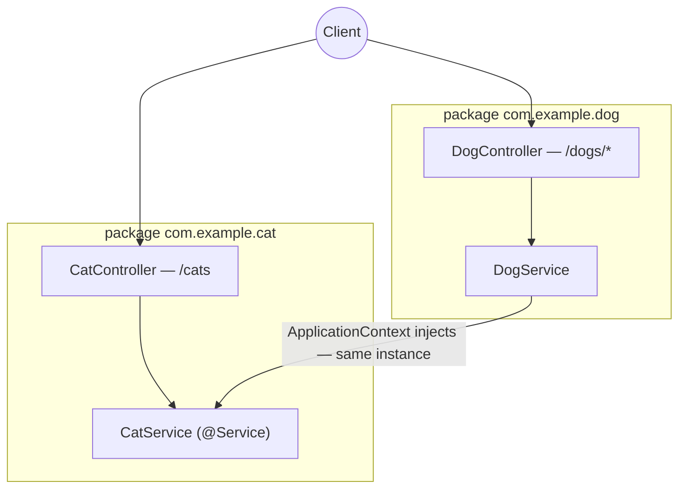

# sortIndex
<!-- @starci/seperator -->
2
<!-- @starci/seperator -->
# lang
<!-- @starci/seperator -->
java
<!-- @starci/seperator -->
# body
<!-- @starci/seperator -->
## 1. Opening

*"When one service depends on another, who creates it and who decides both share a single instance?"* — a **Senior Engineer** asks. A **Mid-level Developer** replies: *"I just `new` it wherever I need it."* The answer lacks depth: hand-rolling `new` hard-wires the consumer to a concrete implementation, every service spins up its own copy (losing sharing), and as the dependency graph grows the startup order becomes fragile and tests get locked to real objects.

This lesson ships **Spring Boot** (runs on the host, no Docker):

- **Part 2.1**: **hands-on** runs a backend with two business areas (`Cat`, `Dog`) and calls a few endpoints to **observe** the framework create and wire dependencies — without a single `new`.
- **Part 2.2**: **theory** consolidates two foundational concepts — *beans and the component-scan boundary* (where the framework puts your code) and *inversion of control* (who creates and wires components) — plus typical **edge cases**.

## 2. Core concepts

This lesson follows **practice-led theory**. Students clone the source, run **Spring Boot** via `mvn spring-boot:run`, and call the API to **observe** the `ApplicationContext` auto-inject a bean across packages and share one instance. The theory part then consolidates beans/component scan, **Dependency Injection**, the **IoC container**, and deep edge cases.

### 2.1. Hands-on

#### 2.1.1. Prepare source code and environment

Purpose: run the demo to see `DogService` reuse `CatService` through the container — without self-instantiation — and both endpoints return the *same* instance.

Source: [StarCi-Academy/fs-1-framework-core-and-request-lifecycle-0-frameworks-in-backend](https://github.com/StarCi-Academy/fs-1-framework-core-and-request-lifecycle-0-frameworks-in-backend) on GitHub.

```bash
# Step 1: Clone the repository locally
git clone https://github.com/StarCi-Academy/fs-1-framework-core-and-request-lifecycle-0-frameworks-in-backend.git

# Step 2: Navigate to the lesson directory
cd fs-1-framework-core-and-request-lifecycle-0-frameworks-in-backend
```

#### 2.1.2. Architecture / components

The demo has two **business packages** — each a separate area that the `ApplicationContext` scans and wires:

- **`com.example.cat`:** holds `CatController` + `CatService` (`@Service`), the shared dependency.
- **`com.example.dog`:** holds `DogController` + `DogService`; `DogService` receives `CatService` via the constructor.
- **`@SpringBootApplication`:** sits at the base package `com.example`, enabling component scan for both subpackages.
- **`CatService`:** a singleton bean — the shared surface.

| Component | File | Role |
| --- | --- | --- |
| `Application` | `src/main/java/com/example/Application.java` | `@SpringBootApplication` — base package + component scan |
| `CatService` | `src/main/java/com/example/cat/CatService.java` | Singleton bean (`@Service`), the shared surface |
| `DogService` | `src/main/java/com/example/dog/DogService.java` | Injects `CatService` via the constructor |
| `CatController` / `DogController` | `.../cat/CatController.java`, `.../dog/DogController.java` | Expose the REST endpoints |



Figure 1: Component scan + the ApplicationContext injecting `CatService` (singleton) across package `com.example.dog`.

#### 2.1.3. Code walkthrough and essence

Focus: *why nothing is ever `new`-ed yet the components are wired correctly — and why they share a single instance*.

##### 2.1.3.1. `@Service` + component scan — registering and discovering a bean

```java
// com.example.cat.CatService
@Service
public class CatService {
    public String getSpyHint() {
        return "cat-network-ready";
    }
    public List<Cat> findAll() {
        return List.of(new Cat(1, "Milo"), new Cat(2, "Luna"));
    }
}
```

`@Service` marks `CatService` as a **bean**; the `ApplicationContext` scans the base package `com.example` and registers it automatically. This is Spring's "boundary": only what sits in the scan path becomes a usable bean — place a class outside the base package without `@ComponentScan` and the container will not see it.

##### 2.1.3.2. Constructor injection — IoC, not self-instantiation

```java
// com.example.dog.DogService
@Service
public class DogService {
    private final CatService cat;

    public DogService(CatService cat) {
        this.cat = cat;
    }

    public Map<String, Object> getSpyReport() {
        return Map.of("mission", "cross-module-dependency-check", "dependency", cat.getSpyHint(), "status", "ok");
    }
}
```

`DogService` does not `new CatService()` — it merely *declares* "I need a `CatService`" via the constructor parameter. Spring auto-wires the single constructor, reads the parameter type, builds the dependency graph, and injects it. This is **inversion of control**: the power to create objects moves from the consumer to the container.

##### 2.1.3.3. Cross-package wiring — beans in the same scan path wire automatically

```java
// com.example.Application
@SpringBootApplication
public class Application {
    public static void main(String[] args) {
        SpringApplication.run(Application.class, args);
    }
}
```

`@SpringBootApplication` at `com.example` enables scanning of both `com.example.cat` and `com.example.dog`, so a bean in one package can resolve a bean in the other with no extra declaration. Essence: cross-package dependencies are wired **automatically within the scan** — but a bean outside the base package needs `@ComponentScan` to appear.

> This concept is **portable**: IoC/DI is a universal pattern. Quick contrast — NestJS uses explicit `@Module` + `exports`/`imports`, ASP.NET Core uses a built-in container + `AddSingleton`/constructor injection, and Go has no container so you wire by hand at `main` (the composition root). Same idea: the consumer declares "what I need", and one central place handles creation, wiring, and lifecycle.

#### 2.1.4. Prerequisites and startup

##### 2.1.4.1. Prerequisites

- **JDK 21** (LTS) and **Maven** (or the bundled `./mvnw` wrapper).
- Port **3000** available on the host (Spring Boot backend).
- **Windows:** use `Invoke-RestMethod` instead of `curl`.

##### 2.1.4.2. Start

```bash
# Step 1: Enter the directory
cd backend/1-java

# Step 2: Install dependencies
mvn install -DskipTests

# Step 3: Run (watch)
mvn spring-boot:run
```

The app listens at `http://localhost:3000`.

#### 2.1.5. Verification

**3 flows** below — each verifies one goal; expand a flow to run it:

- **Flow 1 — `GET /cats`:** routes map to the right controller → service.
- **Flow 2 — `GET /dogs/spy`:** the dependency comes from `CatService` via cross-package DI.
- **Flow 3 — `GET /dogs/cats-via-di`:** a single `CatService` instance is shared.

::::accordion
:::panel{title="Flow 1 — routes map controller → service"}

- Step 1: call `GET /cats`.

  ```bash
  # Windows (PowerShell)
  Invoke-RestMethod -Uri "http://localhost:3000/cats"

  # macOS / Linux
  # → Paste cURL into Postman: Import → Raw text
  curl -s http://localhost:3000/cats
  ```

  Response should return (HTTP 200):

  ```json
  [{ "id": 1, "name": "Milo" }, { "id": 2, "name": "Luna" }]
  ```

*Conclusion: If the response matches the JSON above, the system confirms:*

- *The app bootstrapped and the container mapped `CatController` → `CatService` correctly.*

:::
:::panel{title="Flow 2 — cross-package DI"}

- Step 1: call `GET /dogs/spy`.

  ```bash
  # Windows (PowerShell)
  Invoke-RestMethod -Uri "http://localhost:3000/dogs/spy"

  # macOS / Linux
  # → Paste cURL into Postman: Import → Raw text
  curl -s http://localhost:3000/dogs/spy
  ```

  Response should return (HTTP 200):

  ```json
  { "mission": "cross-module-dependency-check", "dependency": "cat-network-ready", "status": "ok" }
  ```

*Conclusion: If the response matches the JSON above, the system confirms:*

- *`dependency` comes from `CatService` — the framework injected across packages, with no `new CatService()`.*

:::
:::panel{title="Flow 3 — a single shared instance (singleton)"}

- Step 1: call `GET /dogs/cats-via-di`.

  ```bash
  # Windows (PowerShell)
  Invoke-RestMethod -Uri "http://localhost:3000/dogs/cats-via-di"

  # macOS / Linux
  # → Paste cURL into Postman: Import → Raw text
  curl -s http://localhost:3000/dogs/cats-via-di
  ```

  Response should return (HTTP 200):

  ```json
  { "dog": "Rex", "borrowedCats": [{ "id": 1, "name": "Milo" }, { "id": 2, "name": "Luna" }] }
  ```

*Conclusion: If the response matches the JSON above, the system confirms:*

- *`borrowedCats` matches `GET /cats` exactly — `DogService` and `CatController` share ONE `CatService` bean (singleton by default).*

:::
::::

#### 2.1.6. Cleanup

This lesson does not use Docker, no resource cleanup is needed. Press `Ctrl+C` in the terminal to stop Spring Boot.

#### 2.1.7. Further reading

- **IoC Container & Beans:** how the `ApplicationContext` scans, creates, and manages beans. ([Spring — IoC Container](https://docs.spring.io/spring-framework/reference/core/beans.html))
- **Constructor-based DI:** why Spring recommends constructor injection. ([Spring — Dependency Injection](https://docs.spring.io/spring-framework/reference/core/beans/dependencies/factory-collaborators.html))
- **Bean scopes:** why singleton is the default and when you need request scope. ([Spring — Bean Scopes](https://docs.spring.io/spring-framework/reference/core/beans/factory-scopes.html))

### 2.2. Theory

#### 2.2.1. The essence

The essence of a backend framework like Spring comes down to one thing: **the framework takes over creating beans, wiring dependencies, and managing lifecycles — the developer only *declares intent*, never `new`s**. This is *inversion of control* (IoC). The three facets below are not three separate concepts but three views of that one essence.

- **Who creates, who wires (Dependency Injection + IoC container).** A bean declares its dependencies via *constructor parameters*; the `ApplicationContext` (Spring's IoC container) reads those types, builds the dependency graph, creates beans in the right order, and injects them. Why this is the core and not a convenience: `new CatService()` hard-wires the consumer to one concrete implementation (hard to swap), creates a private copy (loses sharing), and ties tests to the real object. Handing creation to the container buys *testability* (natural mocking), *loose coupling* (swap an implementation without touching consumers), *lifecycle management* (the container owns the bean lifecycle). Verified in Flow 2: `dependency` comes from `CatService`, which `DogService` never instantiated.
- **Where code lives, what is shared (beans and the scan-path boundary).** Spring has no explicit module declaration like NestJS — the "boundary" is the **scan path**. `@Service`/`@Component`/`@RestController` mark a class as a bean, and `@SpringBootApplication` (= `@ComponentScan` at the base package) decides which packages are scanned. The essence: Spring turns package structure into a wiring rule — a class outside the scan path never becomes a bean, and a mistake becomes a `NoSuchBeanDefinitionException` at startup rather than a silent runtime bug.
- **How long it lives, how widely it is shared (beans and scope).** A bean is a **singleton** by default — one instance shared across the whole `ApplicationContext` (Flow 3 proves it), cheap and sufficient for stateless beans. Only when each request needs strictly-isolated state (e.g. tenant context) do you reach for `@RequestScope`; but request scope needs a proxy to inject into a singleton and pays a re-creation cost per request — so it is the exception, not the default.

Putting it together: the framework "holds" all three — *create + wire + lifecycle* — while the developer only describes "what I need, where it sits in the scan path, how long it lives". Learning a new framework is exactly finding how it implements these three facets.

#### 2.2.2. Edge cases to internalize

- **Bean outside the scan path:** the container does not see it → `NoSuchBeanDefinitionException` at startup. **Solution:** put it in the base package or declare `@ComponentScan`.
- **Circular dependency:** `A ↔ B` via constructors makes the context unbuildable. **Solution:** extract the shared part; `@Lazy` is only a last resort.
- **Overusing request/prototype scope:** raises creation cost + needs proxies. **Solution:** default to singleton, change scope only when required.
- **Hard-coding config into a bean:** hard to reuse/switch environments. **Solution:** use `@ConfigurationProperties` / `application.properties`.

## 3. Wrap-up

### 3.1. Common interview questions

- **Question 1: What does inversion of control solve compared to self-instantiating dependencies?**
  - What interviewers want to hear: it moves object creation to the container for loose coupling + testability.
  - Sample answer (concise): When you `new` things yourself, a component is hard-wired to a concrete implementation, so it is hard to test and hard to swap. IoC moves creation to the `ApplicationContext`; the bean only declares "what it needs" via the constructor. That lets you mock dependencies naturally in tests and swap implementations without touching consumers.
- **Question 2: What do component scan and package boundaries decide in Spring?**
  - What interviewers want to hear: the scan path decides which classes become beans; beans outside it are not wired.
  - Sample answer (concise): `@SpringBootApplication` enables component scan at the base package, so only classes within that path (marked `@Service`/`@Component`) become beans and get injected. A bean outside the path needs an explicit `@ComponentScan` to appear. This is how Spring turns package structure into a wiring boundary, surfacing mistakes as early startup errors.
- **Question 3: When do you use a singleton versus per-request state?**
  - What interviewers want to hear: default to singleton; use request scope only when state must not leak across requests.
  - Sample answer (concise): Default to singleton because it is cheap and enough for stateless beans. Use `@RequestScope` only when each request carries state that must absolutely not be shared, e.g. tenant context. In exchange you pay the cost of re-creating the bean per request and need a proxy to inject it into singletons.
<!-- @starci/seperator -->
