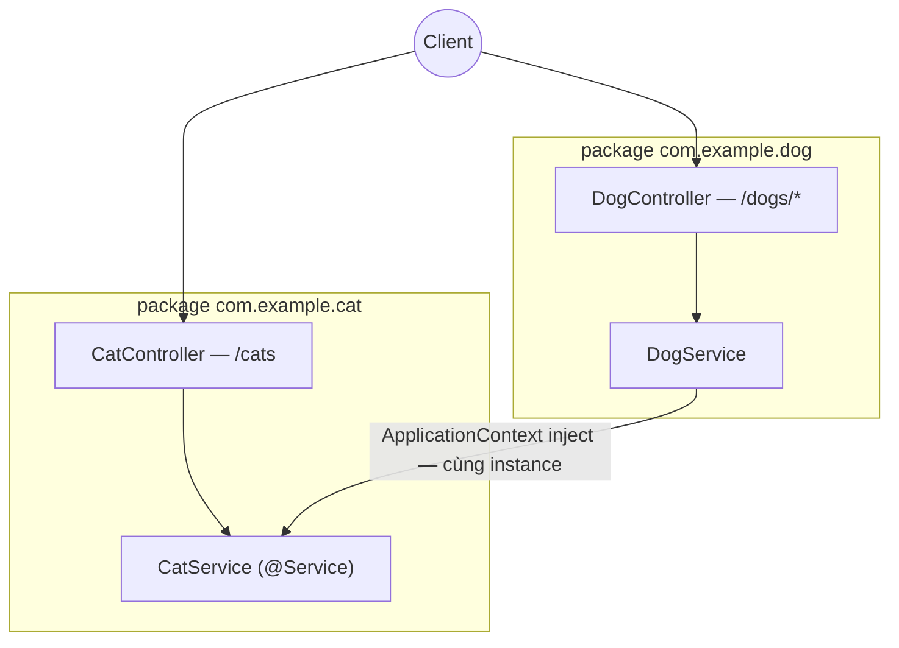

# sortIndex
<!-- @starci/seperator -->
2
<!-- @starci/seperator -->
# lang
<!-- @starci/seperator -->
java
<!-- @starci/seperator -->
# body
<!-- @starci/seperator -->
## 1. Lời mở đầu

*"Khi một service phụ thuộc service khác, ai tạo ra nó và ai quyết định cả hai dùng chung một instance?"* — một **Senior Engineer** đặt câu hỏi. **Mid-level Developer** đáp: *"Em `new` ra ở đâu cần là xong."* Câu trả lời thiếu chiều sâu: tự `new` khoá cứng consumer vào một implementation cụ thể, mỗi service sinh ra một bản sao riêng (mất tính dùng chung), và khi **dependency graph** lớn lên thì thứ tự khởi tạo trở nên mong manh, test bị buộc vào object thật.

Bài học triển khai **Spring Boot** (chạy trên host, không Docker):

- **Phần 2.1**: **thực hành** chạy một backend hai vùng nghiệp vụ (`Cat`, `Dog`) và gọi vài endpoint để **quan sát** framework tự tạo + ghép nối phụ thuộc — không có một dòng `new` nào.
- **Phần 2.2**: **lý thuyết** hệ thống hoá hai khái niệm nền tảng — *bean và ranh giới component scan* (framework đặt code vào đâu) và *inversion of control* (ai tạo + ghép nối) — kèm các **edge case** điển hình.

## 2. Các khái niệm cốt lõi

Bài tuân theo **Thực hành dẫn dắt Lý thuyết**. Học viên clone source, chạy **Spring Boot** bằng `mvn spring-boot:run` và gọi API để **quan sát** việc `ApplicationContext` tự inject bean xuyên package và chia sẻ cùng một instance. Sau đó phần lý thuyết hệ thống hoá bean/component scan, **Dependency Injection**, **IoC container** và phân tích các edge case chuyên sâu.

### 2.1. Thực hành

#### 2.1.1. Chuẩn bị source code và môi trường

Mục đích: chạy demo để thấy `DogService` dùng lại `CatService` qua container — không tự khởi tạo — và cả hai endpoint trả về *cùng một* instance.

Source: [StarCi-Academy/fs-1-framework-core-and-request-lifecycle-0-frameworks-in-backend](https://github.com/StarCi-Academy/fs-1-framework-core-and-request-lifecycle-0-frameworks-in-backend) trên GitHub.

```bash
# Bước 1: Clone repository về máy local
git clone https://github.com/StarCi-Academy/fs-1-framework-core-and-request-lifecycle-0-frameworks-in-backend.git

# Bước 2: Di chuyển vào đúng thư mục bài học
cd fs-1-framework-core-and-request-lifecycle-0-frameworks-in-backend
```

#### 2.1.2. Kiến trúc / thành phần

Demo có hai **package nghiệp vụ** — mỗi package là một vùng riêng, được `ApplicationContext` quét và ghép nối:

- **`com.example.cat`:** chứa `CatController` + `CatService` (`@Service`), là phụ thuộc được chia sẻ.
- **`com.example.dog`:** chứa `DogController` + `DogService`; `DogService` nhận `CatService` qua constructor.
- **`@SpringBootApplication`:** đặt ở base package `com.example`, bật component scan cho cả hai package con.
- **`CatService`:** bean singleton — bề mặt được chia sẻ.

| Thành phần | File | Vai trò |
| --- | --- | --- |
| `Application` | `src/main/java/com/example/Application.java` | `@SpringBootApplication` — base package + component scan |
| `CatService` | `src/main/java/com/example/cat/CatService.java` | Bean singleton (`@Service`), bề mặt chia sẻ |
| `DogService` | `src/main/java/com/example/dog/DogService.java` | Inject `CatService` qua constructor |
| `CatController` / `DogController` | `.../cat/CatController.java`, `.../dog/DogController.java` | Phơi endpoint REST |



Hình 1: Component scan + ApplicationContext inject `CatService` (singleton) xuyên package `com.example.dog`.

#### 2.1.3. Giải thích code và bản chất

Trọng tâm: *vì sao không có dòng `new` nào mà các thành phần vẫn được ghép nối đúng — và vì sao chúng dùng chung một instance*.

##### 2.1.3.1. `@Service` + component scan — đăng ký và khám phá bean

```java
// com.example.cat.CatService
@Service
public class CatService {
    public String getSpyHint() {
        return "cat-network-ready";
    }
    public List<Cat> findAll() {
        return List.of(new Cat(1, "Milo"), new Cat(2, "Luna"));
    }
}
```

`@Service` đánh dấu `CatService` là một **bean**; `ApplicationContext` quét base package `com.example` và tự đăng ký nó. Đây là "ranh giới" kiểu Spring: thứ nằm trong scan path mới trở thành bean dùng được — đặt class ngoài base package mà không khai báo `@ComponentScan` thì container không thấy.

##### 2.1.3.2. Constructor injection — IoC, không tự khởi tạo

```java
// com.example.dog.DogService
@Service
public class DogService {
    private final CatService cat;

    public DogService(CatService cat) {
        this.cat = cat;
    }

    public Map<String, Object> getSpyReport() {
        return Map.of("mission", "cross-module-dependency-check", "dependency", cat.getSpyHint(), "status", "ok");
    }
}
```

`DogService` không `new CatService()` — nó chỉ *khai báo* "cần một `CatService`" qua tham số constructor. Spring auto-wire constructor duy nhất, đọc kiểu tham số, dựng dependency graph và inject. Đây là **inversion of control**: quyền tạo object chuyển từ consumer sang container.

##### 2.1.3.3. Ghép nối xuyên package — beans cùng scan path tự nối

```java
// com.example.Application
@SpringBootApplication
public class Application {
    public static void main(String[] args) {
        SpringApplication.run(Application.class, args);
    }
}
```

`@SpringBootApplication` ở `com.example` bật scan cho cả `com.example.cat` lẫn `com.example.dog`, nên bean ở package này resolve được bean ở package kia mà không cần khai báo thêm. Bản chất: phụ thuộc chéo được container nối **tự động trong phạm vi scan** — nhưng bean ngoài base package phải thêm `@ComponentScan` thì mới hiện.

> Khái niệm này **portable**: IoC/DI là pattern phổ quát. Đối chiếu ngắn — NestJS dùng `@Module` + `exports`/`imports` tường minh, ASP.NET Core dùng built-in container + `AddSingleton`/constructor injection, Go không có container nên ghép nối thủ công ở `main` (**composition root**). Đều chung ý: consumer khai báo "cần gì", một nơi tập trung lo việc tạo + ghép nối + vòng đời.

#### 2.1.4. Chuẩn bị & khởi chạy

##### 2.1.4.1. Điều kiện cần trước

- **JDK 21** (LTS) và **Maven** (hoặc dùng `./mvnw` wrapper kèm repo).
- Port **3000** available trên host (backend Spring Boot).
- **Windows:** dùng `Invoke-RestMethod` thay cho `curl`.

##### 2.1.4.2. Khởi động

```bash
# Bước 1: Vào thư mục backend
cd backend/1-java

# Bước 2: Cài dependency
mvn install -DskipTests

# Bước 3: Chạy (watch)
mvn spring-boot:run
```

App lắng nghe tại `http://localhost:3000`.

#### 2.1.5. Kiểm thử

**3 luồng** dưới đây, mỗi luồng kiểm chứng một mục tiêu — mở từng luồng để chạy:

- **Luồng 1 — `GET /cats`:** route map đúng controller → service.
- **Luồng 2 — `GET /dogs/spy`:** phụ thuộc đến từ `CatService` qua DI xuyên package.
- **Luồng 3 — `GET /dogs/cats-via-di`:** cùng một instance `CatService` được chia sẻ.

::::accordion
:::panel{title="Luồng 1 — route map controller → service"}

- Bước 1: gọi `GET /cats`.

  ```bash
  # Windows (PowerShell)
  Invoke-RestMethod -Uri "http://localhost:3000/cats"

  # macOS / Linux
  # → Dán cURL vào Postman: Import → Raw text
  curl -s http://localhost:3000/cats
  ```

  Response phải trả về (HTTP 200):

  ```json
  [{ "id": 1, "name": "Milo" }, { "id": 2, "name": "Luna" }]
  ```

*Kết luận: Nếu response khớp JSON trên, hệ thống xác nhận:*

- *App bootstrap thành công, container map đúng `CatController` → `CatService`.*

:::
:::panel{title="Luồng 2 — DI xuyên package"}

- Bước 1: gọi `GET /dogs/spy`.

  ```bash
  # Windows (PowerShell)
  Invoke-RestMethod -Uri "http://localhost:3000/dogs/spy"

  # macOS / Linux
  # → Dán cURL vào Postman: Import → Raw text
  curl -s http://localhost:3000/dogs/spy
  ```

  Response phải trả về (HTTP 200):

  ```json
  { "mission": "cross-module-dependency-check", "dependency": "cat-network-ready", "status": "ok" }
  ```

*Kết luận: Nếu response khớp JSON trên, hệ thống xác nhận:*

- *`dependency` đến từ `CatService` — framework đã inject xuyên package, không có `new CatService()`.*

:::
:::panel{title="Luồng 3 — cùng một instance (singleton)"}

- Bước 1: gọi `GET /dogs/cats-via-di`.

  ```bash
  # Windows (PowerShell)
  Invoke-RestMethod -Uri "http://localhost:3000/dogs/cats-via-di"

  # macOS / Linux
  # → Dán cURL vào Postman: Import → Raw text
  curl -s http://localhost:3000/dogs/cats-via-di
  ```

  Response phải trả về (HTTP 200):

  ```json
  { "dog": "Rex", "borrowedCats": [{ "id": 1, "name": "Milo" }, { "id": 2, "name": "Luna" }] }
  ```

*Kết luận: Nếu response khớp JSON trên, hệ thống xác nhận:*

- *`borrowedCats` trùng đúng `GET /cats` — `DogService` và `CatController` dùng chung MỘT bean `CatService` (singleton mặc định).*

:::
::::

#### 2.1.6. Dọn tài nguyên

Bài này không sử dụng Docker, không cần dọn tài nguyên. Nhấn `Ctrl+C` trong terminal để dừng Spring Boot.

#### 2.1.7. Đọc thêm

- **IoC Container & Beans:** cách `ApplicationContext` quét, tạo và quản bean. ([Spring — IoC Container](https://docs.spring.io/spring-framework/reference/core/beans.html))
- **Constructor-based DI:** vì sao Spring khuyến nghị inject qua constructor. ([Spring — Dependency Injection](https://docs.spring.io/spring-framework/reference/core/beans/dependencies/factory-collaborators.html))
- **Bean scopes:** vì sao singleton là mặc định và khi nào cần request scope. ([Spring — Bean Scopes](https://docs.spring.io/spring-framework/reference/core/beans/factory-scopes.html))

### 2.2. Lý thuyết

#### 2.2.1. Bản chất

Bản chất của một backend framework như Spring gói gọn trong một điều: **framework giành lấy quyền tạo bean, ghép nối phụ thuộc và quản vòng đời — dev chỉ *khai báo ý đồ*, không tự `new`**. Đây là *inversion of control* (IoC). Ba mặt dưới đây không phải ba khái niệm rời rạc mà là ba góc nhìn của cùng một bản chất đó.

- **Ai tạo, ai ghép (Dependency Injection + IoC container).** Bean khai báo phụ thuộc qua *tham số constructor*; `ApplicationContext` (IoC container của Spring) đọc kiểu đó, dựng dependency graph, tạo bean đúng thứ tự rồi inject. Vì sao điều này là cốt lõi chứ không phải tiện ích: tự `new CatService()` khoá cứng consumer vào một implementation cụ thể (khó swap), tạo bản sao riêng (mất chia sẻ), và buộc test vào object thật. Chuyển quyền tạo cho container đổi lấy *testability* (mock tự nhiên), *loose coupling* (đổi implementation không sửa consumer), *lifecycle management* (container quản vòng đời bean). Verify ở Luồng 2: `dependency` đến từ `CatService` mà `DogService` không hề khởi tạo.
- **Code đặt đâu, gì được chia sẻ (bean và ranh giới scan path).** Spring không có khai báo module tường minh như NestJS — "ranh giới" là **scan path**. `@Service`/`@Component`/`@RestController` đánh dấu một class thành bean, và `@SpringBootApplication` (= `@ComponentScan` ở base package) quyết định package nào được quét. Bản chất: Spring biến cấu trúc package thành luật ghép nối — class ngoài scan path không trở thành bean, sai sót thành `NoSuchBeanDefinitionException` lúc khởi động chứ không phải bug runtime âm thầm.
- **Sống bao lâu, dùng chung tới đâu (bean và scope).** Bean mặc định là **singleton** — một instance dùng chung trong toàn `ApplicationContext` (Luồng 3 chứng minh), rẻ và đủ cho bean stateless. Khi mỗi request cần state riêng tuyệt đối không được lẫn (vd tenant context) mới dùng `@RequestScope`; nhưng request scope cần proxy để inject vào singleton và có chi phí tạo lại mỗi request — nên là ngoại lệ, không phải mặc định.

Gộp lại: framework "cầm" cả ba — *tạo + ghép + vòng đời* — còn dev chỉ mô tả "cần gì, đặt ở đâu trong scan path, sống bao lâu". Hiểu một framework mới chính là tìm xem nó hiện thực ba mặt này thế nào.

#### 2.2.2. Các trường hợp biên (edge cases) cần lưu ý

- **Bean ngoài scan path:** container không thấy → lỗi `NoSuchBeanDefinitionException` lúc khởi động. **Giải pháp:** đặt trong base package hoặc khai báo `@ComponentScan`.
- **Circular dependency:** `A ↔ B` qua constructor khiến context không khởi tạo được. **Giải pháp:** tách phần chung; `@Lazy` chỉ là cứu cánh.
- **Lạm dụng request/prototype scope:** tăng chi phí tạo + cần proxy. **Giải pháp:** mặc định singleton, chỉ đổi scope khi bắt buộc.
- **Hard-code config vào bean:** khó tái dùng/đổi môi trường. **Giải pháp:** dùng `@ConfigurationProperties` / `application.properties`.

## 3. Tổng kết

### 3.1. Các câu hỏi dễ bị phỏng vấn

- **Câu hỏi 1: Inversion of control giải quyết vấn đề gì so với tự khởi tạo phụ thuộc?**
  - Ý interviewer muốn nghe: chuyển quyền tạo object sang container để loose coupling + testability.
  - Trả lời mẫu (ngắn): Khi tự `new`, thành phần bị khoá cứng vào một implementation cụ thể nên khó test và khó swap. IoC chuyển quyền tạo cho `ApplicationContext`; bean chỉ khai báo "cần gì" qua constructor. Nhờ đó ta mock phụ thuộc tự nhiên khi test, và đổi implementation mà không sửa consumer.
- **Câu hỏi 2: Component scan và ranh giới package quyết định gì trong Spring?**
  - Ý interviewer muốn nghe: scan path quyết định class nào thành bean; bean ngoài path không được ghép nối.
  - Trả lời mẫu (ngắn): `@SpringBootApplication` bật component scan ở base package, nên chỉ class trong path đó (đánh dấu `@Service`/`@Component`) mới trở thành bean và được inject. Bean ngoài path phải khai báo `@ComponentScan` mới hiện. Đây là cách Spring biến cấu trúc package thành ranh giới ghép nối, và sai sót thành lỗi sớm lúc khởi động.
- **Câu hỏi 3: Khi nào dùng singleton, khi nào cần state riêng mỗi request?**
  - Ý interviewer muốn nghe: mặc định singleton; chỉ request scope khi state không được lẫn giữa request.
  - Trả lời mẫu (ngắn): Mặc định singleton vì rẻ và đủ cho bean stateless. Chỉ dùng `@RequestScope` khi mỗi request mang state riêng tuyệt đối không được lẫn, ví dụ tenant context. Đổi lại phải chịu chi phí tạo lại bean mỗi request và cần proxy để inject vào singleton.
<!-- @starci/seperator -->
