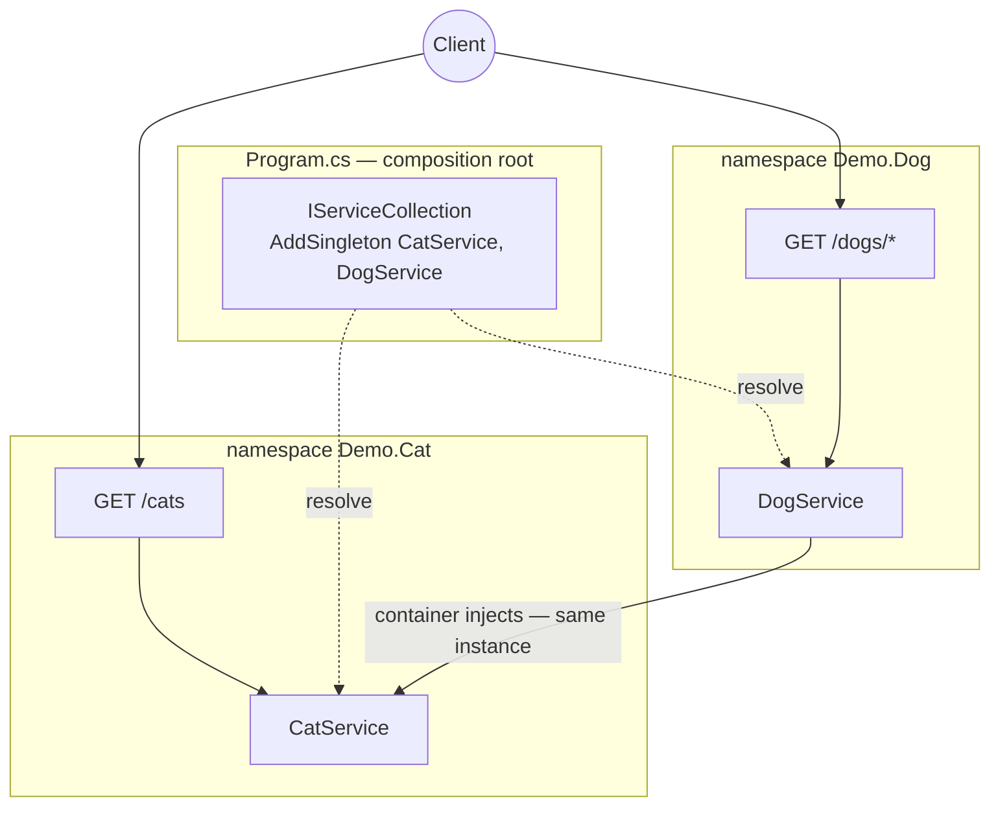

# sortIndex
<!-- @starci/seperator -->
3
<!-- @starci/seperator -->
# lang
<!-- @starci/seperator -->
csharp
<!-- @starci/seperator -->
# body
<!-- @starci/seperator -->
## 1. Opening

*"When one service depends on another, who creates it and who decides both share a single instance?"* — a **Senior Engineer** asks. A **Mid-level Developer** replies: *"I just `new` it wherever I need it."* The answer lacks depth: hand-rolling `new` hard-wires the consumer to a concrete implementation, every service spins up its own copy (losing sharing), and as the dependency graph grows the startup order becomes fragile and tests get locked to real objects.

This lesson ships **ASP.NET Core** (runs on the host, no Docker):

- **Part 2.1**: **hands-on** runs a backend with two business areas (`Cat`, `Dog`) and calls a few endpoints to **observe** the framework create and wire dependencies — without a single consumer-side `new`.
- **Part 2.2**: **theory** consolidates two foundational concepts — *service registration and the composition root* (where the framework puts your code) and *inversion of control* (who creates and wires components) — plus typical **edge cases**.

## 2. Core concepts

This lesson follows **practice-led theory**. Students clone the source, run **ASP.NET Core** via `dotnet run`, and call the API to **observe** the built-in DI container auto-inject a service across namespaces and share one instance. The theory part then consolidates service registration, **Dependency Injection**, the **IoC container**, and deep edge cases.

### 2.1. Hands-on

#### 2.1.1. Prepare source code and environment

Purpose: run the demo to see `DogService` reuse `CatService` through the container — without self-instantiation — and both endpoints return the *same* instance.

Source: [StarCi-Academy/fs-1-framework-core-and-request-lifecycle-0-frameworks-in-backend](https://github.com/StarCi-Academy/fs-1-framework-core-and-request-lifecycle-0-frameworks-in-backend) on GitHub.

```bash
# Step 1: Clone the repository locally
git clone https://github.com/StarCi-Academy/fs-1-framework-core-and-request-lifecycle-0-frameworks-in-backend.git

# Step 2: Navigate to the lesson directory
cd fs-1-framework-core-and-request-lifecycle-0-frameworks-in-backend
```

#### 2.1.2. Architecture / components

The demo has two **business namespaces** — services are registered into the built-in container at the composition root:

- **`Demo.Cat`:** holds `CatService`, the shared dependency.
- **`Demo.Dog`:** holds `DogService`; receives `CatService` via the constructor.
- **`Program.cs`:** the composition root — `AddSingleton` for both services.
- **`CatService`:** registered as a Singleton — the shared surface.

| Component | File | Role |
| --- | --- | --- |
| `Program` | `Program.cs` | Composition root — `AddSingleton` + `MapGet` endpoints |
| `CatService` | `Cat/CatService.cs` | Singleton service, the shared surface |
| `DogService` | `Dog/DogService.cs` | Injects `CatService` via the constructor |



Figure 1: The composition root registering services + the container injecting `CatService` (Singleton) across namespace `Demo.Dog`.

#### 2.1.3. Code walkthrough and essence

Focus: *why the consumer never `new`s yet the components are wired correctly — and why they share a single instance*.

##### 2.1.3.1. Register services into the container — the composition root

```csharp
// Program.cs
var builder = WebApplication.CreateBuilder(args);
builder.Services.AddSingleton<CatService>();
builder.Services.AddSingleton<DogService>();
var app = builder.Build();
```

`AddSingleton<CatService>()` tells the container how to create `CatService` and that it is a **Singleton** (one shared instance). This is ASP.NET's "boundary": only services registered at the composition root can be resolved — forget to register and the container throws `InvalidOperationException: Unable to resolve service` at runtime.

##### 2.1.3.2. Constructor injection — IoC, not self-instantiation

```csharp
// Dog/DogService.cs
public class DogService
{
    private readonly CatService _cat;

    public DogService(CatService cat) => _cat = cat;

    public object GetSpyReport() => new
    {
        mission = "cross-module-dependency-check",
        dependency = _cat.GetSpyHint(),
        status = "ok",
    };
}
```

`DogService` does not `new CatService()` — it merely *declares* "I need a `CatService`" via the constructor parameter. The container reads the parameter type, builds the dependency graph, and injects it. This is **inversion of control**: the power to create objects moves from the consumer to the container.

##### 2.1.3.3. Endpoints receive services via parameters — the container resolves per route

```csharp
// Program.cs
app.MapGet("/cats", (CatService cat) => cat.FindAll());
app.MapGet("/dogs/spy", (DogService dog) => dog.GetSpyReport());
app.MapGet("/dogs/cats-via-di", (DogService dog) => dog.BorrowCats());
app.Run("http://localhost:3000");
```

A minimal API handler declares a `CatService`/`DogService` parameter — the container resolves it from the registration when a request arrives. Services in different namespaces wire together because they live in **one** container. Essence: cross-namespace dependencies are explicit at the *registration* site, and the container does the wiring.

> This concept is **portable**: IoC/DI is a universal pattern. Quick contrast — NestJS uses `@Module` + `exports`/`imports`, Spring uses `@Component`/component scan, and Go has no container so you wire by hand at `main` (the composition root). Same idea: the consumer declares "what I need", and one central place handles creation, wiring, and lifecycle.

#### 2.1.4. Prerequisites and startup

##### 2.1.4.1. Prerequisites

- **.NET SDK 8** (LTS).
- Port **3000** available on the host (ASP.NET Core backend).
- **Windows:** use `Invoke-RestMethod` instead of `curl`.

##### 2.1.4.2. Start

```bash
# Step 1: Enter the directory
cd backend/2-csharp

# Step 2: Install dependencies
dotnet restore

# Step 3: Run (watch)
dotnet watch run
```

The app listens at `http://localhost:3000`.

#### 2.1.5. Verification

**3 flows** below — each verifies one goal; expand a flow to run it:

- **Flow 1 — `GET /cats`:** routes map to the right endpoint → service.
- **Flow 2 — `GET /dogs/spy`:** the dependency comes from `CatService` via cross-namespace DI.
- **Flow 3 — `GET /dogs/cats-via-di`:** a single `CatService` instance is shared.

::::accordion
:::panel{title="Flow 1 — routes map endpoint → service"}

- Step 1: call `GET /cats`.

  ```bash
  # Windows (PowerShell)
  Invoke-RestMethod -Uri "http://localhost:3000/cats"

  # macOS / Linux
  # → Paste cURL into Postman: Import → Raw text
  curl -s http://localhost:3000/cats
  ```

  Response should return (HTTP 200):

  ```json
  [{ "id": 1, "name": "Milo" }, { "id": 2, "name": "Luna" }]
  ```

*Conclusion: If the response matches the JSON above, the system confirms:*

- *The app bootstrapped and the container resolved `CatService` for the `/cats` endpoint.*

:::
:::panel{title="Flow 2 — cross-namespace DI"}

- Step 1: call `GET /dogs/spy`.

  ```bash
  # Windows (PowerShell)
  Invoke-RestMethod -Uri "http://localhost:3000/dogs/spy"

  # macOS / Linux
  # → Paste cURL into Postman: Import → Raw text
  curl -s http://localhost:3000/dogs/spy
  ```

  Response should return (HTTP 200):

  ```json
  { "mission": "cross-module-dependency-check", "dependency": "cat-network-ready", "status": "ok" }
  ```

*Conclusion: If the response matches the JSON above, the system confirms:*

- *`dependency` comes from `CatService` — the framework injected across namespaces, with no `new CatService()`.*

:::
:::panel{title="Flow 3 — a single shared instance (Singleton)"}

- Step 1: call `GET /dogs/cats-via-di`.

  ```bash
  # Windows (PowerShell)
  Invoke-RestMethod -Uri "http://localhost:3000/dogs/cats-via-di"

  # macOS / Linux
  # → Paste cURL into Postman: Import → Raw text
  curl -s http://localhost:3000/dogs/cats-via-di
  ```

  Response should return (HTTP 200):

  ```json
  { "dog": "Rex", "borrowedCats": [{ "id": 1, "name": "Milo" }, { "id": 2, "name": "Luna" }] }
  ```

*Conclusion: If the response matches the JSON above, the system confirms:*

- *`borrowedCats` matches `GET /cats` exactly — the `/dogs/*` and `/cats` endpoints share ONE `CatService` instance (registered Singleton).*

:::
::::

#### 2.1.6. Cleanup

This lesson does not use Docker, no resource cleanup is needed. Press `Ctrl+C` in the terminal to stop ASP.NET Core.

#### 2.1.7. Further reading

- **Dependency injection:** how ASP.NET Core's built-in container registers and resolves services. ([ASP.NET Core — DI](https://learn.microsoft.com/aspnet/core/fundamentals/dependency-injection))
- **Service lifetimes:** Singleton vs Scoped vs Transient. ([.NET — Service lifetimes](https://learn.microsoft.com/dotnet/core/extensions/dependency-injection#service-lifetimes))
- **Minimal APIs:** how handlers receive services via parameters. ([ASP.NET Core — Minimal APIs](https://learn.microsoft.com/aspnet/core/fundamentals/minimal-apis))

### 2.2. Theory

#### 2.2.1. The essence

The essence of a backend framework like ASP.NET Core comes down to one thing: **the framework takes over creating objects, wiring dependencies, and managing lifetimes — the developer only *declares intent*, never `new`s**. This is *inversion of control* (IoC). The three facets below are not three separate concepts but three views of that one essence.

- **Who creates, who wires (Dependency Injection + IoC container).** A service declares its dependencies via *constructor parameters*; ASP.NET Core's **built-in container** reads those types, builds the dependency graph, creates instances in the right order, and injects them. Why this is the core and not a convenience: `new CatService()` hard-wires the consumer to one concrete implementation (hard to swap), creates a private copy (loses sharing), and ties tests to the real object. Handing creation to the container buys *testability* (natural mocking), *loose coupling* (swap an implementation without touching consumers), *lifecycle management* (the container owns the lifecycle). Verified in Flow 2: `dependency` comes from `CatService`, which `DogService` never instantiated.
- **Where code lives, what is shared (registration and the composition root).** Unlike Spring (auto-scan), ASP.NET Core requires **explicit registration**: the `IServiceCollection` in `Program.cs` is the composition root, where you declare `AddSingleton`/`AddScoped`/`AddTransient`. The "boundary" here is registration — only registered services can be resolved, and forgetting to register becomes an `InvalidOperationException` at runtime rather than a silent bug. The essence: explicit registration trades a little verbosity for clarity — `Program.cs` shows the entire dependency graph at a glance.
- **How long it lives, how widely it is shared (service lifetime).** Three lifetimes: **Singleton** (one instance app-wide — Flow 3 proves it, cheap and sufficient for stateless services), **Scoped** (one instance per request, e.g. `DbContext`), **Transient** (a new instance per resolution). Default to Singleton; reach for Scoped only when each request needs its own state — and note you must not inject a Scoped into a Singleton (a captive dependency keeps the instance alive too long).

Putting it together: the framework "holds" all three — *create + wire + lifecycle* — while the developer only describes "what I need, what I register at the composition root, how long it lives". Learning a new framework is exactly finding how it implements these three facets.

#### 2.2.2. Edge cases to internalize

- **Forgetting to register a service:** the container throws `InvalidOperationException: Unable to resolve service` at runtime. **Solution:** always `Add*` the service at the composition root.
- **Captive dependency:** a Singleton holding a Scoped → keeps the Scoped instance alive too long. **Solution:** do not inject Scoped into Singleton; use `IServiceScopeFactory`.
- **Circular dependency:** `A ↔ B` makes the container unable to resolve. **Solution:** extract the shared part; avoid the cycle.
- **Hard-coding config into a service:** hard to reuse/switch environments. **Solution:** use the Options pattern (`IOptions<T>`) + `appsettings.json`.

## 3. Wrap-up

### 3.1. Common interview questions

- **Question 1: What does inversion of control solve compared to self-instantiating dependencies?**
  - What interviewers want to hear: it moves object creation to the container for loose coupling + testability.
  - Sample answer (concise): When you `new` things yourself, a component is hard-wired to a concrete implementation, so it is hard to test and hard to swap. IoC moves creation to the container; a service only declares "what it needs" via the constructor. That lets you mock dependencies naturally in tests and swap implementations without touching consumers.
- **Question 2: Why does ASP.NET Core require explicit service registration at the composition root?**
  - What interviewers want to hear: registration makes the dependency graph and lifetimes explicit.
  - Sample answer (concise): `Program.cs` (`IServiceCollection`) is the single place that declares how each service is created and its lifetime, so the whole dependency graph and scope are visible there. An unregistered service fails to resolve at runtime. In exchange for a little verbosity you get clarity and tight control over lifetimes.
- **Question 3: When do you use Singleton versus Scoped/Transient?**
  - What interviewers want to hear: default to Singleton; Scoped for per-request state, avoid captive dependencies.
  - Sample answer (concise): Default to Singleton because it is cheap and enough for stateless services. Use Scoped when each request needs its own state (e.g. `DbContext`), and Transient when you want a fresh instance each time. Importantly, do not inject Scoped into a Singleton to avoid a captive dependency keeping the instance alive too long.
<!-- @starci/seperator -->
