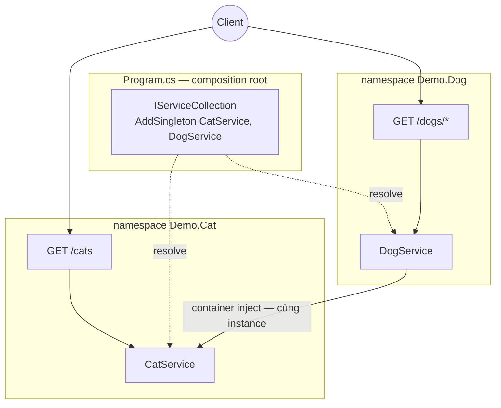

# sortIndex
<!-- @starci/seperator -->
3
<!-- @starci/seperator -->
# lang
<!-- @starci/seperator -->
csharp
<!-- @starci/seperator -->
# body
<!-- @starci/seperator -->
## 1. Lời mở đầu

*"Khi một service phụ thuộc service khác, ai tạo ra nó và ai quyết định cả hai dùng chung một instance?"* — một **Senior Engineer** đặt câu hỏi. **Mid-level Developer** đáp: *"Em `new` ra ở đâu cần là xong."* Câu trả lời thiếu chiều sâu: tự `new` khoá cứng consumer vào một implementation cụ thể, mỗi service sinh ra một bản sao riêng (mất tính dùng chung), và khi **dependency graph** lớn lên thì thứ tự khởi tạo trở nên mong manh, test bị buộc vào object thật.

Bài học triển khai **ASP.NET Core** (chạy trên host, không Docker):

- **Phần 2.1**: **thực hành** chạy một backend hai vùng nghiệp vụ (`Cat`, `Dog`) và gọi vài endpoint để **quan sát** framework tự tạo + ghép nối phụ thuộc — không có một dòng `new` nào ở phía consumer.
- **Phần 2.2**: **lý thuyết** hệ thống hoá hai khái niệm nền tảng — *đăng ký service và composition root* (framework đặt code vào đâu) và *inversion of control* (ai tạo + ghép nối) — kèm các **edge case** điển hình.

## 2. Các khái niệm cốt lõi

Bài tuân theo **Thực hành dẫn dắt Lý thuyết**. Học viên clone source, chạy **ASP.NET Core** bằng `dotnet run` và gọi API để **quan sát** built-in DI container tự inject service xuyên namespace và chia sẻ cùng một instance. Sau đó phần lý thuyết hệ thống hoá đăng ký service, **Dependency Injection**, **IoC container** và phân tích các edge case chuyên sâu.

### 2.1. Thực hành

#### 2.1.1. Chuẩn bị source code và môi trường

Mục đích: chạy demo để thấy `DogService` dùng lại `CatService` qua container — không tự khởi tạo — và cả hai endpoint trả về *cùng một* instance.

Source: [StarCi-Academy/fs-1-framework-core-and-request-lifecycle-0-frameworks-in-backend](https://github.com/StarCi-Academy/fs-1-framework-core-and-request-lifecycle-0-frameworks-in-backend) trên GitHub.

```bash
# Bước 1: Clone repository về máy local
git clone https://github.com/StarCi-Academy/fs-1-framework-core-and-request-lifecycle-0-frameworks-in-backend.git

# Bước 2: Di chuyển vào đúng thư mục bài học
cd fs-1-framework-core-and-request-lifecycle-0-frameworks-in-backend
```

#### 2.1.2. Kiến trúc / thành phần

Demo có hai **namespace nghiệp vụ** — service được đăng ký vào container built-in tại **composition root**:

- **`Demo.Cat`:** chứa `CatService`, là phụ thuộc được chia sẻ.
- **`Demo.Dog`:** chứa `DogService`; nhận `CatService` qua constructor.
- **`Program.cs`:** composition root — `AddSingleton` cả hai service vào container.
- **`CatService`:** đăng ký Singleton — bề mặt được chia sẻ.

| Thành phần | File | Vai trò |
| --- | --- | --- |
| `Program` | `Program.cs` | Composition root — `AddSingleton` + `MapGet` endpoint |
| `CatService` | `Cat/CatService.cs` | Service Singleton, bề mặt chia sẻ |
| `DogService` | `Dog/DogService.cs` | Inject `CatService` qua constructor |



Hình 1: Composition root đăng ký service + container inject `CatService` (Singleton) xuyên namespace `Demo.Dog`.

#### 2.1.3. Giải thích code và bản chất

Trọng tâm: *vì sao consumer không `new` mà các thành phần vẫn được ghép nối đúng — và vì sao chúng dùng chung một instance*.

##### 2.1.3.1. Đăng ký service vào container — composition root

```csharp
// Program.cs
var builder = WebApplication.CreateBuilder(args);
builder.Services.AddSingleton<CatService>();
builder.Services.AddSingleton<DogService>();
var app = builder.Build();
```

`AddSingleton<CatService>()` khai báo cho container biết cách tạo `CatService` và rằng nó là **Singleton** (một instance dùng chung). Đây là "ranh giới" kiểu ASP.NET: chỉ service được đăng ký ở composition root mới resolve được — quên đăng ký thì container ném `InvalidOperationException: Unable to resolve service` lúc chạy.

##### 2.1.3.2. Constructor injection — IoC, không tự khởi tạo

```csharp
// Dog/DogService.cs
public class DogService
{
    private readonly CatService _cat;

    public DogService(CatService cat) => _cat = cat;

    public object GetSpyReport() => new
    {
        mission = "cross-module-dependency-check",
        dependency = _cat.GetSpyHint(),
        status = "ok",
    };
}
```

`DogService` không `new CatService()` — nó chỉ *khai báo* "cần một `CatService`" qua tham số constructor. Container đọc kiểu tham số, dựng dependency graph và inject. Đây là **inversion of control**: quyền tạo object chuyển từ consumer sang container.

##### 2.1.3.3. Endpoint nhận service qua tham số — container resolve khi route chạy

```csharp
// Program.cs
app.MapGet("/cats", (CatService cat) => cat.FindAll());
app.MapGet("/dogs/spy", (DogService dog) => dog.GetSpyReport());
app.MapGet("/dogs/cats-via-di", (DogService dog) => dog.BorrowCats());
app.Run("http://localhost:3000");
```

Minimal API handler khai báo tham số `CatService`/`DogService` — container tự resolve từ registration khi request tới. Service ở namespace khác nối với nhau được vì cùng **một** container. Bản chất: phụ thuộc chéo là tường minh ở chỗ *đăng ký*, còn việc ghép nối do container lo.

> Khái niệm này **portable**: IoC/DI là pattern phổ quát. Đối chiếu ngắn — NestJS dùng `@Module` + `exports`/`imports`, Spring dùng `@Component`/component scan, Go không có container nên ghép nối thủ công ở `main` (composition root). Đều chung ý: consumer khai báo "cần gì", một nơi tập trung lo việc tạo + ghép nối + vòng đời.

#### 2.1.4. Chuẩn bị & khởi chạy

##### 2.1.4.1. Điều kiện cần trước

- **.NET SDK 8** (LTS).
- Port **3000** available trên host (backend ASP.NET Core).
- **Windows:** dùng `Invoke-RestMethod` thay cho `curl`.

##### 2.1.4.2. Khởi động

```bash
# Bước 1: Vào thư mục backend
cd backend/2-csharp

# Bước 2: Cài dependency
dotnet restore

# Bước 3: Chạy (watch)
dotnet watch run
```

App lắng nghe tại `http://localhost:3000`.

#### 2.1.5. Kiểm thử

**3 luồng** dưới đây, mỗi luồng kiểm chứng một mục tiêu — mở từng luồng để chạy:

- **Luồng 1 — `GET /cats`:** route map đúng endpoint → service.
- **Luồng 2 — `GET /dogs/spy`:** phụ thuộc đến từ `CatService` qua DI xuyên namespace.
- **Luồng 3 — `GET /dogs/cats-via-di`:** cùng một instance `CatService` được chia sẻ.

::::accordion
:::panel{title="Luồng 1 — route map endpoint → service"}

- Bước 1: gọi `GET /cats`.

  ```bash
  # Windows (PowerShell)
  Invoke-RestMethod -Uri "http://localhost:3000/cats"

  # macOS / Linux
  # → Dán cURL vào Postman: Import → Raw text
  curl -s http://localhost:3000/cats
  ```

  Response phải trả về (HTTP 200):

  ```json
  [{ "id": 1, "name": "Milo" }, { "id": 2, "name": "Luna" }]
  ```

*Kết luận: Nếu response khớp JSON trên, hệ thống xác nhận:*

- *App bootstrap thành công, container resolve đúng `CatService` cho endpoint `/cats`.*

:::
:::panel{title="Luồng 2 — DI xuyên namespace"}

- Bước 1: gọi `GET /dogs/spy`.

  ```bash
  # Windows (PowerShell)
  Invoke-RestMethod -Uri "http://localhost:3000/dogs/spy"

  # macOS / Linux
  # → Dán cURL vào Postman: Import → Raw text
  curl -s http://localhost:3000/dogs/spy
  ```

  Response phải trả về (HTTP 200):

  ```json
  { "mission": "cross-module-dependency-check", "dependency": "cat-network-ready", "status": "ok" }
  ```

*Kết luận: Nếu response khớp JSON trên, hệ thống xác nhận:*

- *`dependency` đến từ `CatService` — framework đã inject xuyên namespace, không có `new CatService()`.*

:::
:::panel{title="Luồng 3 — cùng một instance (Singleton)"}

- Bước 1: gọi `GET /dogs/cats-via-di`.

  ```bash
  # Windows (PowerShell)
  Invoke-RestMethod -Uri "http://localhost:3000/dogs/cats-via-di"

  # macOS / Linux
  # → Dán cURL vào Postman: Import → Raw text
  curl -s http://localhost:3000/dogs/cats-via-di
  ```

  Response phải trả về (HTTP 200):

  ```json
  { "dog": "Rex", "borrowedCats": [{ "id": 1, "name": "Milo" }, { "id": 2, "name": "Luna" }] }
  ```

*Kết luận: Nếu response khớp JSON trên, hệ thống xác nhận:*

- *`borrowedCats` trùng đúng `GET /cats` — endpoint `/dogs/*` và `/cats` dùng chung MỘT instance `CatService` (đăng ký Singleton).*

:::
::::

#### 2.1.6. Dọn tài nguyên

Bài này không sử dụng Docker, không cần dọn tài nguyên. Nhấn `Ctrl+C` trong terminal để dừng ASP.NET Core.

#### 2.1.7. Đọc thêm

- **Dependency injection:** cách container built-in của ASP.NET Core đăng ký và resolve service. ([ASP.NET Core — DI](https://learn.microsoft.com/aspnet/core/fundamentals/dependency-injection))
- **Service lifetimes:** phân biệt Singleton / Scoped / Transient. ([.NET — Service lifetimes](https://learn.microsoft.com/dotnet/core/extensions/dependency-injection#service-lifetimes))
- **Minimal APIs:** cách handler nhận service qua tham số. ([ASP.NET Core — Minimal APIs](https://learn.microsoft.com/aspnet/core/fundamentals/minimal-apis))

### 2.2. Lý thuyết

#### 2.2.1. Bản chất

Bản chất của một backend framework như ASP.NET Core gói gọn trong một điều: **framework giành lấy quyền tạo object, ghép nối phụ thuộc và quản vòng đời — dev chỉ *khai báo ý đồ*, không tự `new`**. Đây là *inversion of control* (IoC). Ba mặt dưới đây không phải ba khái niệm rời rạc mà là ba góc nhìn của cùng một bản chất đó.

- **Ai tạo, ai ghép (Dependency Injection + IoC container).** Service khai báo phụ thuộc qua *tham số constructor*; **built-in container** của ASP.NET Core đọc kiểu đó, dựng dependency graph, tạo instance đúng thứ tự rồi inject. Vì sao điều này là cốt lõi chứ không phải tiện ích: tự `new CatService()` khoá cứng consumer vào một implementation cụ thể (khó swap), tạo bản sao riêng (mất chia sẻ), và buộc test vào object thật. Chuyển quyền tạo cho container đổi lấy *testability* (mock tự nhiên), *loose coupling* (đổi implementation không sửa consumer), *lifecycle management* (container quản vòng đời). Verify ở Luồng 2: `dependency` đến từ `CatService` mà `DogService` không hề khởi tạo.
- **Code đặt đâu, gì được chia sẻ (đăng ký và composition root).** Khác Spring (auto-scan), ASP.NET Core yêu cầu **đăng ký tường minh**: `IServiceCollection` ở `Program.cs` là composition root, nơi khai báo `AddSingleton`/`AddScoped`/`AddTransient`. "Ranh giới" ở đây là registration — chỉ service được đăng ký mới resolve được, quên đăng ký thành `InvalidOperationException` lúc chạy chứ không phải bug âm thầm. Bản chất: đăng ký tường minh đổi lấy sự rõ ràng — nhìn `Program.cs` là thấy toàn bộ dependency graph.
- **Sống bao lâu, dùng chung tới đâu (service lifetime).** Ba lifetime: **Singleton** (một instance toàn app — Luồng 3 chứng minh, rẻ và đủ cho service stateless), **Scoped** (một instance mỗi request, vd `DbContext`), **Transient** (tạo mới mỗi lần resolve). Mặc định Singleton; chỉ Scoped khi mỗi request cần state riêng — và lưu ý không inject Scoped vào Singleton (**captive dependency** giữ instance sống quá lâu).

Gộp lại: framework "cầm" cả ba — *tạo + ghép + vòng đời* — còn dev chỉ mô tả "cần gì, đăng ký gì ở composition root, sống bao lâu". Hiểu một framework mới chính là tìm xem nó hiện thực ba mặt này thế nào.

#### 2.2.2. Các trường hợp biên (edge cases) cần lưu ý

- **Quên đăng ký service:** container ném `InvalidOperationException: Unable to resolve service` lúc chạy. **Giải pháp:** luôn `Add*` service ở composition root.
- **Captive dependency:** Singleton giữ một Scoped → giữ instance Scoped sống quá lâu. **Giải pháp:** không inject Scoped vào Singleton; dùng `IServiceScopeFactory`.
- **Circular dependency:** `A ↔ B` khiến container không resolve được. **Giải pháp:** tách phần chung; tránh phụ thuộc vòng.
- **Hard-code config vào service:** khó tái dùng/đổi môi trường. **Giải pháp:** dùng Options pattern (`IOptions<T>`) + `appsettings.json`.

## 3. Tổng kết

### 3.1. Các câu hỏi dễ bị phỏng vấn

- **Câu hỏi 1: Inversion of control giải quyết vấn đề gì so với tự khởi tạo phụ thuộc?**
  - Ý interviewer muốn nghe: chuyển quyền tạo object sang container để loose coupling + testability.
  - Trả lời mẫu (ngắn): Khi tự `new`, thành phần bị khoá cứng vào một implementation cụ thể nên khó test và khó swap. IoC chuyển quyền tạo cho container; service chỉ khai báo "cần gì" qua constructor. Nhờ đó ta mock phụ thuộc tự nhiên khi test, và đổi implementation mà không sửa consumer.
- **Câu hỏi 2: Vì sao ASP.NET Core yêu cầu đăng ký service tường minh ở composition root?**
  - Ý interviewer muốn nghe: registration làm dependency graph rõ ràng và lifetime tường minh.
  - Trả lời mẫu (ngắn): `Program.cs` (`IServiceCollection`) là nơi duy nhất khai báo cách tạo và lifetime của từng service, nên nhìn vào đó là thấy toàn bộ dependency graph và scope. Service không đăng ký sẽ lỗi resolve lúc chạy. Đổi lấy chút verbosity, ta được sự rõ ràng và kiểm soát lifetime chặt.
- **Câu hỏi 3: Khi nào dùng Singleton, khi nào cần Scoped/Transient?**
  - Ý interviewer muốn nghe: mặc định Singleton; Scoped khi state riêng mỗi request, tránh captive dependency.
  - Trả lời mẫu (ngắn): Mặc định Singleton vì rẻ và đủ cho service stateless. Scoped khi mỗi request cần state riêng (ví dụ `DbContext`), Transient khi muốn instance mới mỗi lần dùng. Lưu ý không inject Scoped vào Singleton để tránh captive dependency giữ instance sống quá lâu.
<!-- @starci/seperator -->
