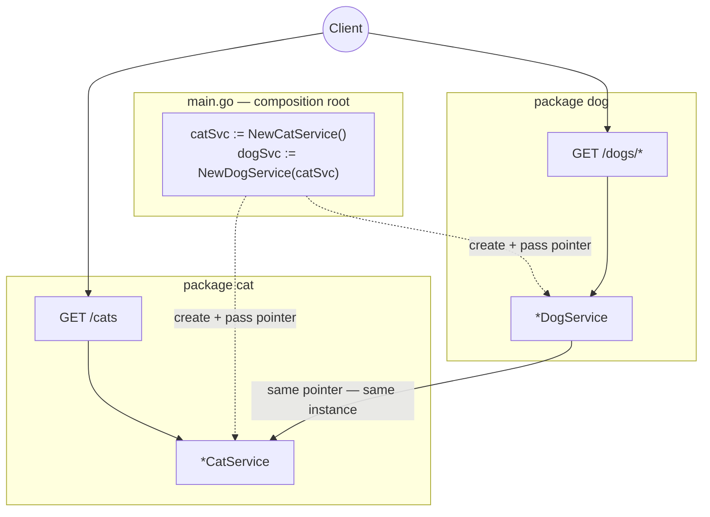

# sortIndex
<!-- @starci/seperator -->
4
<!-- @starci/seperator -->
# lang
<!-- @starci/seperator -->
go
<!-- @starci/seperator -->
# body
<!-- @starci/seperator -->
## 1. Opening

*"When one service depends on another, who creates it and who decides both share a single instance?"* — a **Senior Engineer** asks. A **Mid-level Developer** replies: *"I just `new` it wherever I need it."* The answer lacks depth: ad-hoc wiring hard-wires the consumer to a concrete implementation, easily creates duplicate copies (losing sharing), and as the dependency graph grows the startup order becomes fragile and tests get locked to real objects.

This lesson ships **Go** with **Gin** (runs on the host, no Docker). Go has **no IoC container** — so this lesson surfaces the concept by its *absence*: you wire dependencies by hand at `main`, seeing exactly what other frameworks do for you:

- **Part 2.1**: **hands-on** runs a backend with two business areas (`cat`, `dog`) and calls a few endpoints to **observe** manual wiring and shared instances.
- **Part 2.2**: **theory** consolidates two foundational concepts — *packages and the export boundary* (where you put your code) and *inversion of control / the composition root* (who creates and wires components) — plus typical **edge cases**.

## 2. Core concepts

This lesson follows **practice-led theory**. Students clone the source, run **Go** via `go run .`, and call the API to **observe** `dog` reuse `cat` through a pointer passed at `main` and share one instance. The theory part then consolidates packages/exports, **manual dependency injection**, the **composition root**, and deep edge cases.

### 2.1. Hands-on

#### 2.1.1. Prepare source code and environment

Purpose: run the demo to see `DogService` reuse `CatService` through a pointer passed at `main` — without creating its own copy — and both endpoints return the *same* instance.

Source: [StarCi-Academy/fs-1-framework-core-and-request-lifecycle-0-frameworks-in-backend](https://github.com/StarCi-Academy/fs-1-framework-core-and-request-lifecycle-0-frameworks-in-backend) on GitHub.

```bash
# Step 1: Clone the repository locally
git clone https://github.com/StarCi-Academy/fs-1-framework-core-and-request-lifecycle-0-frameworks-in-backend.git

# Step 2: Navigate to the lesson directory
cd fs-1-framework-core-and-request-lifecycle-0-frameworks-in-backend
```

#### 2.1.2. Architecture / components

The demo has two **business packages** — and `main` plays the composition root that wires them by hand:

- **`cat`:** exports `CatService` (pointer) + `NewCatService()`, the shared dependency.
- **`dog`:** `DogService` holds a `*cat.CatService`; receives it via a constructor function.
- **`main`:** creates `cat` once, passes it into `dog`, mounts Gin routes — with no container, this is where *you* wire things.

| Component | File | Role |
| --- | --- | --- |
| `main` | `main.go` | Composition root — creates + wires services, mounts Gin routes |
| `CatService` | `cat/cat.go` | The shared service (exported via a capitalized name) |
| `DogService` | `dog/dog.go` | Holds `*cat.CatService` via a constructor function |



Figure 1: `main` (the composition root) creates `CatService` once and passes the pointer into `DogService` — one shared instance.

#### 2.1.3. Code walkthrough and essence

Focus: *why Go has no container yet the components are wired correctly — and why they share a single instance*.

##### 2.1.3.1. Exporting via a capitalized name — the package's public surface

```go
// cat/cat.go
package cat

type CatService struct{}

func NewCatService() *CatService { return &CatService{} }

func (s *CatService) GetSpyHint() string { return "cat-network-ready" }

func (s *CatService) FindAll() []Cat {
    return []Cat{{ID: 1, Name: "Milo"}, {ID: 2, Name: "Luna"}}
}
```

In Go the "boundary" is the **capitalization = export** convention: `CatService` and `NewCatService` are capitalized, so other packages can use them; lowercase identifiers stay hidden. This is how Go turns package structure into a public surface — no decorators, no module declaration.

##### 2.1.3.2. Constructor function + struct field — explicit dependency, no container

```go
// dog/dog.go
package dog

import "demo/cat"

type DogService struct {
    cat *cat.CatService
}

func NewDogService(c *cat.CatService) *DogService {
    return &DogService{cat: c}
}

func (s *DogService) GetSpyReport() map[string]any {
    return map[string]any{
        "mission":    "cross-module-dependency-check",
        "dependency": s.cat.GetSpyHint(),
        "status":     "ok",
    }
}
```

`DogService` receives a `*cat.CatService` via `NewDogService` — it *declares* the dependency through a parameter, never `&cat.CatService{}` inside. Go has no container, so this is **inversion of control done by hand**: the power to create lives with the caller (the composition root), not inside `dog`.

##### 2.1.3.3. Wiring at `main` — the composition root, same pointer = same instance

```go
// main.go
func main() {
    catSvc := cat.NewCatService()
    dogSvc := dog.NewDogService(catSvc) // pass the same pointer -> shared

    r := gin.Default()
    r.GET("/cats", func(c *gin.Context) { c.JSON(200, catSvc.FindAll()) })
    r.GET("/dogs/spy", func(c *gin.Context) { c.JSON(200, dogSvc.GetSpyReport()) })
    r.GET("/dogs/cats-via-di", func(c *gin.Context) { c.JSON(200, dogSvc.BorrowCats()) })
    r.Run(":3000")
}
```

`main` creates `catSvc` *once* then passes that very pointer into `dog`, so both the `/cats` route and `dog` share ONE instance. Essence: what NestJS/Spring/.NET do automatically (build the graph + share singletons), in Go *you* do explicitly — `main` shows the entire dependency graph at a glance.

> This concept is **portable**: IoC/DI is a universal pattern. Quick contrast — NestJS uses `@Module` + `exports`/`imports`, Spring uses `@Component`/component scan, ASP.NET Core uses a built-in container + `AddSingleton`. Go has *no* container so you are the composition root: same idea — the consumer declares "what I need", and one central place handles creation, wiring, and lifecycle.

#### 2.1.4. Prerequisites and startup

##### 2.1.4.1. Prerequisites

- **Go 1.22+**.
- Port **3000** available on the host (Gin backend).
- **Windows:** use `Invoke-RestMethod` instead of `curl`.

##### 2.1.4.2. Start

```bash
# Step 1: Enter the directory
cd backend/3-go

# Step 2: Install dependencies
go mod download

# Step 3: Run
go run .
```

The app listens at `http://localhost:3000`.

#### 2.1.5. Verification

**3 flows** below — each verifies one goal; expand a flow to run it:

- **Flow 1 — `GET /cats`:** routes map to the right endpoint → service.
- **Flow 2 — `GET /dogs/spy`:** the dependency comes from `CatService` passed through the composition root.
- **Flow 3 — `GET /dogs/cats-via-di`:** a single `CatService` instance is shared.

::::accordion
:::panel{title="Flow 1 — routes map endpoint → service"}

- Step 1: call `GET /cats`.

  ```bash
  # Windows (PowerShell)
  Invoke-RestMethod -Uri "http://localhost:3000/cats"

  # macOS / Linux
  # → Paste cURL into Postman: Import → Raw text
  curl -s http://localhost:3000/cats
  ```

  Response should return (HTTP 200):

  ```json
  [{ "id": 1, "name": "Milo" }, { "id": 2, "name": "Luna" }]
  ```

*Conclusion: If the response matches the JSON above, the system confirms:*

- *The app bootstrapped and the `/cats` route calls `catSvc.FindAll()` correctly.*

:::
:::panel{title="Flow 2 — dependency via the composition root"}

- Step 1: call `GET /dogs/spy`.

  ```bash
  # Windows (PowerShell)
  Invoke-RestMethod -Uri "http://localhost:3000/dogs/spy"

  # macOS / Linux
  # → Paste cURL into Postman: Import → Raw text
  curl -s http://localhost:3000/dogs/spy
  ```

  Response should return (HTTP 200):

  ```json
  { "mission": "cross-module-dependency-check", "dependency": "cat-network-ready", "status": "ok" }
  ```

*Conclusion: If the response matches the JSON above, the system confirms:*

- *`dependency` comes from `CatService` — `dog` uses the dependency passed at `main`, with no self-created `CatService`.*

:::
:::panel{title="Flow 3 — a single shared instance"}

- Step 1: call `GET /dogs/cats-via-di`.

  ```bash
  # Windows (PowerShell)
  Invoke-RestMethod -Uri "http://localhost:3000/dogs/cats-via-di"

  # macOS / Linux
  # → Paste cURL into Postman: Import → Raw text
  curl -s http://localhost:3000/dogs/cats-via-di
  ```

  Response should return (HTTP 200):

  ```json
  { "dog": "Rex", "borrowedCats": [{ "id": 1, "name": "Milo" }, { "id": 2, "name": "Luna" }] }
  ```

*Conclusion: If the response matches the JSON above, the system confirms:*

- *`borrowedCats` matches `GET /cats` exactly — the same ONE `*CatService` pointer is shared (created once at `main`).*

:::
::::

#### 2.1.6. Cleanup

This lesson does not use Docker, no resource cleanup is needed. Press `Ctrl+C` in the terminal to stop Go.

#### 2.1.7. Further reading

- **Effective Go — packages & exports:** the capitalization convention and package organization. ([Effective Go](https://go.dev/doc/effective_go))
- **Dependency injection in Go:** why Go usually does manual DI rather than a container. ([Go Blog — Dependency injection](https://go.dev/blog/wire))
- **Gin web framework:** routing and handlers. ([Gin — Documentation](https://gin-gonic.com/docs/))

### 2.2. Theory

#### 2.2.1. The essence

The essence of using a backend framework is *inversion of control*: the power to create objects, wire dependencies, and manage lifecycles is handed to one central place, and the developer only declares "what I need". Go **has no IoC container**, so this lesson shows that essence in its *most bare form* — **you are the container, wiring manually in `main`**. The three facets below are still the same essence; Go just makes you do by hand what NestJS/Spring/.NET do automatically.

- **Who creates, who wires (manual DI + composition root).** A constructor function (`NewDogService(c *cat.CatService)`) declares the dependency, and `main` creates and passes it — `main` is the composition root. Why this is still the core: if every place called `cat.NewCatService()` itself, you would hard-wire and lose sharing just like `new` in other languages. Passing dependencies through constructor functions still buys *testability* (pass a mock in) and *loose coupling* (swap an implementation without touching consumers); only *lifecycle* is managed by you instead of a container. Verified in Flow 2: `dependency` comes from `CatService`, which `dog` never creates.
- **Where code lives, what is shared (packages and the export boundary).** Go has no decorators or module declarations — the "boundary" is the **capitalization convention**: capitalized identifiers are exported from the package, lowercase ones stay hidden. The essence is the same as NestJS's `exports` or Spring's scan path but enforced by the compiler: package organization + exported names *are* the public surface, and import cycles are *forbidden* outright (a compile failure, not a runtime bug).
- **How long it lives, how widely it is shared (lifecycle + sharing instances).** There is no framework "singleton scope" — sharing is up to you: create `CatService` *once* at `main` and pass the same pointer, and everyone shares it (Flow 3 proves it). If you need per-request state, create it inside the handler — but weigh the cost and avoid mixing in global state.

Putting it together: all three facets — *create + wire + lifecycle* — are held by `main` in Go. Precisely because there is no container, Go exposes the IoC essence most clearly — understand it here and you understand that another framework's container is *automating* exactly these three jobs.

#### 2.2.2. Edge cases to internalize

- **Accidentally creating multiple instances:** calling `NewCatService()` in several places → loses sharing. **Solution:** create once at the composition root and pass the pointer around.
- **Circular package imports:** Go *forbids* import cycles → compile failure. **Solution:** extract the shared part into a third package; define an interface on the consumer side.
- **Overusing global variables instead of DI:** hard to test, hides dependencies. **Solution:** pass dependencies through constructor functions.
- **Hard-coding config in code:** hard to switch environments. **Solution:** read from flags/env (`os.Getenv`) or a config file, passed in at `main`.

## 3. Wrap-up

### 3.1. Common interview questions

- **Question 1: What does inversion of control solve compared to self-instantiating dependencies?**
  - What interviewers want to hear: it moves object creation outward (to the composition root) for loose coupling + testability.
  - Sample answer (concise): When you create dependencies inside a component, it is hard-wired to a concrete implementation, so it is hard to test and hard to swap. IoC moves creation outward; in Go that is the `main` composition root. A service only declares "what it needs" via a constructor function, so tests can pass a mock and you can swap implementations without touching consumers.
- **Question 2: Go has no IoC container, so how do you do DI and what differs?**
  - What interviewers want to hear: manual DI at the composition root; explicit but you manage lifecycle.
  - Sample answer (concise): Go has no container, so you wire things at `main` — create each dependency once and pass the pointer into constructor functions. The upside is the dependency graph is right there in `main` with no runtime "magic". The trade-off is you manage lifecycle and instance sharing yourself, instead of letting a framework do it like NestJS/Spring/.NET.
- **Question 3: How do you guarantee a single shared instance in Go?**
  - What interviewers want to hear: create once at the composition root and pass the same pointer.
  - Sample answer (concise): Since there is no framework "singleton scope", you create the service once at `main` and pass that same pointer to every consumer — they all share it. If you accidentally call the constructor in several places you get multiple copies and lose sharing, so the convention is to create only at the composition root.
<!-- @starci/seperator -->
