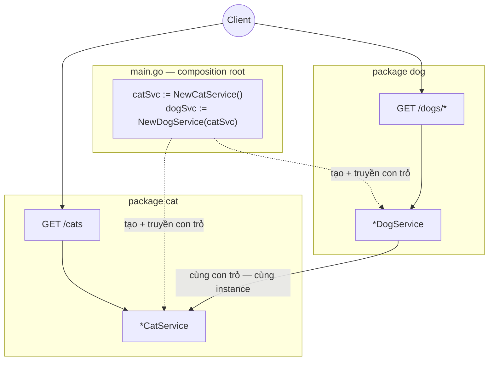

# sortIndex
<!-- @starci/seperator -->
4
<!-- @starci/seperator -->
# lang
<!-- @starci/seperator -->
go
<!-- @starci/seperator -->
# body
<!-- @starci/seperator -->
## 1. Lời mở đầu

*"Khi một service phụ thuộc service khác, ai tạo ra nó và ai quyết định cả hai dùng chung một instance?"* — một **Senior Engineer** đặt câu hỏi. **Mid-level Developer** đáp: *"Em `new` ra ở đâu cần là xong."* Câu trả lời thiếu chiều sâu: ghép nối bừa khoá cứng consumer vào một implementation cụ thể, dễ vô tình tạo nhiều bản sao (mất tính dùng chung), và khi **dependency graph** lớn lên thì thứ tự khởi tạo trở nên mong manh, test bị buộc vào object thật.

Bài học triển khai **Go** với **Gin** (chạy trên host, không Docker). Go **không có IoC container** — nên bài này làm khái niệm hiện ra qua *sự vắng mặt*: bạn tự ghép nối ở `main`, thấy rõ phần việc mà framework khác làm thay:

- **Phần 2.1**: **thực hành** chạy một backend hai vùng nghiệp vụ (`cat`, `dog`) và gọi vài endpoint để **quan sát** việc ghép nối thủ công và chia sẻ cùng một instance.
- **Phần 2.2**: **lý thuyết** hệ thống hoá hai khái niệm nền tảng — *package và ranh giới export* (đặt code vào đâu) và *inversion of control / composition root* (ai tạo + ghép nối) — kèm các **edge case** điển hình.

## 2. Các khái niệm cốt lõi

Bài tuân theo **Thực hành dẫn dắt Lý thuyết**. Học viên clone source, chạy **Go** bằng `go run .` và gọi API để **quan sát** việc `dog` dùng lại `cat` qua con trỏ được truyền ở `main` và chia sẻ cùng một instance. Sau đó phần lý thuyết hệ thống hoá package/export, **dependency injection thủ công**, **composition root** và phân tích các edge case chuyên sâu.

### 2.1. Thực hành

#### 2.1.1. Chuẩn bị source code và môi trường

Mục đích: chạy demo để thấy `DogService` dùng lại `CatService` qua con trỏ truyền ở `main` — không tự tạo bản riêng — và cả hai endpoint trả về *cùng một* instance.

Source: [StarCi-Academy/fs-1-framework-core-and-request-lifecycle-0-frameworks-in-backend](https://github.com/StarCi-Academy/fs-1-framework-core-and-request-lifecycle-0-frameworks-in-backend) trên GitHub.

```bash
# Bước 1: Clone repository về máy local
git clone https://github.com/StarCi-Academy/fs-1-framework-core-and-request-lifecycle-0-frameworks-in-backend.git

# Bước 2: Di chuyển vào đúng thư mục bài học
cd fs-1-framework-core-and-request-lifecycle-0-frameworks-in-backend
```

#### 2.1.2. Kiến trúc / thành phần

Demo có hai **package nghiệp vụ** — và `main` đóng vai composition root tự ghép nối:

- **`cat`:** export `CatService` (con trỏ) + `NewCatService()`, là phụ thuộc được chia sẻ.
- **`dog`:** `DogService` giữ một `*cat.CatService`; nhận qua constructor function.
- **`main`:** tạo `cat` một lần, truyền vào `dog`, gắn route Gin — Go không có container nên đây là nơi *bạn* ghép nối.

| Thành phần | File | Vai trò |
| --- | --- | --- |
| `main` | `main.go` | Composition root — tạo + ghép service, gắn route Gin |
| `CatService` | `cat/cat.go` | Service được chia sẻ (export qua chữ HOA) |
| `DogService` | `dog/dog.go` | Giữ `*cat.CatService` qua constructor function |



Hình 1: `main` (composition root) tạo `CatService` một lần và truyền con trỏ vào `DogService` — cùng instance dùng chung.

#### 2.1.3. Giải thích code và bản chất

Trọng tâm: *vì sao Go không có container mà các thành phần vẫn ghép nối đúng — và vì sao chúng dùng chung một instance*.

##### 2.1.3.1. Export qua chữ HOA — bề mặt công khai của package

```go
// cat/cat.go
package cat

type CatService struct{}

func NewCatService() *CatService { return &CatService{} }

func (s *CatService) GetSpyHint() string { return "cat-network-ready" }

func (s *CatService) FindAll() []Cat {
    return []Cat{{ID: 1, Name: "Milo"}, {ID: 2, Name: "Luna"}}
}
```

Trong Go, "ranh giới" là quy ước **chữ HOA = export**: `CatService` và `NewCatService` viết hoa nên package khác dùng được; định danh viết thường thì ẩn. Đây là cách Go biến cấu trúc package thành bề mặt công khai — không có decorator hay khai báo module.

##### 2.1.3.2. Constructor function + struct field — phụ thuộc tường minh, không container

```go
// dog/dog.go
package dog

import "demo/cat"

type DogService struct {
    cat *cat.CatService
}

func NewDogService(c *cat.CatService) *DogService {
    return &DogService{cat: c}
}

func (s *DogService) GetSpyReport() map[string]any {
    return map[string]any{
        "mission":    "cross-module-dependency-check",
        "dependency": s.cat.GetSpyHint(),
        "status":     "ok",
    }
}
```

`DogService` nhận `*cat.CatService` qua `NewDogService` — *khai báo* phụ thuộc qua tham số, không tự `&cat.CatService{}` bên trong. Go không có container, nên đây là **inversion of control làm bằng tay**: quyền tạo nằm ở người gọi (composition root), không nằm trong `dog`.

##### 2.1.3.3. Wiring ở `main` — composition root, cùng con trỏ = cùng instance

```go
// main.go
func main() {
    catSvc := cat.NewCatService()
    dogSvc := dog.NewDogService(catSvc) // truyền cùng con trỏ -> dùng chung

    r := gin.Default()
    r.GET("/cats", func(c *gin.Context) { c.JSON(200, catSvc.FindAll()) })
    r.GET("/dogs/spy", func(c *gin.Context) { c.JSON(200, dogSvc.GetSpyReport()) })
    r.GET("/dogs/cats-via-di", func(c *gin.Context) { c.JSON(200, dogSvc.BorrowCats()) })
    r.Run(":3000")
}
```

`main` tạo `catSvc` *một lần* rồi truyền chính con trỏ đó vào `dog`, nên cả route `/cats` lẫn `dog` dùng chung MỘT instance. Bản chất: cái mà NestJS/Spring/.NET làm tự động (dựng đồ thị + chia sẻ singleton), ở Go *bạn* làm tường minh — nhìn `main` là thấy toàn bộ dependency graph.

> Khái niệm này **portable**: IoC/DI là pattern phổ quát. Đối chiếu ngắn — NestJS dùng `@Module` + `exports`/`imports`, Spring dùng `@Component`/component scan, ASP.NET Core dùng built-in container + `AddSingleton`. Go *không* có container nên bạn là composition root: cùng một ý — consumer khai báo "cần gì", một nơi tập trung lo việc tạo + ghép nối + vòng đời.

#### 2.1.4. Chuẩn bị & khởi chạy

##### 2.1.4.1. Điều kiện cần trước

- **Go 1.22+**.
- Port **3000** available trên host (backend Gin).
- **Windows:** dùng `Invoke-RestMethod` thay cho `curl`.

##### 2.1.4.2. Khởi động

```bash
# Bước 1: Vào thư mục backend
cd backend/3-go

# Bước 2: Cài dependency
go mod download

# Bước 3: Chạy (watch)
go run .
```

App lắng nghe tại `http://localhost:3000`.

#### 2.1.5. Kiểm thử

**3 luồng** dưới đây, mỗi luồng kiểm chứng một mục tiêu — mở từng luồng để chạy:

- **Luồng 1 — `GET /cats`:** route map đúng endpoint → service.
- **Luồng 2 — `GET /dogs/spy`:** phụ thuộc đến từ `CatService` truyền qua composition root.
- **Luồng 3 — `GET /dogs/cats-via-di`:** cùng một instance `CatService` được chia sẻ.

::::accordion
:::panel{title="Luồng 1 — route map endpoint → service"}

- Bước 1: gọi `GET /cats`.

  ```bash
  # Windows (PowerShell)
  Invoke-RestMethod -Uri "http://localhost:3000/cats"

  # macOS / Linux
  # → Dán cURL vào Postman: Import → Raw text
  curl -s http://localhost:3000/cats
  ```

  Response phải trả về (HTTP 200):

  ```json
  [{ "id": 1, "name": "Milo" }, { "id": 2, "name": "Luna" }]
  ```

*Kết luận: Nếu response khớp JSON trên, hệ thống xác nhận:*

- *App bootstrap thành công, route `/cats` gọi đúng `catSvc.FindAll()`.*

:::
:::panel{title="Luồng 2 — phụ thuộc qua composition root"}

- Bước 1: gọi `GET /dogs/spy`.

  ```bash
  # Windows (PowerShell)
  Invoke-RestMethod -Uri "http://localhost:3000/dogs/spy"

  # macOS / Linux
  # → Dán cURL vào Postman: Import → Raw text
  curl -s http://localhost:3000/dogs/spy
  ```

  Response phải trả về (HTTP 200):

  ```json
  { "mission": "cross-module-dependency-check", "dependency": "cat-network-ready", "status": "ok" }
  ```

*Kết luận: Nếu response khớp JSON trên, hệ thống xác nhận:*

- *`dependency` đến từ `CatService` — `dog` dùng phụ thuộc được truyền ở `main`, không tự tạo `CatService`.*

:::
:::panel{title="Luồng 3 — cùng một instance"}

- Bước 1: gọi `GET /dogs/cats-via-di`.

  ```bash
  # Windows (PowerShell)
  Invoke-RestMethod -Uri "http://localhost:3000/dogs/cats-via-di"

  # macOS / Linux
  # → Dán cURL vào Postman: Import → Raw text
  curl -s http://localhost:3000/dogs/cats-via-di
  ```

  Response phải trả về (HTTP 200):

  ```json
  { "dog": "Rex", "borrowedCats": [{ "id": 1, "name": "Milo" }, { "id": 2, "name": "Luna" }] }
  ```

*Kết luận: Nếu response khớp JSON trên, hệ thống xác nhận:*

- *`borrowedCats` trùng đúng `GET /cats` — cùng MỘT con trỏ `*CatService` được chia sẻ (tạo một lần ở `main`).*

:::
::::

#### 2.1.6. Dọn tài nguyên

Bài này không sử dụng Docker, không cần dọn tài nguyên. Nhấn `Ctrl+C` trong terminal để dừng Go.

#### 2.1.7. Đọc thêm

- **Effective Go — packages & exports:** quy ước chữ HOA và tổ chức package. ([Effective Go](https://go.dev/doc/effective_go))
- **Dependency injection in Go:** vì sao Go thường DI thủ công thay vì container. ([Go Blog — Dependency injection](https://go.dev/blog/wire))
- **Gin web framework:** routing và handler. ([Gin — Documentation](https://gin-gonic.com/docs/))

### 2.2. Lý thuyết

#### 2.2.1. Bản chất

Bản chất của việc dùng framework backend là *inversion of control*: quyền tạo object + ghép nối + quản vòng đời được giao cho một nơi tập trung, dev chỉ khai báo "cần gì". Go **không có IoC container**, nên bài này cho thấy bản chất ấy ở dạng *trần trụi nhất* — **bạn chính là container, ghép nối thủ công ở `main`**. Ba mặt dưới đây vẫn là cùng một bản chất, chỉ khác là Go bắt bạn làm tay điều mà NestJS/Spring/.NET làm tự động.

- **Ai tạo, ai ghép (DI thủ công + composition root).** Constructor function (`NewDogService(c *cat.CatService)`) khai báo phụ thuộc, và `main` tạo + truyền chúng — `main` là composition root. Vì sao đây vẫn là cốt lõi: nếu mỗi nơi tự `cat.NewCatService()` thì khoá cứng và mất chia sẻ y như tự `new` ở ngôn ngữ khác. Truyền phụ thuộc qua constructor function vẫn đổi lấy *testability* (truyền mock vào) và *loose coupling* (đổi implementation không sửa consumer); chỉ *lifecycle* là bạn quản tay thay vì container. Verify ở Luồng 2: `dependency` đến từ `CatService` mà `dog` không tự tạo.
- **Code đặt đâu, gì được chia sẻ (package và ranh giới export).** Go không có decorator hay khai báo module — "ranh giới" là **quy ước chữ HOA**: định danh viết hoa được export ra ngoài package, viết thường thì ẩn. Bản chất giống `exports` của NestJS hay scan-path của Spring nhưng do compiler ép: tổ chức package + tên export *chính là* bề mặt công khai, và import vòng bị compiler *cấm* thẳng (fail compile, không phải lỗi runtime).
- **Sống bao lâu, dùng chung tới đâu (vòng đời + chia sẻ instance).** Không có "singleton scope" của framework — chia sẻ instance là do bạn: tạo `CatService` *một lần* ở `main` và truyền cùng con trỏ thì mọi nơi dùng chung (Luồng 3 chứng minh). Muốn state riêng mỗi request thì tạo mới trong handler — nhưng phải cân nhắc chi phí và đừng để lẫn state toàn cục.

Gộp lại: ba mặt *tạo + ghép + vòng đời* ở Go đều do `main` cầm tay. Chính vì thiếu container mà Go làm lộ rõ bản chất IoC nhất — hiểu được ở đây thì hiểu container của framework khác đang *tự động hoá* đúng ba việc này.

#### 2.2.2. Các trường hợp biên (edge cases) cần lưu ý

- **Vô tình tạo nhiều instance:** gọi `NewCatService()` nhiều nơi → mất tính dùng chung. **Giải pháp:** tạo một lần ở composition root, truyền con trỏ đi.
- **Circular package import:** Go *cấm* import vòng → compile fail. **Giải pháp:** tách phần chung ra package thứ ba; định nghĩa interface ở phía consumer.
- **Lạm dụng biến global thay vì DI:** khó test, ẩn phụ thuộc. **Giải pháp:** truyền phụ thuộc qua constructor function.
- **Hard-code config trong code:** khó đổi môi trường. **Giải pháp:** đọc từ flag/env (`os.Getenv`) hoặc file config, truyền vào ở `main`.

## 3. Tổng kết

### 3.1. Các câu hỏi dễ bị phỏng vấn

- **Câu hỏi 1: Inversion of control giải quyết vấn đề gì so với tự khởi tạo phụ thuộc?**
  - Ý interviewer muốn nghe: chuyển quyền tạo object ra ngoài (composition root) để loose coupling + testability.
  - Trả lời mẫu (ngắn): Khi tự tạo phụ thuộc bên trong, thành phần bị khoá cứng vào một implementation cụ thể nên khó test và khó swap. IoC chuyển quyền tạo ra ngoài; ở Go là composition root `main`. Service chỉ khai báo "cần gì" qua constructor function, nhờ đó test truyền mock dễ và đổi implementation không sửa consumer.
- **Câu hỏi 2: Go không có IoC container thì DI làm thế nào và có gì khác?**
  - Ý interviewer muốn nghe: DI thủ công ở composition root; rõ ràng nhưng phải tự quản vòng đời.
  - Trả lời mẫu (ngắn): Go không có container nên bạn tự ghép nối ở `main` — tạo dependency một lần và truyền con trỏ vào constructor function. Ưu điểm là dependency graph hiển hiện ngay trong `main`, không có "magic" runtime. Đổi lại bạn phải tự quản vòng đời và chia sẻ instance, thay vì để framework lo như NestJS/Spring/.NET.
- **Câu hỏi 3: Làm sao đảm bảo dùng chung một instance trong Go?**
  - Ý interviewer muốn nghe: tạo một lần ở composition root rồi truyền cùng con trỏ.
  - Trả lời mẫu (ngắn): Vì không có "singleton scope" của framework, bạn tạo service một lần ở `main` và truyền chính con trỏ đó cho mọi consumer — tất cả dùng chung. Nếu lỡ gọi constructor nhiều nơi sẽ sinh nhiều bản sao và mất tính dùng chung, nên quy ước là chỉ tạo ở composition root.
<!-- @starci/seperator -->
